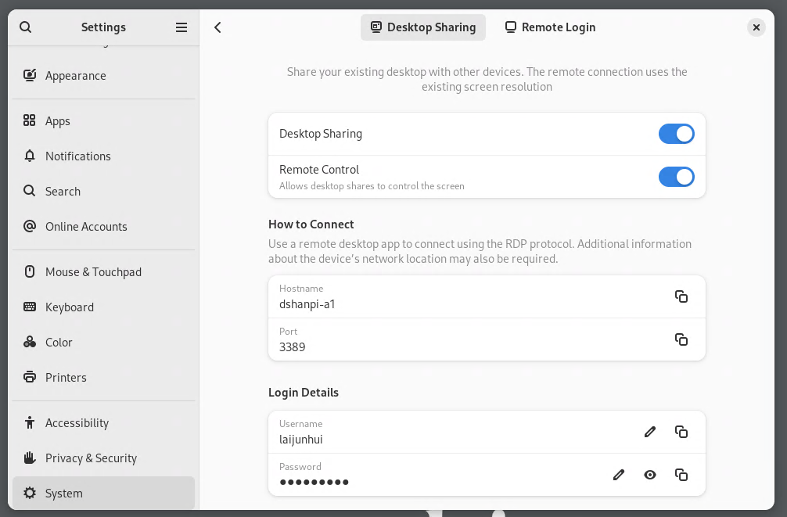
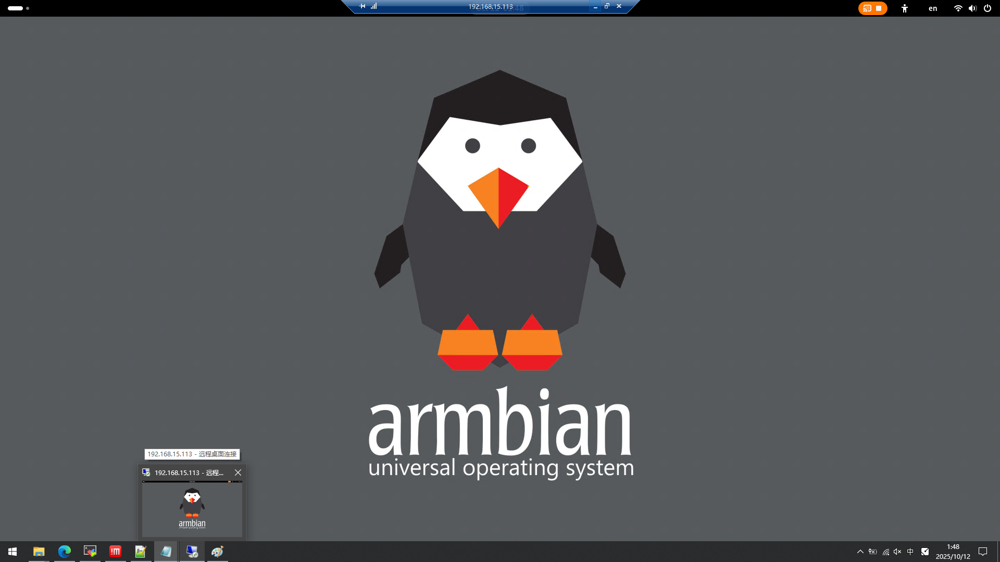
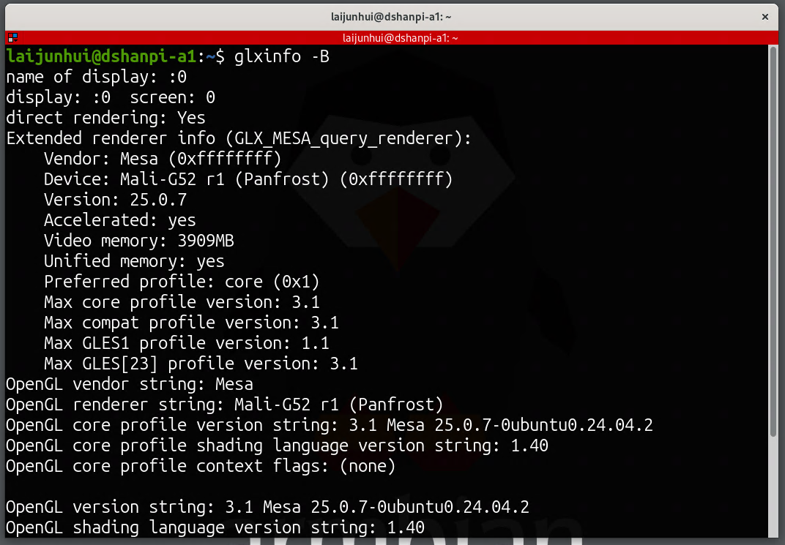

# **DshanPI-A1 RK3576 armbian远程桌面**


### 背景与问题


* 使用设备：DshanPI-A1，搭载 Armbian 系统，窗口系统为 Wayland，GPU 采用开源驱动。

* 初始尝试：使用 NoMachine 实现远程桌面，但存在两个问题：

1. 默认创建虚拟桌面，而非物理桌面；

2. 对 Wayland 支持不佳，会以兼容模式开启 X11 桌面，导致 OpenGL 无法调用 GPU 加速。

### 解决方案：使用 Armbian 自带远程桌面


1. **安装必要环境**

   由于系统默认未预装远程桌面组件，先通过命令安装：


```
sudo apt install gnome-remote-desktop
```


2. **配置远程桌面**

* 重启设置窗口（关闭后重新打开），依次进入 `Settings → System → Remote Desktop`。

* 勾选 `Desktop Sharing`（桌面共享）和 `Remote Control`（远程控制）。

* 初始密码为随机生成，需手动修改为自定义密码。

  

  

3. **连接与验证**

* 在 Windows 端打开「远程桌面连接」，输入设备 IP、用户名及密码。

* 首次登录可能黑屏，重启设备后连接成功。

  

### 功能验证

通过命令测试 GPU 加速是否正常：


* 执行 `glxinfo -B`，输出显示 Mali GPU 信息（OpenGL 支持正常）；

  

* 执行 `es2_info`，同样检测到 Mali GPU（OpenGLES 支持正常）。

  

结论：远程桌面可正常调用 GPU 加速，满足需求。

### 参考资料


* 《Armbian 25.5.1 Noble Gnome 开启远程桌面功能》

  （[https://blog.csdn.net/u013833472/article/details/149032655](https://blog.csdn.net/u013833472/article/details/149032655)）
