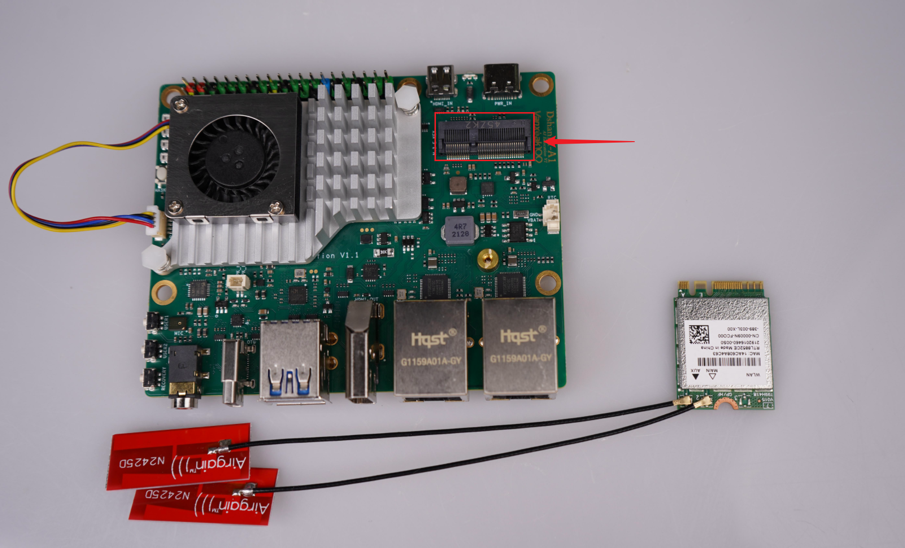

# 硬件连接指南

本节将详细介绍百问网 dshanpi-a1 与各配套外设模块的连接方式。

## 1. 串口连接

串口debug引脚在 dshanpi-a1 扩展引脚上，我们需要借助 USB转TTL模块 来登录我们的串口终端，需要注意的是：

- dshanpi-a1 的 **TX** 引脚需要接到 -》USB转TTL模块的 **RX** 引脚；
- dshanpi-a1 的 **RX** 引脚需要接到 -》USB转TTL模块的 **TX** 引脚；
- dshanpi-a1 的 **GND** 引脚需要接到 -》USB转TTL模块的 **GND** 引脚；

串口连接只需接这三根线即可，无需接上VCC引脚。扩展引脚参考如下：

实物连接参考如下图：

## 2. 金属散热器连接

散热器连接参考实物图如下：

这里接口引脚需要对准位置，否则无法接入。

然后参考下图，散热器对准这两个孔。

分别按下两个固定柱，即可安装完成，如下图所示：

## 3. PCIE WiFi6 模块连接

准备一块PCIE WiFi6模块，我们将需要接入到 dshanpi-a1 的 M.2 KEKY 接口上，如下：

接入后，我们需要拧上螺丝，即可固定住 PCIE WiFi6模块。如下：

## 4. HDMI 连接

准备一根 HDMI 线，接入 dshanpi-a1的 HDMI 接口（另一端可以连接电脑的 HDMI 接口或USB转HDMI模块的接口），连接接口如下：

## 5. HDMI-IN 连接

借助板载 HDMI-IN 接口，使用一根 MicroHDMI 线将 dshanpi-a1 与 PC 相连，即可把 PC 画面当作一路“虚拟摄像头”实时捕获，并随时录制、保存 PC 屏幕的全部内容（包括声音）。连接接口如下：

## 6. DP 显示连接

除了可以通过 HDMI 显示，还可以通过 DP 接口显示我们 dshanpi-a1 的桌面。准备一根 TYPeC DP 数据线，TYPeC一端接入 dshanpi-a1 的 usb3.0 otg 接口上，另一端接入显示屏的 DP 接口。连接接口如下：

## 7. PD 电源适配器连接

电源适配器推荐购买我们的 30W PD电源适配器，其他的没有测试过，连接接口如下：

