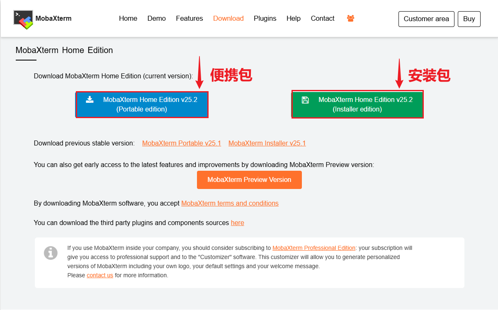
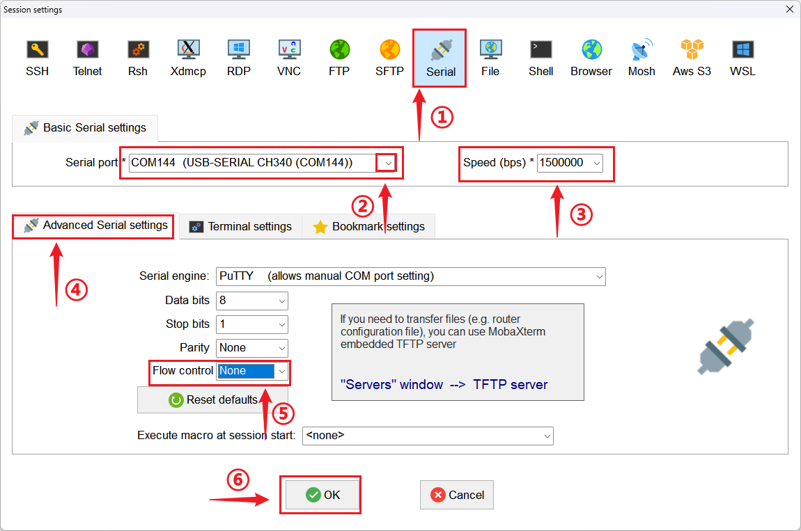

# 连接串口终端

在本章节中，我们将详细讲解如何配置和使用 MobaXterm 作为功能强大的串口终端工具。我们将一步步引导您完成从准备工作到成功建立通信的全过程。

## 获取MobaXerm工具

我们可以在主机windows上选择下载 MobaXterm 的 **安装包** 或者 **便携包**（如果主机是macOS/Linux，推荐 WindTerm）。MobaXterm 官方下载地址如下：

[MobaXterm Xserver with SSH, telnet, RDP, VNC and X11 - Home Edition](https://mobaxterm.mobatek.net/download-home-edition.html)

这里我们下载的是免费版本，已足够我们日常开发使用。下面有 Portable edition（便携包）和 Installer edition（安装包）：

根据个人需求，选择其中一个下载即可（不知道安装哪个的，不要犹豫，就下载便携包，即下即用免安装）。

## 连接前的检查

根据前面连接串口之后，打开 **设备管理器**，展开 **“端口 (COM和LPT)”** 分类，我们可以看到类似如下端口号（记住它，后面有大用）：

- **USB-SERIAL CH340 ：** 就是我们使用的USB转串口模块（如 CH340, CP2102等）。
- **COM144：** 这个是电脑识别到USB转串口模块 **自动随机分配** 的端口号。

> **注意！！！**
> 如果这里没有显示对应的端口号，需要检查如下：
> ①主机系统是否是window11以上，是则会自动安装USB转串口模块对应的驱动；如果是windows11以下，需要安装对应的驱动（怎么安装？安装驱动精灵或者前往对应官网手动下载驱动）。
> ②串口在硬件上是否连接正确（如果不知道怎么连接，可以完完全全参考我们的连接教程）。

## MobaXterm配置步骤

准备工作就绪后，请按照以下步骤在 MobaXterm 中配置串口会话（这里以百问网 dshanpi-a1(RK3576) 为例）：

### 1. 启动新会话

打开 MobaXterm ，点击左上角的 **`会话 (Session)`** 按钮，或使用快捷键 **`Ctrl+Shift+N`**，如下图所示：

### 2. 选择会话类型

MobaXterm 这个工具比较强大，支持很多会话类型（如SSH、Serial、VNC等）。这里我们需要选择 **`串口 (Serial)`** 图标、做相应的配置，如下所示：

- ① 选择 **`串口 (Serial)`** 图标；
- ② 从下拉菜单中选择记下的 COM 端口号（如COM144）；
- ③ 设置数据传输的速率。此值必须与目标设备的波特率设置一致（以百问网 dshanpi-a1(RK3576) 为例，波特率是1500000）；
- ④ 点击高级串口设置 (Advanced Serial settings)；
- ⑤ **Flow control (流控制)** 此选项用于协调设备间的数据流。在绝大多数调试场景中，应将其设置为 **`None`**；
- ⑥ 点击 **`OK`**，会自动启动会话。

## 常见问题与解决方案

如果在连接或通信中遇到问题，请尝试以下检查：

- **问题：终端无任何显示或显示乱码。**
  - **解决方案**: 这是最常见的问题。
    1. **检查波特率**：确保 MobaXterm 中设置的波特率与设备固件中的设置**绝对一致**。
    2. **检查接线**：尝试交换 `TX` 和 `RX` 的接线。
    3. **检查 COM 端口**：确认选择了正确的 COM 端口。

- **问题：提示 "Unable to open serial port" (无法打开串口)。**
  - **解决方案**:
    1. **端口被占用**：检查是否有其他软件（如其他终端工具）正在使用该 COM 端口。关闭它们后再试。
    2. **驱动问题**：返回设备管理器，确认驱动程序状态正常，没有黄色感叹号标志。

- **问题：可以接收数据（看到打印信息），但无法发送数据（输入命令无反应）。**
  - **解决方案**:
    1. **检查 `TX` 连接**：确认 MobaXterm 所在电脑的 `TX` 线已正确连接到目标设备的 `RX` 引脚。
    2. **检查地线 (GND)**：确保两边的地线已经共地连接，这是稳定通信的必要条件。

- **问题：会话启动之后，没看到打印信息。**
  - **解决方案**:
    1. **尝试点击回车键**：如果设备上电启动过久，打印信息已跳过，随后打开的串口终端会话会看不见打印信息。
    2. **复位设备**：重新启动设备，在设备串口连接正常情况下，即可看到打印信息。