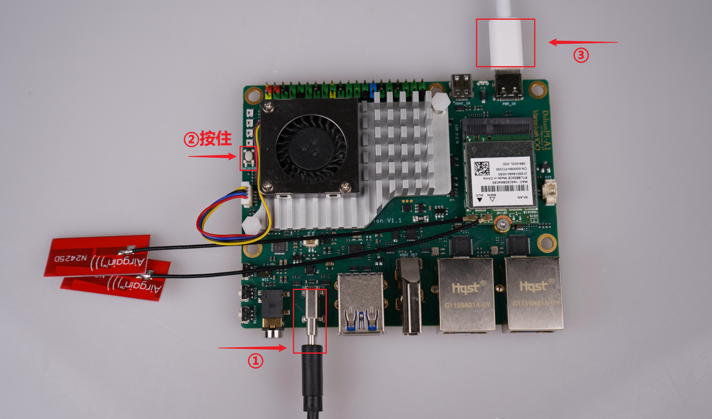

# 烧录系统至EMMC

本章节将讲解如何把我们提供的 ArmbianOS 系统镜像烧录至EMMC。

> 设备出厂时已预装ArmbianOS系统，但在开发过程中难免出现系统损坏或配置错乱。如遇此类情况，请依照本章步骤快速恢复，确保开发环境始终稳定可用。

## 准备工作

### 1. 硬件准备

烧录系统镜像，除了dshanpi-a1板子，还需要准备 **TypeC-3.2 10Gbps速率USB线 、30W PD电源适配器** （建议韦东山店铺购买，其他的没测试）。如下所示：

TypeC-3.2 10Gbps速率USB线：

 30W PD电源适配器：

### 2. 软件下载

软件上，我们需要在 PC 端下载 **系统镜像、烧录工具和驱动安装工具包** 。下载链接如下：

> 按住 `ctrl` 键，鼠标 `左键` 点击链接，即可一键下载

- **ArmBianOS 系统镜像：** [DshanPi-A1_ArmbianOS](https://dl.100ask.net/Hardware/MPU/RK3576-DshanPi-A1/100ASK_Armbian_25.11.0-trunk_Dshanpi-a1_noble_vendor_6.1.115_gnome_desktop.img.7z)
- **烧录工具 RKDevTool：**  [RKDevTool_Release_v3.32.zip](https://dl.100ask.net/Hardware/MPU/RK3576-DshanPi-A1/RKDevTool_Release_v3.32.zip)
- **驱动安装工具包 DriverAssitant：** [DriverAssitant_v5.1.1.zip](https://dl.100ask.net/Hardware/MPU/RK3576-DshanPi-A1/DriverAssitant_v5.1.1.zip)
- **DshanPi-A1 ArmbianOS 引导固件：** [rk3576_spl_loader_v1.09.107.bin](https://dl.100ask.net/Hardware/MPU/RK3576-DshanPi-A1/rk3576_spl_loader_v1.09.107.bin)

### 3. 烧录驱动安装

在烧录之前，我们需要先安装烧录驱动，在前面下载的资料里找到驱动安装工具包 **`DriverAssitant_vxxx`** ，打开启动下载程序 **`DriverInstall.exe`** ，点击驱动安装即，如下：

## 烧录系统镜像

准备工作完成后，①接上 **usb3.0 otg** 线（数据线另一端接电脑的 USB3.0 蓝色接口），②按住 **`MASKROM`** 按键，**先不松开** ，③再接上电源，dshanpi-a1 就会进入 **`MASKROM`** 烧录模式。参照下图操作：

打开烧录工具 ，参考下图配置烧录工具：

- ① 勾上前两个选项；
- ② 第二个选项设置为 **`EMMC`** ；
- ③ 地址默认都设置为 **`0x00000000`** ；
- ④ 名字照着上图设置；
- ⑤ Loader的路径设置为前面我们下载的引导固件 **`rk3576_spl_loader_v1.09.107.bin`** ；
- ⑥ Systerm的路径设置为前面我们下载的系统镜像 **`100ASK_xxx.img`** ；
- ⑦ 勾上强制按地址写；
- ⑧ 点击执行（一定要显示为 **MASKROM** 模型才可以烧录）。

开始烧录后，等待下载完成即可启动系统。

## 常见问题与解决方案

- **问题：执行烧录操作后烧录工具没有显示MASKROM设备？**
  - **解决方案：** 检查设备管理器是否出现以下设备，烧录驱动是否安装，如果安装了，插拔一下 usb3.0 otg 接口的数据线或者重启电脑。

