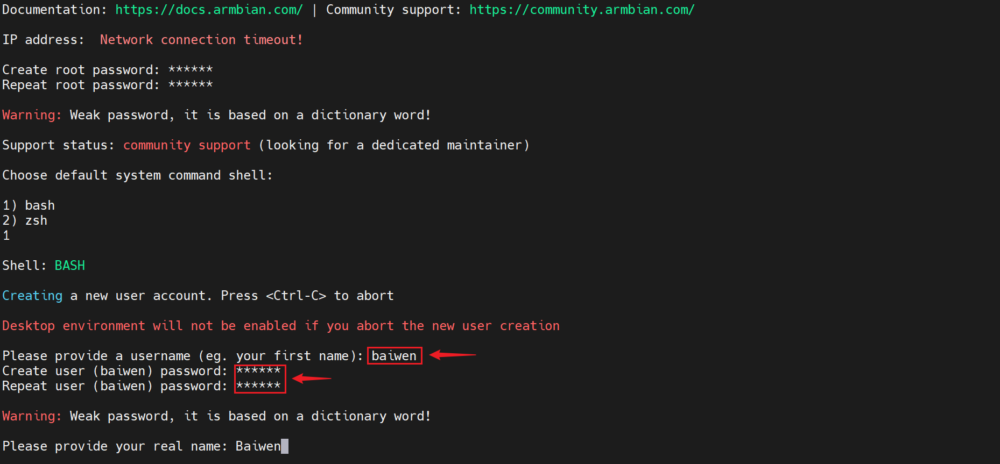
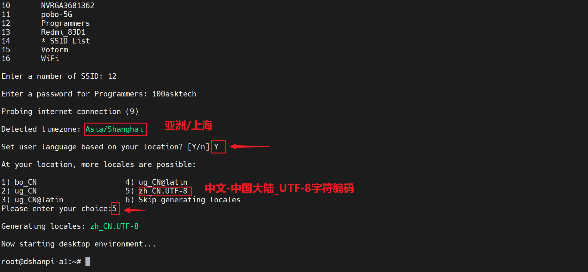
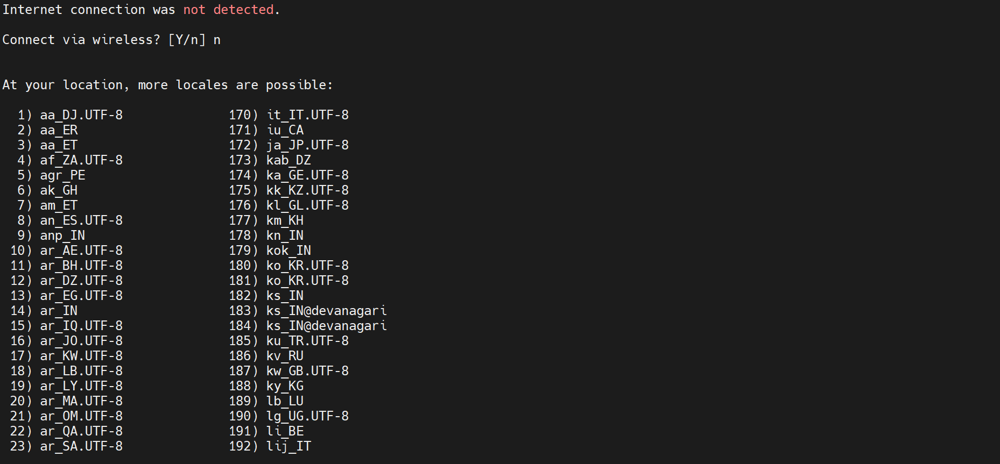
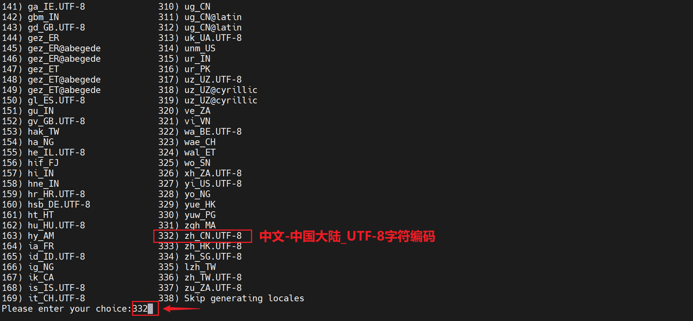
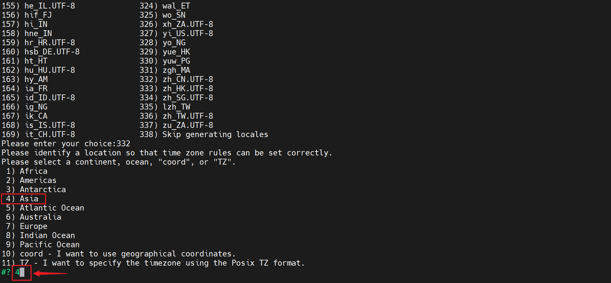
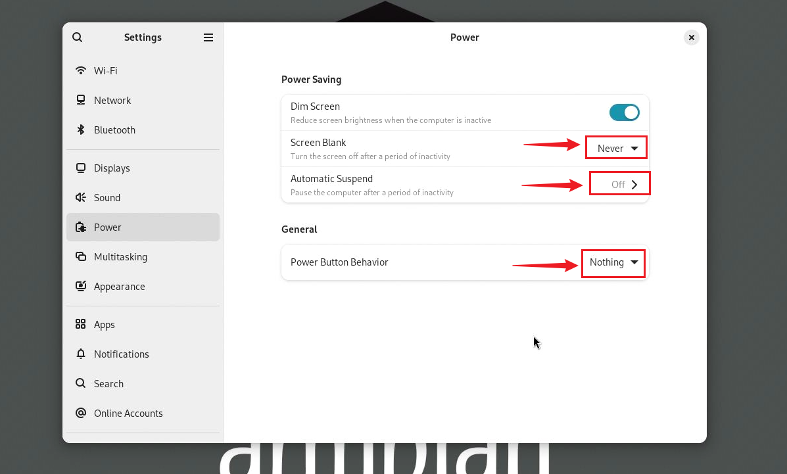

# 首次启动设置引导

本章节将带领您完成百网网 dshanpi-a1的首次启动快速配置，从零开始，一步到位。

> 执行下面操作，遇到问题时，亲，请你别慌，可以在下面结尾的 问题与解决方案 里面找找答案。

## 启动设置步骤

### 1. 设置root密码

首次上电启动后，需要先设置root密码，自定义设置自己记得住的密码即可，这里设置为 **`100ask`**：

输入两次相同的密码，然后回车。

### 2. 选择系统默认shell

这里选择`bash`（看个人习惯，也可选择zsh，推荐bash，兼容性强），输入`1`，然后回车。

### 3. 设置用户名与密码

自定义设置自己喜欢的用户名和用户密码，这里用户名设置为 **`baiwen`**，用户密码设置为 `100ask`（需要输入两次相同的密码），然后回车。

最后回车确认`Please provide your real name: Baiwen`。

### 4. 连接WiFi

这里可以选择提前连接WiFi `Y` 或者不连接WiFi `n`。下面分两种情况引导：

- **如果选择提前连接WiFi ：**

需要提前连接WiFi，请输入Y，系统会自动扫描设备附近的WiFi网络：

找到要连接的WiFi网络，输入密码，然后回车。提前连接WiFi成功后，系统会自动帮您找到您的时区等信息，您只需要根据选项进行选择即可：

正常情况按照这个进行设置即可。设置完成后，系统会自动进入root用户，我们也可以重新启动。

- **如果不提前连接WiFi ：**

输入 `n`，接着需要手动输入您的区域：

正常情况下，会选择 `zh_CN.UTF-8`（看您个人喜好），然后回车：

接下来需要确定区域，这里选择 `Asia`（亚洲），输入 `4`：

然后选择国家 `China`，输入`11`：

最后选择 `Beijing Time` （北京时间），输入`1`，时区会被系统自动固定为 `Asia/Shanghai`。

正常情况也是按照这个进行设置即可。设置完成后，系统会自动进入root用户，我们也可以重新启动。

## 问题与解决方案

- **问题：在屏幕上如何进行设置呢？**
  - **解决方案：** 接上鼠标、键盘，和上面的设置是一样的。设置完成后，会进入如下桌面：

    

- **问题：启动系统之后，隔一段时间，系统无反应**
  - **解决方案：** 这是系统进入了挂起状态，选择下面其中一个解决方案。
    1. **重新启动系统：** 断电重新启动系统，即可短暂解决挂起问题。
    2. **关闭挂起功能：** 在桌面上找到 **设置settings**，接着找到 **电源Power**，参考下图关闭挂起功能。
    
    
    
    3. **命令行关闭挂起功能：** 打开终端，执行以下指令：

    ~~~bash
    gsettings set org.gnome.settings-daemon.plugins.power sleep-inactive-ac-timeout 0
    gsettings set org.gnome.settings-daemon.plugins.power sleep-inactive-battery-timeout 0
    gsettings set org.gnome.settings-daemon.plugins.power sleep-inactive-ac-type 'nothing'
    gsettings set org.gnome.settings-daemon.plugins.power sleep-inactive-battery-type 'nothing'
    ~~~

- **问题：第一次拿到板子，进入系统，发现直接提示需要输入用户名和密码，与上面文档操作不符**
  - **解决方案：** 正常现象，别慌！选择下面其中一个解决方案。
  
    1. **重新烧录镜像：** 参考烧录教程，重新烧录镜像，即可进入上面文档的操作步骤一样的界面。
    2. **输入root与root密码：** 说明目前只有一个root用户，输入用户名root，密码1234或者100ask，都试试。
