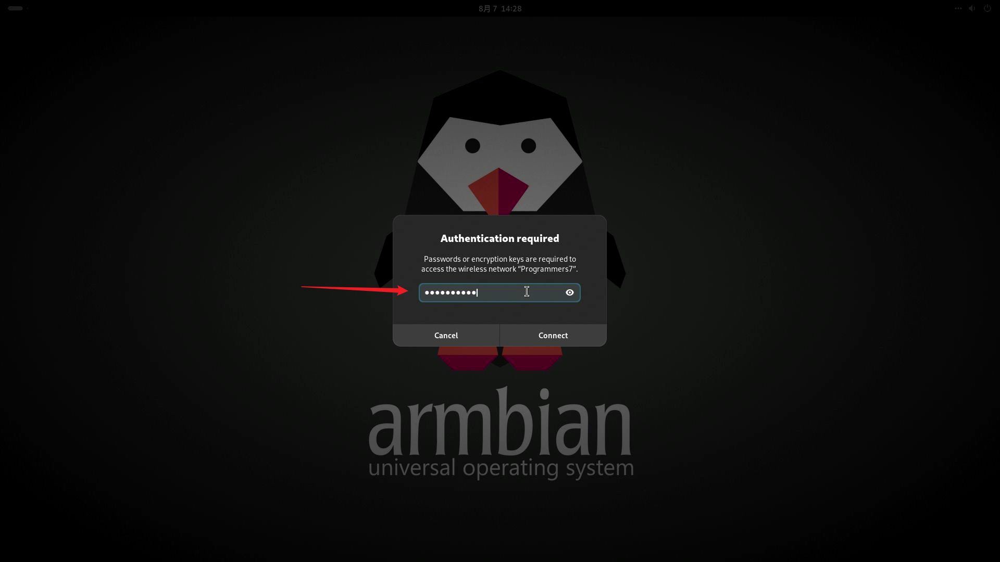

# 网络连接引导

本章节将讲解如何在百问网 dshanpi-a1 设备上连接网络，连接的方式主要有两种：千兆有线网口 和 无线WiFi。

> 千兆有线网口连接这里就不做讲解了，接上即可使用，无需配置。

## 桌面无线WiFi设置

在 dshanpi-a1 桌面上，WiFi连接步骤参考下图：

点击网络名称后，系统要求输入密码，如下图所示：

输入正确的密码，然后回车，即可连接成功。

## 命令行连接无线WiFi

在终端里，我们可以使用 `nmcli` 来查看、管理、配置网络连接，`nmcli` 是 **NetworkManager** 提供的命令行工具。

### 1. 主要功能

- **查看网络状态**（有线、无线、VPN等）
- **配置 IP 地址**（静态或动态 DHCP）
- **连接 Wi-Fi**
- **管理网络接口**（启用、禁用）
- **编辑网络配置文件**

### 2. 常用命令示例

| 功能             | 命令                                                         |
| ---------------- | ------------------------------------------------------------ |
| 显示网络设备     | `nmcli device`                                               |
| 显示网络连接列表 | `nmcli connection show`                                      |
| 启用接口         | `nmcli device set eth0 managed yes`                          |
| 启动连接         | `nmcli connection up <连接名>`                               |
| 关闭连接         | `nmcli connection down <连接名>`                             |
| 连接 Wi-Fi       | `nmcli device wifi connect "SSID" password "密码"`           |
| 列出可用 Wi-Fi   | `nmcli device wifi list`                                     |
| 设置静态 IP      | `nmcli con mod <连接名> ipv4.addresses 192.168.1.100/24 ipv4.gateway 192.168.1.1 ipv4.method manual` |

例如，执行列出可用 Wi-Fi指令：

~~~bash
sudo nmcli device wifi list
~~~

如下所示：

~~~bash
root@dshanpi-a1:~# nmcli device wifi list
IN-USE  BSSID              SSID                         MODE   CHAN  RATE      >
        F0:92:B4:A6:03:91  ChinaNet-kRAH                Infra  1     130 Mbit/s>
        76:39:89:FE:F0:AE  --                           Infra  40    405 Mbit/s>
        74:39:89:F8:F0:AD  Programmers                  Infra  6     270 Mbit/s>
*       74:39:89:F8:F0:AE  Programmers7                 Infra  40    405 Mbit/s>
        D2:AD:08:F8:EB:71  DIRECT-71-HP Smart Tank 750  Infra  6     65 Mbit/s >
        48:8A:D2:D1:62:A2  MERCURY_62A2                 Infra  13    270 Mbit/s>
        54:71:DD:96:21:FC  HUAWEI-0E16WP_5G             Infra  44    270 Mbit/s>
        1A:47:3D:EB:E9:D1  DIRECT-d1-HP M132 LaserJet   Infra  6     130 Mbit/s>
        BC:B0:E7:B8:90:18  ChinaNet-ec7h                Infra  11    130 Mbit/s>
        4C:10:D5:3B:43:63  CMCC-q9T4                    Infra  6     270 Mbit/s>
        64:6E:97:5D:22:4A  pobo                         Infra  7     270 Mbit/s>
        78:60:5B:5F:D7:9F  WiFi                         Infra  9     130 Mbit/s>
        54:71:DD:96:21:F8  HUAWEI-1619                  Infra  11    130 Mbit/s>
        D4:E3:C5:AE:59:CC  GC                           Infra  11    130 Mbit/s>
        30:1F:48:D0:01:34  1520                         Infra  3     130 Mbit/s>
        C8:50:E9:BB:F5:0A  ChinaNet-sqJr                Infra  11    130 Mbit/s>
        D6:84:09:1D:9B:95  --                           Infra  1     270 Mbit/s>
        50:FA:84:AF:14:13  TP-LINK_AF_15C               Infra  11    270 Mbit/s>
        D6:84:09:1D:9B:97  --                           Infra  149   270 Mbit/s>
        78:60:5B:5F:D7:A0  WiFi                         Infra  44    270 Mbit/s>
        D4:84:09:1D:9B:97  Voform                       Infra  149   270 Mbit/s>
        4C:10:D5:3B:43:64  CMCC-q9T4-5G                 Infra  48    270 Mbit/s>
~~~

执行连接 Wi-Fi指令：

~~~bash
nmcli device wifi connect Programmers7 password 100askxxx
~~~

最后等待连接成功即可。

