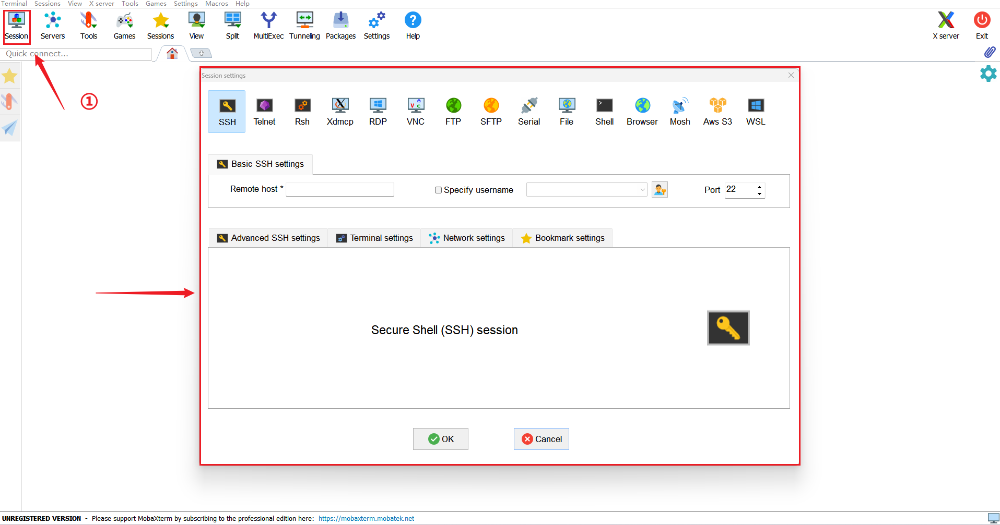

# 远程登录SSH终端

本章节将讲解如何通过 SSH工具登录远程百问网 dshanpi-a1 终端。

## 满足条件

> 以下条件只是讲解，如果后续开发需要修改配置或是无法SSH连接远程终端，可以参考使用。默认SSH服务已经启动，重点确保本地主机能访问到远程 dshanpi-a1 的 IP 和 端口。

### **1. 本地端条件**

- **SSH 客户端**
  - 本地电脑必须有 SSH 客户端工具（Windows 上常用 MobaXterm、PuTTY、Git Bash；Linux 和 macOS 自带 `ssh` 命令）。
- **正确的连接信息**
  - 远程主机的 **IP 地址** 或 **域名**
  - 远程主机的 **SSH 端口**（默认 22）
  - 远程主机的 **用户名**（例如 `root`、`baiwen`）
  - 登录凭证（密码 或 私钥文件）

### **2. 网络条件**

- **网络可达**

  - 本地能访问到远程主机的 IP 和端口

  - 测试方法：

    ```bash
    ping <远程IP>            # 测试是否能通
    telnet <远程IP> 22       # 测试 22 端口是否可达
    ```

- **防火墙允许**

  - 本地网络、远程主机和中间网络设备不能屏蔽 SSH 端口

### **3. 远程端条件**

- **SSH 服务已安装**

  - 远程主机必须安装 SSH 服务器程序（OpenSSH 常用，dshanpi-a1 OS 默认已经安装）

  - Linux 下检查：

    ```bash
    sudo sshd -V              # 查看 SSH 服务版本
    sudo systemctl status ssh # 查看服务状态
    ```

    如下所示：

    ~~~bash
    root@dshanpi-a1:~# sshd -V
    OpenSSH_9.6p1 Ubuntu-3ubuntu13.13, OpenSSL 3.0.13 30 Jan 2024
    root@dshanpi-a1:~#
    root@dshanpi-a1:~#
    root@dshanpi-a1:~# sudo systemctl status ssh
    ○ ssh.service - OpenBSD Secure Shell server
         Loaded: loaded (/usr/lib/systemd/system/ssh.service; disabled; preset: ena>
         Active: inactive (dead)
    TriggeredBy: ● ssh.socket
           Docs: man:sshd(8)
                 man:sshd_config(5)
    ~~~

    从 输出来看，`ssh.service` 处于 **inactive (dead)** 状态，而且是 **disabled**（没有设置开机启动）。同时，它显示 `TriggeredBy: ● ssh.socket`，说明 SSH 服务是通过 socket 激活的，而不是一直保持运行。也就是当有远程设备发起连接请求时，系统才自动启动 SSH 服务，处理连接。

- **SSH 服务正在运行**
  - 远程端必须启动 SSH 服务（`sudo systemctl start ssh` ）

- **允许你的认证方式**
  - 如果是密码登录，`/etc/ssh/sshd_config` 中 `PasswordAuthentication` 必须为 `yes`
  - 如果是密钥登录，公钥必须正确放在远程的 `~/.ssh/authorized_keys`

### **4. 用户权限**

- 远程用户必须有 Shell 登录权限（被禁用或改成 `/sbin/nologin` 就无法进入终端）
- 如果是 root 登录，要确保 `/etc/ssh/sshd_config` 中 `PermitRootLogin yes`

## SSH登录远程终端步骤

这里讲解例子是Windows主机通过 MobaXterm SSH登录远程 dshanpi-a1 终端。

### 1. 启动新会话

打开 MobaXterm ，点击左上角的 **`会话 (Session)`** 按钮，或使用快捷键 **`Ctrl+Shift+N`**，如下图所示：



### 2. 选择会话类型

这里我们需要选择 **`SSH`** 图标、做相应的配置，如下所示：


- ① 选择 **`SSH`** 图标；
- ② 输入 dshanpi-a1 IP地址（每个人的IP地址都不一样，也许是静态设置或者动态获取的，具体可以登录串口或者屏幕查看）；
- ③ 打勾并输入设置的远程用户名；
- ④ 端口号默认是22；
- ⑤ 点击 **`OK`**，会自动启动会话。

### 3. 输入远程用户密码

配置完成后，正常情况下，需要输入对应远程用户的密码，密码正确即可登录成功，如下所示：


