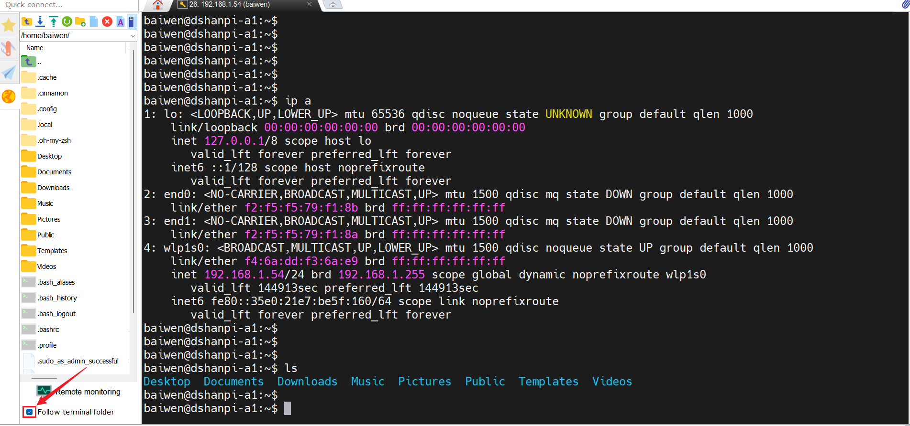
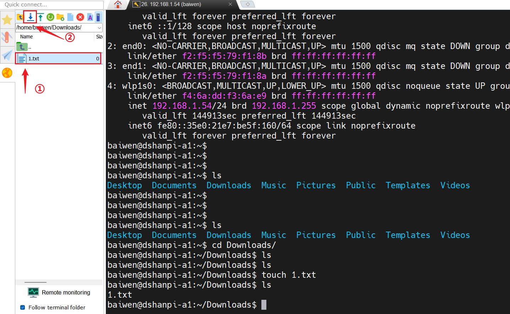
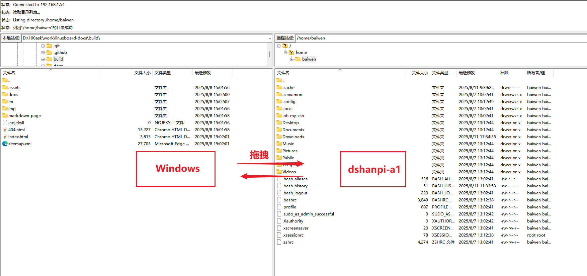

# 文件传输

本章节将讲解百问网 dshanpi-a1 与不同设备间如何进行文件传输。

## 与Windows主机进行文件传输

在开发过程中，常常需要与Windows主机进行文件传输，这里将介绍两种方式：

### 1. 通过MobaXterm实现文件传输

通过之前对 MobaXterm 的使用可以发现，它是一款非常强大且功能丰富的终端工具。在使用 SSH 登录远程终端时，MobaXterm 还支持便捷的文件传输功能，具体操作参考如下：

进入 SSH 终端界面时，左侧会自动显示当前初始目录的文件：


勾上 `Follow terminal folder` ，无论在终端中切换到哪个路径，左侧都会自动同步显示该路径下的文件和文件夹内容。



选中需要传输的文件，点击 `下载` 蓝色箭头，选择Windows存放的路径，即可下载。



从Windows主机上传文件，点击 `拉取` 绿色箭头即可上传文件（文件保存在当前路径下）。


MobaXterm传输文件的方式还可以通过直接拖拽的方式进行互传。


> 如果发现，新增的文件没有在左边的显示框上，可以刷新一下。

### 2. 通过FileZilla实现文件传输

除了使用 MobaXterm，我们还可以通过 FileZilla 客户端工具来进行文件传输。FileZilla下载地址如下：

[Download FileZilla Client for Windows (64bit x86)](https://filezilla-project.org/download.php?type=client)


打开 FileZilla 客户端工具，参考下图配置：


- ① 输入 dshanpi-a1 IP 地址；
- ② 输入 dshanpi-a1 用户名；
- ③ 输入 dshanpi-a1 用户密码；
- ④ 输入端口号 22（通常是通过 sftp 协议【**SSH 文件传输协议**】来传输文件）；
- ⑤ 点击快速连接。

连接成功后，会提示 `是否信任`，选择 `总是信任` ：


后续我们就可以通过拖拽或者双击的方式来互传文件。



## 与Linux、Mac设备进行文件传输

这里推荐使用 **scp 来与Linux、Mac OS设备**来互传文件，一条指令即可完成文件互传。scp使用指令如下：

~~~bash
scp /path/to/local/file username@remote_mac_or_linux:/path/to/remote/directory/
~~~

反之，也可以从远程设备拷贝文件到本地：

```bash
scp username@remote_mac_or_linux:/path/to/remote/file /path/to/local/directory/
```

- **`/path/to/local/file`：** 本地设备上的具体文件路径
- **`username@remote_mac_or_linux:/path/to/remote/file`：** 远程设备上的具体文件路径。
- **`/path/to/local/directory/`：** 地设备上的目标目录路径。
- **`username@remote_mac_or_linux:/path/to/remote/directory/`：** 远程设备上的目标目录路径。

> 注意：如果需要传输文件夹则需加 **`-r`** 参数递归复制整个文件夹。scp 在哪个设备使用，哪个设备就是本地设备。

scp使用举例如下：

这里将与**用户名**为ubuntu、**IP地址**为192.168.1.67（该地址 dshanpi-a1能 ping 通）Linux设备进行互传文件。

从远程Linux设备获取文件到当前路径，在终端执行以下的命令：

~~~bash
scp ubuntu@192.168.1.67:/home/ubuntu/Documents/1.txt .
~~~

如下：

~~~bash
baiwen@dshanpi-a1:~/Downloads$ scp ubuntu@192.168.1.67:/home/ubuntu/Documents/1.txt .
The authenticity of host '192.168.1.67 (192.168.1.67)' can't be established.
ED25519 key fingerprint is SHA256:6u5vPdqrR9X2XtbR83HSI092UBrLPSN13Yx2o4SuaHc.
This key is not known by any other names.
Are you sure you want to continue connecting (yes/no/[fingerprint])? yes
Warning: Permanently added '192.168.1.67' (ED25519) to the list of known hosts.
ubuntu@192.168.1.67's password:
1.txt                                                                          100%    7     0.5KB/s   00:00
baiwen@dshanpi-a1:~/Downloads$ ls
1.txt
baiwen@dshanpi-a1:~/Downloads$ cat 1.txt
100ask
~~~

反过来，从本地Linux设备发送文件到远程设备：

~~~bash
scp ./2.txt ubuntu@192.168.1.67:/home/ubuntu/Documents/
~~~

如下：

~~~bash
baiwen@dshanpi-a1:~/Downloads$ touch 2.txt
baiwen@dshanpi-a1:~/Downloads$ scp ./2.txt ubuntu@192.168.1.67:/home/ubuntu/Documents/
ubuntu@192.168.1.67's password:
2.txt                                                                          100%    0     0.0KB/s   00:00
~~~

如果需要发送文件夹，如下：

~~~bash
baiwen@dshanpi-a1:~/Downloads$ mkdir 100ask
baiwen@dshanpi-a1:~/Downloads$ scp -r ./100ask ubuntu@192.168.1.67:/home/ubuntu/Documents/
ubuntu@192.168.1.67's password:
baiwen@dshanpi-a1:~/Downloads$
~~~

反之：

~~~bash
baiwen@dshanpi-a1:~/Downloads$ scp -r ubuntu@192.168.1.67:/home/ubuntu/Documents/dshanpi ~/Downloads/
ubuntu@192.168.1.67's password:
baiwen@dshanpi-a1:~/Downloads$ ls
100ask  1.txt  2.txt  dshanpi
baiwen@dshanpi-a1:~/Downloads$
~~~


