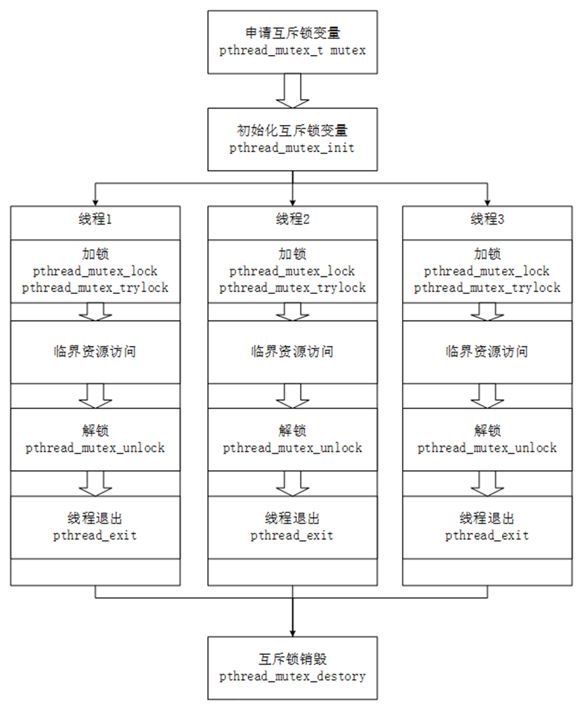

# 多线程编程 

- 源码获取：[AppBaseCode](https://dl.100ask.net/Hardware/MPU/RK3576-DshanPi-A1/utils/AppBaseCode/)

​	本章将分为两大部分进行讲解，第一部分将引出线程的使用场景及基本概念，通过示例代码来说明一个线程创建到退出到回收的基本流程。第二部分则会通过示例代码来说明如果控制好线程，从临界资源访问与线程的执行顺序控制上引出互斥锁、信号量的概念与使用方法。

## 1 线程的使用

### 1.1 为什么要使用多线程

在编写代码时，是否会遇到以下的场景会感觉到难以下手？

要做2件事，一件需要阻塞等待，另一件需要实时进行。例如播放器：一边在屏幕上播放视频，一边在等待用户的按键操作。如果使用单线程的话，程序必须一会查询有无按键，一会播放视频。查询按键太久，就会导致视频播放卡顿；视频播放太久，就无法及时响应用户的操作。并且查询按键和播放视频的代码混杂在一起，代码丑陋。

如果使用多线程，线程1单独处理按键，线程2单独处理播放，可以完美解决上述问题。

### 1.2 线程概念

所谓线程，就是操作系统所能调度的最小单位。普通的进程，只有一个线程在执行对应的逻辑。我们可以通过多线程编程，使一个进程可以去执行多个不同的任务。相比多进程编程而言，线程享有共享资源，即在进程中出现的全局变量，每个线程都可以去访问它，与进程共享“4G”内存空间，使得系统资源消耗减少。本章节来讨论Linux下POSIX线程。

### 1.3 线程的标识pthread_t

对于进程而言，每一个进程都有一个唯一对应的PID号来表示该进程，而对于线程而言，也有一个“类似于进程的PID号”，名为tid，其本质是一个pthread_t类型的变量。线程号与进程号是表示线程和进程的唯一标识，但是对于线程号而言，其仅仅在其所属的进程上下文中才有意义。

```
获取线程号
#include <pthread.h>
pthread_t pthread_self(void);
成功：返回线程号
```

在程序中，可以通过函数pthread_self，来返回当前线程的线程号，例程1给出了打印线程tid号。

本节源码位于如下目录：

09_thread\Pthread_Text1.c

测试例程1：（Pthread_Text1.c）

```
1	#include <pthread.h>
2	#include <stdio.h>
3
4	int main()
5	{
6		pthread_t tid = pthread_self();//获取主线程的tid号
7		printf("tid = %lu\n",(unsigned long)tid);
8       return 0;
9	}
```

注意**：**因采用POSIX线程接口，故在要编译的时候包含pthread库，使用gcc编译应gcc xxx.c -lpthread 方可编译多线程程序。

编译结果：

```
baiwen@dshanpi-a1:~/code/thread$ gcc -o pthread Pthread_Text1.c -lpthread
baiwen@dshanpi-a1:~/code/thread$ ./pthread
tid = 281472960012320
```

 

### 1.4 线程的创建

怎么创建线程呢？使用pthread_create函数：

**创建线程**

```
创建线程
#include <pthread.h>
int pthread_create(pthread_t *thread, const pthread_attr_t *attr,void *(*start_routine) (void *), void *arg);
```

- 该函数第一个参数为pthread_t指针，用来保存新建线程的线程号；


- 第二个参数表示了线程的属性，一般传入NULL表示默认属性；


- 第三个参数是一个函数指针，就是线程执行的函数。这个函数返回值为void*，形参为void*。


- 第四个参数则表示为向线程处理函数传入的参数，若不传入，可用NULL填充，有关线程传参后续小节会有详细的说明，接下来通过一个简单例程来使用该函数创建出一个线程。


本节源码位于如下目录：


09_thread\Pthread_Text2.c

测试例程2：（Pthread_Text2.c）

```
1 	#include <pthread.h>
2 	#include <stdio.h>
3 	#include <unistd.h>
4 	#include <errno.h>
5 
6 	void *fun(void *arg)
7 	{
8 		printf("pthread_New = %lu\n",(unsigned long)pthread_self());//打印线程的tid号
9 	}
10
11	int main()
12	{
13
14		pthread_t tid1;
15		int ret = pthread_create(&tid1,NULL,fun,NULL);//创建线程
16		if(ret != 0){
17			perror("pthread_create");
18			return -1;
19		}
20
21		/*tid_main 为通过pthread_self获取的线程ID，tid_new通过执行pthread_create成功后tid指向的空间*/
22		printf("tid_main = %lu tid_new = %lu \n",(unsigned long)pthread_self(),(unsigned long)tid1);
23		
24		/*因线程执行顺序随机，不加sleep可能导致主线程先执行，导致进程结束，无法执行到子线程*/
25		sleep(1);
26
27		return 0;
28	}
29
```

运行结果：

```
baiwen@dshanpi-a1:~/code/thread$ gcc -o pthread Pthread_Text2.c -lpthread
baiwen@dshanpi-a1:~/code/thread$ ./pthread
tid_main = 281473117855776 tid_new = 281473115615648
pthread_New = 281473115615648
```

通过pthread_create确实可以创建出来线程，主线程中执行pthread_create后的tid指向了线程号空间，与子线程通过函数pthread_self打印出来的线程号一致。

特别说明的是，当主线程伴随进程结束时，所创建出来的线程也会立即结束，不会继续执行。并且创建出来的线程的执行顺序是随机竞争的，并不能保证哪一个线程会先运行。可以将上述代码中sleep函数进行注释，观察实验现象。

去掉上述代码25行后运行结果：

```
baiwen@dshanpi-a1:~/code/thread$ ./pthread
tid_main = 281473650946080 tid_new = 281473648685472
```

上述运行代码3次，其中有2次被进程结束，无法执行到子线程的逻辑，最后一次则执行到了子线程逻辑后结束的进程。如此可以说明，线程的执行顺序不受控制，且整个进程结束后所产生的线程也随之被释放，在后续内容中将会描述如何控制线程执行。

### 1.5 向线程传入参数

pthread_create()的最后一个参数的为void*类型的数据，表示可以向线程传递一个void*数据类型的参数，线程的回调函数中可以获取该参数，例程3举例了如何向线程传入变量地址与变量值。

本节源码位于如下目录：


09_thread\Pthread_Text3.c

测试例程3：（Pthread_Text3.c）

```
1 	#include <pthread.h>
2 	#include <stdio.h>
3 	#include <unistd.h>
4 	#include <errno.h>
5 
6 	void *fun1(void *arg)
7 	{
8 		printf("%s:arg = %d Addr = %p\n",__FUNCTION__,*(int *)arg,arg);
9 	}
10
11	void *fun2(void *arg)
12	{
13		printf("%s:arg = %d Addr = %p\n",__FUNCTION__,(int)(long)arg,arg);
14	}
15
16	int main()
17	{
18
19		pthread_t tid1,tid2;
20		int a = 50;
21		int ret = pthread_create(&tid1,NULL,fun1,(void *)&a);//创建线程传入变量a的地址
22		if(ret != 0){
23			perror("pthread_create");
24			return -1;
25		}
27		ret = pthread_create(&tid2,NULL,fun2,(void *)(long)a);//创建线程传入变量a的值
28		if(ret != 0){
29			perror("pthread_create");
30			return -1;
31		}
32		sleep(1);
33		printf("%s:a = %d Add = %p \n",__FUNCTION__,a,&a);
34		return 0;
35	}
36
```

运行结果：

```
baiwen@dshanpi-a1:~/code/thread$ gcc -o pthread Pthread_Text3.c -lpthread
baiwen@dshanpi-a1:~/code/thread$ ./pthread
fun1:arg = 50 Addr = 0xffffcc71ba30
fun2:arg = 50 Addr = 0x32
main:a = 50 Add = 0xffffcc71ba30
```

本例程展示了如何利用线程创建函数的第四个参数向线程传入数据，举例了如何以地址的方式传入值、以变量的方式传入值，例程代码的21行，是将变量a先行取地址后，再次强制类型转化为`void*`后传入线程，线程处理的回调函数中，先将万能指针`void*`转化为`int*`，再次取地址就可以获得该地址变量的值，其本质在于地址的传递。例程代码的27行，直接将int类型的变量强制转化为`void*`进行传递（针对不同位数机器，指针对其字数不同，需要int转化为long在转指针，否则可能会发生警告），在线程处理回调函数中，直接将`void*`数据转化为int类型即可，本质上是在传递变量a的值。

上述两种方法均可得到所要的值，但是要注意其本质，一个为地址传递，一个为值的传递。当变量发生改变时候，传递地址后，该地址所对应的变量也会发生改变，但传入变量值的时候，即使地址指针所指的变量发生变化，但传入的为变量值，不会受到指针的指向的影响，实际项目中切记两者之间的区别。具体说明见例程4。

本节源码位于如下目录：


09_thread\Pthread_Text4.c

测试例程4：（Pthread_Text4.c）

```
1 	#include <pthread.h>
2 	#include <stdio.h>
3 	#include <unistd.h>
4 	#include <errno.h>
5 
6 	void *fun1(void *arg)
7 	{
8 		while(1){
9 		
10			printf("%s:arg = %d Addr = %p\n",__FUNCTION__,*(int *)arg,arg);
11			sleep(1);
12		}
13	}
14
15	void *fun2(void *arg)
16	{
17		while(1){
18		
19			printf("%s:arg = %d Addr = %p\n",__FUNCTION__,(int)(long)arg,arg);
20			sleep(1);
21		}
22	}
23
24	int main()
25	{
26
27		pthread_t tid1,tid2;
28		int a = 50;
29		int ret = pthread_create(&tid1,NULL,fun1,(void *)&a);
30		if(ret != 0){
31			perror("pthread_create");
32			return -1;
33		}
34		sleep(1);
35		ret = pthread_create(&tid2,NULL,fun2,(void *)(long)a);
36		if(ret != 0){
37			perror("pthread_create");
38			return -1;
39		}
40		while(1){
41			a++;
42			sleep(1);
43			printf("%s:a = %d Add = %p \n",__FUNCTION__,a,&a);
44		}
45		return 0;
46	}
47
```

运行结果：

```
baiwen@dshanpi-a1:~/code/thread$ gcc -o pthread Pthread_Text4.c -lpthread
baiwen@dshanpi-a1:~/code/thread$ ./pthread
fun1:arg = 50 Addr = 0xfffffe1e3b30
fun2:arg = 50 Addr = 0x32
fun1:arg = 51 Addr = 0xfffffe1e3b30
main:a = 51 Add = 0xfffffe1e3b30
fun2:arg = 50 Addr = 0x32
fun1:arg = 52 Addr = 0xfffffe1e3b30
main:a = 52 Add = 0xfffffe1e3b30
fun2:arg = 50 Addr = 0x32
fun1:arg = 53 Addr = 0xfffffe1e3b30
main:a = 53 Add = 0xfffffe1e3b30
fun1:arg = 54 Addr = 0xfffffe1e3b30
fun2:arg = 50 Addr = 0x32
main:a = 54 Add = 0xfffffe1e3b30
fun1:arg = 55 Addr = 0xfffffe1e3b30
fun2:arg = 50 Addr = 0x32
main:a = 55 Add = 0xfffffe1e3b30
fun1:arg = 56 Addr = 0xfffffe1e3b30
fun2:arg = 50 Addr = 0x32
main:a = 56 Add = 0xfffffe1e3b30
fun1:arg = 57 Addr = 0xfffffe1e3b30
fun2:arg = 50 Addr = 0x32
^C
```

上述例程讲述了如何向线程传递一个参数，在处理实际项目中，往往会遇到传递多个参数的问题，我们可以通过结构体来进行传递，解决此问题。

本节源码位于如下目录：


09_thread\Pthread_Text5.c

测试例程5：（Pthread_Text5.c）

```
1 	#include <pthread.h>
2 	#include <stdio.h>
3 	#include <unistd.h>
4 	#include <string.h>
5 	#include <errno.h>
6 
7 	struct Stu{
8 		int Id;
9 		char Name[32];
10		float Mark;
11	};
12
13	void *fun1(void *arg)
14	{
15		struct Stu *tmp = (struct Stu *)arg;
16		printf("%s:Id = %d Name = %s Mark = %.2f\n",__FUNCTION__,tmp->Id,tmp->Name,tmp->Mark);
17		
18	}
19
20	int main()
21	{
22
23		pthread_t tid1,tid2;
24		struct Stu stu;
25		stu.Id = 10000;
26		strcpy(stu.Name,"ZhangSan");
27		stu.Mark = 94.6;
28
29		int ret = pthread_create(&tid1,NULL,fun1,(void *)&stu);
30		if(ret != 0){
31			perror("pthread_create");
32			return -1;
33		}
34		printf("%s:Id = %d Name = %s Mark = %.2f\n",__FUNCTION__,stu.Id,stu.Name,stu.Mark);
35		sleep(1);
36		return 0;
37	}
38
```

运行结果：

```
baiwen@dshanpi-a1:~/code/thread$ gcc -o pthread Pthread_Text5.c -lpthread
baiwen@dshanpi-a1:~/code/thread$ ./pthread
main:Id = 10000 Name = ZhangSan Mark = 94.60
fun1:Id = 10000 Name = ZhangSan Mark = 94.60
```

 

### 1.6 线程的退出与回收

线程的退出情况有三种：第一种是进程结束，进程中所有的线程也会随之结束。第二种是通过函数pthread_exit来主动的退出线程。第三种被其他线程调用pthread_cancel来被动退出。

当线程结束后，主线程可以通过函数pthread_join/pthread_tryjoin_np来回收线程的资源，并且获得线程结束后需要返回的数据。

1 **线程主动退出**

pthread_exit函数原型如下：

```
线程主动退出
#include <pthread.h>
void pthread_exit(void *retval);
```

pthread_exit函数为线程退出函数，在退出时候可以传递一个void*类型的数据带给主线程，若选择不传出数据，可将参数填充为NULL。

2 **线程被动退出**

pthread_cancel函数原型如下：

```
线程被动退出，其他线程使用该函数让另一个线程退出
#include <pthread.h>
int pthread_cancel(pthread_t thread);
成功：返回0
```

该函数传入一个tid号，会强制退出该tid所指向的线程，若成功执行会返回0。

3 **线程资源回收(阻塞方式)**

pthread_join函数原型如下：

```
线程资源回收（阻塞）
#include <pthread.h>
int pthread_join(pthread_t thread, void **retval);
```

该函数为线程回收函数，默认状态为阻塞状态，直到成功回收线程后才返回。第一个参数为要回收线程的tid号，第二个参数为线程回收后接受线程传出的数据。

4 **线程资源回收(非阻塞方式)**

pthread_tryjoin_np函数原型如下：

```
线程资源回收（非阻塞）
#define _GNU_SOURCE            
#include <pthread.h>
int pthread_tryjoin_np(pthread_t thread, void **retval);
```

该函数为非阻塞模式回收函数，通过返回值判断是否回收掉线程，成功回收则返回0，其余参数与pthread_join一致。

5 **程序示例1**

本节源码位于如下目录：


09_thread\Pthread_Text6.c

测试例程6：（Pthread_Text6.c）

```
1 	#include <pthread.h>
2 	#include <stdio.h>
3 	#include <unistd.h>
4 	#include <errno.h>
5 
6 	void *fun1(void *arg)
7 	{
8 		static int tmp = 0;//必须要static修饰，否则pthread_join无法获取到正确值
9 		//int tmp = 0;
10		tmp = *(int *)arg;
11		tmp+=100;
12		printf("%s:Addr = %p tmp = %d\n",__FUNCTION__,&tmp,tmp);
13		pthread_exit((void *)&tmp);//将变量tmp取地址转化为void*类型传出
14	}
15
16
17	int main()
18	{
19
20		pthread_t tid1;
21		int a = 50;
22		void *Tmp = NULL;//因pthread_join第二个参数为void**类型
23		int ret = pthread_create(&tid1,NULL,fun1,(void *)&a);
24		if(ret != 0){
25			perror("pthread_create");
26			return -1;
27		}
28		pthread_join(tid1,&Tmp);
29		printf("%s:Addr = %p Val = %d\n",__FUNCTION__,Tmp,*(int *)Tmp);
30		return 0;
31	}
```

运行结果：

```
baiwen@dshanpi-a1:~/code/thread$ gcc -o pthread Pthread_Text6.c -lpthread
baiwen@dshanpi-a1:~/code/thread$ ./pthread
fun1:Addr = 0xaaaacdb00014 tmp = 150
main:Addr = 0xaaaacdb00014 Val = 150
```

上述例程先通过23行将变量以地址的形式传入线程，在线程中做出了自加100的操作，当线程退出的时候通过线程传参，用void*类型的数据通过pthread_join接受。此例程去掉了之前加入的sleep函数，原因是pthread_join函数具备阻塞的特性，直至成功收回掉线程后才会冲破阻塞，因此不需要靠考虑主线程会执行到30行结束进程的情况。特别要说明的是例程第8行，当变量从线程传出的时候，需要加static修饰，对生命周期做出延续，否则无法传出正确的变量值。

6 **程序示例2**

本节源码位于如下目录：


09_thread\Pthread_Text7.c

测试例程7：（Pthread_Text7.c）

```
1 	#define _GNU_SOURCE 
2 	#include <pthread.h>
3 	#include <stdio.h>
4 	#include <unistd.h>
5 	#include <errno.h>
6 
7 	void *fun(void *arg)
8 	{
9 		printf("Pthread:%d Come !\n",(int )(long)arg+1);
10		pthread_exit(arg);
11	}
12
13
14	int main()
15	{
16		int ret,i,flag = 0;
17		void *Tmp = NULL;
18		pthread_t tid[3];
19		for(i = 0;i < 3;i++){
20			ret = pthread_create(&tid[i],NULL,fun,(void *)(long)i);
21			if(ret != 0){
22				perror("pthread_create");
23				return -1;
24			}
25		}
26		while(1){//通过非阻塞方式收回线程，每次成功回收一个线程变量自增，直至3个线程全数回收
27			for(i = 0;i <3;i++){
28				if(pthread_tryjoin_np(tid[i],&Tmp) == 0){
29					printf("Pthread : %d exit !\n",(int )(long )Tmp+1);
30					flag++;	
31				}
32			}
33			if(flag >= 3) break;
34		}
35		return 0;
36	}
```

运行结果：

```
baiwen@dshanpi-a1:~/code/thread$ gcc -o pthread Pthread_Text7.c -lpthread
baiwen@dshanpi-a1:~/code/thread$ ./pthread
Pthread:1 Come !
Pthread:2 Come !
Pthread:3 Come !
Pthread : 1 exit !
Pthread : 2 exit !
Pthread : 3 exit !
```

例程7展示了如何使用非阻塞方式来回收线程，此外也展示了多个线程可以指向同一个回调函数的情况。例程6通过阻塞方式回收线程几乎规定了线程回收的顺序，若最先回收的线程未退出，则一直会被阻塞，导致后续先退出的线程无法及时的回收。

通过函数pthread_tryjoin_np，使用非阻塞回收，线程可以根据退出先后顺序自由的进行资源的回收。

7 **程序示例3**

本节源码位于如下目录：


09_thread\Pthread_Text8.c

测试例程8：（Pthread_Text8.c）

```
1 	#define _GNU_SOURCE 
2 	#include <pthread.h>
3 	#include <stdio.h>
4 	#include <unistd.h>
5 	#include <errno.h>
6 
7 	void *fun1(void *arg)
8 	{
9 		printf("Pthread:1 come!\n");
10		while(1){
11			sleep(1);
12		}
13	}
14
15	void *fun2(void *arg)
16	{
17		printf("Pthread:2 come!\n");
18		pthread_cancel((pthread_t )(long)arg);//杀死线程1，使之强制退出
19		pthread_exit(NULL);
20	}
21
22	int main()
23	{
24		int ret,i,flag = 0;
25		void *Tmp = NULL;
26		pthread_t tid[2];
27		ret = pthread_create(&tid[0],NULL,fun1,NULL);
28		if(ret != 0){
29			perror("pthread_create");
30			return -1;
31		}
32		sleep(1);
33		ret = pthread_create(&tid[1],NULL,fun2,(void *)tid[0]);//传输线程1的线程号
34		if(ret != 0){
35			perror("pthread_create");
36			return -1;
37		}
38		while(1){//通过非阻塞方式收回线程，每次成功回收一个线程变量自增，直至2个线程全数回收

39			for(i = 0;i <2;i++){
40				if(pthread_tryjoin_np(tid[i],NULL) == 0){
41					printf("Pthread : %d exit !\n",i+1);
42					flag++;	
43				}
44			}
45			if(flag >= 2) break;
46		}
47		return 0;
48	}
49
```

运行结果：

```
baiwen@dshanpi-a1:~/code/thread$ gcc -o pthread Pthread_Text8.c -lpthread
baiwen@dshanpi-a1:~/code/thread$ ./pthread
Pthread:1 come!
Pthread:2 come!
Pthread : 2 exit !
Pthread : 1 exit !
```

例程8展示了如何利用pthread_cancel函数主动的将某个线程结束。27行与33行创建了线程，将第一个线程的线程号传参形式传入了第二个线程。第一个的线程执行死循环睡眠逻辑，理论上除非进程结束，其永远不会结束，但在第二个线程中调用了pthread_cancel函数，相当于向该线程发送一个退出的指令，导致线程被退出，最终资源被非阻塞回收掉。此例程要注意第32行的sleep函数，一定要确保线程1先执行，因线程是无序执行，故加入该睡眠函数控制顺序，在本章后续，会讲解通过加锁、信号量等手段来合理的控制线程的临界资源访问与线程执行顺序控制。

## 2 线程的控制

### 2.1 多线程编临界资源访问

当线程在运行过程中，去操作公共资源，如全局变量的时候，可能会发生彼此“矛盾”现象。例如线程1企图想让变量自增，而线程2企图想要变量自减，两个线程存在互相竞争的关系导致变量永远处于一个“平衡状态”，两个线程互相竞争，线程1得到执行权后将变量自加，当线程2得到执行权后将变量自减，变量似乎永远在某个范围内浮动，无法到达期望数值，如例程9所示。

本节源码位于如下目录：


09_thread\Pthread_Text9.c

测试例程9：（Pthread_Text9.c）

```
1 	#define _GNU_SOURCE 
2 	#include <pthread.h>
3 	#include <stdio.h>
4 	#include <unistd.h>
5 	#include <errno.h>
6 
7 
8 	int Num = 0;
9 
10	void *fun1(void *arg)
11	{
12		while(Num < 3){
13			Num++;
14			printf("%s:Num = %d\n",__FUNCTION__,Num);
15			sleep(1);
16		}
17		pthread_exit(NULL);
18	}
19
20	void *fun2(void *arg)
21	{
22		while(Num > -3){
23			Num--;
24			printf("%s:Num = %d\n",__FUNCTION__,Num);
25			sleep(1);
26		}
27		pthread_exit(NULL);
28	}
29
30	int main()
31	{
32		int ret;
33		pthread_t tid1,tid2;
34		ret = pthread_create(&tid1,NULL,fun1,NULL);
35		if(ret != 0){
36			perror("pthread_create");
37			return -1;
38		}
39		ret = pthread_create(&tid2,NULL,fun2,NULL);
40		if(ret != 0){
41			perror("pthread_create");
42			return -1;
43		}
44		pthread_join(tid1,NULL);
45		pthread_join(tid2,NULL);
46		return 0;
47	}
```

运行结果：

```
baiwen@dshanpi-a1:~/code/thread$ gcc -o pthread Pthread_Text9.c -lpthread
baiwen@dshanpi-a1:~/code/thread$ ./pthread
fun1:Num = 1
fun2:Num = 0
fun1:Num = 1
fun2:Num = 0
fun1:Num = 1
fun2:Num = 0
fun1:Num = 1
fun2:Num = 0
fun1:Num = 1
fun2:Num = 0
fun1:Num = 1
fun2:Num = 0
^C
```

为了解决上述对临界资源的竞争问题，pthread线程引出了互斥锁来解决临界资源访问。通过对临界资源加锁来保护资源只被单个线程操作，待操作结束后解锁，其余线程才可获得操作权。

### 2.2 互斥锁API简述

多个线程都要访问某个临界资源，比如某个全局变量时，需要互斥地访问：我访问时，你不能访问。

可以使用以下函数进行互斥操作。

1 **初始化互斥量**

函数原型如下：

```
int pthread_mutex_init(phtread_mutex_t *mutex, 
const pthread_mutexattr_t *restrict attr);
```

该函数初始化一个互斥量，第一个参数是改互斥量指针，第二个参数为控制互斥量的属性，一般为NULL。当函数成功后会返回0，代表初始化互斥量成功。

当然初始化互斥量也可以调用宏来快速初始化，代码如下：

```
pthread_mutex_t mutex = PTHREAD_MUTEX_INITALIZER;*
```

2 **互斥量加锁/解锁**

函数原型如下：

```
互斥量加锁（阻塞）/解锁 
#include <pthread.h>
int pthread_mutex_lock(pthread_mutex_t *mutex);
int pthread_mutex_unlock(pthread_mutex_t *mutex);
成功：返回0
```

lock函数与unlock函数分别为加锁解锁函数，只需要传入已经初始化好的pthread_mutex_t互斥量指针。成功后会返回0。

当某一个线程获得了执行权后，执行lock函数，一旦加锁成功后，其余线程遇到lock函数时候会发生阻塞，直至获取资源的线程执行unlock函数后。unlock函数会唤醒其他正在等待互斥量的线程。

特别注意的是，当获取lock之后，必须在逻辑处理结束后执行unlock，否则会发生死锁现象！导致其余线程一直处于阻塞状态，无法执行下去。在使用互斥量的时候，尤其要注意使用pthread_cancel函数，防止发生死锁现象！

3 **互斥量加锁(非阻塞方式)**

函数原型如下：

```
互斥量加锁（非阻塞）
#include <pthread.h>
int pthread_mutex_trylock(pthread_mutex_t *mutex);
```

该函数同样也是一个线程加锁函数，但该函数是非阻塞模式通过返回值来判断是否加锁成功，用法与上述阻塞加锁函数一致。

4 **互斥量加锁(非祖师方式)**

函数原型如下：

```
互斥量销毁
#include <pthread.h>
 int pthread_mutex_destory(pthread_mutex_t *mutex);
成功：返回0
```

该函数是用于销毁互斥量的，传入互斥量的指针，就可以完成互斥量的销毁，成功返回0。

5 **程序示例**

本节源码位于如下目录：


09_thread\Pthread_Text10.c

测试例程10：（Pthread_Text10.c）

```
1 	#define _GNU_SOURCE 
2 	#include <pthread.h>
3 	#include <stdio.h>
4 	#include <unistd.h>
5 	#include <errno.h>
6 
7 	pthread_mutex_t mutex;//互斥量变量 一般申请全局变量
8 
9 	int Num = 0;//公共临界变量
10
11	void *fun1(void *arg)
12	{
13		pthread_mutex_lock(&mutex);//加锁 若有线程获得锁，则会阻塞
14		while(Num < 3){
15			Num++;
16			printf("%s:Num = %d\n",__FUNCTION__,Num);
17			sleep(1);
18		}
19		pthread_mutex_unlock(&mutex);//解锁
20		pthread_exit(NULL);//线程退出 pthread_join会回收资源
21	}
22
23	void *fun2(void *arg)
24	{
25		pthread_mutex_lock(&mutex);//加锁 若有线程获得锁，则会阻塞
26		while(Num > -3){
27			Num--;
28			printf("%s:Num = %d\n",__FUNCTION__,Num);
29			sleep(1);
30		}
31		pthread_mutex_unlock(&mutex);//解锁
32		pthread_exit(NULL);//线程退出 pthread_join会回收资源
33	}
34
35	int main()
36	{
37		int ret;
38		pthread_t tid1,tid2;
39		ret = pthread_mutex_init(&mutex,NULL);//初始化互斥量
40		if(ret != 0){
41			perror("pthread_mutex_init");
42			return -1;
43		}
44		ret = pthread_create(&tid1,NULL,fun1,NULL);//创建线程1
45		if(ret != 0){
46			perror("pthread_create");
47			return -1;
48		}
49		ret = pthread_create(&tid2,NULL,fun2,NULL);//创建线程2
50		if(ret != 0){
51			perror("pthread_create");
52			return -1;
53		}
54		pthread_join(tid1,NULL);//阻塞回收线程1
55		pthread_join(tid2,NULL);//阻塞回收线程2
56		pthread_mutex_destroy(&mutex);//销毁互斥量
57		return 0;
58	}
59
```

运行结果：

```
baiwen@dshanpi-a1:~/code/thread$ gcc -o pthread Pthread_Text10.c -lpthread
baiwen@dshanpi-a1:~/code/thread$ ./pthread
fun1:Num = 1
fun1:Num = 2
fun1:Num = 3
fun2:Num = 2
fun2:Num = 1
fun2:Num = 0
fun2:Num = -1
fun2:Num = -2
fun2:Num = -3
```

上述例程通过加入互斥量，保证了临界变量某一时刻只被某一线程控制，实现了临界资源的控制。需要说明的是，线程加锁在循环内与循环外的情况。本历程在进入while循环前进行了加锁操作，在循环结束后进行的解锁操作，如果将加锁解锁全部放入while循环内，作为单核的机器，执行结果无异，当有多核机器执行代码时，可能会发生“抢锁”现象，这取决于操作系统底层的实现。

### 2.3 多线程编执行顺序控制

解决了临界资源的访问，但似乎对线程的执行顺序无法得到控制，因线程都是无序执行，之前采用sleep强行延时的方法勉强可以控制执行顺序，但此方法在实际项目情况往往是不可取的，其仅仅可解决线程创建的顺序，当创建之后执行的顺序又不会受到控制，于是便引入了信号量的概念，解决线程执行顺序。

例程11将展示线程的执行的随机性。

本节源码位于如下目录：


09_thread\Pthread_Text11.c

测试例程11：（Pthread_Text11.c）

```
1 	#define _GNU_SOURCE 
2 	#include <pthread.h>
3 	#include <stdio.h>
4 	#include <unistd.h>
5 	#include <errno.h>
6 
7 	void *fun1(void *arg)
8 	{
9 		printf("%s:Pthread Come!\n",__FUNCTION__);
10		pthread_exit(NULL);
11	}
12
13	void *fun2(void *arg)
14	{
15		printf("%s:Pthread Come!\n",__FUNCTION__);
16		pthread_exit(NULL);
17	}
18
19	void *fun3(void *arg)
20	{
21		printf("%s:Pthread Come!\n",__FUNCTION__);
22		pthread_exit(NULL);
23	}
24
25	int main()
26	{
27		int ret;
28		pthread_t tid1,tid2,tid3;
29		ret = pthread_create(&tid1,NULL,fun1,NULL);
30		if(ret != 0){
31			perror("pthread_create");
32			return -1;
33		}
34		ret = pthread_create(&tid2,NULL,fun2,NULL);
35		if(ret != 0){
36			perror("pthread_create");
37			return -1;
38		}
39		ret = pthread_create(&tid3,NULL,fun3,NULL);
40		if(ret != 0){
41			perror("pthread_create");
42			return -1;
43		}
44		pthread_join(tid1,NULL);
45		pthread_join(tid2,NULL);
46		pthread_join(tid3,NULL);
47		return 0;
48	}
```

运行结果：

```
baiwen@dshanpi-a1:~/code/thread$ gcc -o pthread Pthread_Text11.c -lpthread
baiwen@dshanpi-a1:~/code/thread$ ./pthread
fun1:Pthread Come!
fun2:Pthread Come!
fun3:Pthread Come!
```

通过上述例程可以发现，多次执行该函数其次序是无序的，线程之间的竞争无法控制，通过使用信号量来使得线程顺序为可控的。

### 2.4 信号量API简述

注意：信号量跟互斥量不一样，互斥量用来防止多个线程同时访问某个临界资源。信号量起通知作用，线程A在等待某件事，线程B完成了这件事后就可以给线程A发信号。

1 **初始化信号量**

函数原型如下：

```
int sem_init(sem_t *sem,int pshared,unsigned int value);
```

- 该函数可以初始化一个信号量，第一个参数传入sem_t类型指针；


- 第二个参数传入0代表线程控制，否则为进程控制；


- 第三个参数表示信号量的初始值，0代表阻塞，1代表运行。


- 待初始化结束信号量后，若执行成功会返回0。


2**信号量P/V操作**

函数原型如下：

```
#include <pthread.h>
int sem_wait(sem_t *sem);
int sem_post(sem_t *sem);
成功：返回0
```

- sem_wait函数作用为检测指定信号量是否有资源可用，若无资源可用会阻塞等待，若有资源可用会自动的执行“sem-1”的操作。所谓的“sem-1”是与上述初始化函数中第三个参数值一致，成功执行会返回0。


- sem_post函数会释放指定信号量的资源，执行“sem+1”操作。


通过以上2个函数可以完成所谓的PV操作，即信号量的申请与释放，完成对线程执行顺序的控制。

3 **信号量申请(非阻塞方式)**

函数原型如下：

```
#include <pthread.h>
int sem_trywait(sem_t *sem);
成功：返回0
```

此函数是信号量申请资源的非阻塞函数，功能与sem_wait一致，唯一区别在于此函数为非阻塞。

4 **信号量销毁**

函数原型如下：

```
#include <pthread.h>
int sem_destory(sem_t *sem);
成功：返回0
```

该函数为信号量销毁函数，执行过后可将信号量进行销毁。

5 **程序示例**

本节源码位于如下目录：


09_thread\Pthread_Text12.c

测试例程12：（Pthread_Text12.c）

```
1 	#define _GNU_SOURCE 
2 	#include <pthread.h>
3 	#include <stdio.h>
4 	#include <unistd.h>
5 	#include <errno.h>
6 	#include <semaphore.h>
7 
8 	sem_t sem1,sem2,sem3;//申请的三个信号量变量
9 
10	void *fun1(void *arg)
11	{
12		sem_wait(&sem1);//因sem1本身有资源，所以不被阻塞 获取后sem1-1 下次会会阻塞
13		printf("%s:Pthread Come!\n",__FUNCTION__);
14		sem_post(&sem2);// 使得sem2获取到资源
15		pthread_exit(NULL);
16	}
17
18	void *fun2(void *arg)
19	{
20		sem_wait(&sem2);//因sem2在初始化时无资源会被阻塞，直至14行代码执行 不被阻塞 sem2-1 下次会阻塞
21		printf("%s:Pthread Come!\n",__FUNCTION__);
22		sem_post(&sem3);// 使得sem3获取到资源
23		pthread_exit(NULL);
24	}
25
26	void *fun3(void *arg)
27	{
28		sem_wait(&sem3);//因sem3在初始化时无资源会被阻塞，直至22行代码执行 不被阻塞 sem3-1 下次会阻塞
29		printf("%s:Pthread Come!\n",__FUNCTION__);
30		sem_post(&sem1);// 使得sem1获取到资源
31		pthread_exit(NULL);
32	}
33
34	int main()
35	{
36		int ret;
37		pthread_t tid1,tid2,tid3;
38		ret = sem_init(&sem1,0,1);  //初始化信号量1 并且赋予其资源
39		if(ret < 0){
40			perror("sem_init");
41			return -1;
42		}
43		ret = sem_init(&sem2,0,0); //初始化信号量2 让其阻塞
44		if(ret < 0){
45			perror("sem_init");
46			return -1;
47		}
48		ret = sem_init(&sem3,0,0); //初始化信号3 让其阻塞
49		if(ret < 0){
50			perror("sem_init");
51			return -1;
52		}
53		ret = pthread_create(&tid1,NULL,fun1,NULL);//创建线程1
54		if(ret != 0){
55			perror("pthread_create");
56			return -1;
57		}
58		ret = pthread_create(&tid2,NULL,fun2,NULL);//创建线程2
59		if(ret != 0){
60			perror("pthread_create");
61			return -1;
62		}
63		ret = pthread_create(&tid3,NULL,fun3,NULL);//创建线程3
64		if(ret != 0){
65			perror("pthread_create");
66			return -1;
67		}
68		/*回收线程资源*/
69		pthread_join(tid1,NULL);
70		pthread_join(tid2,NULL);
71		pthread_join(tid3,NULL);
72
73		/*销毁信号量*/
74		sem_destroy(&sem1);
75		sem_destroy(&sem2);
76		sem_destroy(&sem3);
78		return 0;
79	}
```

运行结果：

```
baiwen@dshanpi-a1:~/code/thread$ gcc -o pthread Pthread_Text12.c -lpthread
baiwen@dshanpi-a1:~/code/thread$ ./pthread
fun1:Pthread Come!
fun2:Pthread Come!
fun3:Pthread Come!
```

该例程加入了信号量，使得线程的执行顺序变为可控的。在初始化信号量时，将信号量1填入资源，第一个线程调用sem_wait函数可以成功获得信号量，在执行完逻辑后使用sem_pos函数来释放。当执行函数sem_wait后，会执行sem自减操作，使下一次竞争被阻塞，直至通过sem_pos被释放。

上述例程因38行初始化信号量1时候，使其默认获取到资源；第43、48行初始化信号量2、3时候，使之没有资源。于是在线程处理函数中，每个线程通过sem_wait函数来等待资源，发生阻塞。因信号量1初始值为有资源，故可以先执行线程1的逻辑。待执行完第12行sem_wait函数，会导致sem1-1，使得下一次此线程会被阻塞。继而执行至14行，通过sem_post函数使sem2信号量获取资源，从而冲破阻塞执行线程2的逻辑...以此类推完成线程的有序控制。

### 2.5 条件变量

参考《Unix_Linux_Windows_OpenMP多线程编程.pdf》，作者不详。

条件变量时一种同步机制，用来通知其他线程条件满足了。一般是用来通知对方共享数据的状态信息，因此条件变量时结合互斥量来使用的。

1 **创建和销毁条件变量**

函数原型如下：

```
#include <pthread.h>
// 初始化条件变量
pthread_cond_t cond = PTHREAD_COND_INITIALIZER;
int pthread_cond_init(pthread_cond_t *cond, pthread_condattr_t *cond_attr);//cond_attr通常为NULL
// 销毁条件变量
int pthread_cond_destroy(pthread_cond_t *cond);
这些函数成功时都返回0
```

2 **等待条件变量**

函数原型如下：

```
int pthread_cond_wait(pthread_cond_t *cond, pthread_mutex_t *mutex);
```

这需要结合互斥量一起使用，示例代码如下：

```
pthread_mutex_lock(&g_tMutex);
// 如果条件不满足则，会unlock g_tMutex  
// 条件满足后被唤醒，会lock g_tMutex
pthread_cond_wait(&g_tConVar, &g_tMutex); 
/* 操作临界资源 */
pthread_mutex_unlock(&g_tMutex);
```

3 **通知条件变量**

函数原型如下：

```
int pthread_cond_signal(pthread_cond_t *cond);
```

pthread_cond_signal函数只会唤醒一个等待cond条件变量的线程，示例代码如下：

```
pthread_cond_signal(&g_tConVar);
```


## 3 总结

### 3.1 线程使用流程图

有关多线程的创建流程如图 9.14所示，首先需要创建线程，一旦线程创建完成后，线程与线程之间会发生竞争执行，抢占时间片来执行线程逻辑。在创建线程时候，可以通过创建线程的第四个参数传入参数，在线程退出时亦可传出参数被线程回收函数所回收，获取到传出的参数。

![img](data:image/png;base64,/9j/4AAQSkZJRgABAQEAqACoAAD/2wBDAAoHBwgHBgoICAgLCgoLDhgQDg0NDh0VFhEYIx8lJCIfIiEmKzcvJik0KSEiMEExNDk7Pj4+JS5ESUM8SDc9Pjv/2wBDAQoLCw4NDhwQEBw7KCIoOzs7Ozs7Ozs7Ozs7Ozs7Ozs7Ozs7Ozs7Ozs7Ozs7Ozs7Ozs7Ozs7Ozs7Ozs7Ozs7Ozv/wAARCAMvAogDASIAAhEBAxEB/8QAHwAAAQUBAQEBAQEAAAAAAAAAAAECAwQFBgcICQoL/8QAtRAAAgEDAwIEAwUFBAQAAAF9AQIDAAQRBRIhMUEGE1FhByJxFDKBkaEII0KxwRVS0fAkM2JyggkKFhcYGRolJicoKSo0NTY3ODk6Q0RFRkdISUpTVFVWV1hZWmNkZWZnaGlqc3R1dnd4eXqDhIWGh4iJipKTlJWWl5iZmqKjpKWmp6ipqrKztLW2t7i5usLDxMXGx8jJytLT1NXW19jZ2uHi4+Tl5ufo6erx8vP09fb3+Pn6/8QAHwEAAwEBAQEBAQEBAQAAAAAAAAECAwQFBgcICQoL/8QAtREAAgECBAQDBAcFBAQAAQJ3AAECAxEEBSExBhJBUQdhcRMiMoEIFEKRobHBCSMzUvAVYnLRChYkNOEl8RcYGRomJygpKjU2Nzg5OkNERUZHSElKU1RVVldYWVpjZGVmZ2hpanN0dXZ3eHl6goOEhYaHiImKkpOUlZaXmJmaoqOkpaanqKmqsrO0tba3uLm6wsPExcbHyMnK0tPU1dbX2Nna4uPk5ebn6Onq8vP09fb3+Pn6/9oADAMBAAIRAxEAPwD2VmVQWYhQOpJqP7TB/wA9o/8AvoVi+MYo59IghlUPHJeQq6now3Dg1P8A8Il4f/6BFt/3xQBp/aYP+e0f/fQo+0wf89o/++hWZ/wiXh//AKBFt/3xR/wiXh//AKBFt/3xQBp/aYP+e0f/AH0KPtMH/PaP/voVmf8ACJeH/wDoEW3/AHxR/wAIl4f/AOgRbf8AfFAGn9pg/wCe0f8A30KPtMH/AD2j/wC+hWZ/wiXh/wD6BFt/3xR/wiXh/wD6BFt/3xQBp/aYP+e0f/fQo+0wf89o/wDvoVmf8Il4f/6BFt/3xR/wiXh//oEW3/fFAGn9pg/57R/99Cj7TB/z2j/76FZn/CJeH/8AoEW3/fFH/CJeH/8AoEW3/fFAGn9pg/57R/8AfQo+0wf89o/++hWZ/wAIl4f/AOgRbf8AfFH/AAiXh/8A6BFt/wB8UAaf2mD/AJ7R/wDfQo+0wf8APaP/AL6FZn/CJeH/APoEW3/fFH/CJeH/APoEW3/fFAGn9pg/57R/99Cj7TB/z2j/AO+hWZ/wiXh//oEW3/fFH/CJeH/+gRbf98UAaf2mD/ntH/30KPtMH/PaP/voVmf8Il4f/wCgRbf98Uf8Il4f/wCgRbf98UAaf2mD/ntH/wB9Cj7TB/z2j/76FZn/AAiXh/8A6BFt/wB8Uf8ACJeH/wDoEW3/AHxQBp/aYP8AntH/AN9Cj7TB/wA9o/8AvoVmf8Il4f8A+gRbf98Uf8Il4f8A+gRbf98UAaf2mD/ntH/30KPtMH/PaP8A76FZn/CJeH/+gRbf98Uf8Il4f/6BFt/3xQBp/aYP+e0f/fQo+0wf89o/++hWZ/wiXh//AKBFt/3xR/wiXh//AKBFt/3xQBp/aYP+e0f/AH0KPtMH/PaP/voVmf8ACJeH/wDoEW3/AHxR/wAIl4f/AOgRbf8AfFAGn9pg/wCe0f8A30KPtMH/AD2j/wC+hWZ/wiXh/wD6BFt/3xR/wiXh/wD6BFt/3xQBp/aYP+e0f/fQo+0wf89o/wDvoVmf8Il4f/6BFt/3xR/wiXh//oEW3/fFAGn9pg/57R/99ClFxCTgTRkn/aFZf/CJeH/+gRbf98VleJvDei2nh+5uLfTYIpY9pR0XBU7h0oA62imRf6lP90U+gAooooAKKKKACiiigAooooAKKKKACiimSyxwRmSaRY0HVnYAD8aAH0VU/tXTv+f+1/7/AC/40f2rp3/P/a/9/l/xoAt0VU/tXTv+f+1/7/L/AI0f2rp3/P8A2v8A3+X/ABoAt0VU/tXTv+f+1/7/AC/40f2rp3/P/a/9/l/xoAt0VU/tXTv+f+1/7/L/AI0f2rp3/P8A2v8A3+X/ABoAt0VU/tXTv+f+1/7/AC/40f2rp3/P/a/9/l/xoAt0VU/tXTv+f+1/7/L/AI0f2rp3/P8A2v8A3+X/ABoAt0VU/tXTv+f+1/7/AC/40f2rp3/P/a/9/l/xoAt0VU/tXTv+f+1/7/L/AI0f2rp3/P8A2v8A3+X/ABoAt0VU/tXTv+f+1/7/AC/40f2rp3/P/a/9/l/xoAt0VU/tXTv+f+1/7/L/AI0f2rp3/P8A2v8A3+X/ABoAt0VU/tXTv+f+1/7/AC/40f2rp3/P/a/9/l/xoAt0VU/tXTv+f+1/7/L/AI0f2rp3/P8A2v8A3+X/ABoAt0VU/tXTv+f+1/7/AC/40f2rp3/P/a/9/l/xoAt0VU/tXTv+f+1/7/L/AI0f2rp3/P8A2v8A3+X/ABoAt0VU/tXTv+f+1/7/AC/40q6lYOwRL63ZicACVST+tAFqiiigDD8Wf8g61/6/oP8A0MVuVh+LP+Qda/8AX9B/6GK3KACiiigAooooAKKKKACiiigAooooAKKKKACiiigAooooAKKKKACiiigAooooAKKKKACiiigAooooAKKKKACiiigArG8Xf8ive/Rf/QxWzWN4u/5Fe9+i/wDoYoA1of8AUp/uj+VPpkP+pT/dH8qfQAUUUUAFFFFABRRRQAUUUUAFFFFABWD4tijnsrGGVA8b6hbhkYZDDeODW9WH4o/499P/AOwjb/8AoYoAtf8ACOaJ/wBAmz/78r/hR/wjmif9Amz/AO/K/wCFaVFAGb/wjmif9Amz/wC/K/4Uf8I5on/QJs/+/K/4VpUUAZv/AAjmif8AQJs/+/K/4Uf8I5on/QJs/wDvyv8AhWlRQBm/8I5on/QJs/8Avyv+FH/COaJ/0CbP/vyv+FaVFAGb/wAI5on/AECbP/vyv+FH/COaJ/0CbP8A78r/AIVpUUAZv/COaJ/0CbP/AL8r/hR/wjmif9Amz/78r/hWlRQBm/8ACOaJ/wBAmz/78r/hR/wjmif9Amz/AO/K/wCFaVFAGb/wjmif9Amz/wC/K/4Uf8I5on/QJs/+/K/4VpUUAZv/AAjmif8AQJs/+/K/4Uf8I5on/QJs/wDvyv8AhWlRQBm/8I5on/QJs/8Avyv+FH/COaJ/0CbP/vyv+FaVFAGb/wAI5on/AECbP/vyv+FH/COaJ/0CbP8A78r/AIVpUUAZv/COaJ/0CbP/AL8r/hR/wjmif9Amz/78r/hWlRQBm/8ACOaJ/wBAmz/78r/hR/wjmif9Amz/AO/K/wCFaVFAGb/wjmif9Amz/wC/K/4Uf8I5on/QJs/+/K/4VpUUAZv/AAjmif8AQJs/+/K/4Vj+K9E0u18O3M9vp9tFKm0q6RgMp3DoRXVVh+Mv+RWvPov/AKEKANyiiigDD8Wf8g61/wCv6D/0MVuVh+LP+Qda/wDX9B/6GK3KACiiigAooooAKKKKACiiigAooooAKKKKACiiigAooooAKKKKACiiigAooooAKKKKACiiigAooooAKKKKACiiigArG8Xf8ive/Rf/AEMVs1jeLv8AkV736L/6GKANaH/Up/uj+VPpkP8AqU/3R/Kn0AFFFFABRRRQAUUUUAFFFFABRRRQAVh+KP8Aj30//sI2/wD6GK3Kw/FH/Hvp/wD2Ebf/ANDFAG5RRRQAUUUUAFFFFABRRRQAUUUUAFFFFABRRRQAUUUUAFFFFABRRRQAUUUUAFFFFABRRRQAUUUUAFYfjL/kVrz6L/6EK3Kw/GX/ACK159F/9CFAG5RRRQBh+LP+Qda/9f0H/oYrcrD8Wf8AIOtf+v6D/wBDFblABRRRQAUUUUAFFFFABRRRQAUUUUAFFFFABRRRQAUUUUAFFFFABRRRQAUUUUAFFFFABRRRQAUUUUAFFFFABRRRQAVjeLv+RXvfov8A6GK2axvF3/Ir3v0X/wBDFAGtD/qU/wB0fyqhr+sR6DpEuoSRNN5ZULGn3nJIAA/Or8P+pT/dH8q5jxdep/bHh/S2ieYXN6JHVewQZBPtuxQBsX+rGxu9Nt/szSNfymPAIHl4UsSfyrSrkr231yXxXp8R1GxJjhmmU/Y2+XlVHG/ng9a6DTIb6COVb+/S8kMhYFIvLCA/w4yaAI21m3i1pdKmjlikkTdDI6fu5fVVb1HpWjXK+P7+Sw0mykt13XH26Jo174Byx/LNdRHIssayIcq6hlI7g0ADusaM7sFVRkkngCsrTdfjvrea7ngaztBP5dvNOwUTjswHYE9M9ao+K2ivEjsv7Rv7HypBJKbeyeVZVx90naRisDSL6PVdNm/tPXNZuba5d0hiOnja8IOAeIucjmgD0MnjPX6VgyeK7VbkbEL2gtZJ3lH3gUYKU2+uTUPhO4aLTH0iJ724ksVxHcXtu8YkBztGWAJx0Nctc3htPF7WbLa2sYjb/SCjPCbh3Q4I9jt9BzQB3Wn6w1/q19ZLbMsdosZ80nGSwztI7EDH51qVw1tqGr2umXl/ALTzr6/8kM2eGJCBsdxgZxXaWwnW2jW6dHnCgSMgwpPcgUAS1h+KP+PfT/8AsI2//oYrcrD8Uf8AHvp//YRt/wD0MUAblFFFABRRRQAUUUUAFFFFABRRRQAUUUUAFFFFABRRRQAUUUUAFFFFABRRRQAUUUUAFFFFABRRRQAVh+Mv+RWvPov/AKEK3Kw/GX/IrXn0X/0IUAblFFFAGH4s/wCQda/9f0H/AKGK3Kw/Fn/IOtf+v6D/ANDFblABRRRQAVnTeINHtpnhm1S1jljOHRpQCp9DWjXN+F7O1mTVnltoXb+1bn5mQE/foA0P+Em0L/oL2f8A3+FH/CTaF/0F7P8A7/Crf9nWP/Pnb/8Afpf8KP7Osf8Anzt/+/S/4UAVP+Em0L/oL2f/AH+FH/CTaF/0F7P/AL/Crf8AZ1j/AM+dv/36X/Cj+zrH/nzt/wDv0v8AhQBU/wCEm0L/AKC9n/3+FH/CTaF/0F7P/v8ACrf9nWP/AD52/wD36X/Cj+zrH/nzt/8Av0v+FAFT/hJtC/6C9n/3+FH/AAk2hf8AQXs/+/wq3/Z1j/z52/8A36X/AAo/s6x/587f/v0v+FAFT/hJtC/6C9n/AN/hR/wk2hf9Bez/AO/wq3/Z1j/z52//AH6X/Cj+zrH/AJ87f/v0v+FAFT/hJtC/6C9n/wB/hR/wk2hf9Bez/wC/wq3/AGdY/wDPnb/9+l/wo/s6x/587f8A79L/AIUAVP8AhJtC/wCgvZ/9/hR/wk2hf9Bez/7/AAq3/Z1j/wA+dv8A9+l/wo/s6x/587f/AL9L/hQBU/4SbQv+gvZ/9/hR/wAJNoX/AEF7P/v8Kt/2dY/8+dv/AN+l/wAKP7Osf+fO3/79L/hQBU/4SbQv+gvZ/wDf4Uf8JNoX/QXs/wDv8Kt/2dY/8+dv/wB+l/wo/s6x/wCfO3/79L/hQBU/4SbQv+gvZ/8Af4Uf8JNoX/QXs/8Av8Kt/wBnWP8Az52//fpf8KP7Osf+fO3/AO/S/wCFAFT/AISbQv8AoL2f/f4Uf8JNoX/QXs/+/wAKt/2dY/8APnb/APfpf8KP7Osf+fO3/wC/S/4UAVP+Em0L/oL2f/f4Uf8ACTaF/wBBez/7/Crf9nWP/Pnb/wDfpf8ACj+zrH/nzt/+/S/4UAVP+Em0L/oL2f8A3+FWbLVLDUS4sryC4KY3CNw23PTOKd/Z1j/z52//AH6X/Csi0ghg8d3qwxJGDpkBIRQM/vZfSgDoKKKKACsbxd/yK979F/8AQxWzWN4u/wCRXvfov/oYoA1of9Sn+6P5Vy+u2ZOtaZczZDzX4jXDfdQIenoSefyrqIf9Sn+6P5Vh+JWC6hoW44zqAA/75agDFktdNtfF91HcyaiscFpGqOJJmyWJJ+YewFbXhR9HvLWfU9H89kuJCsjzM5LleM/N/OovFurXWj2UkksLHTZQI5rqHJe1B4LMO647jpWmtzZ6dosDWSrJB5arbJH/AMtMj5QPrQBl30K634sFpkmHTrVzJ6CSUYA+u3Jqz4SvvtWiLbycXFg5tZlzyCnA/MYP41Z0PSzplrI0zeZd3UhmuJPVz2HsOgrntTg1Pw54zj1bS7KS9sdWKw31vF1jkH3ZR+HBoA1/EN4JLd7FZTDCwxd3H/PND1VfV26AD61gB7lLqK3nuJrKe+2ppVjCm77HGgOJJB79D25xXVaqrrGk0MVsJEJImuWwkR9SO5rlkM+pTXVl4fme4u5/kvtdlTCxr/djHc+gHA60Abel6rrF3a3sGq6XJp9xajb9ojw8c3+1H3/A1hTajpMV/dxz2UzWFraLCWERLs8jZOR68A+vNdpYWi6dp0Nr58sywIF82Z9zNjuTXFanb6lc6pLPoIF5p1vci7u45yFWaVcYWN++MZ9OB60AXr9Y49WstHQDBv4plTuI1jPP5rXYV5/qWoSW3iSDxpNZ/wDEot4/sbycl1VjkzY/uhvl+mTXd29xDd28dxbyCSKVQyOOjA9DQBLWH4o/499P/wCwjb/+hitysPxR/wAe+n/9hG3/APQxQBuUUUUAFFFFABVZNQtX1GTT1mBuooxI8fcKeAasEhQSTgDqTXGR6wLTVBfQKk0urXePm/5Z20YxuGOfQ/jQt7B0OltdasLy5nto5gssE5gZX+Us4GSF9eD2q1cXEFpC09zNHDEgyzyMFUfUmuDK/azqsaaVe3VzFqpurVkTaocBcAv/AA9MH2rU8ZzaPJok7agsSXv2bKxyclc9vQ80dEN6NmvaeKNCvrdLiDVLbypN2xnkCbsHBxnGeat22qafeztBa3sE8qLvZYpAxAzjPFcu+qaBPr2nzB7Y2yW80fzRYAYMmcDFXtFm0+48VX8mn+SUFtGCYkC9z7U+3z/Um+/9djbbU7BHZHvrdWU4ZWlUEH3Gaa2saYiF21G1CqMkmZeP1rAsptIsV1O61RIFVtTeMSSRg8kLgdKTUL7w3qOl6naWItZbiOykkKrDghcEZ6etS3pf+trlJXdjpJb60hhjnkuI1ilYKkm75WJ6c9OaJdQsoZTFNeQRyDqjyAEfgay72HTZ/C6affXMVrDNbooJYKV6YIz6HGKxNbtwj6siWJu3NvEhmyoZML97Jok+W4o+8kddDqFlczGGC8gllC7iiSBiB64FWCyjqwH41yehQ/8AFTRSy6elnMNNK4DKxI3rySPWtK4tvDt1qB89IJLmaTy2JY5Lhc7Tz1x2qmv6+dhJ3/ryubDTRJjfIi7jtGWAyfSh5Y4yod1UscKCcZPoK4gadoGo6lYXV0i2VutwwtLfcVaaVM5duegwcD8a3/EgjudOj+WVkRxOLiHB8vZ82c1Lelx9bE9v4h064083qSkR7ZGCsMMQhIYgfhV2yvIdQsoLy3JaGeMSISMEgjI4rzSyvheeFGu4bKSRLuOS3imDDMPmTHC7evzZHPtXbWesyNq0ekQ6XMiQRAzSMwAiBHycd87T9Kr+v6/AHZM26p6Xqtrq9s09qxIjkaKRGGGR1OCCPWsRvEMnmaldNdC2sbW7FsJJYSQGAAJz/d3cZpmmH7Jd6tb2N1F9ojk+0XS+SfmZxkEHvkCl5+QeR1dVZ9TsLVlW4vbeEtnAklC5x16+lctf2V9d+BZbzxAkb6lFFI6NESvlgnIHB6gYpbyw0vQNRilt9Ni8mHT7q5aLbncw2E9c8nFD0f8AXa4LXY6e21TT72ZobW+t7iRFDMsUgYgHucVbrmtH8mTxM1zFaJa+fpkTmNVAK5duCR1rpabVhBRRRSGFYfjL/kVrz6L/AOhCtysPxl/yK159F/8AQhQBuUUUUAYfiz/kHWv/AF/Qf+hitysPxZ/yDrX/AK/oP/QxW5QAUUUUAFYPhP8A1Oq/9ha5/wDQ63qwfCf+p1X/ALC1z/6HQBvUUUUAFFFFABRRRQAUUVW1C7Wx064u3OFhiZz+ApN2VxpXdizRXO+FtfmvreKx1bEOr+SJnj27Q6Hoy+o5APoe1XbrVJrfxHaaeEUwTW0sztglgUKgY/76qmrOwlqatFYsfizSpb1rNWufNWEzMGtZFwoOM8r61QtfGNrHeaj9tuHFvFOiQf6K4IyO5x60gudTRVHWr/8AsvRru+43QRMyg9zjgfnWdrGo6jZeFEut8UWoAwLLtXcqszoGGD9TQBv0Vmabqs13eX9ncWbQy2TgBgcrMpGQyn+nasybWteuteisLHT4bWGNBNcPdyZdkzjCquQDnuTQB01Fc1ba7rlxo7aiulWRQK55vGBO0kdNnt61t6Zcy3ml2tzOipLNEruqHIBIyQDQFy1RRRQAUUUUAFFFFABWFD/yPt5/2C4P/RstbtYUP/I+3n/YLg/9Gy0AbtFFFABWN4u/5Fe9+i/+hitmsbxd/wAive/Rf/QxQBrQ/wCpT/dH8qZPZ2908LzxLI0D+ZGT/C3qKfD/AKlP90fyp9ADJI0miaKRA6OCrKwyCD1BqO2s7e0tobeCFUigULGuPugelT0UAFFFFAFS50yyvJfMurdZjt27ZMspHup4/SrMcaRRrHGioijCqowAPYU6igBrosqFHUMrDBB71FJZ28tsLZoV8kYAjHAwO2B29qnooAY0MTwmFo0aIjaUKgqR6YpwAUAAAAdAKWigCOK4hnMgilSQxNscK2dreh96x/FH/Hvp/wD2Ebf/ANDFYnhWeS18ba/byH91fXLyxZ6Bk2qwH1Bz+Fbfij/j30//ALCNv/6GKANyiiigAooooAZLGk0LxSDKOpVh6g9a4zQ102C/kfRVtN8YNpZxSS4LIpy7k8kjPT2FdnNJHFBJJLxGilm4zwBzxXKeGbvR7eyb/hG9HaDT9xeS9nHkxuM8kFvmP4gD3pdbg9iib280/wDttr/U49NU3aBvIhMpJkUAbCcHP4Va8fLLb+C0sopWmnlaOPzn+8wX5iT+Cn86yo57bUPiHHqd1HNHpVwubBpABHcXEYPz4PP3SdvrjNbOul9Q8OTanNgRrZt5WOhLnr+AAH4mmlovl+An1+f4/wCX6ALvWFsZtXl02wE1hBKjNIzqzhCTlQAQAwANaukDVJ7hL66Sxjgmt1OyEMX3dQSxA4xxiofFFlPceH7yWPUbi2SOyk3RRBCr/Keu5SfyIp/h/T2tIbeeXVbq5eW2QCGZk2qAOoUAfnT/AK/MbWn9eRh3FxDaRST3EqxRJ4gBZ2OAOVqa/wBSstRvdaayu4rhU0ghjG27By1S6ddaP5+oRahdQI8OqPKiPJghgFwasa5qmhNpWpTx3tqbiSzePcJBkjBwPzNQ/hX9fZsVH4/u/O5B4qtLabwdBLLbxSSIbYK7oCQPMToTUWs+X/bFzE/2thO0MIitZFTcSp67u3FT+LGmXwDut4TPMotykY/iIdCBVNNL1i8uGuYpYmuRfws8ki7lTYhDcZGRk461bV3bz/yRC+Beg7wmIH177Tb/AGsLcWbsVupA7KwlCnpxj5e1IttYTLrP2yQwldZSWMxj947qsZCr3JOCPxqx4csLnTNags7to3nSwkLtH905m3cfnUemafF/a+tazHZm7vbW8dIYzJgYKJnaOgbtmjr8n/6UHVpd/wBDM0ZrO607UBqEbRal9lufs0UuPlhJbOwjgnP3u/4VvCOAeHNOtZpY4LFLZHlUtgyKqg7R7cc1QTRPt/hG0v72CS0u7NZrlEb7yh1bKN+BGfpWpPp6aj4Mji8yGFzaKBNKoIQbRnntx3qWrJr0/Urdr5/oc/pOmaXPpiXtnMguntnne2DAM43koxUf3d3BrotDkW68Qa1dRsWXdDED24Td/wCz1zvh7WLRb3Ur7UNOawU2arabU3RyQJxlGwCSSRwQCeK0PhxKIdIn026EkWpwTFrmGbAcK33Dx1G3aM+oNX1/ruS+7/rT+vvNHxC8xu7TT5LdbjS9SLW1yFGGiYgkNn04IqLwzHHHrevOh+VZooQSeyRgVfv7PR7C1nvrxVjijBkkdnP+P6VyFhNb+H7IX3iHTJI7TVLhpjcqzEW+/wC6si9QMY55681Ketv6/rcbX9f18jovFqw6l4TvJ7a+kEaROQ1vINr44IPBzzWRr9mmlQywxzTSh9KvG3TvvbLbO/1PSr+tWjQ6PDoPhzS08nUgw85DiC3UjJc4657AdaNasmkFlo/mNd393IDNOVA8uFWDOf8AZU7QoHfPfBoX9fcO9tR3h25t7zWlmtXMkQ0yJA2COQ7AiuprnPD1x9n0XTo12gSzMnPpk10dF7q/9dyVpoFFFFAwrD8Zf8itefRf/QhW5WH4y/5Fa8+i/wDoQoA3KKKKAMPxZ/yDrX/r+g/9DFblYfiz/kHWv/X9B/6GK3KACiiigArB8J/6nVf+wtc/+h1vVg+E/wDU6r/2Frn/ANDoA3qKKKACiiigAooooAK5vxnepFYw2bxSTR3Eq+esQy3lg88e5wK6SsTxVGo0oyBRvMsQLd8bhxR1QdGUmnstZ1pS+nXtpd6ZbvIjyoEBV1K7eCcjv+FU9CLHUfDDO7Ox0eQlnOSTmLvVnT7o3/iXXbhbeaJI4ktV81NpkcBido7jBHPvUOkQy2+reGoJ42jlj0eRXRhgqR5WQacP6+6Q3pdf10GW+q2V1f6jqC62lrLNIYoDGqyv5UXDYXByCxJ6d6wbm7F5/advF4gunkmu4lAFkAXPHOdnBFbt1c2EWuwuk1tpj2ltIpdYQwR2fb0x/sms2z1mOK/1GeXxgqxRXKSOsdmCZQFHH49OKmNtH/W6FLr/AF0Oj1s3lrFplj5M9/CH33FwxUcINw3noASBk1iz2N4/hK81O6n8g6lcR3TrjcYwZFCDJ4wFC9uua2fFN1f3elWMek6fJfRX8yCbawTERG45z0B6H61B4g0VJ/Dd/e31rF9tjhaRfJdiqhQCAAfpRqrv+v62Gulieza0j11ca89/qUluyomR5e0HPzKgxnJ781mpd6xN46uLRJtOS5hs4zIu1/mQtkheevHWr3hS/k1W4utRiit4dJfbHZlYwrzMB8z59CcgfSsi20ePV/F13fSyNG0qrcRuOD5aPtC/QjIquq+ZLa5X8jUsbLxBF4baz22MWVlASXduAZmIyQcZ5roNJXZpFom9H2wou5G3KcDse4riZrnwfF4jtlSSE2q2Uu5FLkFgyY47nGa7fS/sZ0y3OnxiO1MYMSBdu1T0GO1Hn3/4IWtZf10LdFFFIYUUUUAFFFFABWFD/wAj7ef9guD/ANGy1u1yt7a6hdeOrgafqYsGXTIN5Nusu/8AeS46nigDqqKwP7I8Sf8AQ0j/AMF8f+NH9keJP+hpH/gvj/xoA36xvF3/ACK979F/9DFQ/wBkeJP+hpH/AIL4/wDGoL7w5r2oWclpceKMxSY3BbCMHg59fagDo4f9Sn+6P5U+ufGj+JFAA8UjA/6h0f8AjS/2R4k/6Gkf+C+P/GgDforA/sjxJ/0NI/8ABfH/AI0f2R4k/wChpH/gvj/xoA36KwP7I8Sf9DSP/BfH/jR/ZHiT/oaR/wCC+P8AxoA36KwP7I8Sf9DSP/BfH/jR/ZHiT/oaR/4L4/8AGgDforA/sjxJ/wBDSP8AwXx/40f2R4k/6Gkf+C+P/GgDforA/sjxJ/0NI/8ABfH/AI0f2R4k/wChpH/gvj/xoAw2/wBEa51gcfYNekMh9InCq/6Gt/xR/wAe+n/9hG3/APQxRbeHDDoeoWF1dm9kv3kkkkaMICzADoOnQVlvevfeF9EllJMyX9vFLnrvSTa36gn8aAOwooooAKKKKAEIyMHkGoLmxtbyJYbiFZIlORGR8vtxViigDP1jRLDXdLk06+hDwOOAvBQjoVPYioU8PW6+Go9BaaV4I4li3kjeVHStaigDMuPDuk3ckklzZRzNKMPvyc8Yp1p4f0mwukurWwiinRCiuo5CnsK0aKAKlrplraGcxxgmeUyuWGcscZ/lT7ixtbq3kt5YEaOVSjDb1BGDViigBiRJFEsSKFRAAo9AKZbW0drCIo+mSST1JPUmpqKAMrT/AA3pml6td6nZweVPdqFkwx28HOQOxPekfwvoUk8s76XbtLM++R2TJZvWtaigDGn8I6BPBJE2l24EilSQnIyKsvotpLa29pKHkt7dQqxMx2tjpuH8X41oUUAU5tNhubqKaYl0gwYoiBtVv73uf5VHLoWmza3DrUlspvoIzEkuSCFPqO/f8zWhRQBlyaDBd3aXGozSXpifdFHJgRoex2Dgkep5q7e2dvqFlNZ3UYkgnQo6MOCDU9FHSwdblexs4tPsILKDd5UEYjTccnAGBTbSwitJJZstJPMcySv95sdB7AelWqKOtw6WOfh8E6PBq0epL9qaSKVpo4nuXMSOepCZwOtdBRRR0sAUUUUAFYfjL/kVrz6L/wChCtysPxl/yK159F/9CFAG5RRRQBh+LP8AkHWv/X9B/wChitysPxZ/yDrX/r+g/wDQxW5QAUUUUAFYPhP/AFOq/wDYWuf/AEOt6sHwn/qdV/7C1z/6HQBvUUUUAFFFFABRRRQAVkeJ7e6uNElWztzcTIyusQYAvgg4BPFa9FAHLJq2uanqtgi+GbqyhjmLTy3MseAm0jgKSSeRQtzd3Xj4GbTZ7W30+zlDXMmDHJvZcbSP908GupooWn9fIDjJBrGj6pd+JLTS2vba+wJrOIYnRVGFdcnknuvB5qtY+NrOynv7mXS9Z33MgcQ/YH3JgYweMZ/Gu8ooWgbmDdf25rVrYzabcf2TDMC1wJ4Q06r2284B+tVrrRb2+STS4priKzlG28vZpczTjuqDouehbA9hXT0UOwanBaa17pGs6d4SvraU2sXm/ZLxfuSRbfkUns4BIP0zWyC9l4puGhtZJo4NORUSMct8/QZ4zXR0tF3uJo5mW41JvEdvqA0O78mK1kiI3x53MyEfxf7Jrd0+4uLqySa6s3s5WzuhdgxXn1HFWaKOgwooooAKKKKACiiigArCh/5H28/7BcH/AKNlrdrCh/5H28/7BcH/AKNloA3aKKKACiiigAooooAKKKKACiiigAooooAKKKKACiiigArh9Q/0LV5tNPCyapa3kX0ZgrAfQqD/AMCruK5Dxrasuq+H7+PGRqEUEnPVGYH/ANCUUAdfRRRQAUUUUAFFFFABRRRQAUUUUAFFFFABRRRQAUUUUAFFFFABRRRQAUUUUAFFFFABRRRQAUUUUAFYfjL/AJFa8+i/+hCtysPxl/yK159F/wDQhQBuUUUUAYfiz/kHWv8A1/Qf+hitysPxZ/yDrX/r+g/9DFblABRRRQAVg+E/9Tqv/YWuf/Q63qwfCf8AqdV/7C1z/wCh0Ab1FFFABRRRQAUVmXniHTbG8eznmIuFjEnlhCSQTjj1qnrfiS3tvDUuo2XnXSyRt5T28ZfB6ZPpg+vpSuBrX9/baZZSXl5J5UEQy7YJwPwqaKRZoklQ5V1DKfY1h6verfeDtSkSOZMWrg+bGUJ+X0NP0TxDplyLbTYrjNwtuuBtIV8KNwU9CR3xVW3Fc3KKxm8V6XG14krTRvZbfNR4WDHdkjaP4uh6VZl1uwj0+3vlmMsVyoaARKWaXIyNoHJ45pDNCiqH9taedPjvknDxSnbHsGWdv7oHXPB4qWx1G31CFpISylDiSORSrofRgeRQA261Wysry2tLibZPdtthTafnPfnpVyuT1PW9P1LWNGhtLgSMl+exAbCsCQe4B44rrKFt/XkD0dv66hRVW+1C306JZLhjl22oiKWZ29FA5JqldeJtNtNMGpSNM1vu2uyRMxjOcEMB0OfWgDXorPt9c0661STTYbgNcxp5hXBwQDg4PfBIB9M0kGvadcX32OOY+YxKoxUhJCPvBW6EjvigDRorOu9csbO4MMjSMUx5rRxllhz03kfd/GqnijW/7J0Z5oo7iV5ANjwxlguSOSR0FAPQ3KKgtLtLyHzUjljGcYljKH8jU9ABRRRQAVhQ/wDI+3n/AGC4P/RstbtYUP8AyPt5/wBguD/0bLQBu0UUUAFFFFABRRRQAUUUUAFFFFABRRRQAUUUUAFFFFABXFeL5Wu/Eui2qnMdldQ3EmOzs4VAfw3n8K7WuHc/a4jqx5+2a3AkR/6ZxuFA/wC+t5/GgDuKKKKACiiigAooooAKKKKACiiigAooooAKKKKACiiigAooooAKKKKACiiigAooooAKKKKACiiigArD8Zf8itefRf8A0IVuVh+Mv+RWvPov/oQoA3KKKKAMPxZ/yDrX/r+g/wDQxW5WH4s/5B1r/wBf0H/oYrcoAKKKKACsHwn/AKnVf+wtc/8Aodb1YPhP/U6r/wBha5/9DoA3qKKKACiiigDnnijf4hxSMoLx6a+0n+HMi5rKb5ND8XQqR5cd3JtCjgZjRj+pJq9fC+HjuOSxMZddNbMcvCuPMXv2q3B4dZfD97YTXAa5vzJJNMq4G9vQeg4H0FC2+T/9KE92vNfkSeIufB+oD/pzf/0Gs2SOO3l8JxwosaKCqhR0HlVbuNN1m88OXttcvam9uIDCix7hGoxjJzk570k+lalJLoLqtvjT/wDj4G88/Jt+Xj8afX5oOnyZFYWkU3jzWppBv221ugUjI5D5P9KZcyNY+L7W1s7AzRW+nt5UMTKgjywBIyR2AFWtPsdWg8TX2oTwWwt7xY0wspLIE3YPTnOasatp12+oW2q6a0f2q3Vo2ilJCzRtgkZHQggEH60u39dGN63+X6f5GAsT2F6GudOb7Xdai82nWwmGFJT52YjIA6k9etRyzXlufGEs2zzxBEcQ5wMxnoep+tbFzompSXFjqqzxNqFrI7PE2fLZHABQHqMYGD7dKbbeHb17/Up9RuoZYdSjVZIo4yNhClcA55GOee9Jr3WvK35f5DTSd/63Ibu3igh8KRRoAsc6Bfb90a6quV/4R/XJRpSy31qo0qUFD5bHzlClQWGRg4/Xn2rqqpu9/X/IlK1vT/M5+7Jl8d2ETqSkNlJInpuLAH9BVPxTpUGn+DddEDyZvHaZyzZwzEZx6DitTWNLu576z1TTpIxd2e5fLlyEmRsZUkdDwMHmqOsaPq+oaFd2q/Z2u78jzGZyEiAxgDjn9KS2X9dblJ2lcv39rBYaJNcwRItxbWbrHLtG4DGTz7kZrDih1DUNB0WG10qSL7O8EyzvMmAAPmPBzyCfzrqoUluLDyr6FEd1KuiNuXHTrgVk6Zpmr2cdvps08LWNofkmUkSyIPuqR2xxk55xTXxfd+Fybe7b1MzUJfNtPEkekW6iILJ9ruZnJBlCchF746HJHPrVnUj/AMW7h/69Yf8A2WnN4e1OKLVdPtLqBbPUpJJfNdSXhLj5gB0PPQ9verf9h3UvhQ6RPcxmfygiyKp2gqBjjPTihaL7vwHJX0Xn+JuUVS0yO/WEyak8JuXxuWDOxQOwzzV2kAUUUUAFctd2Nxe+O7kW+pT2RXTIcmFVO797L13A/wCTXU1hQ/8AI+3n/YLg/wDRstAC/wBg6l/0Mt//AN+4v/iaP7B1L/oZb/8A79xf/E1uUUAYf9g6l/0Mt/8A9+4v/iaoa5YatpmjXF5D4kvWkiAwGjjxywH933rq6xvF3/Ir3v0X/wBDFAESaHqTRq3/AAkt/wAgH/Vxf/E07+wdS/6Ga/8A+/cX/wATWzD/AKlP90fyp9AGH/YOpf8AQzX/AP37i/8AiaP7B1L/AKGa/wD+/cX/AMTW5RQBh/2DqX/QzX//AH7i/wDiaP7B1L/oZr//AL9xf/E1uUUAYf8AYOpf9DNf/wDfuL/4mj+wdS/6Ga//AO/cX/xNblFAGH/YOpf9DNf/APfuL/4mj+wdS/6Ga/8A+/cX/wATW5RQBh/2DqX/AEM1/wD9+4v/AImj+wdS/wChmv8A/v3F/wDE1uUUAclHq15Z+Gdaa4uXu57W6ltoHYAM3QKOMDOWqbU7EaboWiWQOfIvLVC394hhk/icmsy0/wBN19tLHKjWJryYeixhdv5tit7xR/x76f8A9hG3/wDQxQBuVS1TVrTR4I5rtpMSSCNFiiaRmY9gqgntV2sLxH/x+6J/2EF/9BagBf8AhLtP/wCfXVf/AAV3H/xFH/CXaf8A8+uq/wDgruP/AIityigDD/4S7T/+fXVf/BXcf/EUf8Jdp/8Az66r/wCCu4/+IrcooAw/+Eu0/wD59dV/8Fdx/wDEUf8ACXaf/wA+uq/+Cu4/+IrcooAw/wDhLtP/AOfXVf8AwV3H/wARR/wl2n/8+uq/+Cu4/wDiK3KKAMP/AIS7T/8An11X/wAFdx/8RR/wl2n/APPrqv8A4K7j/wCIrcooAw/+Eu0//n11X/wV3H/xFH/CXaf/AM+uq/8AgruP/iK3KKAMP/hLtP8A+fXVf/BXcf8AxFH/AAl2n/8APrqv/gruP/iK3KKAMP8A4S7T/wDn11X/AMFdx/8AEUf8Jdp//Prqv/gruP8A4ityigDD/wCEu0//AJ9dV/8ABXcf/EUf8Jdp/wDz66r/AOCu4/8AiK3KKAMP/hLtP/59dV/8Fdx/8RR/wl2n/wDPrqv/AIK7j/4ityigDD/4S7T/APn11X/wV3H/AMRR/wAJdp//AD66r/4K7j/4ityigDD/AOEu0/8A59dV/wDBXcf/ABFH/CXaf/z66r/4K7j/AOIrcooAw/8AhLtP/wCfXVf/AAV3H/xFNfxjpcSl5YdSiQdXk02dVX6kpgVvVj+LP+RW1D/riaANdWDKGU5BGQaxPGX/ACK159F/9CFa9t/x7Rf7g/lWR4y/5Fa8+i/+hCgDcooooAw/Fn/IOtf+v6D/ANDFblYfiz/kHWv/AF/Qf+hitygAooooAKwfCf8AqdV/7C1z/wCh1vVg+E/9Tqv/AGFrn/0OgDeooooAKKKKAKR0fTzqo1Q2qfbQmwTc7tvpV2iigAooooAKKKKACiiigBDyMVQOiWZOf3v/AH9atCigCK3t47WIRR7to/vHJqWiigAooooAKKKKACiiigAooooAKwof+R9vP+wXB/6NlrdrCh/5H28/7BcH/o2WgDdooooAKxvF3/Ir3v0X/wBDFbNY3i7/AJFe9+i/+higDWh/1Kf7o/lT6ZD/AKlP90fyp9ABRRRQAUUUUAFFFFABRRRQAUUUUAct4Y0W6tPEniDUruNkW4uttru/554BJHsW/lV3xR/x76f/ANhG3/8AQxW5WH4o/wCPfT/+wjb/APoYoA3KwvEf/H7on/YQX/0Fq3awvEf/AB+6J/2EF/8AQWoA3aKKKACiiigAooooAKKKbJv8tvLID4O0npmgDnl1HyvE95c3V20NjH5VnDGx+SSZjk49+g/Gs9rjUrW7129srhQLbUYzLHOfkMPlpvwT93AJOfaqttp9wL2GHXL6FI7Ddc3LQ8Dz3JCHce+OenGBRaDQ7nUtYlFhPqf75dnkq8ivmMcNjjqO9JOy/ruv1v8AIel/6/rY6PxDdalFo095pVzbRqkDSeaybz0yCvY/jWRbWur2VxpdhH4guZDdpLNLNNEjsxwDjBGABmmeL3kt/As1/m50/bbLGLFGUKpJA2nj37elVoDpm+wuj4muI1jjkdvNf96pIAK9PlAx0NUtG/67kO9lY3tP/tKHxPLa3eqPdwraBwhhVAGLdeKWS+1S1u9aieMm3gthcWs5HchsofXBXP41W0WfTpNfeS11efUJJ7X5S4yoAOfvAAc56UT6jqssmtaffxWiRw6f5qGBmJy28c5A/u1ErqHyf6lxV5fd+hU1HX9at/D32+K/0oyssZCoCW+ZlHTPvXSalqcWkaY19dK7pHt3iNcnkgcD8a4zUYJpvCC7PDCwERxO1x5kPyBWVi3Bz0BNb/ip/t3g6WSyjkuxKI2jECFy43A5AHtWjtf5kp6Invp5x4s0mFJnSGSKZpIweHwBjP0q5Y6rHfX9/ZpFIjWMixuzD5Wyobg/jXO32uwnxbpUn2DUhthmGDZSZPA6DFXfC9wLrVtfmWGeJWu0wJ4jG3+qTsamP9feM6SiiigAooooAKKKKACsfxZ/yK2of9cT/OtisfxZ/wAitqH/AFxP86ANO2/49ov9wfyrI8Zf8itefRf/AEIVr23/AB7Rf7g/lWR4y/5Fa8+i/wDoQoA3KKKKAMPxZ/yDrX/r+g/9DFblYfiz/kHWv/X9B/6GK3KACiiigArlNKv59Gk1K3uNJv5DJqE8yPFDuVkZsgg5rq6KAMP/AISb/qDap/4D/wD16P8AhJv+oNqn/gP/APXrcooAw/8AhJv+oNqn/gP/APXo/wCEm/6g2qf+A/8A9etyigDD/wCEm/6g2qf+A/8A9ej/AISb/qDap/4D/wD163KKAMP/AISb/qDap/4D/wD16P8AhJv+oNqn/gP/APXrcooAw/8AhJv+oNqn/gP/APXo/wCEm/6g2qf+A/8A9etyigDD/wCEm/6g2qf+A/8A9ej/AISb/qDap/4D/wD163KKAMP/AISb/qDap/4D/wD16P8AhJv+oNqn/gP/APXrcooAw/8AhJv+oNqn/gP/APXo/wCEm/6g2qf+A/8A9etyigDD/wCEm/6g2qf+A/8A9ej/AISb/qDap/4D/wD163KKAMP/AISb/qDap/4D/wD16P8AhJv+oNqn/gP/APXrcooAw/8AhJv+oNqn/gP/APXo/wCEm/6g2qf+A/8A9etyigDD/wCEm/6g2qf+A/8A9ej/AISb/qDap/4D/wD163KKAMP/AISb/qDap/4D/wD16h0mWe/8VXmoGxubaA2MMKmdNpZg8hOB9GFdFRQAUUUUAFY3i7/kV736L/6GK2axvF3/ACK979F/9DFAGtD/AKlP90fyp9Mh/wBSn+6P5U+gAooooAKKKKACiiigAooooAKKKKACsPxR/wAe+n/9hG3/APQxW5WH4o/499P/AOwjb/8AoYoA3KwvEf8Ax+6J/wBhBf8A0Fq3awvEf/H7on/YQX/0FqAN2iiigAooooAKKKKACkNLTXXfGy7iu4EZB5FAHMaJpWoaU09zrusQAzXTSCOMBVfJ+XcW5JwBwMY96y9Y+13nja78O2MjQfb4YLi5uI2w0USFgwHcM3ygexrcs/CselQtJZSG41GTIa/vmMsgB+v6DpVS98HyWsEeoaNODrlvIZvtVxz9qJGGSQ/3SOgHTAxRordl/X9fcPe4eLfL1LR/s8bF4oI5J5GP+wCq5+pJ/Kp7sf2V4fnWz0u4nF3bvLK8LIArFOSdzA8+2aZBYalP4ANtcWvlapJamORMj72fX0q9c2mtTWT2cL2UcLQCMGRHZhlcHocUPZoUd0yDwpf3s+mWEEukzW9utlGVnkkQ7mwOAoJOMc5qpf3EH9ueIk85NyaShYbhlf8AW9fzH51o6VYa3ZpZ2s93ZG0t4PKcRRMHYgYBBJwKhk8JRxaJ9j027e3u1dpFu5FEjO7fe3g/eBzgj0+lE9b/ADHF2MOSSXUvDsOr6ZBLc2VvCpuLWTKpfIo52g+nY9Gx361tatqrPoukXemyPbx3V3bqMKAQjHlcduOKzpIviLaRi3s18PTwooVSUkiyP90EgVoTaHq9/oFhBdXltFfwXEdw5SLMQKnO1QMHHvVX1v5olKy+RPqH/I5aR/1xn/kKltr26k8XX1i0gNtDaQyIm3kMzOCc/wDARUE2kazPqVtftf2gltlZUAt2wQ3XPzU7S9N1ODxHf399JBIk1vDGjRKV5UuTwSf7wqUN9fl+hu0UUUAFFFFABRRRQAVj+LP+RW1D/rif51sVj+LP+RW1D/rif50Aadt/x7Rf7g/lWR4y/wCRWvPov/oQrXtv+PaL/cH8qyPGX/IrXn0X/wBCFAG5RRRQBh+LP+Qda/8AX9B/6GK3Kw/Fn/IOtf8Ar+g/9DFblABRRRQAUUUUAFFFFABRRRQAUUUUAFFFFABRRRQAUUUUAFFFFABRRRQAUUUUAFFFFABRRRQAUUUUAFFFFABRRRQAVjeLv+RXvfov/oYrZrG8Xf8AIr3v0X/0MUAa0P8AqU/3R/Kn0yH/AFKf7o/lT6ACiiigAooooAKKKKACiiigAooooAKw/FH/AB76f/2Ebf8A9DFblYfij/j30/8A7CNv/wChigDcrC8R/wDH7on/AGEF/wDQWrdrC8R/8fuif9hBf/QWoA3aKKKACiiigAooooAKKKjkl2wNLGvmkKSFUj5vbNDdgJKKoaLqY1jSYNQELQiYH92xBK4JGCR9Kv02rAFFFFIAoorO1vVW0aw+1/ZXuF8xUYIwG3cQMnJ6ZI6UAaNFIDkA0tABRRRQAUVmza1DD4ht9FME5luIGmWUJ+7AU4wT61okgYyQMnAoAWiiigAooooAKx/Fn/Irah/1xP8AOtisfxZ/yK2of9cT/OgDTtv+PaL/AHB/Ksjxl/yK159F/wDQhWvbf8e0X+4P5VkeMv8AkVrz6L/6EKANyiiigDD8Wf8AIOtf+v6D/wBDFblYfiz/AJB1r/1/Qf8AoYrcoAKKKKACiiigAooooAKKKKACiiigAooooAKKKKACiiigAooooAKKKKACiiigAooooAKKKKACiiigAooooAKKKKACsbxd/wAive/Rf/QxWzWN4u/5Fe9+i/8AoYoA1of9Sn+6P5U+mQ/6lP8AdH8qfQAUUUUAFFFFABRRRQAUUUUAFFFFABWH4o/499P/AOwjb/8AoYrcrD8Uf8e+n/8AYRt//QxQBuVheI/+P3RP+wgv/oLVu1heI/8Aj90T/sIL/wCgtQBu0UUUAFFFFABWJqHiCSz1uPSYtPknnmgaWIhwA2CAQfTGetbdYMv/ACPtt/2Dpf8A0YlC1aXr+TB6K/8AW5NHrM9/pFxcWFoPtcDNHJb3D7PLdeoJAPHQ+4NQeFbi+uPDlu13bxxgwZV0l3bjznjAxUWinOo+JmXdsN3gE9MiFAcfjVrw06jwrYKSAzW/A9aT+FvyX5MPtJev5owvDHiF7TQ9Pj/s6V7IzGB7oMAFkaRgML1K5wCf51qv4mu49UvdMOl77mCNJIVjmz5obdyePlxt9+tY8fHw707t/paf+jzWzYxofH2qylRvFlbqG9AWk/wFVLVv5iXw39PzLC+IGm0+wmt7GQ3d+m6O2lOwpxk7j2A47d6RfE9qNImvp43ie3l8iWDgsJM42/iTwap6mLw+N7NbSSGNmsZNpmQsOGGcYI56VWvUn0O3vJne2vb3U72KOOMx4jjcjAJGc9s0t9e/+dh7af1tc3LLVZZNRbTr62S3uvK85FSTerJnGc4HIJHFYHiXXWv9HuRb2Mr2S3McIuwwwXEqg8ddoIxn1/Opo7ae18bR/aLyS5mfSpMu4CjPmL0A4FUlYD4XW5ZgG8xA3b5vPGfxzmh7L+uo+v8AXY7hfuj6VS1LUvsPkxRQme6uG2wxBtucDJJPYDuaur90fSua1kXZ8ZaULV4o3a3mCtMhZc8ZxgjnFD3sLoXYtekuNLvLiGyZryxYpNaFwDuAzgHuCOh70mma7Nqcll5Vkvk3VqLhpBMD5WegIx1/wNO0rTprK+1G7u7qKaW62M6RptCBQR3J61meDClvc6nZFGXMv2i2LHObdySuPYHdx2zQt/6/r/hhPb+v6/4c111S5HiEaZLZqkTwtLHMJc7sHGCMcVQ8T3epwXemR2lrC8L3kYZnmKknsMYP51an/wCRwtP+vST/ANCFN8R/67SP+whH/WhfZ9f1CX2v66GvA0zwK08axyEfMituA/GpKarK2dpBwcH2NOoGFFFFABWP4s/5FbUP+uJ/nWxWP4s/5FbUP+uJ/nQBp23/AB7Rf7g/lWR4y/5Fa8+i/wDoQrXtv+PaL/cH8qyPGX/IrXn0X/0IUAblFFFAGH4s/wCQda/9f0H/AKGK3Kw/Fn/IOtf+v6D/ANDFblABRRRQAUUUUAFFFFABRRRQAUUUUAFFFFABRRRQAUUUUAFFFFABRRRQAUUUUAFFFFABRRRQAUUUUAFFFFABRRRQAVjeLv8AkV736L/6GK2axvF3/Ir3v0X/ANDFAGtD/qU/3R/Kn0yH/Up/uj+VPoAKKKKACiiigAooooAKKKKACiiigArD8Uf8e+n/APYRt/8A0MVuVh+KP+PfT/8AsI2//oYoA3KwvEf/AB+6J/2EF/8AQWrdrC8R/wDH7on/AGEF/wDQWoA3aKKKACiiigArktUENz4/s4UvHtrlbCTYyDOCXXg9jxnj2rraTAznAz60db/1sD2sVNM0u30uy+zQ7nDMzyPIctIzHLMT6k1U03w+mlpKkV5cSKQVhWVtwgU9lFa9FAHPDwpjw9Bow1KfZBMJRLtG44bcAfbNWLXQri21ubVG1SSR51VJIzEoUqudoHp9481s0U763DpYztV0hNTMEqzyW11bMWgnj6rnggjuD3HtUE3hu1utKNjczTSOZBN9o3YkEoOQ4PbB7VsUUgMWHw1CuqxarcXlzPeIhRnLYVlyCBtHAAIBqG68H2d1HcW73V0lnNL5wt432iOTOSyntzzj1JNdBRQBRj1GwhjWL7ajbBty75Jx6+9Rahp9trkMMsNy0c1vJvguITyjdD9QehHer32W3/54R/8AfAp6IkY2ooUegGKAMqXQnk0eexGozpNcnM10AN7Z647Djj2oGhMNZtNSW+kU29v5BiVAFkX3/EDHpWvRQBjzaJcy64mqDVZUMalFhEa7dpOSPr71a1bS49WsxA00kDo4kimiOGjYdCKvUUdLB1uV7K1WytlhEjykctJIcs57kmrFFFABRRRQAVj+LP8AkVtQ/wCuJ/nWxWP4s/5FbUP+uJ/nQBp23/HtF/uD+VZHjL/kVrz6L/6EK17b/j2i/wBwfyrI8Zf8itefRf8A0IUAblFFFAGH4s/5B1r/ANf0H/oYrcrD8Wf8g61/6/oP/QxW5QAUUUUAFFFFABRRRQAUUUUAFFFFABRRRQAUUUUAFFFFABRRRQAUUUUAFFFFABRRRQAUUUUAFFFFABRRRQAUUUUAFY3i7/kV736L/wChitmsbxd/yK979F/9DFAGtD/qU/3R/Kn0yH/Up/uj+VPoAKKKKACiiigAooooAKKKKACiiigArD8Uf8e+n/8AYRt//QxW5WH4o/499P8A+wjb/wDoYoA3KwvEf/H7on/YQX/0Fq3awvEf/H7on/YQX/0FqAN2iiigAoopD0oAWkJA68Vzi+M4Wjupf7OujFZTNFdMAD5WMc479c8dBTvE2pX0MFibCzW4gmuYcy+eF4LAgAY5zx+dC1t52/EHpc0tY1ZNHto55LeWZXlSL93j5SzAAnJ6c1oVzPi+5ZfCoubyL7OUuYWdd2/aBIvcdau6fr7Xt7NZyadcWs6xedCsxA81M4ByOhz2NC2/rshdTZorlj428u0u5pNJuDLZTtHPFEwcqq4y2R1+9wOpq/feI0s3mZLOae3tAGu5kxiIEZ6fxEDkjsKBm1RWZeaysM0FrZwi8uriMyxxhwoKDGWLdhzSRa/ZNpE2pSsYY7cskyt1R1OCvuc8UASPq6prsWkm2mDywtKsxxsIHUdc55HatCuTg1GS/wDGmnmaxns3+xSsFmA5Ulccjv6jtXWUdA6hRWPqHiFLOe4jhtXuVskEl26sAIVIz+Jxzj0qS71uOP7LFZx/arm8QyQRBtoZQMkknoOaANSisO58Tw2+g3WqfZmY2TlLmHcAYyMbue+Ac+9S2GvC8v1tZLKa3WaMy20kmMTKCATjt1Bwexo3A16Kw7nxNDBLK4t3eyt5hBPdBgAjkgYA7gEgE9qm1DXfsc8kNvZy3ZgQS3BjIHlp/U45xSvpcCzquoNplk90tncXYQEskG3IAGc/MRU9pcC7tIbhVKiVA4B7ZGap3t1De+HJ7q3cPFNbF0YdwVyKl0f/AJAtl/17p/6CKa638v1B9Pn+hdooooAKx/Fn/Irah/1xP862Kx/Fn/Irah/1xP8AOgDTtv8Aj2i/3B/Ksjxl/wAitefRf/QhWvbf8e0X+4P5VkeMv+RWvPov/oQoA3KKKKAMPxZ/yDrX/r+g/wDQxW5WH4s/5B1r/wBf0H/oYrcoAKKKKACiiigAooooAKKKKACiiigAooooAKKKKACiiigAooooAKKKKACiiigAooooAKKKKACiiigAooooAKKKKACsbxd/yK979F/9DFbNY3i7/kV736L/AOhigDWh/wBSn+6P5U+mQ/6lP90fyp9ABRRRQAUUUUAFFFFABRRRQAUUUUAFYfij/j30/wD7CNv/AOhitysPxR/x76f/ANhG3/8AQxQBuVheI/8Aj90T/sIL/wCgtW7WF4j/AOP3RP8AsIL/AOgtQBu0UUUAFFFITgZPSgDlNK2LoPiJn4X7Xckn/gIpPm/4Qzw7vzu32ed3XqtVNB0+HXItZhj1RxbS6jL9ohiYHcOOh/hB7+tdVqelx6jp32NZHtyhVopI8ZjZSCpGfQgULRJ/4fwE1e69fxM3xkVbQwODi7t8j/totOlP/FeW47f2e3/odPv/AA9Je6OlgdSkEnnJNJcNGGZ2Ug9OAOQPwqaXR5n15NWW92lLYwCLysjk53Zz60bfe/yDf8PzKXhSKNbnXpAo3SapJuPrhVxVHSYtVu4NagtzZiOS+mRzMG38gD6dMVsaLotzpM928moC5S6maZ1MIXDnGcHPTjpTbjw+7X1xcWeoS2kd5j7VEqgiQgYyp/hYjAJ56UrL8Lfl/kV1+d/z/wAzOgW4hvtO0KykgFzbWCtPfGPcQmdoVR7kH6Vjuhi8M30TSGRf7eIlaTncvmjOa6y70BZNQiv7K6eyuI4Ps7MihlePOQCD3Bzg+/eoLfwjZQWV9ZtcXM0N6zOwkcEoxOSQcdc81V9b/wBb3FZWsv60sF2f+K404Z/5c5uPxWt6sKHw4IdSttWu9VuZrm1iMZc7VV0PZhj2zxjmtX7fZ/8AP1D/AN9iktgMTQII7qTxBBdosglvpEkU/wASFQAD/wABxSXdwH1nT9K0dIIpFtmk+1FN/kwghQFHck8VZm0Hzb+e+0/UZLVb1QLlUUMsuBgMp/hbHGefpT7rw9G93bXllcvZ3NtEYA6jcGjPYg9eeQfWhdP62Qd/66nLyxGLwn4rieRpWF9Jln6t8qV0N/x4r0THH7mf+S1DL4MjOn6jaQ6lcr/aDbpHkw5UnG4jp12j6VoTaPNPq2n6g18QbKNkMfljEm4DJPPHQU97f10B7t+pm+GLW1vfCHlajHHJGZpGnVum4SEkn8RmoNM/tKXWteWy+ybDOoJn3ZIKDGMdsVpDw15VzOLe/lhsbqUzTWoUYLk5O1uqgnkjn8KfeaA0moPe2F9JYyTRiKcKgYSKOhwejAcA/pU2/r7gI7fT20vwZJZPMkzRQSAugwDnJ4/PFaGj/wDIFsv+vdP/AEEVHe6XJNpP9nWd19lUp5Zcx7ztxg9xz71JpVnPp9hHaz3X2nylCo/l7DtAwM8nmq6v5fqK2i+f6F2iiikMKx/Fn/Irah/1xP8AOtisfxZ/yK2of9cT/OgDTtv+PaL/AHB/Ksjxl/yK159F/wDQhWvbf8e0X+4P5VkeMv8AkVrz6L/6EKANyiiigDD8Wf8AIOtf+v6D/wBDFblYfiz/AJB1r/1/Qf8AoYrcoAKKKKACiiigAooooAKKKKACiiigAooooAKKKKACiiigAooooAKKKKACiiigAooooAKKKKACiiigAooooAKKKKACsbxd/wAive/Rf/QxWzWN4u/5Fe9+i/8AoYoA1of9Sn+6P5U+mQ/6lP8AdH8qfQAUUUUAFFFFABRRRQAUUUUAFFFFABWH4o/499P/AOwjb/8AoYrcrD8Uf8e+n/8AYRt//QxQBuVheI/+P3RP+wgv/oLVu1j+IbK9uVsZ7CKOaW0ulmMbvsDDBB5/GgDYorC/tDxL/wBAK2/8DR/8TR/aHiX/AKAVt/4Gj/4mgDdorC/tDxL/ANAK2/8AA0f/ABNH9oeJf+gFbf8AgaP/AImgDbSOOPOxFXPXAxmnVhf2h4l/6AVt/wCBo/8AiaP7Q8S/9AK2/wDA0f8AxNAG7RWF/aHiX/oBW3/gaP8A4mj+0PEv/QCtv/A0f/E0AbtFYX9oeJf+gFbf+Bo/+JqtZa94gv1maLQYMQzNE2bwdV69qAOmorC/tDxL/wBAK2/8DR/8TR/aHiX/AKAVt/4Gj/4mgDcZVdSrKGU8EHvUH2Cz/wCfWH/vgVlf2h4l/wCgFbf+Bo/+Jo/tDxL/ANAK2/8AA0f/ABNAG2qqihUUKo4AA6U6sL+0PEv/AEArb/wNH/xNVrDX/EGowvLDoUG1JWjObwdVOD2oA6aisL+0PEv/AEArb/wNH/xNH9oeJf8AoBW3/gaP/iaAN2isL+0PEv8A0Arb/wADR/8AE0f2h4l/6AVt/wCBo/8AiaAN2isL+0PEv/QCtv8AwNH/AMTR/aHiX/oBW3/gaP8A4mgDdorC/tDxL/0Arb/wNH/xNH9oeJf+gFbf+Bo/+JoA3ax/Fn/Irah/1xP86i/tDxL/ANAK2/8AA0f/ABNVdU/4STVdNnsDo9tCJ12GT7Xnbz1xigDorb/j2i/3B/Ksjxl/yK159F/9CFbMSGOJEPJVQKxvGX/IrXn0X/0IUAblFFFAGH4s/wCQda/9f0H/AKGK3Kw/Fn/IOtf+v6D/ANDFblABRRRQAUUUUAFFFFABRRRQAUUUUAFFFFABRRRQAUUUUAFFFFABRRRQAUUUUAFFFFABRRRQAUUUUAFFFFABRRRQAVjeLv8AkV736L/6GK2axvF3/Ir3v0X/ANDFAGtD/qU/3R/Kn0yH/Up/uj+VPoAKKKKACiiigAooooAKKKKACiiigArD8Uf8e+n/APYRt/8A0MVuVh+KP+PfT/8AsI2//oYoA3KKKKACiiigAooooAKKKKACiiigArD8L/6nUf8AsITfzFblYfhf/U6j/wBhCb+YoA3KKKKACiiigArC8Jf8gy5/6/Zv/Qq3awvCX/IMuf8Ar9m/9CoA3aKKKACiiigAooooAKKKKACiiigArD8Zf8itefRf/QhW5WH4y/5Fa8+i/wDoQoA3KKKKAMPxZ/yDrX/r+g/9DFblYfiz/kHWv/X9B/6GK3KACiiigAooooAKKKKACiiigAooooAKKKKACiiigAooooAKKKKACiiigAooooAKKKKACiiigAooooAKKKKACiiigArG8Xf8ive/Rf8A0MVs1jeLv+RXvfov/oYoA1of9Sn+6P5U+mQ/6lP90fyp9ABRRRQAUUUUAFFFFABRRRQAUUUUAFYfij/j30//ALCNv/6GK3KyvEGn3eoWUK2TQieC5jnUTZ2ttbODjmgDVorC8zxb/wA8NJ/77ko8zxb/AM8NJ/77koA3aKwvM8W/88NJ/wC+5KPM8W/88NJ/77koA3aKwvM8W/8APDSf++5KPM8W/wDPDSf++5KAN2isLzPFv/PDSf8AvuSjzPFv/PDSf++5KAN2isLzPFv/ADw0n/vuSjzPFv8Azw0n/vuSgDdrD8L/AOp1H/sITfzFJ5niz/njpP8A33JWR4efxN5V95MOl4+3S7tzyfeyM49qAO0orC8zxb/zw0n/AL7ko8zxb/zw0n/vuSgDdorC8zxb/wA8NJ/77ko8zxb/AM8NJ/77koA3awvCX/IMuf8Ar9m/9Co8zxZ/zx0n/vuSsfwy/ib+z5/Ih0zb9rlzueTru5oA7WisLzPFv/PDSf8AvuSjzPFv/PDSf++5KAN2isLzPFv/ADw0n/vuSjzPFv8Azw0n/vuSgDdorC8zxb/zw0n/AL7ko8zxb/zw0n/vuSgDdorC8zxb/wA8NJ/77ko8zxb/AM8NJ/77koA3aKwvM8W/88NJ/wC+5KPM8W/88NJ/77koA3aw/GX/ACK159F/9CFJ5ni3/nhpP/fclVdSsfE+r2L2NwulxRSkB3RpCwAIPA/CgDp6KKKAMPxZ/wAg61/6/oP/AEMVuVh+LP8AkHWv/X9B/wChitygAooooAKKKKACiiigAooooAKKKKACiiigAooooAKKKKACiiigAooooAKKKKACiiigAooooAKKKKACiiigAooooAKxvF3/ACK979F/9DFbNY3i7/kV736L/wChigDWh/1Kf7o/lT6ZD/qU/wB0fyp9ABRRRQAUUUUAFFFFABRRRQAUUUUAFFFFABRRRQAUUUUAFFFFABRRRQAUUUUAFYfhf/U6j/2EJv5itysPwv8A6nUf+whN/MUAblFFFABRRRQAVheEv+QZc/8AX7N/6FW7WF4S/wCQZc/9fs3/AKFQBu0UUUAFFFFABRRRQAUUUUAFFFFABRRRQAUUUUAYfiz/AJB1r/1/Qf8AoYrcrD8Wf8g61/6/oP8A0MVuUAFFFFABRRRQAUUUUAFFFFABRRRQAUUUUAFFFFABRRRQAUUUUAFFFFABRRRQAUUUUAFFFFABRRRQAUUUUAFFFFABWN4u/wCRXvfov/oYrZrG8Xf8ive/Rf8A0MUAa0P+pT/dH8qfTIf9Sn+6P5U+gAooooAKKKKACiiigAooooAKKKKACiiigAooooAKKKKACiiigAooooAKKKKACsPwv/qdR/7CE38xW5WH4X/1Oo/9hCb+YoA3KKKKACiiigArC8Jf8gy5/wCv2b/0Kt2sLwl/yDLn/r9m/wDQqAN2iiigAooooAKKKKACiiigAooooAKKKKACiiigDD8Wf8g61/6/oP8A0MVuVh+LP+Qda/8AX9B/6GK3KACiiigAooooAKKKKACiiigAooooAKKKKACiiigAooooAKKKKACiiigAooooAKKKKACiiigAooooAKKKKACiiigArG8Xf8ive/Rf/QxWzWN4u/5Fe9+i/wDoYoA1of8AUp/uj+VPpkP+pT/dH8qfQAUUUUAFFFFABRRRQAUUUUAFFFFABRRRQAUUUUAFFFFABRRRQAUUUUAFFFFABWH4X/1Oo/8AYQm/mK3Kw/C/+p1H/sITfzFAG5RRRQAUUUUAFYXhL/kGXP8A1+zf+hVu1heEv+QZc/8AX7N/6FQBu0UUUAFFFFABRRRQAUUUUAFFFFABRRRQAUUUUAYfiz/kHWv/AF/Qf+hitysPxZ/yDrX/AK/oP/QxW5QAUUUUAFFFFABRRRQAUUUUAFFFFABRRRQAUUUUAFFFFABRRRQAUUUUAFFFFABRRRQAUUUUAFFFFABRRRQAUUUUAFY3i7/kV736L/6GK2axvF3/ACK979F/9DFAGtD/AKlP90fyp9Mh/wBSn+6P5U+gAooooAKKKKACiiigAooooAKKKKACiiigAooooAKKKKACiiigAooooAKKKKACsPwv/qdR/wCwhN/MVuVh+F/9TqP/AGEJv5igDcooooAKKKKACsLwl/yDLn/r9m/9CrdrC8Jf8gy5/wCv2b/0KgDdooooAKKKKACiiigAooooAKKKKACiiigAooooAw/Fn/IOtf8Ar+g/9DFblYfiz/kHWv8A1/Qf+hitygAooooAKKKKACiiigAooooAKKKKACiiigBD0qjpWsWurJP5JKy20pinhfho2HY/XqD3FJdalc29y0MelXVwoUHzYym057ctmud025SPxhrF7b6Tf/aZYoEuIv3YAIB2tndySP5UdQZ2VZzaxEviFNG8p2la2NwXH3VAbGDUekX2q3c94NR0z7FCkg+zHzAxdMfxY6HNc5f6nc2f27XLBFlub66is7RWXIKKcMeOSPvH8KOq/r+tQ6G5deJobDV721vYWhtbO3jna6zkDcxGCOoxjOelbMUsc0SSxOrxuoZWU5DA9CDXHDUrW/8AE2oiOyub6G40+NGiSLaSpLZyH28c1ueFUuodAt7a7sDYtbDyo4jIHOxeFJI74xn3oW2v9asHv/XZEGueMdM0SQWw82+1BvuWNonmSt+A6D61OviawMskJS5EsQXzEFu7bCRkA4HWsXVta0WDxJo9xHe2vlQrcmQxMDj5R6d6m0TWdNTWtZmkvYY0nkiePe4UsCnXBoWwS0t/Xc29M1uy1ea6htTLvtHCSrJEyEEjI6itGud8Mzw3Oq67LBKksZu1wyHIPyCuio6AFFFFABRRRQAUUUUAFFFFABRRRQAVjeLv+RXvfov/AKGK2axvF3/Ir3v0X/0MUAa0P+pT/dH8qfTIf9Sn+6P5U+gAooooAKKKKACiiigAooooAKKKKACiiigAooooAKKKKACiiigAooooAKKKKACsPwv/AKnUf+whN/MVuVh+F/8AU6j/ANhCb+YoA3KKKKACiiigArC8Jf8AIMuf+v2b/wBCrdrC8Jf8gy5/6/Zv/QqAN2iiigAooooAKKKKACiiigAooooAKKKKACiiigDD8Wf8g61/6/oP/QxW5WH4s/5B1r/1/Qf+hitygAooooAKKKKACiiigAooooAKKKKACiiigCCe9tbUgXFzDCW6CSQLn865rSdU09PF+vSNf2oRlt8EzLg/KfeuluLG0u2Vrm1hmZRhTJGGx+dc1pGmae3jDXkNhalVW3wPJXj5T7UuoM39P1Kw13TRdWM63FtKCu5e/YiuT0rRdL0jWJ5tPtHkg0hCm/dl5Zn6jJP8IOPbNdrFBFBH5cMSRJ/dRQo/SuQ0nw/oPhWV2vtTa8up53eNJpd2CxztVO59zTW4PYetxrDeM5yLO2s5G0/KmaXzAVV+T8uMda2fDZuZNNa5uNWj1NbiRpYpYlARFP8ACvqB781yfji5kn8VaRpljdpBcarbvaz7jhoYmKkt7NwQM967PSYbOwt/7KsYRFBYqsYA6DjP58/rRH4fv/N/8AHv/Xaxxfiy+ksPH2nPaWcUyWVhPcSR7QA/TcM/3tozWo+pS2UUmqW/hqOWG+eMrI12oMgYAKcEfL16VH9n8zxjp97Ku77bJc4BHHlqiqv5gZ/GpvFn9vJbKlvDpYs1uIhFveQP94YyAuBS2iv66ja1NfRo71Lu8e40m2sIpSrKYpQ7O2MEtgAdMYrXrM0hdcDXDay1iQzAwrabvlGOQSw5rTpiCiiigAooooAKKKKACiiigAooooAKxvF3/Ir3v0X/ANDFbNY3i7/kV736L/6GKANaH/Up/uj+VPpkP+pT/dH8qfQAUUUUAFFFFABRRRQAUUUUAFFFFABRRRQAUUUUAFFFFABRRRQAUUUUAFFFFABWH4X/ANTqP/YQm/mK3Kw/C/8AqdR/7CE38xQBuUUUUAFFFFABWF4S/wCQZc/9fs3/AKFW7WF4S/5Blz/1+zf+hUAbtFFFABRRRQAUUUUAFFFFABRRRQAUUUUAFFFFAGH4s/5B1r/1/Qf+hitysPxZ/wAg61/6/oP/AEMVuUAFFFFABRRRQAUUUUAFFFFABRRRQAUUUUAZ5GsGR8GzCbjs+8Tj396oWmk6ta6vfaiLi1Zr0RgptbC7QR1/Gt+igDIsrHWBqV5NqGoRTWk6BYreOMr5RHUhupzVbS/Cdj4dtZP7GgjF5MT5l3ckySNnqSep+nAroKKAOaufBFhcaReWrTStfXZEj37nMvmKcqw9AD0A4xTPBVv4ggGqf8JHFGLqS5BWWI/JKoRVDD0+7XUUULQDF1OxupfEOj3NtCDDbCcSNkAJuUBePqKZqGnaxqdokM0tnEVlWT5Qx+6c4rdooAzrSHVl1GWa8uoHtWjCpDHGQVbPJ3d8+laNFFABRRRQAUUUUAFFFFABRRRQAUUUUAFY3i7/AJFe9+i/+hitmsbxd/yK979F/wDQxQBrQ/6lP90fyp9Mh/1Kf7o/lT6ACiiigAooooAKKKKACiiigAooooAKKKKACiiigAooooAKKKKACiiigAooooAKw/C/+p1H/sITfzFblYfhf/U6j/2EJv5igDcooooAKKKKACsLwl/yDLn/AK/Zv/Qq3awvCX/IMuf+v2b/ANCoA3aKKKACiiigAooooAKKKKACiiigAooooAKKKKAMPxZ/yDrX/r+g/wDQxW5WH4s/5B1r/wBf0H/oYrcoAKKKKACiiigAooooAKKKKACiiigAooooAKKKKACiiigAooooAKKKKACiiigAooooAKKKKACiiigAooooAKKKKACsbxd/yK979F/9DFbNY3i7/kV736L/AOhigDWh/wBSn+6P5U+mQ/6lP90fyp9ABRRRQAUUUUAFFFFABRRRQAUUUUAFFFFABRRRQAUUUUAFFFFABRRRQAUUUUAFYfhf/U6j/wBhCb+YrcrD8L/6nUf+whN/MUAblFFFABRRRQAVheEv+QZc/wDX7N/6FW7WF4S/5Blz/wBfs3/oVAG7RRRQAUUUUAFFFFABRRRQAUUUUAFFFFABRRRQBh+LP+Qda/8AX9B/6GK3Kw/Fn/IOtf8Ar+g/9DFblABRRRQAUUUUAFFFFABRRRQAUUUUAFFFFABRRRQAUUUUAFFFFABRRRQAUUUUAFFFFABRRRQAUUUUAFFFFABRRRQAVjeLv+RXvfov/oYrZrG8Xf8AIr3v0X/0MUAa0P8AqU/3R/Kn0yH/AFKf7o/lT6ACiiigAooooAKKKKACiiigAooooAKKKKACiiigAooooAKKKKACiiigAooooAKw/C/+p1H/ALCE38xW5WH4X/1Oo/8AYQm/mKANyiiigAooooAKwvCX/IMuf+v2b/0Kt2sLwl/yDLn/AK/Zv/QqAN2iiigAooooAKKKKACiiigAooooAKKKKACiiigDD8Wf8g61/wCv6D/0MVuVh+LP+Qda/wDX9B/6GK3KACiiigAooooAKKKKACiiigAooooAKKKKACiiigAooooAKKKKACiiigAooooAKKKKACiiigAooooAKKKKACiiigArG8Xf8ive/Rf/AEMVs1jeLv8AkV736L/6GKANaH/Up/uj+VPpkP8AqU/3R/Kn0AFFFFABRRRQAUUUUAFFFFABRRRQAUUUUAFFFFABRRRQAUUUUAFFFFABRRRQAVh+F/8AU6j/ANhCb+YrcrD8L/6nUf8AsITfzFAG5RRRQAUUUUAFYXhL/kGXP/X7N/6FW7WF4S/5Blz/ANfs3/oVAG7RRRQAUUUUAFFFFABRRRQAUUUUAFFFFABRRRQBh+LP+Qda/wDX9B/6GK3Kw/Fn/IOtf+v6D/0MVuUAFFFFABRRRQAUUUUAFFFFABRRRQAUUUUAFFFFABRRRQAUUUUAFFFFABRRRQAUUUUAFFFFABRRRQAUUUUAFFFFABWN4u/5Fe9+i/8AoYrZrG8Xf8ive/Rf/QxQBrQ/6lP90fyp9Mh/1Kf7o/lT6ACiiigAooooAKKKKACiiigAooooAKKKKACiiigAooooAKKKKACiiigAooooAKw/C/8AqdR/7CE38xW5WH4X/wBTqP8A2EJv5igDcooooAKKKKACsLwl/wAgy5/6/Zv/AEKt2sLwl/yDLn/r9m/9CoA3aKKKACiiigAooooAKKKKACiiigAooooAKKKKAMPxZ/yDrX/r+g/9DFblYfiz/kHWv/X9B/6GK3KACiiigAooooAKKKKACiiigAooooAKKKKACiiigAooooAKKKKACiiigAooooAKKKKACiiigAooooAKKKKACiiigArG8Xf8ive/Rf8A0MVs1jeLv+RXvfov/oYoA1of9Sn+6P5U+mQ/6lP90fyp9ABRRRQAUUUUAFFFFABRRRQAUUUUAFFFFABRRRQAUUUUAFFFFABRRRQAUUUUAFYfhf8A1Oo/9hCb+YrcrD8L/wCp1H/sITfzFAG5RRRQAUUUUAFYXhL/AJBlz/1+zf8AoVbtYXhL/kGXP/X7N/6FQBu0UUUAFFFFABRRRQAUUUUAFFFFABRRRQAUUUUAYfiz/kHWv/X9B/6GK3Kw/Fn/ACDrX/r+g/8AQxW5QAUUUUAFFFFABRRRQAUUUUAFFFFABRRRQAUUUUAFFFFABRRRQAUUUUAFFFFABRRRQAUUUUAFFFFABRRRQAUUUUAFY3i7/kV736L/AOhitmsbxd/yK979F/8AQxQBrQ/6lP8AdH8qfTIf9Sn+6P5U+gAooooAKKKKACiiigAooooAKKKKACiiigAooooAKKKKACiiigAooooAKKKKACsPwv8A6nUf+whN/MVuVh+F/wDU6j/2EJv5igDcooooAKKKKACsLwl/yDLn/r9m/wDQq3awvCX/ACDLn/r9m/8AQqAN2iiigAooooAKKKKACiiigAooooAKKKKACiiigDD8Wf8AIOtf+v6D/wBDFblYfiz/AJB1r/1/Qf8AoYrcoAKKKKACiiigAooooAKKKKACiiigAooooAKKKKACiiigAooooAKKKKACiiigAooooAKKKKACiiigAooooAKKKKACsbxd/wAive/Rf/QxWzWN4u/5Fe9+i/8AoYoA1of9Sn+6P5U+mQ/6lP8AdH8qfQAUUUUAFFFFABRRRQAUUUUAFFFFABRRRQAUUUUAFFFFABRRRQAUUUUAFFFFABWH4X/1Oo/9hCb+YrcrD8L/AOp1H/sITfzFAG5RRRQAUUUUAFYXhL/kGXP/AF+zf+hVu1heEv8AkGXP/X7N/wChUAbtFFFABRRRQAUUUUAFFFFABRRRQAUUUUAFFFFAGH4s/wCQda/9f0H/AKGK3Kw/Fn/IOtf+v6D/ANDFblABRRRQAUUUUAFFFFABRRRQAUUUUAFFFFABRRRQAUUUUAFFFFABRRRQAUUUUAFFFFABRRRQAUUUUAFFFFABRRRQAVjeLv8AkV736L/6GK2axvF3/Ir3v0X/ANDFAGtD/qU/3R/Kn0yH/Up/uj+VPoAKKKKACiiigAooooAKKKKACiiigAooooAKKKKACiiigAooooAKKKKACiiigArD8L/6nUf+whN/MVuVh+F/9TqP/YQm/mKANyiiigAooooAKwvCX/IMuf8Ar9m/9CrdrC8Jf8gy5/6/Zv8A0KgDdooooAKKKKACiiigAooooAKKKKACiiigAooooAw/Fn/IOtf+v6D/ANDFblYfiz/kHWv/AF/Qf+hitygAooooAKKKKACiiigAooooAKKKKACiiigAooooAKKKKACiiigAooooAKKKKACiiigAooooAKKKKACiiigAooooAKxvF3/Ir3v0X/0MVs1jeLv+RXvfov8A6GKANaH/AFKf7o/lT6ZD/qU/3R/Kn0AFFFFABRRRQAUUUUAFFFFABRRRQAUUUUAFFFFABRRRQAUUUUAFFFFABRRRQAVh+F/9TqP/AGEJv5itysPwv/qdR/7CE38xQBuUUUUAFFFFABWF4S/5Blz/ANfs3/oVbtYXhL/kGXP/AF+zf+hUAbtFFFABRRRQAUUUUAFFFFABRRRQAUUUUAFFFFAGH4s/5B1r/wBf0H/oYrcrD8Wf8g61/wCv6D/0MVuUAFFFFABRRRQAUUUUAFFFFABRRRQAUUUUAFFFFABRRRQAUUUUAFFFFABRRRQAUUUUAFFFFABRRRQAUUUUAFFFFABWN4u/5Fe9+i/+hitmsbxd/wAive/Rf/QxQBrQ/wCpT/dH8qfTIf8AUp/uj+VPoAKKKKACiiigAooooAKKKKACiiigAooooAKKKKACiiigAooooAKKKKACiiigArD8L/6nUf8AsITfzFblYfhf/U6j/wBhCb+YoA3KKKKACiiigArC8Jf8gy5/6/Zv/Qq3awvCX/IMuf8Ar9m/9CoA3aKKKACiiigAooooAKKKKACiiigAooooAKKKKAMPxZ/yDrX/AK/oP/QxW5WH4s/5B1r/ANf0H/oYrcoAKKKKACiiigAooooAKKKKACiiigAooooAKKKKACiiigAooooAKKKKACiiigAooooAKKKKACiiigAooooAKKKKACsbxd/yK979F/8AQxWzWN4u/wCRXvfov/oYoA1of9Sn+6P5U+mQ/wCpT/dH8qfQAUUUUAFFFFABRRRQAUUUUAFFFFABRRRQAUUUUAFFFFABRRRQAUUUUAFFFFABWH4X/wBTqP8A2EJv5itysPwv/qdR/wCwhN/MUAblFFFABRRRQAVheEv+QZc/9fs3/oVbtYXhL/kGXP8A1+zf+hUAbtFFFABRRRQAUUUUAFFFFABRRRQAUUUUAFFFFAGH4s/5B1r/ANf0H/oYrcrD8Wf8g61/6/oP/QxW5QAUUUUAFFFFABRRRQAUUUUAFFFFABRRRQAUUUUAFFFFABRRRQAUUUUAFFFFABRRRQAUUUUAFFFFABRRRQAUUUUAFY3i7/kV736L/wChitmsbxd/yK979F/9DFAGtD/qU/3R/Kn0yH/Up/uj+VPoAKKKKACiiigAooooAKKKKACiiigAooooAKKKKACiiigAooooAKKKKACiiigArD8L/wCp1H/sITfzFblYfhf/AFOo/wDYQm/mKANyiiigAooooAKwvCX/ACDLn/r9m/8AQq3awvCX/IMuf+v2b/0KgDdooooAKKKKACiiigAooooAKKKKACiiigAooooAw/Fn/IOtf+v6D/0MVuVh+LP+Qda/9f0H/oYrcoAKKKKACimSyxwRNLNIscaDLO7YCj1JrM/4Srw5/wBB/TP/AAMj/wAaANaisn/hKvDn/Qf0z/wMj/xo/wCEq8Of9B/TP/AyP/GgDWorJ/4Srw5/0H9M/wDAyP8Axo/4Srw5/wBB/TP/AAMj/wAaANaisn/hKvDn/Qf0z/wMj/xo/wCEq8Of9B/TP/AyP/GgDWorJ/4Srw5/0H9M/wDAyP8Axo/4Srw5/wBB/TP/AAMj/wAaANaisn/hKvDn/Qf0z/wMj/xo/wCEq8Of9B/TP/AyP/GgDWorJ/4Srw5/0H9M/wDAyP8Axo/4Srw5/wBB/TP/AAMj/wAaANaisn/hKvDn/Qf0z/wMj/xo/wCEq8Of9B/TP/AyP/GgDWorJ/4Srw5/0H9M/wDAyP8Axo/4Srw5/wBB/TP/AAMj/wAaANaisn/hKvDn/Qf0z/wMj/xo/wCEq8Of9B/TP/AyP/GgDWorJ/4Srw5/0H9M/wDAyP8Axo/4Srw5/wBB/TP/AAMj/wAaANaisn/hKvDn/Qf0z/wMj/xo/wCEq8Of9B/TP/AyP/GgDWorJ/4Srw5/0H9M/wDAyP8Axo/4Srw5/wBB/TP/AAMj/wAaANaisn/hKvDn/Qf0z/wMj/xrSguIbqBJ7eZJonGVkjYMrD1BHWgCSiiigArG8Xf8ive/Rf8A0MVs1jeLv+RXvfov/oYoA1of9Sn+6P5U+mQ/6lP90fyp9AGQdXnbxYNHigVoUtPPmlJ5QlsKAPfB/Kn6VqdxfajqkEkSLDZziKJweX+UE5HsTXP6HPPrGu+I5RM9iFuY44bmMqXZFXphgRjOfzpNG06SfS764n8S3sMUl3M7upiT5VY8525HAoA7N3SNdzsFHTJOKz7nVJINfsdNWFWS6jkdpN2Cm3HbvnNZ/i8xzeEJSriaN/Kw+chxuXmpL4Y8a6T6fZp//ZaANqOaKVnSORXaNtrgHJU9cH0qtquojTbJpliaedvlhgT70r9gP8e1Zvh9FGueIXCgM12gLY5I8pcVg+L1iZptWm0/XYrhIfs0Hk3KxoXY4UgK+ckkfgKAOqt9Ua2gsodaMNtfXIxtQkx7/wC6GPf2qfU9Sh0q2W5uA3k+YqMw/g3HAJ9smuMOj213o/8AZV7pOvzz+UrSPJeByHH8QDS46itu5ubu48M/aL63ksTGCr204WV5ccL0OMk4/OgBlt4nuPsMzzwBpY1uZGeP7saxsQufritvSLi6utItbi9jSO4liV5EQ5AJHavNLC51CXRp7O6mltr+V5BLCIgYplaU7iG6/L83HFdlaf2lJ4p+xnUz9msbdJDGkYHm7sjDewxkYoA6WiiigAooooAKKKKACiiigAooooAKKKKACsPwv/qdR/7CE38xW5WH4X/1Oo/9hCb+YoA3KKKKACiiigArC8Jf8gy5/wCv2b/0Kt2sLwl/yDLn/r9m/wDQqAN2iiigAooooAKKKKACiiigAooooAKKKKACiiigDD8Wf8g61/6/oP8A0MVuVh+LP+Qda/8AX9B/6GK3KACiiigDI8VjPhbUQeR5Jq1a2VobSE/ZYf8AVr/yzHpVXxX/AMivqH/XE1o2n/HnB/1zX+VACfYbP/n1h/79ij7DZ/8APrD/AN+xU9FAEH2Gz/59Yf8Av2KPsNn/AM+sP/fsVPRQBB9hs/8An1h/79ij7DZ/8+sP/fsVPRQBB9hs/wDn1h/79ij7DZ/8+sP/AH7FT1i3Op3C+KYbOOWOOzitmmui47k4QA9u5o62Doaf2Gz/AOfWH/v2KPsNn/z6w/8AfsVzl/q+rWms6w1mn2tLO2glW0PG7JbdtPrgcCugluZhZpPbWrTu4BEe8KcH3NHS47a2H/YbP/n1h/79ij7DZ/8APrD/AN+xXIx634nFjdatM2niLz1t4LUBsIRJsJZupz7VqXN/4htL2wjnTTRFc3AjcxmQsF74yKdibo2vsNn/AM+sP/fsUfYbP/n1h/79is+/1HUE1qLTrGG3cvbtMzTMRjDAYGB707f4h/54ad/38f8AwpDL32Gz/wCfWH/v2KPsNn/z6w/9+xWdomqXd3BdvqS20BgunhUxudpAOOc96ytQ1TULOw8SzJdO7QMFtF2jMZKjAHryc0mx21/A6b7DZ/8APrD/AN+xR9hs/wDn1h/79im2Qmg062S8mEk6xqskhGNz4AP5mrNU1Zkp3RB9hs/+fWH/AL9ij7DZ/wDPrD/37FT0UhkH2Gz/AOfWH/v2KPsNn/z6w/8AfsVPRQBB9hs/+fWH/v2KPsNn/wA+sP8A37FT0UAVzY2eD/osH/fsVl+DwB4atwAAAz4A/wB81tnofpWL4P8A+Rbt/wDef/0M0AbdFFYia+ZPGz+H40UrFY/aZH7hi4AH5ZoA26xvF3/Ir3v0X/0MVs1jeLv+RXvfov8A6GKANaH/AFKf7o/lTLqOSW2kjiYI7rgMe1Ph/wBSn+6P5U+gDk7DTLJ9V1yF7JLhLZovKjYZ5EXGPese0Nho3h/Tor/wncS3U7rEUMK5Z2PPfsM/lXSaOwbxN4gjBIbfDzjpmOqSX9za+MbWw12HeXRhp13Gv7uRv4gw/hfGPagDR19bC30i1sp9MjurWe4itxbthVXJ4P4VlXvhvRF8YaXENMtwjW8xYbOuMVqeLEna0sHgtZrkxX8MjrCu5goJycVTur2ebxJYX6aVqHk28MqPmA5y2McfhQBc0eHS9L1vUdM0+xNsdsdzKyn5GLZXgdvu1S1Sa6v9QjaGDzJYcmyt2HAc8edJ6Adh1P41No9ybvxjqkv2eeAfZYBiaMqTy9O8QXdtGxjudSFtBJ8rRWqkzznH3cjkfhQBhWFpO5ms9Iu5mvdPYyNq0zZinuGPzwle6/Tp25rbe91GPSYNR1zSwlzbq7vHBKGjjIHDc/p6VStNCufEBtWv7NtL0a0YPbaap2ySsOjS46eoX866DXJrJdOkt7yFrhbgFFt0BLSn0AoA5zRZpbq2i0u800x3v2KS5acYARpCeMDucn8jV3wldJql7qepx4aNzFCre6IAw/PNZunWviDw/ezTzTR38+podlvI26WBh9xS4+8gBOT/AI1J4YF34U1MeGb2CS4jui1zbXkMPyEnmRXx93B6H0IoA7WiiigAooooAKKKKACiiigAooooAKKKKACsPwv/AKnUf+whN/MVuVh+F/8AU6j/ANhCb+YoA3KKKKACiiigArC8Jf8AIMuf+v2b/wBCrdrC8Jf8gy5/6/Zv/QqAN2iiigAooooAKKKKACiiigAooooAKKKKACiiigDD8Wf8g61/6/oP/QxW5WH4s/5B1r/1/Qf+hitygAooooAyPFf/ACK+of8AXE1o2n/HnB/1zX+VZ3iv/kV9Q/64mtG0/wCPOD/rmv8AKgCaiiigAooooAKKKKACuCurbU9Xu5NNvrQWo1C7LTFpMnyIvu4A7HjqRXe1ydpZa7f6/qkt9Z28Nm8ghieVi5khHZVGMZPOSeval9ofQryx2sPii/8AtuuS2ga1hDMjpGJPvDHIP6etbGlbH8O2y6DMYLeMlVN2jM20E+pB+ntXP686+HfEIt9Fso473VbMw2iJGAvmhx8x46KCSfpXS3rzweHJIGuPPu/KFuZVGN0jALnHbk5o15f67v8Ar5h9rX+tF/XyOO0X+0tc8LPLbajaOkl0T5JjCmNvN3biS3p2ro7yO7e+06W81ewaGK6B2hNhYkYAB3Hn2rK8P6Ho2naUb29g8yKF3tzH5BlGVlba20AnPJGcU3w5daALy7RdNaWWTU5BEy2LYjHGCSV+UD9KrTb5/kRbRv8ArqbmoyNF4n8xDhk0uVgfQh1qmt54gFho97Jqlqy3ksQkjWzxwy5IB3n+VXNRRpPExRBuZtKmAHqd61St9J8QnT9EhuZbNo7V4mljSFldQqkfeLkcfSktl8vzdxy/z/JWIL1Ffw3rCuoYf2oeCM/8tVpmqwC7fVrMglJLyN5AGK/Iqgnkcil1GR4vC2tyRwSzuupsRHEuWb96vArQ0OKW9uNaa7gSGeVwpQHdsBTgZ7mktv6/ulPf5v8AUp3Hh/TbnxZZ2RSd7VLVrlkN1KQXDqEP3u2TXZVyfg+SS/v768lR1a1RLDD/AN6PO4/jlTXWVXT+v62sT1/r+t7hRRRSGFFFFABRRRQAh6H6Vi+D/wDkW7f/AHn/APQzW0eh+lYvg/8A5Fu3/wB5/wD0M0AbRIUFicAckmuH8Nf6R4u/tVgd+oW1xIM9QglRUH5An8a6HxVdva+H7gQ8z3GLeIerOdvH4En8Kp21olh4t06zj+5BpLxr74dBQB0lY3i7/kV736L/AOhitmsbxd/yK979F/8AQxQBrQ/6lP8AdH8qfTIf9Sn+6P5U+gBixxo7OqKrP94gYLfWh4o5ChkRWKNuUkZ2n1FPooAKKKKAECgEkAAnqcdajjt4IXd4oY42kOXZVALH39alooAKTAznAz60tFADfLQSGTYu8jBbHOPTNOoooAKKKKACiiigAooooAKKKKACiiigAooooAKw/C/+p1H/ALCE38xW5WH4X/1Oo/8AYQm/mKANyiiigAooooAKwvCX/IMuf+v2b/0Kt2sLwl/yDLn/AK/Zv/QqAN2iiigAooooAKKKKACiiigAooooAKKKKACiiigDD8Wf8g61/wCv6D/0MVuVh+LP+Qda/wDX9B/6GK3KACiiigDI8V/8ivqH/XE1o2n/AB5wf9c1/lWd4r/5FfUP+uJrRtP+POD/AK5r/KgCaiiigAooooAKKKKACub/ALD1EtcXWq6jPqhLHybOMiGHb2DAfePua6SigDjL7wvqztHr6XKya3aENbQKxECRfxQj/eHVj3xWj4UuJNX0o3l7Yy2lwLyVjBMMNGQSBn14roqKFoD1Oa0KbUbPSVWPTHneS4nZsuI9o3kjr61Hpp8QacLzboqSNc3rTDN2oCoxHt1FdTRQg6WMG/ttTfxTBcWAiVFsnR5JkJXJdSBwevFWfL8Q/wDPxp//AH6f/GtWijpYDH8OWl7a294L9EWWS8lkBTowJ4IHaqMMl4l/q8dnCwnuLgLE7qQqALgufUD9a6aikBxJ0fVvB+pw3WhW76nZ3pCX9u0mH80/8twT0zn5vwrtQSQCRg45HpS0UwCiiigAooooAKKKKAEPQ/SsXwf/AMi3b/7z/wDoZraPQ/SsXwf/AMi3b/7z/wDoZoAj1T/T/FOl2HWO1Vr2Ue4+VP1zVfV9StNI8Y2l3fSNDA1hJGH8tmG7ehxwD2FWdA/03VNW1U8iSf7PF7JHwcexOTW9QBgf8Jx4c/6CB/78Sf8AxNZfiTxdod7oF1b2940krhdqi3kyfmB/u12dFAHPR+NvDqxqp1A5Cgf6iT/4mnf8Jx4c/wCggf8AvxJ/8TW/RQBgf8Jx4c/6CB/78Sf/ABNH/CceHP8AoIH/AL8Sf/E1v0UAYH/CceHP+ggf+/En/wATR/wnHhz/AKCB/wC/En/xNb9FAGB/wnHhz/oIH/vxJ/8AE0f8Jx4c/wCggf8AvxJ/8TW/RQBgf8Jx4c/6CB/78Sf/ABNH/CceHP8AoIH/AL8Sf/E1v0UAYH/CceHP+ggf+/En/wATR/wnHhz/AKCB/wC/En/xNb9FAGB/wnHhz/oIH/vxJ/8AE0f8Jx4c/wCggf8AvxJ/8TW/RQBgf8Jx4c/6CB/78Sf/ABNH/CceHP8AoIH/AL8Sf/E1v0UAYH/CceHP+ggf+/En/wATR/wnHhz/AKCB/wC/En/xNb9FAGB/wnHhz/oIH/vxJ/8AE0f8Jx4c/wCggf8AvxJ/8TW/RQBgf8Jx4c/6CB/78Sf/ABNH/CceHP8AoIH/AL8Sf/E1v0UAYH/CceHP+ggf+/En/wATR/wnHhz/AKCB/wC/En/xNb9FAGB/wnHhz/oIH/vxJ/8AE0eEJ47mxvbiEs0Ut9KyMUK7hxzggGt+igAooooAKKKKACsLwl/yDLn/AK/Zv/Qq3awvCX/IMuf+v2b/ANCoA3aKKKACiiigAooooAKKKKACiiigAooooAKKKKAMPxZ/yDrX/r+g/wDQxW5WH4s/5B1r/wBf0H/oYrcoAKKKKAMjxX/yK+of9cTWjaf8ecH/AFzX+VZ3iv8A5FfUP+uJrRtP+POD/rmv8qAJqKKKACiiigAoqhqms2ejJC96zIk0ojVguQCemfSm2OuWmoGeOESiaBQzwSRlX2nOCAexwaANAnAJ9KqaZqltq1u89qXKRytEd6FTuU4PB5rJ0PXJ7/VNRil0+9hVbgIpkRcIAg688Z6/jWboniPT9JjvoboynOpTeY8cZZYQWABc9gaF+n+QrnaUVl33iC007Ubezuo50FwGKT7B5fyqWOTn0HpSWfiPTr2zu7pXeJLKQxziVNrIQAenuCCPrQM1aKz9P1m11CSWFVlgmhAZ4p12sFPRvoaig8Q2dxcRxqkyxTNthuGUCOVvRTnOeO4oAt6lqNvpVhLe3W8QxDLlIy5A+gGanhlWeFJkztkUMM+hrnPFevWMWlanYFpGkW2YSMkZKRkg4DN2J/8A11u6d/yDLX/rin8hQtb/AC/UHpb+uxZqkurWL6w+kLODepCJmi2nhCcA56dau1k2l9Y3HiG4txYSQ30cILTSRAb0zwAwPIzQtw6GtVPUtWsdIhimv7hYEmlWFCQTl26Diqw8RWLXggHmeWZPJFzt/dGT+5u9fwxnjOaTWr2xgktIL+wkuUlnQRv5QdEkz8pOeh96OwdzWorL1HxBZaXexWdys3mTozxbE3ByP4R789KsabqdvqtqZ7feu1yjxyLtaNh1Uj1oAuUUUUAFFFFACHofpXL6Tff2Z4Ce8XG+JZSgPd9xCj8SQK6g9D9K4mw/0zSdD0kci4upJ5R6xxMT/wChFKAOn0KwGmaJaWfOY4huJ6ljyf1NaFFFABRRRQAUUUUAFFFFABRRRQAUUUUAFFFFABRRRQAUUUUAFFFFABRRRQAUUUUAFFFFABRRRQAUUUUAFFFFABRRRQAVheEv+QZc/wDX7N/6FW7WF4S/5Blz/wBfs3/oVAG7RRRQAUUUUAFFFFABRRRQAUUUUAFFFFABRRRQBh+LP+Qda/8AX9B/6GK3Kw/Fn/IOtf8Ar+g/9DFblABRRRQBkeK/+RX1D/ria0bT/jzg/wCua/yrO8V/8ivqH/XE1o2n/HnB/wBc1/lQBNRRRQAUUUUAc/4uRJINMSRQynUrfIPQ/OKLg7fH9iFbBfTpt4x1AdMfzNM8aAtZ6ciz+Q7ajBtfjg7vQ9au6fpdwmpzapqE8cty8YhjWNcJGgOeM85J5P0FEf1f5IT3+S/Mj0P/AJCmt/8AX4P/AEWtc+qIngrxGyqFZr2csQOp3CugGjXketXFxFeItjcusssJj+feABw3ocA1RHhzU/8AhHNU003Nt519PJKjgNtQMc4Prik/h+VvyHHSXzv+Ya1Al1q3hZZckeezkepELHmpfF2beytDBCrNNqEO9AQvmHPGT9QPyp19pOsXF9pVxDJZKNPyxD7vnJQqe3A5zWlq2mDV9Me0eQwyEq6SpyY3Ugqw+hFU97rv+oltbyt+ZkywXj61/a+oWkVpaQWUsc+Jt5devYdBz+dZE7XU2laBKkEVlp39oW/2e3GWfZk4LHt64HrXSRaVfXkM6azcRSebCYAluCFCkYLc9z+lZz+F9VmsLGyk1aNU06SN4HWHJk2dN4z6ccfWhaNfL82x/wDB/KxTthv8F+I5WUCSWe6MnfJHA/QCus07/kGWv/XFP5CsK68K3UlvqNhbagsNjqALSDy8ujkANg+hwP19a3bGF7Oxgtp7hZpIkCmQKE3Y74zxSWi+S/C4Pf7/AMbFmuduXaPxTeSJ95dLJH13VralqlnpNi97eS7IEKhmALYyQB09zWfbbbvxZdXETLJDHaLCzA5G4tnH5Ut/x/IH/l+ZkS7U+FAnXh1sxcA45Emd+frurY8QMW0+xY9Tdwk/nUS+H7ryBpTXEbaUsvmAZPmkbt3lnttz3644qfX9P1PUVt47CW1iSKZJWMwYklTnHHb3qm9b+aC2lvJlfU0R/G+iFlBKwXBUkdDhaf4cJN/rgzwL84H/AAEVLPpmoXGv6bqTSW6paxOkqDJLFsdD7Yp2i6Zd6fd6lLcyQul5cGaMRg5UYAwc/Skunz/MP+B+Rr0UUUAFFFFACHofpXFeF/3Go6bJJyl1aTRxf7DJKS35hh/3zXanofpXFRK0Xgux1KMZfTrvz/8AgO9lf8NrE/hQB21FNRldFdTlWGQfUU6gAooooAKKKKACiiigAooooAKKKKACiiigAooooAKKKKACiiigAooooAKKKKACiiigAooooAKKKKACiiigAooooAKwvCX/ACDLn/r9m/8AQq3awvCX/IMuf+v2b/0KgDdooooAKKKKACiiigAooooAKKKKACiiigAooooAw/Fn/IOtf+v6D/0MVuVh+LP+Qda/9f0H/oYrcoAKKKKAMjxX/wAivqH/AFxNaNp/x5wf9c1/lWd4r/5FfUP+uJrRtP8Ajzg/65r/ACoAmooooAKKKpx6paTapLpqSE3MMYkdNpGFJwOe/wCFAD7zTbHUQgvbSG4Ebbk81A20+ozVgAAYHAFLRQAUUUUAFFIxCqWPQDJqrpuqWmrWzXFlIZIlcpuKleRweDz1oAt0UUUAFVJ9Ms7iUyywhnPU5NW6KAKa6TYLFJF9ljaOVdsiONysPQg1Na2dtYwCCzt4reFekcSBVH4CpqqLqdk2qNpa3CG8SITND3CE4z+dAFuiiqt/qVlpcUct9cpAksqxIXP3nboPxoAtUUUUAFFFFABRRRQAh6H6VgeGraO88ILazDMcwljceoLMDW+eh+lYvg//AJFu3/3n/wDQzQA7wrcyT6FFFOc3FozW03+8hx/hWzWDYf6B4u1Cz6R3kS3cY7Bh8rj65AP41b1PX7PS7qK1mSeWaVDIqQxFztBAJOPcigDTorC/4Sy0/wCfHUf/AAFamT+MtPtoWmmtdQjjX7zNbNgUAdBRWEPFlmQCLHUcH/p1aj/hLLT/AJ8dR/8AAVqAN2isL/hLLT/nx1H/AMBWo/4Sy0/58dR/8BWoA3aKwv8AhLLT/nx1H/wFaj/hLLT/AJ8dR/8AAVqAN2isL/hLLT/nx1H/AMBWo/4Sy0/58dR/8BWoA3aKwv8AhLLT/nx1H/wFaj/hLLT/AJ8dR/8AAVqAN2isL/hLLT/nx1H/AMBWo/4Sy0/58dR/8BWoA3aKwv8AhLLT/nx1H/wFaj/hLLT/AJ8dR/8AAVqAN2isL/hLLT/nx1H/AMBWo/4Sy0/58dR/8BWoA3aKwv8AhLLT/nx1H/wFaj/hLLT/AJ8dR/8AAVqAN2isI+LbQY/0DUuTj/j1aj/hLLT/AJ8dR/8AAVqAN2isL/hLLT/nx1H/AMBWo/4Sy0/58dR/8BWoA3aKwv8AhLLT/nx1H/wFaj/hLLT/AJ8dR/8AAVqAN2isL/hLLT/nx1H/AMBWo/4Sy0/58dR/8BWoA3aKwv8AhLLT/nx1H/wFaj/hLLT/AJ8dR/8AAVqAN2isL/hLLT/nx1H/AMBWo/4Sy0/58dR/8BWoA3awvCX/ACDLn/r9m/8AQqP+EstP+fHUf/AVqPCKyDSJHkhlh826ldVlXa20twcUAbtFFFABRRRQAUUUUAFFFFABRRRQAUUUUAFFFFAGH4s/5B1r/wBf0H/oYrcrD8Wf8g61/wCv6D/0MVuUAFFFFAGR4r/5FfUP+uJrRtP+POD/AK5r/Ks7xX/yK+of9cTWjaf8ecH/AFzX+VABd3UVlayXM5KxRKWYgZwBVCz8S6VfTwwwXGWuF3REqQJOM4B6Egdqs6t/yCLz/rg/8jXLXMcdt4D8PtEqxmKWyKYHQllBx9QT+dC1f3fjcH/n+Bp23iMzeJrmzNlfLHHFGFzAcEktlvp0Gfaq97qltpXjWee6ZsHT0VERSzud54AHWtC1/wCRx1D/AK9If5vVdIo2+IksrIC6aaoViORmTnFNbr5/kxdH/XVFu68TabbaKmsbpZrJxu8yGMvtHuO3pUsGvadc6s2lxTZuRGZANpwwBwcHvgkZ+tctLlvhhq65xzcAY7fOa6a5tYbDRHmhjUTWtm4ilKjcPlyefcgE1Ldo839bFWd7f1ox0Wv6fNfizWVtzMUjcoQkjDqqt0JHpRJ4gsI7owlpCgfy3nCExI/90t0BrnYINS1LwxpEFtpZj8loJknedMDHJbg5yQT+dVNVma58H6m2lW6QaWJyRLIxZ5m8wbio7LnOCTn2qra2f9bEp32/rc7PUdWs9LEX2qQhpW2xoilmb1wB6CszwbNHcabdzROJI5L6dlYdxvNJB+98fTF1z5GnKIzn+8/zfyFP8JALZXwAAH9oT9B/tmpW9/J/mkN7fNfkzdZtqlsE4GcAc1z2k+IWvtb1C3azvY0SRETzISAvy8k+gNdFWJo//If1z/rrF/6BTW/y/VCfT+u4r+K9Nie8jlFxHJZ7fMR4SGbdnG0d/umpI/EmmzXdjbRSPI2oRedbMsZKumMk5/EfnVCxtY5fHuszSDcUtbdAp5HO/P8AhU2uQw6adJvYlSGGyuBGwVcBY3BXA/HbRta43e7/AK8zR03VrbVRObZZQIJTE/mRlfmHUc9cVVtLrS7jxHcpHZvHqUcAEkskO0tHngA9xmrOiow0uJ2GHmzIw92OTWbcyNF4pvJF+8mllh9Q1Gz1/rQXT+u5fGv6eb77IJG5fyhLtPlmT+5u6bvaodcudLWS0tdUs3nWSdDCTDuRZM/KSexrDlCJ8KVuVIDrai6DY6SZ35+u6tnxAxbT7Fj1N3CT+dO1ml5obejfkyzqGvWGl3cdrdO6SSxs8eEJD46gep56VPp2o22qWv2i2Ziu4qysu1kYdVI7EVk6pFHJ430QuoYpDcMuexwvNP8ADhP2/XF7C/bA/wCAiktvv/Owf1+Buk4BOCcelYsPi7SJzEElkAkfyyxjIEbbioDn+EkjAraPSuFjjSL4fX7xqFZr+RmIHU/aOv6CgDprvxJptneS2csr/aIkDmNYySQfT1q9aXlvf2sd1aTLNDIMo6ng1h20aN4/mlZQXXTIwGPUZc5p3hAhY9WhUgxxanMqADAA4OPzJppf187Cv/XyudAeh+lYvg//AJFu3/3n/wDQzW0eh+lYvg//AJFu3/3n/wDQzSGR+JP9CvNK1ccC2uPKlPYRyfKSfocU+X/ke7b/ALBsv/oxKva1YDU9Gu7IjJliIX/e6j9QKwNFvzqevaVdscu+kyCT/fEiK36g0AdbWN4u/wCRYvfov/oYrZrG8Xf8ive/Rf8A0MUAa0P+pT/dFPpkP+pT/dH8qfQAUUUUAFFFFABRRRQAUUUUAFFFFABRRRQAUUUUAFFFFABRRRQAUUUUAFFFFABRRRQAUUUUAFFFFABRRRQAUUUUAFFFFABRRRQAUUUUAFFFFABRRRQAUUUUAYfiz/kHWv8A1/Qf+hitysPxZ/yDrX/r+g/9DFblABRRRQBkeK/+RX1D/ria0bT/AI84P+ua/wAqzvFf/Ir6h/1xNaNp/wAecH/XNf5UAQ6t/wAgi8/64P8AyNc9omk3+oaPoS3txE1laxRTqFX55WCDaG7ADOeOuB0rqLq1gvbaS2uYllhkG10bowptlZW2nWqWtnCsEEYwkaDAUULS/wAvwuD1/H8TMvdK1Btb+2WNxDHDcRLFciRCWAUkgqQevJHNLHpt7H4ql1IeSbVrMQKu478g5yeMYrZooA5FvD2snwjd6MDZ+dcySEyb22qrHI4xya6W2WeSyEd9FEshXa6xsWUj8QKs0UdLB1uc/p2karZRw6a9zE2nW7fu5BkSug+6h7ceuecdKov4U1T+wJvD8V/AlnuZopjGTJgtuCEdOD37j0rrqKdx3MKbR9QjvrXUrSeA3awmC4EinbIhOcjuCD09uKl8OaPdaLbXEFxeJciW4eZWEZUjccnJyc8/Stiq91ZQXm3zgx29MMR/Kl/X6i6WLFYbaRqCa5cXFvcQrZXmxp1ZT5gZRjCnOMGr8Ok2kEqyorhlORlyau0AYNhYatB4lvdQmjtfs92kaFVkYsgTdg9Oc7qf4pNjdaVLpNzMglvAqxxbwHb5hyB7HBrbqtLp9nPew3strE9zACsUzICyA9cHtmgPMZd3tpo+nie8mEMEe1C5BOCSAOnuRVCFBP4vupFw0cdmsTn0YtnH5Vq3Vpb31tJbXUKTwSDDxuuVYe4pljp9nptuLexto7eEHISNcCjqK2ljGXQb37INGeSM6Ysm4Sbj5hTdu8sjGMds56dqseILLVL5LaLT1tQkUySs0zsCdp6AAfrW1RQMxLjT9RuPEOmaiRbrFbQyJMu8k5bH3eO2KfomnXtjeanLdeSUu7kzReWxJAwBg5HtWxUF1aQ3iBJgxAORhiP5Uf1+oExztOOTjiuV/wCEf1b/AIRG40otafaZblpVbc2wKZN/pnPat2PR7OORZFV9ynI/eH/Gr1AHJumojxtM1m0IlXTIw0cmdhO885HPH61uaJpf9kacLdpfOlZ2kmlxje7HJOP89KkXSNPTU21NbSMXrLsafHzEelXKP6/EVhD0P0rF8H/8i3b/AO8//oZraPQ/SsXwf/yLdv8A7z/+hmgZt1xGjI9n8S7zTSuI47SS4hPbbJIpIH0Kn867eqp061OqLqfl/wClLCYA+f4CQcY+ooAtVjeLv+RXvfov/oYrZrG8Xf8AIr3v0X/0MUAa0P8AqU/3R/Kn0yH/AFKf7o/lT6ACiiigAooooAKKKKACiiigAooooAKKKKACiiigAooooAKKKKACiiigAooooAKKKKACiiigAooooAKKKKACiiigAooooAKKKKACiiigAooooAKKKKACiiigDD8Wf8g61/6/oP8A0MVuVh+LP+Qda/8AX9B/6GK3KACiiigDN8RW0154fvre3j8yWSEhEBxuPpVGDXr6O3jQ+HdQyqAH7vp9a6CigDC/4SG+/wChd1D8l/xo/wCEhvv+hd1D8l/xrdooAwv+Ehvv+hd1D8l/xo/4SG+/6F3UPyX/ABrdooAwv+Ehvv8AoXdQ/Jf8aP8AhIb7/oXdQ/Jf8a3aKAML/hIb7/oXdQ/Jf8aP+Ehvv+hd1D8l/wAa3aKAML/hIb7/AKF3UPyX/Gj/AISG+/6F3UPyX/Gt2igDC/4SG+/6F3UPyX/Gj/hIb7/oXdQ/Jf8AGt2igDC/4SG+/wChd1D8l/xo/wCEhvv+hd1D8l/xrdooAwv+Ehvv+hd1D8l/xo/4SG+/6F3UPyX/ABrdooAwv+Ehvv8AoXdQ/Jf8aP8AhIb7/oXdQ/Jf8a3aKAML/hIb7/oXdQ/Jf8aP+Ehvv+hd1D8l/wAa3aKAML/hIb7/AKF3UPyX/Gj/AISG+/6F3UPyX/Gt2igDC/4SG+/6F3UPyX/Gj/hIb7/oXdQ/Jf8AGt2igDCPiC9wf+Kd1D8l/wAan8L2txZ6Bbw3URhl+ZmQnJXLE4P51rUUAFFFFABWN4u/5Fe9+i/+hitmsbxd/wAive/Rf/QxQBrQ/wCpT/dH8qfTIf8AUp/uj+VPoAKKKKACiiigAooooAKKKKACiiigAooooAKKKKACiiigAooooAKKKKACiiigAooooAKKKKACiiigAooooAKKKKACiiigAooooAKKKKACiiigAooooAKKKKAMPxZ/yDrX/r+g/wDQxW5WH4s/5B1r/wBf0H/oYrcoAKKKKACiiigAooooAKKKKACiiigAooooAKKKKACiiigAooooAKKKKACiiigAooooAKKKKACiiigAooooAKKKKACsbxd/yK979F/9DFbNY3i7/kV736L/AOhigDWh/wBSn+6P5U+mQ/6lP90fyp9ABRRRQAUUUUAFFFFABRRRQAUUUUAFFFFABRRRQAUUUUAFFFFABRRRQAUUUUAFFFFABRRRQAUUUUAFFFFABRRRQAUUUUAFFFFABRRRQAUUUUAFFFFABRRRQBj+JrS7u9MjFlb/AGiaK4jl8reE3BWyQCeKh/tnX/8AoVJ//A2H/Gt6igDB/tnX/wDoVJ//AANh/wAaP7Z1/wD6FSf/AMDYf8a3qKAMH+2df/6FSf8A8DYf8aP7Z1//AKFSf/wNh/xreooAwf7Z1/8A6FSf/wADYf8AGj+2df8A+hUn/wDA2H/Gt6igDB/tnX/+hUn/APA2H/Gj+2df/wChUn/8DYf8a3qKAMH+2df/AOhUn/8AA2H/ABo/tnX/APoVJ/8AwNh/xreooAwf7Z1//oVJ/wDwNh/xo/tnX/8AoVJ//A2H/Gt6igDB/tnX/wDoVJ//AANh/wAaP7Z1/wD6FSf/AMDYf8a3qKAMH+2df/6FSf8A8DYf8aP7Z1//AKFSf/wNh/xreooAwf7Z1/8A6FSf/wADYf8AGj+2df8A+hUn/wDA2H/Gt6igDB/tnX/+hUn/APA2H/Gj+2df/wChUn/8DYf8a3qKAMH+2df/AOhUn/8AA2H/ABo/tnX/APoVJ/8AwNh/xreooAwf7Z1//oVJ/wDwNh/xo/tnX/8AoVJ//A2H/Gt6igDB/tnX/wDoVJ//AANh/wAaP7Z1/wD6FSf/AMDYf8a3qKAMH+2df/6FSf8A8DYf8aP7Z1//AKFSf/wNh/xreooAwf7Z1/8A6FSf/wADYf8AGj+2df8A+hUn/wDA2H/Gt6igDB/tnX/+hUn/APA2H/Gj+2df/wChUn/8DYf8a3qKAMH+2df/AOhUn/8AA2H/ABqlq9x4g1bTJbAeGZYfO2jzHvISF+YHPBz2rq6KAGxqVjVT1AAp1FFABRRRQAUUUUAFFFFABRRRQAUUUUAFFFFABRRRQAUUUUAFFFFABRRRQAUUUUAFFFFABRRRQAUUUUAFFFFABRRRQAUUUUAFFFFABRRRQAUUUUAFFFFABRRRQB//2Q==)

图 9.14 线程使用流程图

### 3.2 互斥量使用流程图

当多个线程出现后，会遇到同时操作临界公共资源的问题，当线程操作公共资源时需要对线程进行保护加锁，防止其与线程在此线程更改变量时同时更改变量，待逻辑执行完毕后再次解锁，使其余线程再度开始竞争。互斥锁创建流程下图所示。




### 3.3 信号量使用流程图

当多个线程出现后，同时会遇到无序执行的问题。有时候需要对线程的执行顺序做出限定，变引入了信号量，通过PV操作来控制线程的执行顺序，如下图所示。


图 9.16 信号量使用流程图