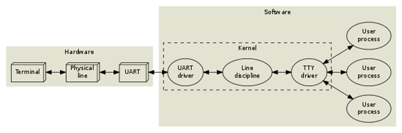
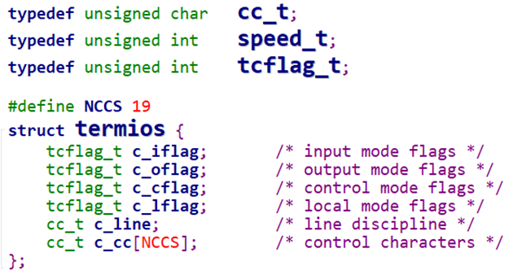
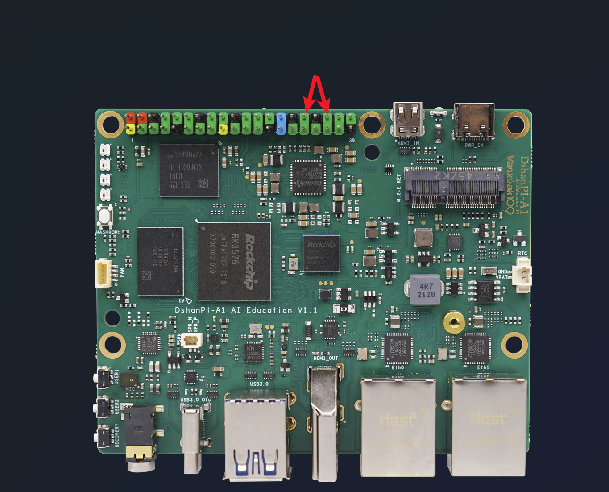
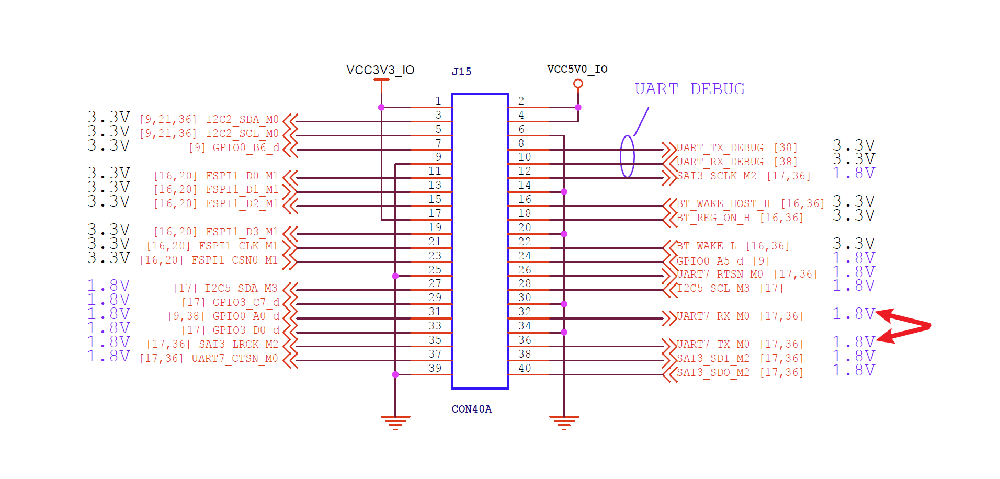

# Uart串口

参考资料：

- Serial Programming Guide for POSIX Operating Systems：[**https://digilander.libero.it/robang/rubrica/serial.htm**](https://digilander.libero.it/robang/rubrica/serial.htm)


- Linux串口编程：[**https://www.cnblogs.com/feisky/archive/2010/05/21/1740893.html**](https://www.cnblogs.com/feisky/archive/2010/05/21/1740893.html)


- Linux串口—struct termios结构体[**https://blog.csdn.net/yemingzhu163/article/details/5897156**](https://blog.csdn.net/yemingzhu163/article/details/5897156)

- 源码获取：[AppBaseCode](https://dl.100ask.net/Hardware/MPU/RK3576-DshanPi-A1/utils/AppBaseCode/)

## 1 串口API



图 11.1 Linux串口通信

在Linux系统中，操作设备的统一接口就是：open/ioctl/read/write。对于UART，又在ioctl之上封装了很多函数，主要是用来设置行规程。所以对于UART，编程的套路就是：

- open；


- 设置行规程，比如波特率、数据位、停止位、检验位、RAW模式、一有数据就返回；


- read/write；


怎么设置行规程？行规程的参数用结构体termios来表示，可以参考Linux串口—struct termios结构体：[**https://blog.csdn.net/yemingzhu163/article/details/5897156**](https://blog.csdn.net/yemingzhu163/article/details/5897156))



这些函数在名称上有一些惯例：

- tc：terminal contorl


- cf: control flag


下面列出一些函数：

表 11‑1 行规程函数

| **函数名**      | **作用**                                  |
| --------------- | ----------------------------------------- |
| **tcgetattr**   | get terminal attributes，获得终端的属性   |
| **tcsetattr**   | set terminal attributes，修改终端参数     |
| **tcflush**     | 清空终端未完成的输入/输出请求及数据       |
| **cfsetispeed** | sets the input baud rate，设置输入波特率  |
| **cfsetospeed** | sets the output baud rate，设置输出波特率 |
| **cfsetspeed**  | 同时设置输入、输出波特率                  |

函数不多，主要是需要设置好termios中的参数，这些参数很复杂，可以参考Linux串口—struct termios结构体。

## 2 串口收发实验

本实验通过把串口的发送、接收引脚短接，实现自发自收：使用write函数发出字符，使用read函数读取字符。

本节源码：11_uart\01_serial_send_recv\serial_send_recv.c

### 2.1 源码分析

程序用法为：`“./serial_send_recv <dev> [string]”`

首先打开设备节点，代码如下：

```
105 int open_port(char *com)
106 {
107    	int fd;
108    	//fd = open(com, O_RDWR|O_NOCTTY|O_NDELAY);
109    	fd = open(com, O_RDWR|O_NOCTTY);
110     if (-1 == fd){
111    	       	return(-1);
112     }
113
114    	  if(fcntl(fd, F_SETFL, 0)<0) /* 设置串口为阻塞状态*/
115    	  {
116    	       	       	printf("fcntl failed!\n");
117    	       	       	return -1;
118    	  }
119
120    	  return fd;
121 }
……
127 int main(int argc, char **argv)
128 {
……
152    	fd = open_port(argv[1]);
153    	if (fd < 0)
154    	{
155    	       	printf("open %s err!\n", argv[1]);
156    	       	return -1;
157    	}
```

第152行调用open_port函数打开设备节点。

第105~121行是open_port函数的代码。

第109行调用open函数打开设备节点。

第114行设置串口为阻塞状态。

 

然后设置串口参数，代码如下：

```
159    	iRet = set_opt(fd, 115200, 8, 'N', 1);
160    	if (iRet)
161    	{
162    	       	printf("set port err!\n");
163    	       	return -1;
164    	}
```

set_opt函数的核心功能为：设置波特率等参数、设置VMIN、VTIME等参数，代码如下：

```
11 /* set_opt(fd,115200,8,'N',1) */
12 int set_opt(int fd,int nSpeed, int nBits, char nEvent, int nStop)
13 {
14     	struct termios newtio,oldtio;
15
16     	if ( tcgetattr( fd,&oldtio) != 0) {
17     	       	perror("SetupSerial 1");
18     	       	return -1;
19     	}
20
21     	bzero( &newtio, sizeof( newtio ) );
22     	newtio.c_cflag |= CLOCAL | CREAD;
23     	newtio.c_cflag &= ~CSIZE;
24
25     	newtio.c_lflag  &= ~(ICANON | ECHO | ECHOE | ISIG);  /*Input*/
26     	newtio.c_oflag  &= ~OPOST;   /*Output*/
……
34     	       	newtio.c_cflag |= CS8;
……
51     	       	newtio.c_cflag &= ~PARENB;
……
69     	case 115200:
70     	       	cfsetispeed(&newtio, B115200);
71     	       	cfsetospeed(&newtio, B115200);
……
79     	if( nStop == 1 )
80     	       	newtio.c_cflag &= ~CSTOPB;
……
83
84     /* VMIN-字节, VTIME-时间(单位0.1秒)
85     	 * VMIN=0, VTIME=0   :  read() 会立即返回，无论是否有数据可读（非阻塞模式）
86     	 * VMIN=0, VTIME!=0  :  read() 会等待最多 VTIME 指定的时间，直到接收到第一个字节，然后返回已接收到的数据。
87     	 * VMIN!=0,VTIME=0   :  read() 会阻塞，直到接收到至少 VMIN 个字节的数据
88     	 * VMIN!=0,VTIME!=0  :  read() 会在接收到第一个字节后，继续等待最多 VTIME 指定的时间，直到接收到至少 VMIN 个字节的数据。
89     	 *
90     	 */
91     	newtio.c_cc[VMIN]  = 1;
92     	newtio.c_cc[VTIME] = 0;
93
94     	tcflush(fd,TCIFLUSH);
95
96     	if((tcsetattr(fd,TCSANOW,&newtio))!=0)
97     	{
98     	       	perror("com set error");
99     	       	return -1;
100    	}
101    	//printf("set done!\n");
102    	return 0;
103 }
```

第21~26行的初始化一个termios 结构体，作用见表11.1：

表11.1 UART设置参数

| 参数            | 作用                | 典型应用场景                     |
| --------------- | ------------------- | -------------------------------- |
| bzero()         | 初始化结构体        | 把配置全部清零                   |
| CLOCAL \| CREAD | 本地连接 + 启用接收 | 避免依赖调制解调器信号           |
| ~CSIZE          | 清除数据位设置      | 为后续设置数据位（如 CS8）做准备 |
| ~ICANON         | 非规范模式          | 实时读取单字节数据（如传感器）   |
| ~ECHO \| ~ECHOE | 禁用回显            | 避免输入干扰输出                 |
| ~ISIG           | 禁用信号            | 防止 Ctrl+C 终止程序             |
| ~OPOST          | 原始输出            | 确保数据原样发送                 |

第27~80在termios 结构体里面继续设置数据位、检验位、波特率、停止位。

第91~92行设置VMIN、VTIME参数分别为1、0，表示读取串口时要一直等待，直到至少读取到1个字节。

第94行清空串口的 输入缓冲区，确保后续操作不受残留数据影响。

第96行使用构造好的termios 结构体来设置串口。

 

最后，如果程序参数个数为3，则把第3个参数作为字符串发送给串口，代码如下：

```
166    	if (argc == 3)
167    	{
168    	       	iRet = write(fd, argv[2], strlen(argv[2]));
169    	       	if (iRet != strlen(argv[2]))
170    	       	{
171    	       	       	printf("write err\n");
172    	       	       	return -1;
173    	       	}
174    	       	return 0;
175    	}
```

如果程序参数个数为2，则进入回环操作：读取串口数据，再把这个数据写回去。代码如下：

```
177     printf("Enter a char: ");
178     while (1)
179     {
180         char c;
181         scanf("%c", &c);
182         iRet = write(fd, &c, 1);
183         iRet = read(fd, &c, 1);
184         if (iRet == 1)
185             printf("get: %02x %c\n", c, c);
186         else
187             printf("can not get data\n");
188     }
189
190     return 0;
191 }
```

第181行从控制终端读取1个字符。

第182行，把这个字符发送给串口。

第183行，读取串口，可以得到回环的数据，也就是上面写出去的数据。

第185行，打印读到的数据：先以16进制打印，在以字符形式打印。

 

### 2.2 硬件连接

对于DshanPI A1，把下图所示2个插针（拓展排针的第32、36插针）使用杜邦线互相连接（它对应设备节点/dev/ttyS7）：



图 11.2 百问网DshanPI A1 UART收发实验接线

 对应硬件原理图的位置：



### 2.3 上机操作

把代码上传到开发板，进入源码目录执行如下命令编译程序：

```
gcc -o serial_send_recv  serial_send_recv.c
```

 

然后执行如下命令进行回环操作：

```
baiwen@dshanpi-a1:~/appBase/14_UART/01_app_send_recv$ sudo  ./serial_send_recv /dev/ttyS7
Enter a char: a
get: 61 a
get: 0a

b
get: 62 b
get: 0a

c
get: 63 c
get: 0a

^C
```
