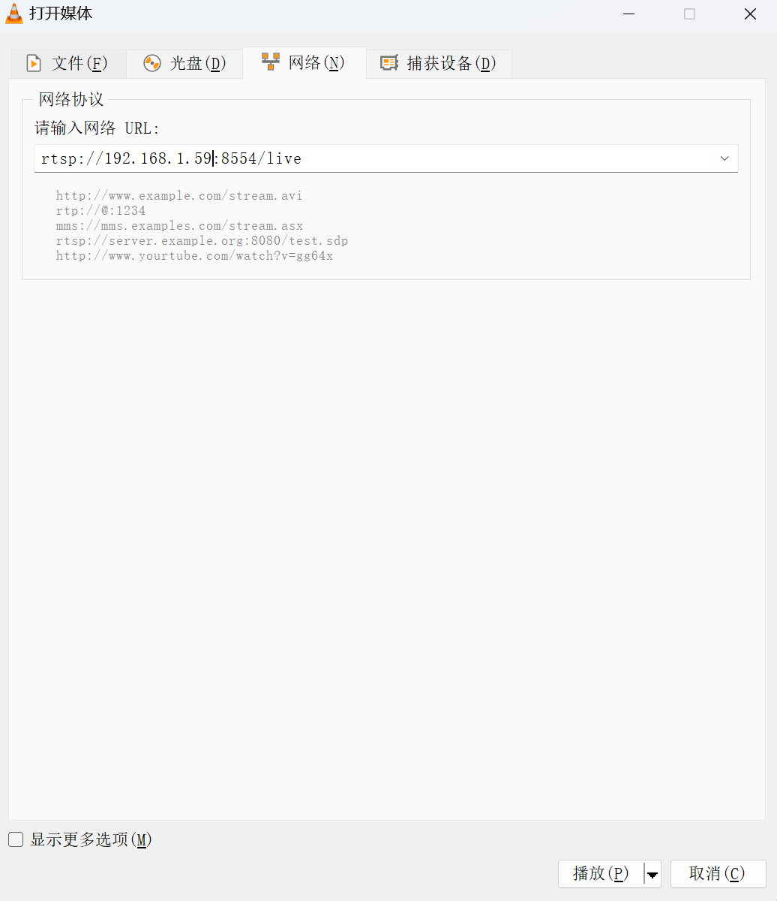

# GStreamer视频推流

参考资料：

- GStreamer官方网址：[https://gstreamer.freedesktop.org/](https://gstreamer.freedesktop.org/)
- GStreamer官方仓库：[https://github.com/GStreamer](https://github.com/GStreamer)


## 1.简介

​	GStreamer 是 Linux/Windows/macOS 上通用的开源多媒体框架。它将“采集 → 解码 → 处理 → 编码 → 协议打包 → 网络发送”整条链路抽象成可插拔的 pipeline（管道）；每个环节都是一个 element（插件），通过 pad 把上下游连接起来即可完成任意复杂度的音视频应用。


## 2.安装 依赖

### 2.1 安装 GStreamer 及 RTSP 插件

进入系统终端，执行：

```
sudo apt update
sudo apt install gstreamer1.0-tools gstreamer1.0-plugins-good gstreamer1.0-plugins-bad gstreamer1.0-rtsp libgstrtspserver-1.0-*  gstreamer1.0-plugins-ugly
```


### 2.2 启动轻量级 RTSP 服务器

1.获取资源包

```
wget https://github.com/bluenviron/mediamtx/releases/download/v1.14.0/mediamtx_v1.14.0_linux_arm64.tar.gz
```

2.解压资源包

```
tar -xzvf mediamtx_v1.14.0_linux_arm64.tar.gz
```

3.运行服务

```
sudo ./mediamtx &
```

启动后，默认 RTSP 端口为 `8554`，路径随意（下文用 `/live`）。


## 3.使用摄像头进行推流

> 开始前请注意：由于我们需要使用摄像头，请提前连接好摄像头！

查看摄像头设备，在终端输入：

```
baiwen@dshanpi-a1:~$ ls /dev/video*
/dev/video0  /dev/video1
```

下文将会使用`video0`设备进行试验。

在终端输入：

```
gst-launch-1.0 -e v4l2src device=/dev/video0 ! queue ! mpph265enc ! rtspclientsink location=rtsp://localhost:8554/live
```

对于其他设备`video11`可执行如下命令：

```
gst-launch-1.0 -e v4l2src device=/dev/video11 ! queue ! mpph265enc ! rtspclientsink location=rtsp://localhost:8554/live
```


## 4.客户端访问

### 4.1 使用VLC播放

1.使用Windows运行[VLC](https://www.videolan.org/vlc/)，访问码流：


2.选择`媒体`->`打开网络串流`


3.填入推流地址，地址为`rtsp://<IP地址>:8554/live`。

假设开发板的IP为：`192.168.1.59`

填入的网络推流地址为：`rtsp://192.168.1.59:8554/live`

填入完成后点击`播放`即可。

如下图所示：



运行效果：


