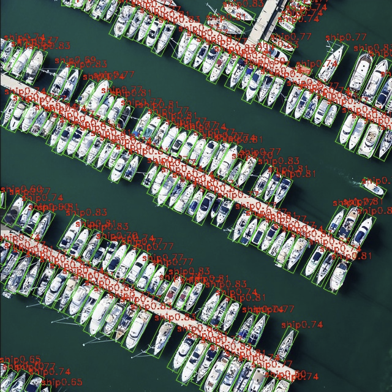

# 旋转目标检测模型部署

参考资料：

- 模型仓库：[https://github.com/airockchip/ultralytics_yolov8](https://github.com/airockchip/ultralytics_yolov8)

- 模型源码资料包（国内用户推荐）：[https://dl.100ask.net/Hardware/MPU/RK3576-DshanPi-A1/utils/ultralytics_yolov8.zip](https://dl.100ask.net/Hardware/MPU/RK3576-DshanPi-A1/utils/ultralytics_yolov8.zip)

YOLOv8-OBB 是 **YOLOv8 系列中专为“旋转目标检测”设计的模型**。它的全称为 **Oriented Bounding Box**（定向边界框），与普通 YOLO 检测模型的区别是：YOLOv8-OBB 输出的不是水平矩形，而是带旋转角的矩形框（x, y, w, h, θ），因此能够更紧密地包围倾斜或旋转的物体。


## 1.获取原始模型

1.进入目标检测模型仓库：

```
git clone https://github.com/airockchip/ultralytics_yolov8
cd ultralytics_yolov8
```

2.使用conda创建环境

```
conda create -name yolov8 python=3.9
conda activate yolov8
```

3.安装yolov8相关依赖

```
pip3 install torch==2.4.1 torchvision==0.19.1 torchaudio==2.4.1 ultralytics==8.3.31 onnx==1.17.0 onnxruntime==1.8.0 onnxsim==0.4.36
```

> 如已安装过可忽略！

4.修改`./ultralytics/cfg/default.yaml`配置文件

```
vi ./ultralytics/cfg/default.yaml
```

将原始的`model: yolov8n.pt`为：

```
model: yolov8n-obb.pt
```


5.导出ONNX模型

```
python ultralytics/engine/exporter.py
```

如果无法下载模型可直接访问[yolov8n-obb.pt](https://github.com/ultralytics/assets/releases/download/v8.2.0/yolov8n-obb.pt)，下载后放在`ultralytics_yolov8`目录下，再次执行。

运行效果如下：

```
(yolov8) baiwen@dshanpi-a1:~/ultralytics_yolov8$ python ultralytics/engine/exporter.py
Ultralytics YOLOv8.2.82 🚀 Python-3.9.23 torch-2.4.1 CPU (Cortex-A53)
YOLOv8n-obb summary (fused): 187 layers, 3,080,144 parameters, 0 gradients, 8.3 GFLOPs

PyTorch: starting from 'yolov8n-obb.pt' with input shape (16, 3, 640, 640) BCHW and output shape(s) ((), (16, 1, 8400)) (6.3 MB)

RKNN: starting export with torch 2.4.1...

RKNN: feed yolov8n-obb.onnx to RKNN-Toolkit or RKNN-Toolkit2 to generate RKNN model.
Refer https://github.com/airockchip/rknn_model_zoo/tree/main/models/CV/object_detection/yolo
RKNN: export success ✅ 3.1s, saved as 'yolov8n-obb.onnx' (11.8 MB)

Export complete (23.8s)
Results saved to /home/baiwen/ultralytics_yolov8
Predict:         yolo predict task=obb model=yolov8n-obb.onnx imgsz=640
Validate:        yolo val task=obb model=yolov8n-obb.onnx imgsz=640 data=runs/DOTAv1.0-ms.yaml
Visualize:       https://netron.app
```

执行完成后可以在当前目录下看到ONNX模型文件`yolov8n-obb.onnx`。

```
(yolov8) baiwen@dshanpi-a1:~/ultralytics_yolov8$ ls
CITATION.cff     docs      mkdocs.yml      README.zh-CN.md        tests                 yolov8n-obb.onnx yolov8n.pt
CONTRIBUTING.md  examples  pyproject.toml  RKOPT_README.md        ultralytics           yolov8n-obb.pt    yolov8n-seg.onnx
docker           LICENSE   README.md       RKOPT_README.zh-CN.md  ultralytics.egg-info  yolov8n.onnx      yolov8n-seg.pt
```

将导出的ONNX模型拷贝至yolov8模型目录。

```
cp yolov8n-obb.onnx ~/Projects/rknn_model_zoo/examples/yolov8_obb/model
```


## 2.模型转换

1.使用Conda激活`rknn-toolkit2`环境

```
conda activate rknn-toolkit2
```

2.进入yolov8模型转换目录

```
cd ~/Projects/rknn_model_zoo/examples/yolov8_obb/python
```

3.执行模型转换

```
python3 convert.py ../model/yolov8n-obb.onnx rk3576
```

运行效果如下：

```
(rknn-toolkit2) baiwen@dshanpi-a1:~/Projects/rknn_model_zoo/examples/yolov8_obb/python$ python3 convert.py ../model/yolov8n-obb.onnx rk3576
I rknn-toolkit2 version: 2.3.2
--> Config model
done
--> Loading model
I Loading : 100%|███████████████████████████████████████████████| 144/144 [00:00<00:00, 7599.52it/s]
done
--> Building model
I OpFusing 0: 100%|███████████████████████████████████████████████| 100/100 [00:01<00:00, 94.25it/s]
I OpFusing 1 : 100%|██████████████████████████████████████████████| 100/100 [00:01<00:00, 81.58it/s]
I OpFusing 2 : 100%|██████████████████████████████████████████████| 100/100 [00:03<00:00, 30.86it/s]
I GraphPreparing : 100%|█████████████████████████████████████████| 175/175 [00:00<00:00, 873.51it/s]
I Quantizating : 100%|████████████████████████████████████████████| 175/175 [00:31<00:00,  5.57it/s]
W build: The default input dtype of 'images' is changed from 'float32' to 'int8' in rknn model for performance!
                       Please take care of this change when deploy rknn model with Runtime API!
W build: The default output dtype of '383' is changed from 'float32' to 'int8' in rknn model for performance!
                      Please take care of this change when deploy rknn model with Runtime API!
W build: The default output dtype of '398' is changed from 'float32' to 'int8' in rknn model for performance!
                      Please take care of this change when deploy rknn model with Runtime API!
W build: The default output dtype of '413' is changed from 'float32' to 'int8' in rknn model for performance!
                      Please take care of this change when deploy rknn model with Runtime API!
W build: The default output dtype of '414' is changed from 'float32' to 'int8' in rknn model for performance!
                      Please take care of this change when deploy rknn model with Runtime API!
I rknn building ...
I rknn building done.
done
--> Export rknn model
done
```

可以看到转换完成后在model目录下看到端侧的RKNN模型。

```
(rknn-toolkit2) baiwen@dshanpi-a1:~/Projects/rknn_model_zoo/examples/yolov8_obb/python$ ls ../model
download_model.sh  test.jpg  yolov8n-obb.onnx  yolov8n_obb.rknn  yolov8_obb_labels_list.txt
```

## 3.模型推理

由于代码需要安装shapely，执行如下命令：

```
pip install Shapely
```

执行推理测试代码：

```
python3 yolov8_obb.py --model_path ../model/yolov8n_obb.rknn --target rk3576
```

运行效果如下：

```
(rknn-toolkit2) baiwen@dshanpi-a1:~/Projects/rknn_model_zoo/examples/yolov8_obb/python$ python3 yolov8_obb.py --model_path ../model/yolov8n_obb.rknn --target rk3576
I rknn-toolkit2 version: 2.3.2
done
--> Init runtime environment
I target set by user is: rk3576
done
--> Running model
W inference: The 'data_format' is not set, and its default value is 'nhwc'!
save image in ./result.jpg
```

运行完成后可以在当前目录下看到生成的结果图像。



