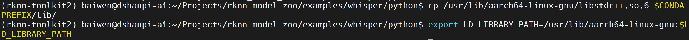

# 语音识别模型部署

参考资料：

- 语音识别模型仓库：[openai/whisper: Robust Speech Recognition via Large-Scale Weak Supervision](https://github.com/openai/whisper)

## 1.模型获取

1.进入语言识别模型目录

```
cd ~/Projects/rknn_model_zoo/examples/whisper/model
```

2.下载语音识别模型文件

```
chmod +x download_model.sh
./download_model.sh
```

运行效果如下：

```
(base) baiwen@dshanpi-a1:~/Projects/rknn_model_zoo/examples/whisper/model$ ./download_model.sh
--2025-08-21 10:48:57--  https://ftrg.zbox.filez.com/v2/delivery/data/95f00b0fc900458ba134f8b180b3f7a1/examples/whisper/whisper_encoder_base_20s.onnx
Resolving ftrg.zbox.filez.com (ftrg.zbox.filez.com)... 180.184.171.46
Connecting to ftrg.zbox.filez.com (ftrg.zbox.filez.com)|180.184.171.46|:443... connected.
HTTP request sent, awaiting response... 200
Length: 81395931 (78M) [application/octet-stream]
Saving to: ‘whisper_encoder_base_20s.onnx’

whisper_encoder_base_20s.onnx            100%[==================================================================================>]  77.62M  3.92MB/s    in 15s

2025-08-21 10:49:13 (5.06 MB/s) - ‘whisper_encoder_base_20s.onnx’ saved [81395931/81395931]

--2025-08-21 10:49:13--  https://ftrg.zbox.filez.com/v2/delivery/data/95f00b0fc900458ba134f8b180b3f7a1/examples/whisper/whisper_decoder_base_20s.onnx
Resolving ftrg.zbox.filez.com (ftrg.zbox.filez.com)... 180.184.171.46
Connecting to ftrg.zbox.filez.com (ftrg.zbox.filez.com)|180.184.171.46|:443... connected.
HTTP request sent, awaiting response... 200
Length: 313437374 (299M) [application/octet-stream]
Saving to: ‘whisper_decoder_base_20s.onnx’

whisper_decoder_base_20s.onnx            100%[==================================================================================>] 298.92M  5.84MB/s    in 47s

2025-08-21 10:50:00 (6.42 MB/s) - ‘whisper_decoder_base_20s.onnx’ saved [313437374/313437374]
```

下载完成后可以在当前目录下看到`whisper_decoder_base_20s.onnx`和`whisper_encoder_base_20s.onnx`


## 2.模型转换

1.使用Conda激活`rknn-toolkit2`环境

```
conda activate rknn-toolkit2
```

2.进入文字检测模型转换目录

```
cd ~/Projects/rknn_model_zoo/examples/whisper/python
```

3.执行模型转换

```
# 编码器模型
python3 convert.py ../model/whisper_encoder_base_20s.onnx rk3576
# 解码器模型
python3 convert.py ../model/whisper_decoder_base_20s.onnx rk3576
```

运行效果如下：

```
(rknn-toolkit2) baiwen@dshanpi-a1:~/Projects/rknn_model_zoo/examples/whisper/python$ python3 convert.py ../model/whisper_encoder_base_20s.onnx rk3576
I rknn-toolkit2 version: 2.3.2
--> Config model
done
--> Loading model
I Loading : 100%|█████████████████████████████████████████████████| 93/93 [00:00<00:00, 1791.34it/s]
W load_onnx: The config.mean_values is None, zeros will be set for input 0!
W load_onnx: The config.std_values is None, ones will be set for input 0!
done
--> Building model
I OpFusing 0: 100%|███████████████████████████████████████████████| 100/100 [00:06<00:00, 14.38it/s]
I OpFusing 1 : 100%|██████████████████████████████████████████████| 100/100 [00:08<00:00, 11.75it/s]
I OpFusing 0 : 100%|██████████████████████████████████████████████| 100/100 [00:11<00:00,  8.72it/s]
I OpFusing 1 : 100%|██████████████████████████████████████████████| 100/100 [00:11<00:00,  8.67it/s]
I OpFusing 2 : 100%|██████████████████████████████████████████████| 100/100 [00:11<00:00,  8.55it/s]
I OpFusing 0 : 100%|██████████████████████████████████████████████| 100/100 [00:11<00:00,  8.37it/s]
I OpFusing 1 : 100%|██████████████████████████████████████████████| 100/100 [00:12<00:00,  8.31it/s]
I OpFusing 2 : 100%|██████████████████████████████████████████████| 100/100 [00:20<00:00,  4.85it/s]
I rknn building ...
I rknn building done.
done
--> Export rknn model
done
(rknn-toolkit2) baiwen@dshanpi-a1:~/Projects/rknn_model_zoo/examples/whisper/python$ python3 convert.py ../model/whisper_decoder_base_20s.onnx rk3576
I rknn-toolkit2 version: 2.3.2
--> Config model
done
--> Loading model
I Loading : 100%|████████████████████████████████████████████████| 147/147 [00:00<00:00, 255.45it/s]
W load_onnx: The config.mean_values is None, zeros will be set for input 1!
W load_onnx: The config.std_values is None, ones will be set for input 1!
done
--> Building model
W build: For tensor ['/blocks.0/attn/Constant_5_output_0'], the value smaller than -3e+38 or greater than 3e+38 has been corrected to -10000 or 10000. Set opt_level to 2 or lower to disable this correction.
W build: For tensor ['/blocks.0/attn/Constant_5_output_0_1'], the value smaller than -3e+38 or greater than 3e+38 has been corrected to -10000 or 10000. Set opt_level to 2 or lower to disable this correction.
W build: For tensor ['/blocks.0/attn/Constant_5_output_0_2'], the value smaller than -3e+38 or greater than 3e+38 has been corrected to -10000 or 10000. Set opt_level to 2 or lower to disable this correction.
W build: For tensor ['/blocks.0/attn/Constant_5_output_0_3'], the value smaller than -3e+38 or greater than 3e+38 has been corrected to -10000 or 10000. Set opt_level to 2 or lower to disable this correction.
W build: For tensor ['/blocks.0/attn/Constant_5_output_0_4'], the value smaller than -3e+38 or greater than 3e+38 has been corrected to -10000 or 10000. Set opt_level to 2 or lower to disable this correction.
W build: For tensor ['/blocks.0/attn/Constant_5_output_0_5'], the value smaller than -3e+38 or greater than 3e+38 has been corrected to -10000 or 10000. Set opt_level to 2 or lower to disable this correction.
I OpFusing 0: 100%|███████████████████████████████████████████████| 100/100 [00:10<00:00,  9.12it/s]
I OpFusing 1 : 100%|██████████████████████████████████████████████| 100/100 [00:13<00:00,  7.20it/s]
I OpFusing 0 : 100%|██████████████████████████████████████████████| 100/100 [00:18<00:00,  5.34it/s]
I OpFusing 1 : 100%|██████████████████████████████████████████████| 100/100 [00:18<00:00,  5.31it/s]
I OpFusing 2 : 100%|██████████████████████████████████████████████| 100/100 [00:19<00:00,  5.22it/s]
I OpFusing 0 : 100%|██████████████████████████████████████████████| 100/100 [00:19<00:00,  5.02it/s]
I OpFusing 1 : 100%|██████████████████████████████████████████████| 100/100 [00:20<00:00,  4.99it/s]
I OpFusing 2 : 100%|██████████████████████████████████████████████| 100/100 [00:22<00:00,  4.36it/s]
I rknn building ...
E RKNN: [11:58:59.648] Unkown op target: 0
I rknn building done.
done
--> Export rknn model
done
```

转换完成后可以在`../model/`看到生成的RKNN模型文件

```
(rknn-toolkit2) baiwen@dshanpi-a1:~/Projects/rknn_model_zoo/examples/whisper/python$ ls ../model/
download_model.sh   test_en.wav  vocab_en.txt  whisper_decoder_base_20s.onnx  whisper_encoder_base_20s.onnx
mel_80_filters.txt  test_zh.wav  vocab_zh.txt  whisper_decoder_base_20s.rknn  whisper_encoder_base_20s.rknn
```


## 3.模型推理

1.由于程序需要依赖`soundfile`库来读取音频文件，所需需要额外执行：

```
pip install soundfile
```

2.执行推理程序识别英文：

```
python whisper.py --encoder_model_path ../model/whisper_encoder_base_20s.rknn --decoder_model_path ../model/whisper_decoder_base_20s.rknn --task en --audio_path ../model/test_en.wav --target rk3576
```

运行效果：

```
(rknn-toolkit2) baiwen@dshanpi-a1:~/Projects/rknn_model_zoo/examples/whisper/python$ python whisper.py --encoder_model_path ../model/whisper_encoder_base_20s.rknn --decoder_model_path ../model/whisper_decoder_base_20s.rknn --task en --audio_path ../model/test_en.wav --target rk3576
I rknn-toolkit2 version: 2.3.2
--> Loading model
done
--> Init runtime environment
I target set by user is: rk3576
done
I rknn-toolkit2 version: 2.3.2
--> Loading model
done
--> Init runtime environment
I target set by user is: rk3576
done
W inference: Inputs should be placed in a list, like [img1, img2], both the img1 and img2 are ndarray.
W inference: The 'data_format' is not set, and its default value is 'nhwc'!
W inference: The 'data_format' is not set, and its default value is 'nhwc'!
W inference: The 'data_format' is not set, and its default value is 'nhwc'!
W inference: The 'data_format' is not set, and its default value is 'nhwc'!

Whisper output:  Mr. Quilter is the apostle of the middle classes and we are glad to welcome his gospel.
```

2.执行推理程序识别中文

```
python whisper.py --encoder_model_path ../model/whisper_encoder_base_20s.rknn --decoder_model_path ../model/whisper_decoder_base_20s.rknn --task en --audio_path ../model/test_zh.wav --target rk3576
```

运行效果如下：

```
(rknn-toolkit2) baiwen@dshanpi-a1:~/Projects/rknn_model_zoo/examples/whisper/python$ python whisper.py --encoder_model_path ../model/whisper_encoder_base_20s.rknn --decoder_model_path ../model/whisper_decoder_base_20s.rknn --task en --audio_path ../model/test_zh.wav --target rk3576
I rknn-toolkit2 version: 2.3.2
--> Loading model
done
--> Init runtime environment
I target set by user is: rk3576
done
I rknn-toolkit2 version: 2.3.2
--> Loading model
done
--> Init runtime environment
I target set by user is: rk3576
done
W inference: Inputs should be placed in a list, like [img1, img2], both the img1 and img2 are ndarray.
W inference: The 'data_format' is not set, and its default value is 'nhwc'!
W inference: The 'data_format' is not set, and its default value is 'nhwc'!
W inference: The 'data_format' is not set, and its default value is 'nhwc'!
W inference: The 'data_format' is not set, and its default value is 'nhwc'!

Whisper output:  I want to say that if you feel interested in my research
```


## 4.音频流推理

1.由于需要访问系统设备所以需要退出conda环境，在系统环境下执行：

```
sudo apt install libportaudio2 portaudio19-dev
```

运行效果如下：

```
(base) baiwen@dshanpi-a1:~$ sudo apt install libportaudio2 portaudio19-dev
[sudo] password for baiwen:
正在读取软件包列表... 完成
正在分析软件包的依赖关系树... 完成
正在读取状态信息... 完成
将会同时安装下列软件：
  libasound2-dev libjack-jackd2-dev libportaudiocpp0
建议安装：
  libasound2-doc portaudio19-doc
下列【新】软件包将被安装：
  libasound2-dev libjack-jackd2-dev libportaudio2 libportaudiocpp0 portaudio19-dev
升级了 0 个软件包，新安装了 5 个软件包，要卸载 0 个软件包，有 9 个软件包未被升级。
需要下载 356 kB 的归档。
解压缩后会消耗 1,871 kB 的额外空间。
您希望继续执行吗？ [Y/n] y
获取:1 http://ports.ubuntu.com noble-updates/main arm64 libasound2-dev arm64 1.2.11-1ubuntu0.1 [115 kB]
获取:2 http://ports.ubuntu.com noble/main arm64 libjack-jackd2-dev arm64 1.9.21~dfsg-3ubuntu3 [42.9 kB]
获取:3 http://ports.ubuntu.com noble/universe arm64 libportaudio2 arm64 19.6.0-1.2build3 [65.4 kB]
获取:4 http://ports.ubuntu.com noble/universe arm64 libportaudiocpp0 arm64 19.6.0-1.2build3 [16.4 kB]
获取:5 http://ports.ubuntu.com noble/universe arm64 portaudio19-dev arm64 19.6.0-1.2build3 [115 kB]
已下载 356 kB，耗时 3秒 (127 kB/s)
正在选中未选择的软件包 libasound2-dev:arm64。
(正在读取数据库 ... 系统当前共安装有 79465 个文件和目录。)
准备解压 .../libasound2-dev_1.2.11-1ubuntu0.1_arm64.deb  ...
正在解压 libasound2-dev:arm64 (1.2.11-1ubuntu0.1) ...
正在选中未选择的软件包 libjack-jackd2-dev:arm64。
准备解压 .../libjack-jackd2-dev_1.9.21~dfsg-3ubuntu3_arm64.deb  ...
正在解压 libjack-jackd2-dev:arm64 (1.9.21~dfsg-3ubuntu3) ...
正在选中未选择的软件包 libportaudio2:arm64。
准备解压 .../libportaudio2_19.6.0-1.2build3_arm64.deb  ...
正在解压 libportaudio2:arm64 (19.6.0-1.2build3) ...
正在选中未选择的软件包 libportaudiocpp0:arm64。
准备解压 .../libportaudiocpp0_19.6.0-1.2build3_arm64.deb  ...
正在解压 libportaudiocpp0:arm64 (19.6.0-1.2build3) ...
正在选中未选择的软件包 portaudio19-dev:arm64。
准备解压 .../portaudio19-dev_19.6.0-1.2build3_arm64.deb  ...
正在解压 portaudio19-dev:arm64 (19.6.0-1.2build3) ...
正在设置 libportaudio2:arm64 (19.6.0-1.2build3) ...
正在设置 libjack-jackd2-dev:arm64 (1.9.21~dfsg-3ubuntu3) ...
正在设置 libportaudiocpp0:arm64 (19.6.0-1.2build3) ...
正在设置 libasound2-dev:arm64 (1.2.11-1ubuntu0.1) ...
正在设置 portaudio19-dev:arm64 (19.6.0-1.2build3) ...
正在处理用于 libc-bin (2.39-0ubuntu8.5) 的触发器 ...
```

2.激活rknn-toolkit2环境

```
conda activate rknn-toolkit2
```


3.让 conda 环境优先使用系统库

```
cp /usr/lib/aarch64-linux-gnu/libstdc++.so.6 $CONDA_PREFIX/lib/
export LD_LIBRARY_PATH=/usr/lib/aarch64-linux-gnu:$LD_LIBRARY_PATH
```



3.安装sounddevice依赖库

```
pip install sounddevice
```

4.新建程序文件`whisper_mic.py`

```
import numpy as np
from rknn.api import RKNN
import argparse
import soundfile as sf
import onnxruntime
import torch
import torch.nn.functional as F
import scipy
import sounddevice as sd
import queue
import threading
import time

SAMPLE_RATE = 16000
N_FFT = 400
HOP_LENGTH = 160
CHUNK_LENGTH = 20
N_SAMPLES = CHUNK_LENGTH * SAMPLE_RATE
MAX_LENGTH = CHUNK_LENGTH * 100
N_MELS = 80
CHANNELS = 1
q = queue.Queue()

def ensure_sample_rate(waveform, original_sample_rate, desired_sample_rate=16000):
    if original_sample_rate != desired_sample_rate:
        print("resample_audio: {} HZ -> {} HZ".format(original_sample_rate, desired_sample_rate))
        desired_length = int(round(float(len(waveform)) / original_sample_rate * desired_sample_rate))
        waveform = scipy.signal.resample(waveform, desired_length)
    return waveform, desired_sample_rate

def ensure_channels(waveform, original_channels, desired_channels=1):
    if original_channels != desired_channels:
        print("convert_channels: {} -> {}".format(original_channels, desired_channels))
        waveform = np.mean(waveform, axis=1)
    return waveform, desired_channels

def get_char_index(c):
    if 'A' <= c <= 'Z':
        return ord(c) - ord('A')
    elif 'a' <= c <= 'z':
        return ord(c) - ord('a') + (ord('Z') - ord('A') + 1)
    elif '0' <= c <= '9':
        return ord(c) - ord('0') + (ord('Z') - ord('A')) + (ord('z') - ord('a')) + 2
    elif c == '+':
        return 62
    elif c == '/':
        return 63
    else:
        print(f"Unknown character {ord(c)}, {c}")
        exit(-1)

def base64_decode(encoded_string):
    if not encoded_string:
        print("Empty string!")
        exit(-1)

    output_length = len(encoded_string) // 4 * 3
    decoded_string = bytearray(output_length)

    index = 0
    output_index = 0
    while index < len(encoded_string):
        if encoded_string[index] == '=':
            return " "

        first_byte = (get_char_index(encoded_string[index]) << 2) + ((get_char_index(encoded_string[index + 1]) & 0x30) >> 4)
        decoded_string[output_index] = first_byte

        if index + 2 < len(encoded_string) and encoded_string[index + 2] != '=':
            second_byte = ((get_char_index(encoded_string[index + 1]) & 0x0f) << 4) + ((get_char_index(encoded_string[index + 2]) & 0x3c) >> 2)
            decoded_string[output_index + 1] = second_byte

            if index + 3 < len(encoded_string) and encoded_string[index + 3] != '=':
                third_byte = ((get_char_index(encoded_string[index + 2]) & 0x03) << 6) + get_char_index(encoded_string[index + 3])
                decoded_string[output_index + 2] = third_byte
                output_index += 3
            else:
                output_index += 2
        else:
            output_index += 1

        index += 4
            
    return decoded_string.decode('utf-8', errors='replace')

def read_vocab(vocab_path):
    with open(vocab_path, 'r') as f:
        vocab = {}
        for line in f:
            if len(line.strip().split(' ')) < 2:
                key = line.strip().split(' ')[0]
                value = ""
            else:
                key, value = line.strip().split(' ')
            vocab[key] = value
    return vocab

def pad_or_trim(audio_array):
    x_mel = np.zeros((N_MELS, MAX_LENGTH), dtype=np.float32)
    real_length = audio_array.shape[1] if audio_array.shape[1] <= MAX_LENGTH else MAX_LENGTH
    x_mel[:, :real_length] = audio_array[:, :real_length]
    return x_mel

def mel_filters(n_mels):
    assert n_mels in {80}, f"Unsupported n_mels: {n_mels}"
    filters_path =  "../model/mel_80_filters.txt"
    mels_data = np.loadtxt(filters_path, dtype=np.float32).reshape((80, 201))
    return torch.from_numpy(mels_data)

def log_mel_spectrogram(audio, n_mels, padding=0):
    if not torch.is_tensor(audio):
        audio = torch.from_numpy(audio)

    if padding > 0:
        audio = F.pad(audio, (0, padding))
    window = torch.hann_window(N_FFT)

    stft = torch.stft(audio, N_FFT, HOP_LENGTH, window=window, return_complex=True)
    magnitudes = stft[..., :-1].abs() ** 2

    filters = mel_filters(n_mels)
    mel_spec = filters @ magnitudes

    log_spec = torch.clamp(mel_spec, min=1e-10).log10()
    log_spec = torch.maximum(log_spec, log_spec.max() - 8.0)
    log_spec = (log_spec + 4.0) / 4.0
    return log_spec

def run_encoder(encoder_model, in_encoder):
    if 'rknn' in str(type(encoder_model)):
        out_encoder = encoder_model.inference(inputs=in_encoder)[0]
    elif 'onnx' in str(type(encoder_model)):
        out_encoder = encoder_model.run(None, {"x": in_encoder})[0]

    return out_encoder

def _decode(decoder_model, tokens, out_encoder):
    if 'rknn' in str(type(decoder_model)):
        out_decoder = decoder_model.inference([np.asarray([tokens], dtype="int64"), out_encoder])[0]
    elif 'onnx' in str(type(decoder_model)):
        out_decoder = decoder_model.run(None, {"tokens": np.asarray([tokens], dtype="int64"), "audio": out_encoder})[0]

    return out_decoder

def run_decoder(decoder_model, out_encoder, vocab, task_code):
    # tokenizer = whisper.decoding.get_tokenizer( True, #model.is_multilingual
    #                                             task="transcribe", 
    #                                             language="en",
    #                                             )
    
    end_token = 50257 # tokenizer.eot
    tokens = [50258, task_code, 50359, 50363] # tokenizer.sot_sequence_including_notimestamps
    timestamp_begin = 50364 # tokenizer.timestamp_begin

    max_tokens = 12
    tokens_str = ''
    pop_id = max_tokens

    tokens = tokens * int(max_tokens/4)
    next_token = 50258 # tokenizer.sot

    while next_token != end_token:
        out_decoder = _decode(decoder_model, tokens, out_encoder)
        next_token = out_decoder[0, -1].argmax()
        next_token_str = vocab[str(next_token)]
        tokens.append(next_token)

        if next_token == end_token:
            tokens.pop(-1)
            next_token = tokens[-1]
            break
        if next_token > timestamp_begin:
            continue
        if pop_id >4:
            pop_id -= 1

        tokens.pop(pop_id)
        tokens_str += next_token_str

    result = tokens_str.replace('\u0120', ' ').replace('<|endoftext|>', '').replace('\n', '')
    if task_code == 50260: # TASK_FOR_ZH
        result = base64_decode(result)
    return result

def init_model(model_path, target=None, device_id=None):
    if model_path.endswith(".rknn"):
        # Create RKNN object
        model = RKNN()

        # Load RKNN model
        print('--> Loading model')
        ret = model.load_rknn(model_path)
        if ret != 0:
            print('Load RKNN model \"{}\" failed!'.format(model_path))
            exit(ret)
        print('done')

        # init runtime environment
        print('--> Init runtime environment')
        ret = model.init_runtime(target=target, device_id=device_id)
        if ret != 0:
            print('Init runtime environment failed')
            exit(ret)
        print('done')

    elif model_path.endswith(".onnx"):
        model = onnxruntime.InferenceSession(model_path,  providers=['CPUExecutionProvider'])

    return model

def release_model(model):
    if 'rknn' in str(type(model)):
        model.release()
    elif 'onnx' in str(type(model)):
        del model
    model = None

def load_array_from_file(filename):
    with open(filename, 'r') as file:
        data = file.readlines()

    array = []
    for line in data:
        row = [float(num) for num in line.split()]
        array.extend(row)

    return np.array(array).reshape((80, 2000))
    
def audio_stream():
    """后台线程：持续把麦克风数据放入队列"""
    def callback(indata, frames, time_, status):
        if status:
            print(status)
        q.put(indata[:, 0].astype(np.float32))

    with sd.InputStream(samplerate=SAMPLE_RATE,
                        channels=CHANNELS,
                        dtype='float32',
                        callback=callback):
        while True:
            time.sleep(0.1)
def main():
    parser = argparse.ArgumentParser(description='Whisper Real-time Mic Demo')
    parser.add_argument('--encoder_model_path', required=True)
    parser.add_argument('--decoder_model_path', required=True)
    parser.add_argument('--task', choices=['en', 'zh'], required=True)
    parser.add_argument('--target', default='rk3576')
    parser.add_argument('--device_id', default=None)
    args = parser.parse_args()

    # 准备词典
    if args.task == "en":
        vocab_path = "../model/vocab_en.txt"
        task_code = 50259
    else:
        vocab_path = "../model/vocab_zh.txt"
        task_code = 50260
    vocab = read_vocab(vocab_path)

    # 初始化 RKNN
    encoder_model = init_model(args.encoder_model_path, args.target, args.device_id)
    decoder_model = init_model(args.decoder_model_path, args.target, args.device_id)

    # 启动麦克风线程
    threading.Thread(target=audio_stream, daemon=True).start()
    print("Listening...  (Ctrl+C to stop)")

    # 滑动 20 s 缓存
    buffer = np.zeros(N_SAMPLES, dtype=np.float32)
    step = SAMPLE_RATE   # 1 s 步长

    while True:
        # 每读 1 s 数据就把窗口向前滑动 1 s
        data = q.get()
        buffer = np.roll(buffer, -len(data))
        buffer[-len(data):] = data

        # 凑够 20 s 做一次推理
        if q.qsize() == 0:   # 简单同步：等队列空再做一次，避免堆积
            mel = log_mel_spectrogram(buffer, 80).numpy()
            mel = pad_or_trim(mel)
            mel = np.expand_dims(mel, 0)

            out_enc = run_encoder(encoder_model, mel)
            txt = run_decoder(decoder_model, out_enc, vocab, task_code)
            print("\rWhisper:", txt, end=" " * 10, flush=True)

if __name__ == '__main__':
    try:
        main()
    except KeyboardInterrupt:
        print("\nbye")
```

5.执行程序：

```
python whisper_mic.py --encoder_model_path ../model/whisper_encoder_base_20s.rknn --decoder_model_path ../model/whisper_decoder_base_20s.rknn --task en --target rk3576
```

