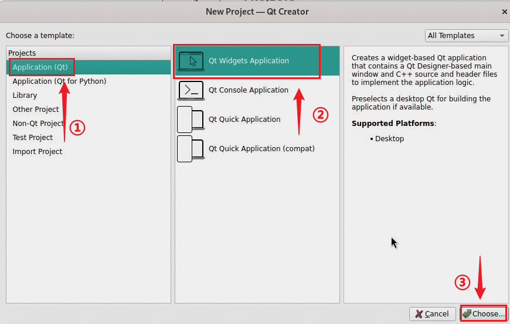
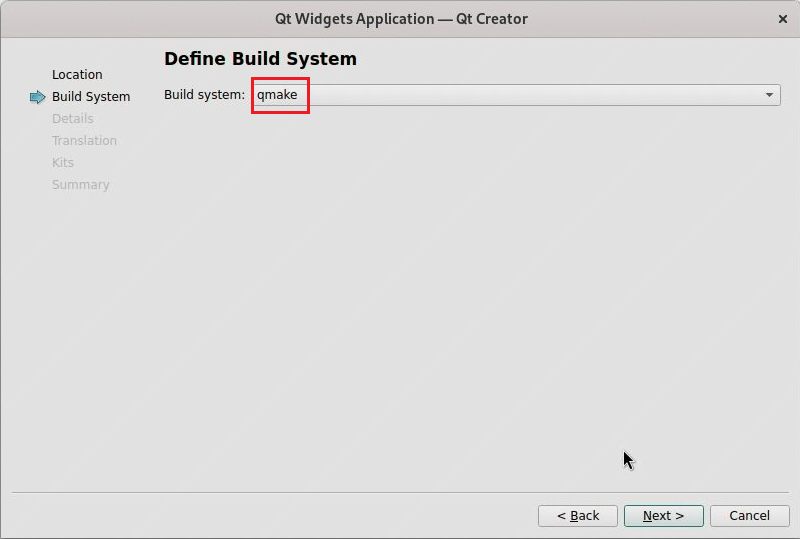
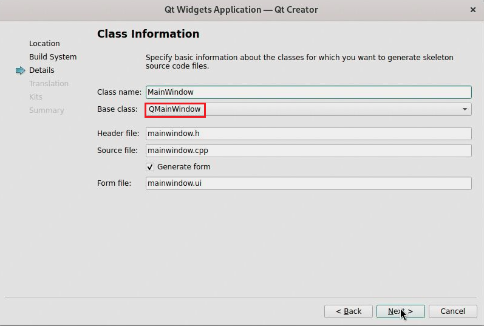
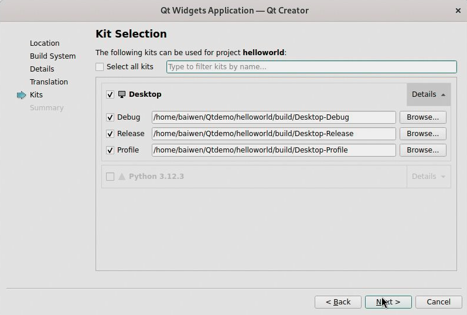
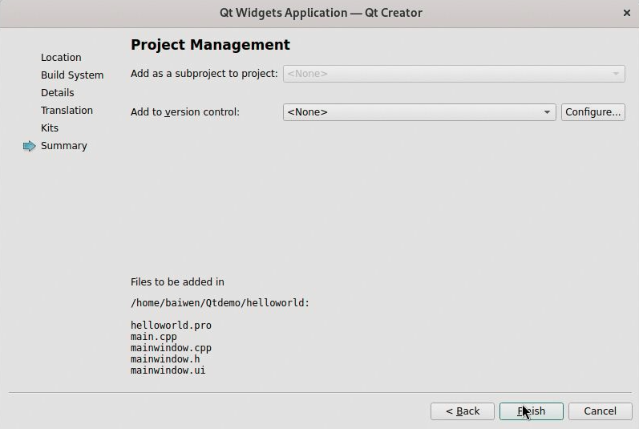
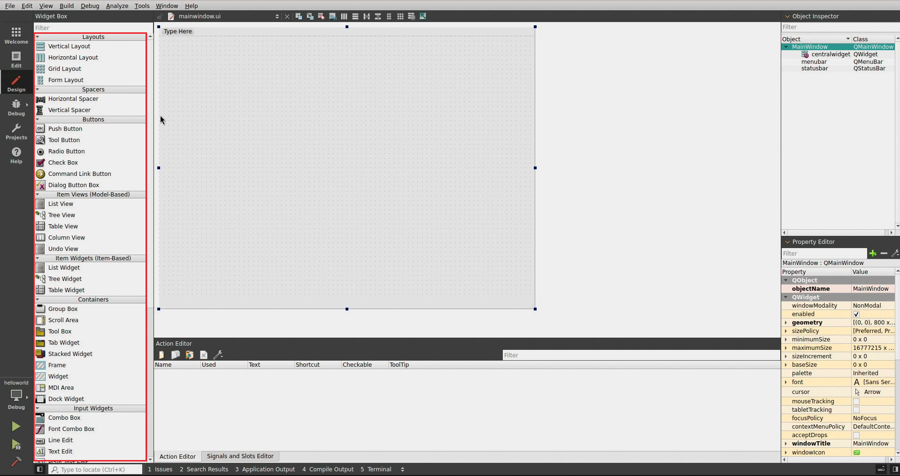
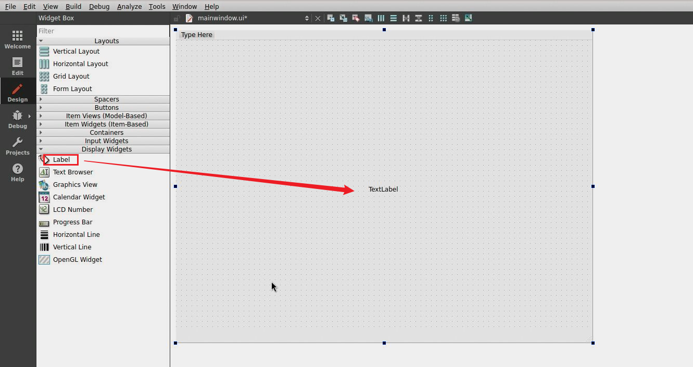

# 开发环境搭建

本章节将带领大家在百问网 dshanpi-a1上搭建Qt5开发环境，为后续开发Qt应用程序做准备。

## 一、安装Qt5开发组件

打开终端，输入以下命令：

~~~bash
sudo apt update
sudo apt install qtwayland5 qtbase5-dev qtcreator
~~~

这些包会提供 qmake、Qt Creator 和基本的 Qt5 库。

## 二、创建第一个Qt项目

Qt5开发组件安装完成后，接下来将基于 QtCreator 创建我们的第一个Qt项目，点击左上角图标，找到并打开 **QtCreator** 工具，参考下图操作：

### 1. 创建Qt项目

**第1步 新建项目：**

运行 QtCreator 后，点击左上角**《File》** -> **《New Project...》** 或者 使用快捷键  **Ctrl + Shit + N** 。

**第2步 选择项目类型：**

在打开的对话框中,依次选择 **Application(Qt)** -> **Qt Widgets Application **，点击 **Choose...** , 如下图所示:

**第3步 输入项目名字、设置保存位置：**

在弹出的 Qt Widgets Application 对话框中，自定义设置项目名称：**helloworld** 和 项目保存路径：**/home/baiwen/Qtdemo**，然后点击 **下一步**。参考如下图：

**第4步 设置构建系统:**

默认选择 **qmake**，如下：

**第5步 选择基类：**

当前的的项目继承自哪种Widget，默认选择 **QMainWindow**，然后点击 **下一步** 。

**第6步 翻译文件默认none，继续点击next：**

**第7步 按照默认选择，继续点击next：**

**第8步 完成项目创建：**

以上信息填写完后，点击 **完成**，我们的第一个 Qt 项目就创建成功了。

### 2. Qt界面设计与构建

**第1步 打开设计界面并添加控件：**

双击左侧的 Forms 文件夹里的 mainwindow.ui 文件，打开 Design 视图。

可以看到如下设计界面：

在左侧 **控件箱（Widget Box）**栏目，我们可看到有很多控件，它按类别把可用的 Qt 控件分组列出，常见的有：

- Layouts（布局）
- Buttons（按钮）
- Item Views / Item Widgets（列表/表格/树形控件）
- Input Widgets（输入控件：行编辑、组合框等）
- Display Widgets（显示控件：标签、进度条等）

我们可以通过拖到控件到中间的输入框，进行设计我们的界面。下面举个例子：

在Display Widgets里，找到 **Label**，拖动到中间的区域。控件中的内容可以双击 Label 进行修改，内容如下图所示：

**第2步 构建项目：**

点击菜单栏 **Build** -> **Build Project ”helloworld“**，开始编译、构建项目。

在构建过程中，可以在左下侧 **“Compile Output”** 窗口看到构建信息。如果有错误，请根据提示出错信息修改，然后重新构建。

**第3步 查看构建结果：**

helloworld 项目构建成功后，编译好的二进制文件存放在前面设置的保存路径中，打开终端，进入该路径（前面设置保存路径是/home/baiwen/Qtdemo）：

~~~bash
baiwen@dshanpi-a1:~$ cd /home/baiwen/Qtdemo
baiwen@dshanpi-a1:~/Qtdemo$ ls
helloworld
baiwen@dshanpi-a1:~/Qtdemo$ cd helloworld/
baiwen@dshanpi-a1:~/Qtdemo/helloworld$ ls
build  helloworld.pro  helloworld.pro.user  main.cpp  mainwindow.cpp  mainwindow.h  mainwindow.ui
baiwen@dshanpi-a1:~/Qtdemo/helloworld$
~~~

可以看到 **"helloworld"** 是我们的项目源码，构建项目之后，会生成一个 **”build/Desktop-Debug“** 文件夹，里面存放着可执行程序 **helloworld**，如下图所示：

### 3. 运行Qt程序

在当前路径`/home/baiwen/Qtdemo/helloworld/build/Desktop-Debug`下，执行运行指令：

~~~bash
./helloworld
~~~

运行成功后即可看到如下界面显示：

