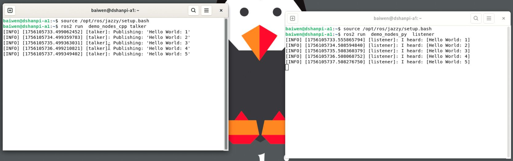

# ROS2环境搭建

## 1.安装依赖

> 开始前请注意：如果有进入conda环境，请退出conda环境,执行:conda deactivate

1.添加ROS2 apt仓库

```
sudo apt install software-properties-common
sudo add-apt-repository universe
```

2.安装 ROS 2 的密钥和源配置包：

```
sudo apt update && sudo apt install curl -y
export ROS_APT_SOURCE_VERSION=$(curl -s https://api.github.com/repos/ros-infrastructure/ros-apt-source/releases/latest | grep -F "tag_name" | awk -F\" '{print $4}')
curl -L -o /tmp/ros2-apt-source.deb "https://github.com/ros-infrastructure/ros-apt-source/releases/download/${ROS_APT_SOURCE_VERSION}/ros2-apt-source_${ROS_APT_SOURCE_VERSION}.$(. /etc/os-release && echo $VERSION_CODENAME)_all.deb"
sudo dpkg -i /tmp/ros2-apt-source.deb
```

3.安装 ROS 2 Jazzy

```
sudo apt update
sudo apt install ros-jazzy-desktop
```

4.配置环境变量

每次打开终端时，运行以下命令来加载 ROS 2 环境：

```
source /opt/ros/jazzy/setup.bash
```

如果你想让它自动生效，可以将这行添加到你的 `~/.bashrc` 文件：

```
echo "source /opt/ros/jazzy/setup.bash" >> ~/.bashrc
```

## 2.验证安装

打开两个终端，分别运行以下命令：

- **终端1（C++ talker 节点）**：

```
source /opt/ros/jazzy/setup.bash
ros2 run demo_nodes_cpp talker
```

- **终端2（Python listener 节点）**：

```
source /opt/ros/jazzy/setup.bash
ros2 run demo_nodes_py listener
```

如果看到消息成功传输，说明安装成功！如下图所示：

