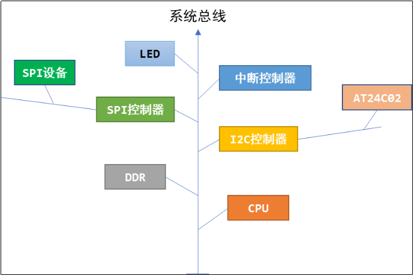
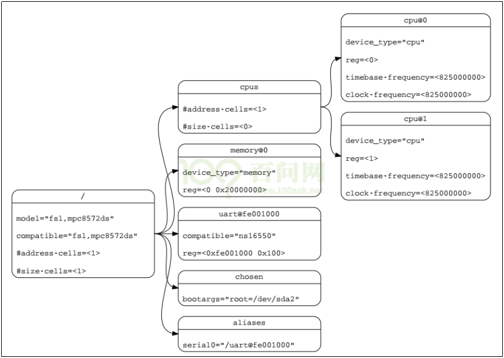
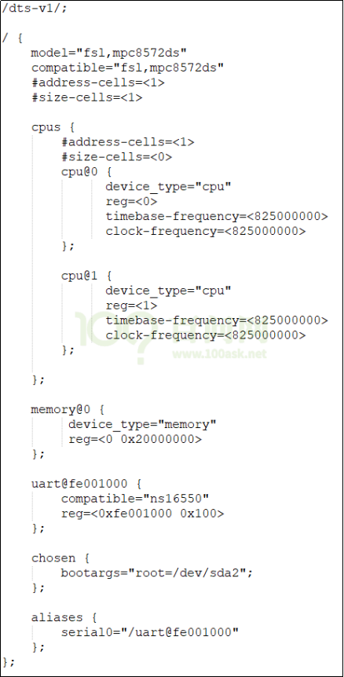
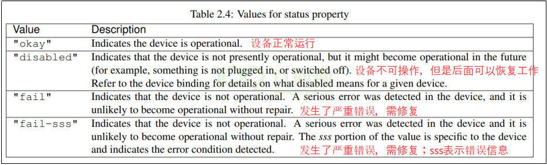
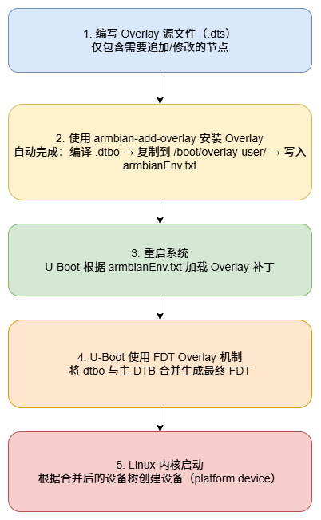

# Armbian平台设备树引入及简明教程

## 1.1 设备树的引入与作用

以LED驱动为例，如果你要更换LED所用的GPIO引脚，需要修改驱动程序源码、重新编译驱动、重新加载驱动。

在内核中，使用同一个芯片的板子，它们所用的外设资源不一样，比如A板用GPIO A，B板用GPIO B。而GPIO的驱动程序既支持GPIO A也支持GPIO B，你需要指定使用哪一个引脚，怎么指定？以前内核代码中硬件信息是写死的（通过 C 代码注册 platform_device）；

随着ARM芯片的流行，内核中针对这些ARM板保存有大量的、没有技术含量的文件。

Linus大发雷霆："this whole ARM thing is a f*cking pain in the ass"。

于是，Linux内核开始引入设备树。

设备树并不是重新发明出来的，在Linux内核中其他平台如PowerPC，早就使用设备树来描述硬件了。

Linus发火之后，内核开始全面使用设备树来改造，神人就是神人。

有一种错误的观点，说 “新驱动都是用设备树来写了” 。 **设备树不可能用来写驱动** 。

请想想，要操作硬件就需要去操作复杂的寄存器，如果设备树可以操作寄存器，那么它就是“驱动”，它就一样很复杂。

设备树只是用来给内核里的驱动程序， **指定硬件的信息** 。比如LED驱动，在内核的驱动程序里去操作寄存器，但是操作哪一个引脚？这由设备树指定。
你可以事先体验一下设备树，板子启动后执行下面的命令：

```bash
ls /sys/firmware/
devicetree  fdt
```

`/sys/firmware/devicetree` 目录下是以目录结构程现的 dtb 文件, 根节点对应 base 目录, 每一个节点对应一个目录, 每一个属性对应一个文件。

这些属性的值如果是字符串，可以使用 cat 命令把它打印出来；对于数值，可以用 hexdump 把它打印出来。

一个单板启动时，u-boot先运行，它的作用是启动内核。U-boot会把内核和设备树文件都读入内存，然后启动内核。在启动内核时会把设备树在内存中的地址告诉内核。

## 1.2 设备树的语法

为什么叫“树”？



怎么描述这棵树？

我们需要编写设备树文件(dts: device tree source)，它需要编译为dtb(device tree blob)文件，内核使用的是dtb文件。

dts文件是根本，它的语法很简单。

下面是一个设备树示例：



它对应的dts文件如下：



### 1.2.1 Devicetree格式

- **DTS文件的格式**

DTS文件布局(layout):

```bash
/dts-v1/;                // 表示版本
[memory reservations]    // 格式为: /memreserve/ <address> <length>;
/ {
    [property definitions]
    [child nodes]
};
```

- **node的格式**

设备树中的基本单元，被称为“node”，其格式为：

```bash
[label:] node-name[@unit-address] {
    [properties definitions]
    [child nodes]
};
```

label是标号，可以省略。label的作用是为了方便地引用node，比如：

```bash
/dts-v1/;
/ {
	uart0: uart@fe001000 {
        compatible="ns16550";
        reg=<0xfe001000 0x100>;
	};
};
```

可以使用下面2种方法来修改uart@fe001000这个node：

```bash
// 在根节点之外使用label引用node：
&uart0 {
    status = “disabled”;
};

或在根节点之外使用全路径：

&{/uart@fe001000}  {
    status = “disabled”;
};
```

- **properties的格式**

简单地说，properties 就是 “name=value”，value有多种取值方式。

1. Property格式1:

   ```bash
   [label:] property-name = value;
   ```

2. Property格式2(没有值):

   ```bash
   [label:] property-name;
   ```

3. Property取值只有3种: 

   ```
   arrays of cells(1个或多个32位数据, 64位数据使用2个32位数据表示)
   
   string(字符串), 
   
   bytestring(1个或多个字节)
   ```
   
   示例:
   
   Arrays of cells : cell就是一个32位的数据，用 **尖括号** 包围起来
   
   ```bash
   interrupts = <17 0xc>;
   ```
   
   64bit数据使用2个cell来表示，用 **尖括号** 包围起来:
   
   ```bash
   clock-frequency = <0x00000001 0x00000000>;
   ```
   
   A null-terminated string (有结束符的字符串)，用 **双引号** 包围起来:
   
   ```bash
   compatible = "simple-bus";
   ```
   
   A bytestring(字节序列) ，用 **中括号** 包围起来:
   
   ```bash
   local-mac-address = [00 00 12 34 56 78];  // 每个byte使用2个16进制数来表示
   local-mac-address = [000012345678];       // 每个byte使用2个16进制数来表示
   ```
   
   可以是各种值的组合, 用 **逗号** 隔开:
   
   ```bash
   compatible = "ns16550", "ns8250";
   example = <0xf00f0000 19>, "a strange property format";
   ```

### 1.2.2 dts文件包含dtsi文件

设备树文件不需要我们从零写出来，内核支持了某款芯片，在内核的 arch/arm/boot/dts 目录下就有了能用的设备树模板，一般命名为 xxxx.dtsi。“i” 表示“include”，被别的文件引用的。

我们使用某款芯片制作出了自己的单板，所用资源跟 xxxx.dtsi 是大部分相同，小部分不同，所以需要引脚 xxxx.dtsi 并修改。

dtsi 文件跟 dts 文件的语法是完全一样的。

dts 中可以包含.h头文件，也可以包含 dtsi 文件，在 `.h` 头文件中可以定义一些宏。

示例：

```bash
/dts-v1/;
#include <dt-bindings/input/input.h>
#include "rk3576.dtsi"
```

### 1.2.3 常用的属性

1. **#address-cells、#size-cells**

   - cell指一个32位的数值，

   - address-cells：address要用多少个32位数来表示；

   - size-cells：size要用多少个32位数来表示。

   比如一段内存，怎么描述它的起始地址和大小？

   下例中，address-cells为1，所以 reg 中用1个数来表示地址，即用0x80000000来表示地址；size-cells为1，所以reg中用1个数来表示大小，即用0x20000000表示大小：

   ```bash
   / {
       #address-cells = <1>;
       #size-cells = <1>;
       memory {
           reg = <0x80000000 0x20000000>;
       };
   };
   ```

2. **compatible**

   “compatible” 表示 “兼容”，对于某个LED，内核中可能有A、B、C三个驱动都支持它，那可以这样写：

   ```
   led {
       compatible = “A”, “B”, “C”;
   };
   ```

   内核启动时，就会为这个LED按这样的优先顺序为它找到驱动程序：A、B、C。

   根节点下也有compatible属性，用来选择哪一个“machine desc”：一个内核可以支持machine A，也支持machine B，内核启动后会根据根节点的compatible属性找到对应的machine desc结构体，执行其中的初始化函数。

   compatible的值，建议取这样的形式："manufacturer,model"，即 “厂家名，模块名” 。

   **注意：**machine desc的意思就是“机器描述”，学到内核启动流程时才涉及。

3. **model**

   model 属性与 compatible 属性有些类似，但是有差别。

   compatible 属性是一个字符串列表，表示可以你的硬件兼容A、B、C等驱动；

   model 用来准确地定义这个硬件是什么。

   比如根节点中可以这样写：

   ```bash
   {
   	compatible = "samsung,smdk2440", "samsung,mini2440";
   	model = "jz2440_v3";
   };
   ```

   它表示这个单板，可以兼容内核中的 “smdk2440” ，也兼容 “mini2440” 。

   从 compatible 属性中可以知道它兼容哪些板，但是它到底是什么板？用 model 属性来明确。

4. **status**

   dtsi 文件中定义了很多设备，但是在你的板子上某些设备是没有的。这时你可以给这个设备节点添加一个status属性，设置为 “disabled” ：

   ```bash
   &uart1 {
         status = "disabled";
   };
   ```

   

5. **reg**

   reg 的本意是register，用来表示寄存器地址。

   但是在设备树里，它可以用来描述一段空间。反正对于ARM系统，寄存器和内存是统一编址的，即访问寄存器时用某块地址，访问内存时用某块地址，在访问方法上没有区别。

   reg属性的值，是一系列的“address  size”，用多少个32位的数来表示address和size，由其父节点的#address-cells、#size-cells决定。

   示例：

   ```bash
   /dts-v1/;
   / {
       #address-cells = <1>;
       #size-cells = <1>; 
       memory {
           reg = <0x80000000 0x20000000>;
       };
   };
   ```

6. **name(过时了，建议不用)**

   它的值是字符串，用来表示节点的名字。在跟 platform_driver 匹配时，优先级最低。

   compatible属性在匹配过程中，优先级最高。

7. **device_type(过时了，建议不用)**

   它的值是字符串，用来表示节点的类型。在跟 platform_driver 匹配时，优先级为中。

   compatible属性在匹配过程中，优先级最高。

### 1.2.4 常用的节点(node)

1. **根节点**

   dts文件中必须有一个根节点：

   ```bash
   /dts-v1/;
   / {
       model = "SMDK24440";
       compatible = "samsung,smdk2440";
   
       #address-cells = <1>;
       #size-cells = <1>; 
   };
   ```

   根节点中必须有这些属性：

   ```
   #address-cells
   // 在它的子节点的reg属性中, 使用多少个u32整数来描述地址(address)
   
   #size-cells
   // 在它的子节点的reg属性中, 使用多少个u32整数来描述大小(size)
   
   compatible   
   // 定义一系列的字符串, 用来指定内核中哪个machine_desc可以支持本设备
   // 即这个板子兼容哪些平台 
   // uImage : smdk2410 smdk2440 mini2440     ==> machine_desc        
   
   model       
   // 这个板子是什么
   // 比如有2款板子配置基本一致, 它们的compatible是一样的
   // 那么就通过model来分辨这2款板子
   ```

2. **CPU节点**

   一般不需要我们设置，在dtsi文件中都定义好了：

   ```bash
   cpus {
       #address-cells = <1>;
       #size-cells = <0>;
       cpu0: cpu@0 {
           .......
       }
   };
   ```

3. **memory节点**

   芯片厂家不可能事先确定你的板子使用多大的内存，所以memory节点需要板厂设置，比如：

   ```bash
   memory {
       reg = <0x80000000 0x20000000>;
   };
   ```

4. **chosen节点**

   我们可以通过设备树文件给内核传入一些参数，这要在chosen节点中设置bootargs属性：

   ```bash
   chosen {
       bootargs = "noinitrd root=/dev/mtdblock4 rw init=/linuxrc console=ttySAC0,115200";
   };
   ```


## 1.3 设备树Overlay引入与原理

### 1.3.1 传统设备树的局限性

对于设备树，我们一般不会从零写dts文件，而是修改。并且内核直接使用dts文件的话，就太低效了，它也需要使用二进制格式的dtb文件。正常来说，我们在内核源码的目录下，执行以下命令编译dtb文件：

```bash
make dtbs V=1
```

从源代码文件dts文件开始，设备树的处理过程为：


① **dts** 在 PC 机上被编译为 **dtb** 文件；
② **u-boot** 把 **dtb** 文件传给内核；
③ 内核解析 **dtb** 文件，把每一个节点都转换为 **device_node** 结构体；
④ 对于某些 **device_node** 结构体，会被转换为 **platform_device** 结构体。

设备树在内核启动时一次性加载，无法动态修改，而我们修改一次 `.dts` 文件就必须 **重新编译** 并替换主设备树，甚至需要编译整个内核，无法在不重新编译内核或者设备树的情况下调整硬件配置。

### 1.3.2 Overlay的解决方案

设备树 Overlay（Device Tree Overlay, DTO）是一种增量式的硬件描述机制，它允许将新的设备节点以 “补丁” 的方式追加到主设备树中，而无需重新编译主设备树或内核。

在支持运行时 Overlay 的 Linux 系统上，DTO 可以在系统运行过程中即时加载；而在 **Armbian**、Raspberry Pi 等大多数嵌入式发行版上， DTO 通常由 **U-Boot 在系统启动阶段加载**，因此在部署 Overlay 后只需要重启一次系统， 新的硬件节点便能像“热插拔”一样被内核识别，无需改动原始设备树。

### 1.3.3 Overlay的工作原理

在Armbian系统中，我们使用 `armbian-add-overlay` 命令即可将自定义的 `.dts` 文件编译、安装并在启动时加载。

`armbian-add-overlay` 实际上是一个 **辅助脚本**，它的设计目的就是让开发者不必自己用 `dtc` 编译（除非你对设备树比较了解，否则不建议手工使用dtc工具直接编译）。

示例：

~~~bash
sudo armbian-add-overlay my-led.dts
~~~

这个命令就已经完成了三件事：

1. 调用 `dtc` 将 `my-led.dts` 编译成 `my-led.dtbo`
2. 自动复制到 `/boot/overlay-user/`
3. 自动在 `/boot/armbianEnv.txt` 中添加加载项

下图便是从编写 Overlay 源文件到 U-Boot 合并 dtbo 并由 Linux 内核加载最终设备树的工作原理流程。只需提供 .dts 文件，armbian-add-overlay 会自动完成编译、安装与配置。



## 1.4 Overlay的基本结构与语法

### 1.4.1 Overlay语法格式

Overlay 文件以 .dts 编写，开头固定为：

~~~bash
/dts-v1/;
/plugin/;
~~~

含义：

- `/dts-v1/`：指定设备树语法版本；
- `/plugin/`：声明该文件为设备树插件（Overlay）。

下面以 **WS2812** 的设备树节点为例说明传统设备树和设备树Overlay两种写法的区别。通常情况下，如果我们要在主设备树中加入 WS2812 的硬件描述，需要按如下方式编写节点：

~~~bash
ws2812: ws2812 {
	compatible = "dshanpi-a1,ws2812";
	status = "okay";
	pinctrl-names = "default";
	pinctrl-0 = <&ws2812_data_pin>;
	data-gpios = <&gpio4 RK_PC7 GPIO_ACTIVE_HIGH>;
};


&pinctrl {
	ws2812 {
		ws2812_data_pin: ws2812-data-pin {
			rockchip,pins =
				<4 RK_PC7 RK_FUNC_GPIO &pcfg_pull_none>;
		};
	};
};
~~~

这种方式属于 **静态修改**：需要重新编译主设备树并替换系统使用的 DTB。

若希望不修改主设备树，而是通过 Overlay 动态追加 WS2812 配置，则可以使用以下格式：

~~~bash
/dts-v1/;
/plugin/;

/ {
        compatible = "rockchip,rk3576";

        fragment@0 {
                target-path = "/";
                __overlay__ {
                        ws2812: ws2812 {
                                compatible = "dshanpi-a1,ws2812";
                                status = "okay";
                                pinctrl-names = "default";
                                pinctrl-0 = <&ws2812_data_pin>;
                                data-gpios = <&gpio4 23 0>;     /* GPIO4_C7, ACTIVE_HIGH */
                        };
                };
        };

        fragment@1 {
                target = <&pinctrl>;
                __overlay__ {
                        ws2812 {
                                ws2812_data_pin: ws2812-data-pin {
                                        /* port=4, pin=23(=C7), func=GPIO, pull=none */
                                        rockchip,pins = <4 23 0 &pcfg_pull_none>;
                                };
                        };
                };
        };
};
~~~

其实就是在设备树基础上增加的内容，和之前讲解的设备树语法完全适用。

- **fragment@0**
   → 向 `/`（根节点）追加 `ws2812` 外设节点。
- **fragment@1**
   → 向 `&pinctrl` 下追加 pinctrl 配置节点。

:::tip
如果 GPIO_ACTIVE_HIGH/GPIO_ACTIVE_LOW 编译不通过，需要改为对应的数值0/1。
:::

### 1.4.2 常用Overlay操作

- **fragment 机制**

Overlay 的核心结构是 fragment：

```bash
fragment@0 {             # fragment@N：一个 Overlay 修改单元
    target = <&gpio3>;   # target：指向已有节点（通过 label 引用）
    __overlay__ {        # __overlay__：在目标节点中插入或修改内容
        status = "okay";
    };
};

fragment@1 {
    target-path = "/";   # target-path：指向节点路径（无 label 时使用）
    __overlay__ {
        leds {
            compatible = "gpio-leds";
            user_led {
                gpios = <&gpio3 10 1>;
                label = "user_led";
            };
        };
    };
};
```

如果不使用 fragment 机制，还有一种写法是：

~~~bash
&gpio3 {
    status = "okay";
};

&{/} {
    leds {
        compatible = "gpio-leds";
        user_led {
            gpios = <&gpio3 10 1>;
            label = "user_led";
        };
    };
};
~~~

这里的 `&{/}` 等价于 `target-path = "/"`。

- **删除节点**

使用 `/delete-node/` 或 `/delete-property/` 可以删除一个节点。

```bash
fragment@2 {
    target = <&base_i2c>;
    __overlay__ {
        /delete-node/ existing_device@50; // 删除主设备树中已有的一个设备
    };
};
```

- **修改属性**

可以修改已存在节点的属性值，或为它添加新的属性。

```bash
fragment@1 {
    target = <&led_pin>;
    __overlay__ {
        // 修改 led_pin 的电气属性
        bias-pull-up;
    };
};
```
