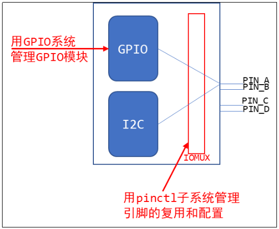
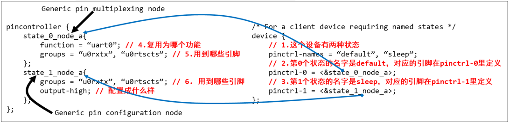
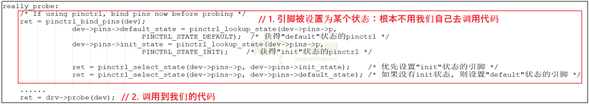
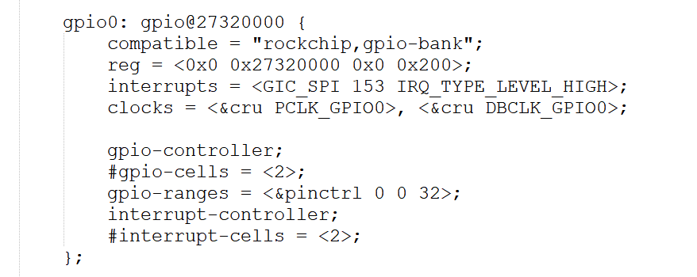
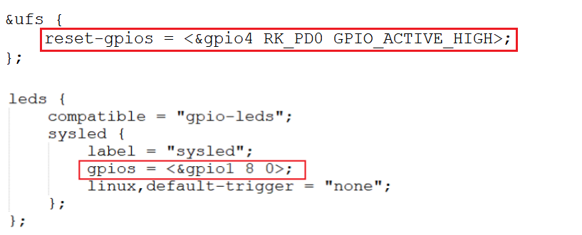
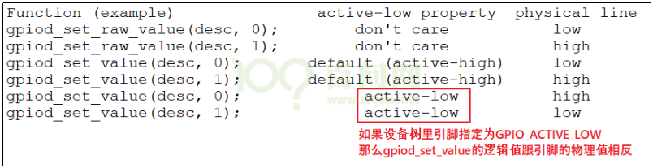
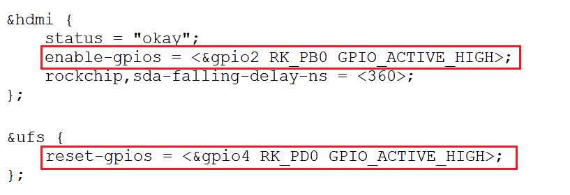
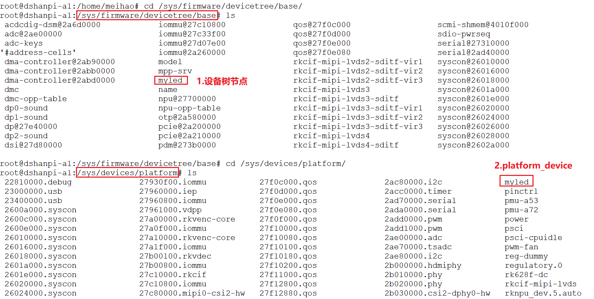

# GPIO和Pinctrl子系统的使用

## 1.1 Pinctrl子系统重要概念

### 1.1.1 引入

无论是哪种芯片，都有类似下图的结构：


- 要想让pinA、B用于GPIO，需要设置 IOMUX 让它们连接到GPIO模块；
- 要想让pinA、B用于I2C，需要设置 IOMUX 让它们连接到I2C模块。

所以GPIO、I2C应该是并列的关系，它们能够使用之前，需要设置 IOMUX。有时候并不仅仅是设置IOMUX，还要配置引脚，比如上拉、下拉、开漏等等。

现在的芯片动辄几百个引脚，在使用到GPIO功能时，让你一个引脚一个引脚去找对应的寄存器，这要疯掉。术业有专攻，这些累活就让芯片厂家做吧──他们是BSP工程师。我们在他们的基础上开发，我们是驱动工程师。开玩笑的，BSP工程师是更懂他自家的芯片，但是如果驱动工程师看不懂他们的代码，那你的进步也有限啊。

所以，要把引脚的复用、配置抽出来，做成Pinctrl子系统，给GPIO、I2C等模块使用。

BSP工程师要做什么？如下图所示：



等BSP工程师在GPIO子系统、Pinctrl子系统中把自家芯片的支持加进去后，我们就可以非常方便地使用这些引脚了：点灯简直太简单了。

等等，GPIO模块在图中跟I2C不是并列的吗？干嘛在讲Pinctrl时还把GPIO子系统拉进来？

大多数的芯片，没有单独的IOMUX模块，引脚的复用、配置等等，就是在GPIO模块内部实现的。

在硬件上GPIO和Pinctrl是如此密切相关，在软件上它们的关系也非常密切。

所以这2个子系统我们一起讲解。

### 1.1.2 重要概念

从设备树开始学习Pintrl会比较容易。

主要参考文档是：

内核Documentation\devicetree\bindings\pinctrl\pinctrl-bindings.txt

这会涉及2个对象：pin controller、client device。

前者提供服务：可以用它来复用引脚、配置引脚。

后者使用服务：声明自己要使用哪些引脚的哪些功能，怎么配置它们。

① **pin controller**

在芯片手册里你找不到 pin controller，它是一个软件上的概念，你可以认为它对应IOMUX──用来复用引脚，还可以配置引脚(比如上下拉电阻等)。

注意，pin controller 和 GPIO Controller 不是一回事，前者控制的引脚可用于GPIO功能、I2C功能；后者只是把引脚配置为输入、输出等简单的功能。即先用 pin controller 把引脚配置为GPIO，再用 GPIO Controler 把引脚配置为输入或输出。

② **client device**

“客户设备”，谁的客户？Pinctrl系统的客户，那就是使用Pinctrl系统的设备，使用引脚的设备。它在设备树里会被定义为一个节点，在节点里声明要用哪些引脚。

下图就可以把几个重要概念理清楚：



上图中，左边是 pin controller 节点，右边是 client device 节点：

1. **pin state：**

对于一个 “client device” 来说，比如对于一个UART设备，它有多个“状态”：default、sleep等，那对应的引脚也有这些状态。

怎么理解？

比如默认状态下，UART设备是工作的，那么所用的引脚就要复用为UART功能。

在休眠状态下，为了省电，可以把这些引脚复用为GPIO功能；或者直接把它们配置输出高电平。

上图中，pinctrl-names里定义了2种状态：default、sleep。

- 第0种状态用到的引脚在 pinctrl-0 中定义，它是 state_0_node_a，位于 pincontroller 节点中。 
- 第1种状态用到的引脚在 pinctrl-1 中定义，它是 state_1_node_a，位于 pincontroller 节点中。 

当这个设备处于default状态时，pinctrl子系统会自动根据上述信息把所用引脚复用为uart0功能。

当这这个设备处于sleep状态时，pinctrl子系统会自动根据上述信息把所用引脚配置为高电平。

2. **groups和function：**

一个设备会用到一个或多个引脚，这些引脚就可以归为一组(group)；

这些引脚可以复用为某个功能：function。

当然：一个设备可以用到多组引脚，比如A1、A2两组引脚，A1组复用为F1功能，A2组复用为F2功能。

3. **Generic pin multiplexing node和Generic pin configuration node**

在上图左边的pin controller节点中，有子节点或孙节点，它们是给client device使用的。

- 可以用来描述复用信息：哪组(group)引脚复用为哪个功能(function)；
- 可以用来描述配置信息：哪组(group)引脚配置为哪个设置功能(setting)，比如上拉、下拉等。

> 注意：pin controller节点的格式，没有统一的标准！！！！每家芯片都不一样。甚至上面的group、function关键字也不一定有，但是概念是有的。

### 1.1.3 代码中怎么引用pinctrl

这是透明的，我们的驱动基本不用管。当设备切换状态时，对应的pinctrl就会被调用。

比如在platform_device和platform_driver的枚举过程中，流程如下：



当系统休眠时，也会去设置该设备sleep状态对应的引脚，不需要我们自己去调用代码。非要自己调用，也有函数：

```c
devm_pinctrl_get_select_default(struct device *dev);      // 使用"default"状态的引脚
pinctrl_get_select(struct device *dev, const char *name); // 根据name选择某种状态的引脚
pinctrl_put(struct pinctrl *p);   // 不再使用, 退出时调用
```

## 1.2 GPIO子系统重要概念

### 1.2.1 引入

要操作GPIO引脚，先把所用引脚配置为GPIO功能，这通过Pinctrl子系统来实现。

然后就可以根据设置引脚方向(输入还是输出)、读值──获得电平状态，写值──输出高低电平。

以前我们通过寄存器来操作GPIO引脚，即使LED驱动程序，对于不同的板子它的代码也完全不同。

当BSP工程师实现了GPIO子系统后，我们就可以：

- 在设备树里指定GPIO引脚
- 在驱动代码中：使用GPIO子系统的标准函数获得GPIO、设置GPIO方向、读取/设置GPIO值。

这样的驱动代码，将是单板无关的。

### 1.2.2 在设备树中指定引脚

在几乎所有ARM芯片中，GPIO都分为几组，每组中有若干个引脚。所以在使用GPIO子系统之前，就要先确定：它是哪组的？组里的哪一个？

在设备树中，“GPIO组” 就是一个GPIO Controller，这通常都由芯片厂家设置好。我们要做的是找到它名字，比如“gpio1”，然后指定要用

它里面的哪个引脚，比如 `<&gpio1  0>`。

有代码更直观，下图是一些芯片的GPIO控制器节点，它们一般都是厂家定义好，例如：在 “kernel/arch/arm64/boot/dts/rockchip/rk3576.dtsi” 文件中：



我们暂时只需要关心里面的这2个属性：

```bash
gpio-controller;
#gpio-cells = <2>;
```

-  `“gpio-controller” ` 表示这个节点是一个GPIO Controller，它下面有很多引脚。
-  `“#gpio-cells = <2>”` 表示 **这个控制器** 下每一个 **引脚** 要用 **2** 个32位的数(cell)来描述。

为什么要用2个数？其实使用多个cell来描述一个引脚，这是GPIO Controller自己决定的。比如可以用其中一个cell来表示那是哪一个引脚，用另一个cell来表示它是高电平有效还是低电平有效，甚至还可以用更多的cell来示其他特性。

普遍的用法是，用第1个cell来表示哪一个引脚，用第2个cell来表示有效电平：

```bash
GPIO_ACTIVE_HIGH ： 高电平有效
GPIO_ACTIVE_LOW  :  低电平有效
```

定义 GPIO Controller 是芯片厂家的事，我们怎么引用某个引脚呢？在自己的设备节点中使用属性 `"[<name>-]gpios"` ，示例如下：



上图中，可以使用 gpios 属性，也可以使用 name-gpios 属性。

### 1.2.3 在驱动代码中调用GPIO子系统

在设备树中指定了GPIO引脚，在驱动代码中如何使用？

也就是GPIO子系统的接口函数是什么？

GPIO子系统有两套接口：基于描述符的(descriptor-based)、老的(legacy)。前者的函数都有前缀 `“gpiod_” `，它使用`gpio_desc`结构体来表示一个引脚；后者的函数都有前缀 `“gpio_”`，它使用一个整数来表示一个引脚。

要操作一个引脚，首先要 get 引脚，然后设置方向，读值、写值。

驱动程序中要包含头文件，

~~~c
#include <linux/gpio/consumer.h>   // descriptor-based
~~~

或者

```c
#include <linux/gpio.h>            // legacy
```

常用函数：

一、GPIO 获取（Request / Free）

| 功能                   | Descriptor-based（推荐）                 | Legacy GPIO（旧 API）         |
| ---------------------- | ---------------------------------------- | ----------------------------- |
| 请求 GPIO              | `gpiod_get(dev, "name", flags)`          | `gpio_request(gpio, "label")` |
| 请求可选（失败不报错） | `gpiod_get_optional(dev, "name", flags)` | 无对应                        |
| 批量请求               | `gpiod_get_array(dev, "name", flags)`    | `gpio_request_array(arr, n)`  |
| 释放                   | `gpiod_put(desc)`                        | `gpio_free(gpio)`             |
| 批量释放               | `gpiod_put_array(descs)`                 | `gpio_free_array(arr, n)`     |

二、GPIO 输入 / 输出配置 

| 功能                     | Descriptor-based（推荐）                    | Legacy GPIO（旧 API）                |
| ------------------------ | ------------------------------------------- | ------------------------------------ |
| 设置为输出并给初值       | `gpiod_direction_output(desc, value)`       | `gpio_direction_output(gpio, value)` |
| 设置为输入               | `gpiod_direction_input(desc)`               | `gpio_direction_input(gpio)`         |
| 设置方向（自动 request） | `devm_gpiod_get(dev, "xx", GPIOD_OUT_HIGH)` | 无自动设置，需要 request 后设置      |

三、GPIO 数值读写

| 功能           | Descriptor-based（推荐）                | Legacy GPIO（旧 API）                  |
| -------------- | --------------------------------------- | -------------------------------------- |
| 读取           | `gpiod_get_value(desc)`                 | `gpio_get_value(gpio)`                 |
| 读取（可睡眠） | `gpiod_get_value_cansleep(desc)`        | `gpio_get_value_cansleep(gpio)`        |
| 写入           | `gpiod_set_value(desc, value)`          | `gpio_set_value(gpio, value)`          |
| 写入（可睡眠） | `gpiod_set_value_cansleep(desc, value)` | `gpio_set_value_cansleep(gpio, value)` |

四、GPIO 标志（Flags）

| descriptor 标志                | 意义       | Legacy 对应                      |
| ------------------------------ | ---------- | -------------------------------- |
| `GPIOD_IN`                     | 输入       | `gpio_direction_input`           |
| `GPIOD_OUT_LOW`                | 输出低     | `gpio_direction_output(gpio, 0)` |
| `GPIOD_OUT_HIGH`               | 输出高     | `gpio_direction_output(gpio, 1)` |
| `GPIOD_ASIS`                   | 保持原方向 | 无对应                           |
| `GPIOD_FLAGS_BIT_NONEXCLUSIVE` | 可共享     | 无对应                           |

五、GPIO 中断接口（IRQ 与 GPIO 关联）

| 功能                             | Descriptor-based（推荐）                      | Legacy GPIO（旧 API）       |
| -------------------------------- | --------------------------------------------- | --------------------------- |
| 将 GPIO 转换为 IRQ               | `gpiod_to_irq(desc)`                          | `gpio_to_irq(gpio)`         |
| 设置 IRQ 触发类型（非 gpio API） | `irq_set_irq_type(irq, IRQ_TYPE_EDGE_RISING)` | 同样使用 irq_set_irq_type() |
| 注册中断                         | `request_irq(irq, handler, flags, name, dev)` | 同样                        |

有前缀“devm_”的含义是“设备资源管理”(Managed Device Resource)，这是一种自动释放资源的机制。它的思想是“资源是属于设备的，设备不存在时资源就可以自动释放”。

比如在Linux开发过程中，先申请了GPIO，再申请内存；如果内存申请失败，那么在返回之前就需要先释放GPIO资源。如果使用devm的相关函数，在内存申请失败时可以直接返回：设备的销毁函数会自动地释放已经申请了的GPIO资源。

假设备在设备树中有如下节点：

```bash
foo_device {
	compatible = "acme,foo";
	...
	led-gpios = <&gpio 15 GPIO_ACTIVE_HIGH>, /* red */
		    <&gpio 16 GPIO_ACTIVE_HIGH>, /* green */
		    <&gpio 17 GPIO_ACTIVE_HIGH>; /* blue */

	power-gpios = <&gpio 1 GPIO_ACTIVE_LOW>;
};
```

那么可以使用下面的函数获得引脚：

```bash
struct gpio_desc *red, *green, *blue, *power;

red = gpiod_get_index(dev, "led", 0, GPIOD_OUT_HIGH);
green = gpiod_get_index(dev, "led", 1, GPIOD_OUT_HIGH);
blue = gpiod_get_index(dev, "led", 2, GPIOD_OUT_HIGH);
power = gpiod_get(dev, "power", GPIOD_OUT_HIGH);
```

注意：gpiod_set_value设置的值是“逻辑值”，不一定等于物理值。

什么意思？



旧的 `“gpio_”` 函数没办法根据设备树信息获得引脚，它需要先知道引脚号。

引脚号怎么确定？

参考 [基础应用GPIO](https://wiki.dshanpi.org/docs/DshanPi-A1/AppDev/part3-0/03-0-1_GPIO) 章节。

## 1.3 基于GPIO子系统的LED驱动程序

### 1.3.1 编写思路

GPIO的地位跟其他模块，比如I2C、UART的地方是一样的，要使用某个引脚，需要先把引脚配置为GPIO功能，这要使用Pinctrl子系统，只需要在设备树里指定就可以。在驱动代码上不需要我们做任何事情。

GPIO本身需要确定引脚，这也需要在设备树里指定。

设备树节点会被内核转换为platform_device。

对应的，驱动代码中要注册一个platform_driver，在probe函数中：获得引脚、注册file_operations。

在file_operations中：设置方向、读值/写值。下图就是一个设备树的例子：


一般来说，一个PAD用作GPIO无需设置pinctrl：因为GPIO本身跟pinctl密切相关，在驱动程序里使用“gpiod_request”获得引脚时，会把引脚配置为GPIO功能。

### 1.3.2 在设备树中添加Pinctrl信息

有些芯片提供了设备树生成工具，在GUI界面中选择引脚功能和配置信息，就可以自动生成Pinctrl子结点。把它复制到你的设备树文件中，再在client device结点中引用就可以。

有些芯片只提供文档，那就去阅读文档，一般在内核源码目录Documentation\devicetree\bindings\pinctrl下面，保存有该厂家的文档。

如果连文档都没有，那只能参考内核源码中的设备树文件，在内核源码目录arch/arm/boot/dts目录下。

最后一步，网络搜索。

### 1.3.3 在设备树中添加GPIO信息

先查看电路原理图确定所用引脚，再在设备树中指定：添加 “[name]-gpios” 属性，指定使用的是哪一个GPIO Controller里的哪一个引脚，还有其他Flag信息，比如 GPIO_ACTIVE_LOW 等。具体需要多少个cell来描述一个引脚，需要查看设备树中这个GPIO Controller节点里的 “#gpio-cells” 属性值，也可以查看内核文档。

设备树自带的示例如下：



DshanPi-A1 没有板载LED，本实验只操作扩展引脚中的 `gpio0_B6` 引脚，需要在设备树里增加一个节点，按照一般开发过程，我们应该修改设备树文件，增加如下节点：

```c
myled {
    compatible = "dshanpi-a1,leddrv";
    led-gpios = <&gpio0 14 GPIO_ACTIVE_HIGH>;
};
```

但是我们在开发板上进行编译操作，里面没有放置“巨大的内核源码”。所以我们通过设备树Overlay来添加新节点。

创建一个dts文件，命令如下：

~~~bash
meihao@dshanpi-a1:~$ su
Password:
root@dshanpi-a1:/home/meihao# ls
Desktop  Documents  Downloads  KernelDemo  KernelTree  Music  Pictures  Public  Templates  Videos
root@dshanpi-a1:/home/meihao# cd KernelTree/
root@dshanpi-a1:/home/meihao/KernelTree# vim my_led.dts
~~~

`my_led.dts` 填入以下内容：

~~~bash
/dts-v1/;
/plugin/;

/ {
    fragment@0 {
        target-path = "/";
        __overlay__ {
            myled {
                compatible = "dshanpi-a1,leddrv";
                led-gpios = <&gpio0 14 0>;
            };
        };
    };
};
~~~

保存文件后，执行以下命令以编译并加载该设备树 Overlay：

~~~bash
root@dshanpi-a1:/home/meihao/KernelTree# armbian-add-overlay my_led.dts
Compiling the overlay
Copying the compiled overlay file to /boot/overlay-user/
Reboot is required to apply the changes
~~~

可以看到：

~~~bash
root@dshanpi-a1:/home/meihao/KernelTree# ls /boot/overlay-user/
my_led.dtbo
root@dshanpi-a1:/home/meihao/KernelTree# cat /boot/armbianEnv.txt
verbosity=1
bootlogo=true
console=both
overlay_prefix=rk35xx
fdtfile=rockchip/rk3576-100ask-dshanpi-a1.dtb
rootdev=UUID=428e5288-8d7f-4b7b-ad54-e2dde8920113
rootfstype=ext4
user_overlays=my_led
usbstoragequirks=0x2537:0x1066:u,0x2537:0x1068:u
~~~

重新启动板子后，就会使用新的设备树文件，可以如下确认：



### 1.3.4 编程示例

第1步 定义、注册一个platform_driver

第2步 在它的probe函数里：

1. 根据 platform_device 的设备树信息确定GPIO：gpiod_get

2. 定义、注册一个 file_operations 结构体

3. 在 file_operarions 中使用GPIO子系统的函数操作GPIO：

   gpiod_direction_output、gpiod_set_value

源码 leddrv.c 位于如下链接：

[leddrv源码下载](https://dl.100ask.net/Hardware/MPU/RK3576-DshanPi-A1/driver_sources/03_led.tar.gz)

- **注册platform_driver**

注意下面第122行的 "dshanpi-a1,leddrv"，它会跟设备树中节点的compatible对应：

~~~c
121 static const struct of_device_id ask100_leds[] = {
122     { .compatible = "dshanpi-a1,leddrv" },
123     { },
124 };
125
126 /* 1. 定义platform_driver */
127 static struct platform_driver chip_demo_gpio_driver = {
128     .probe      = chip_demo_gpio_probe,
129     .remove     = chip_demo_gpio_remove,
130     .driver     = {
131         .name   = "100ask_led",
132         .of_match_table = ask100_leds,
133     },
134 };
135
136 /* 2. 在入口函数注册platform_driver */
137 static int __init led_init(void)
138 {
139     int err;
140
141     printk("%s %s line %d\n", __FILE__, __FUNCTION__, __LINE__);
142
143     err = platform_driver_register(&chip_demo_gpio_driver);
144
145     return err;
146 }
~~~

- **在probe函数中获得GPIO**

核心代码是第87行，它从该设备（对应设备树中的设备节点）获取名为 “led” 的引脚。在设备树中，必定有一属性名为 “led-gpios” 或 “led-gpio” 。

~~~c
77 /* 4. 从platform_device获得GPIO
78  *    把file_operations结构体告诉内核：注册驱动程序
79  */
80 static int chip_demo_gpio_probe(struct platform_device *pdev)
81 {
82      //int err;
83
84      printk("%s %s line %d\n", __FILE__, __FUNCTION__, __LINE__);
85
86      /* 4.1 设备树中定义有: led-gpios=<...>; */
87     led_gpio = gpiod_get(&pdev->dev, "led", 0);
88      if (IS_ERR(led_gpio)) {
89              dev_err(&pdev->dev, "Failed to get GPIO for led\n");
90              return PTR_ERR(led_gpio);
91      }
~~~

- **注册file_operations结构体：这是老套路了**

~~~c
93      /* 4.2 注册file_operations      */
94      major = register_chrdev(0, "100ask_led", &led_drv);  /* /dev/led */
95
96      led_class = class_create(THIS_MODULE, "100ask_led_class");
97      if (IS_ERR(led_class)) {
98              printk("%s %s line %d\n", __FILE__, __FUNCTION__, __LINE__);
99              unregister_chrdev(major, "led");
100             gpiod_put(led_gpio);
101             return PTR_ERR(led_class);
102     }
103
104     device_create(led_class, NULL, MKDEV(major, 0), NULL, "100ask_led%d", 0); /* /dev/100ask_led0 */
~~~

- **在open函数中调用GPIO函数设置引脚方向**

~~~C
51 static int led_drv_open (struct inode *node, struct file *file)
52 {
53      //int minor = iminor(node);
54
55      printk("%s %s line %d\n", __FILE__, __FUNCTION__, __LINE__);
56      /* 根据次设备号初始化LED */
57      gpiod_direction_output(led_gpio, 0);
58
59      return 0;
60 }
~~~

- **在write函数中调用GPIO函数设置引脚值**

~~~C
34 /* write(fd, &val, 1); */
35 static ssize_t led_drv_write (struct file *file, const char __user *buf, size_t size, loff_t *offset)
36 {
37      int err;
38      char status;
39      //struct inode *inode = file_inode(file);
40      //int minor = iminor(inode);
41
42      printk("%s %s line %d\n", __FILE__, __FUNCTION__, __LINE__);
43      err = copy_from_user(&status, buf, 1);
44
45      /* 根据次设备号和status控制LED */
46      gpiod_set_value(led_gpio, status);
47
48      return 1;
49 }
~~~

- **释放GPIO**

~~~C
gpiod_put(led_gpio);
~~~

### 1.3.5 上机实验

执行以下命令：

~~~bash
make
su
insmod leddrv.ko
ls /dev/100ask_led0
./ledtest /dev/100ask_led0 on
./ledtest /dev/100ask_led0 off
~~~

如下：

~~~bash
meihao@dshanpi-a1:~/KernelDemo/03_led$ ls
leddrv.c  ledtest.c  Makefile
meihao@dshanpi-a1:~/KernelDemo/03_led$ make
make -C /lib/modules/6.1.115-vendor-rk35xx/build M=`pwd` modules
make[1]: Entering directory '/usr/src/linux-headers-6.1.115-vendor-rk35xx'
  CC [M]  /home/meihao/KernelDemo/03_led/leddrv.o
  MODPOST /home/meihao/KernelDemo/03_led/Module.symvers
  CC [M]  /home/meihao/KernelDemo/03_led/leddrv.mod.o
  LD [M]  /home/meihao/KernelDemo/03_led/leddrv.ko
make[1]: Leaving directory '/usr/src/linux-headers-6.1.115-vendor-rk35xx'
cc -o ledtest ledtest.c
meihao@dshanpi-a1:~/KernelDemo/03_led$ ls
leddrv.c  leddrv.ko  leddrv.mod  leddrv.mod.c  leddrv.mod.o  leddrv.o  ledtest  ledtest.c  Makefile  modules.order  Module.symvers
meihao@dshanpi-a1:~/KernelDemo/03_led$ su
Password:
root@dshanpi-a1:/home/meihao/KernelDemo/03_led#
root@dshanpi-a1:/home/meihao/KernelDemo/03_led# ls
leddrv.c  leddrv.ko  leddrv.mod  leddrv.mod.c  leddrv.mod.o  leddrv.o  ledtest  ledtest.c  Makefile  modules.order  Module.symvers
root@dshanpi-a1:/home/meihao/KernelDemo/03_led# insmod leddrv.ko
root@dshanpi-a1:/home/meihao/KernelDemo/03_led# ls /dev/100ask_led0
/dev/100ask_led0
root@dshanpi-a1:/home/meihao/KernelDemo/03_led# ./ledtest /dev/100ask_led0 on
root@dshanpi-a1:/home/meihao/KernelDemo/03_led# ./ledtest /dev/100ask_led0 off
~~~

