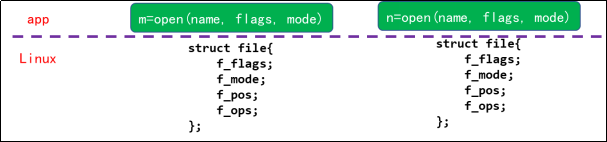
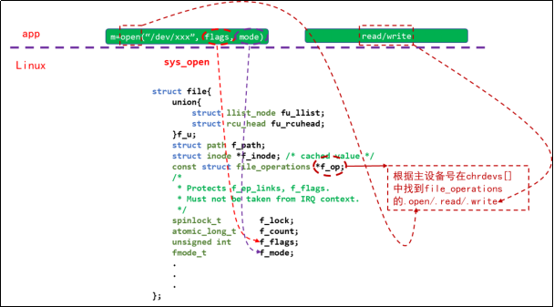
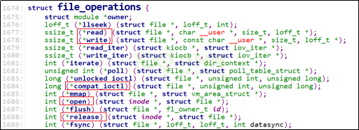
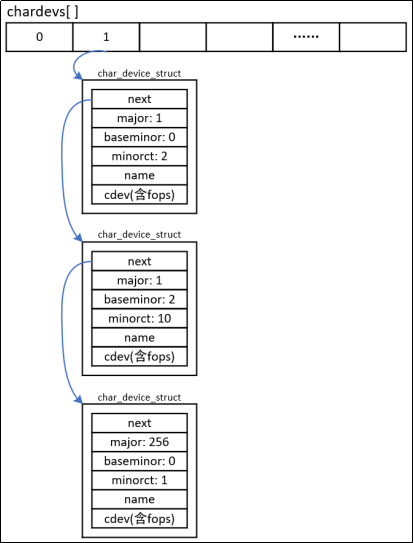
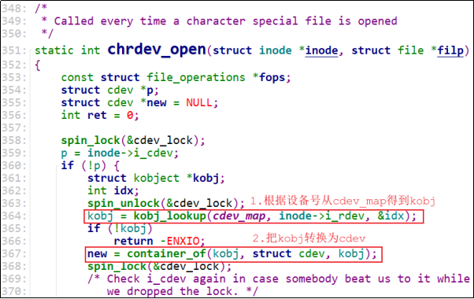
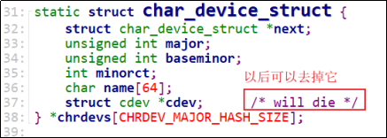

# Hello驱动(不涉及硬件操作)

本章节包含示例源码下载链接如下：

下载地址：[Hello驱动源码](https://dl.100ask.net/Hardware/MPU/RK3576-DshanPi-A1/driver_sources/01_Hello.tar.gz)

## 1.1 APP打开的文件在内核中如何表示

APP打开文件时，可以得到一个整数，这个整数被称为文件句柄。对于APP的每一个文件句柄，在内核里面都有一个“struct file”与之对应。


我们使用 open 打开文件时，传入的 flags、mode 等参数会被记录在内核中对应的struct file结构体里(f_flags、f_mode)：

~~~c 
int open(const char *pathname, int flags, mode_t mode);
~~~

去读写文件时，文件的当前偏移地址也会保存在struct file结构体的f_pos成员里。



## 1.2 打开字符设备节点时，内核中也有对应的struct file

注意这个结构体中的结构体：struct file_operations *f_op，这是由驱动程序提供的。

驱动程序的struct file：


驱动程序的open/read/write：



结构体struct file_operations的定义如下：



## 1.3 怎么编写驱动程序

APP和驱动之间的简单对应关系为：


> APP调用open函数时，内核会根据设备节点的主设备号找到驱动程序的 struct file_operations 结构体，然后调用它的 open 函数。以后APP调用 read/write/ioctl 等函数时，就会调用到驱动程序对应的 struct file_operations 结构体的 read/write/unlocked_ioctl 函数。

编写驱动程序的流程为：
① 确定主设备号，也可以让内核分配
② 定义自己的 **file_operations** 结构体
③ 实现对应的 **drv_open/drv_read/drv_write** 等函数，填入 **file_operations** 结构体
④ 把 **file_operations** 结构体告诉内核：**register_chrdev**
⑤ 谁来注册驱动程序啊？得有一个入口函数：安装驱动程序时，就会去调用这个入口函数
⑥ 有入口函数就应该有出口函数：卸载驱动程序时，出口函数调用 **unregister_chrdev**
⑦ 其他完善：提供设备信息，自动创建设备节点：**class_create, device_create**

## 1.4 编写代码

### 1.4.1 写驱动程序

参考内核driver/char中的程序，包含头文件，写框架，传输数据：

- 驱动中实现open, read, write, release，APP调用这些函数时，都打印内核信息
- APP调用write函数时，传入的数据保存在驱动中
- APP调用read函数时，把驱动中保存的数据返回给APP

hello_drv.c 源码如下：

```c
01 #include <linux/module.h>
02
03 #include <linux/fs.h>
04 #include <linux/errno.h>
05 #include <linux/miscdevice.h>
06 #include <linux/kernel.h>
07 #include <linux/major.h>
08 #include <linux/mutex.h>
09 #include <linux/proc_fs.h>
10 #include <linux/seq_file.h>
11 #include <linux/stat.h>
12 #include <linux/init.h>
13 #include <linux/device.h>
14 #include <linux/tty.h>
15 #include <linux/kmod.h>
16 #include <linux/gfp.h>
17
18 /* 1. 确定主设备号 */
19 static int major = 0;
20 static char kernel_buf[1024];
21 static struct class *hello_class;
22
23
24 #define MIN(a, b) (a < b ? a : b)
25
26 /* 3. 实现对应的open/read/write等函数，填入file_operations结构体 */ 
27 static ssize_t hello_drv_read (struct file *file, char __user *buf, size_t size, loff_t *offset)
28 {
29      int err;
30      printk("%s %s line %d\n", __FILE__, __FUNCTION__, __LINE__);
31      err = copy_to_user(buf, kernel_buf, MIN(1024, size));
32      return MIN(1024, size);
33 }
34
35 static ssize_t hello_drv_write (struct file *file, const char __user *buf, size_t size, loff_t *offset)
36 {
37      int err;
38      printk("%s %s line %d\n", __FILE__, __FUNCTION__, __LINE__);
39      err = copy_from_user(kernel_buf, buf, MIN(1024, size));
40      return MIN(1024, size);
41 }
42
43 static int hello_drv_open (struct inode *node, struct file *file)
44 {
45      printk("%s %s line %d\n", __FILE__, __FUNCTION__, __LINE__);
46      return 0;
47 }
48
49 static int hello_drv_close (struct inode *node, struct file *file)
50 {
51      printk("%s %s line %d\n", __FILE__, __FUNCTION__, __LINE__);
52      return 0;
53 }
54
55 /* 2. 定义自己的file_operations结构体 */
56 static struct file_operations hello_drv = {
57      .owner   = THIS_MODULE,
58      .open    = hello_drv_open,
59      .read    = hello_drv_read,
60      .write   = hello_drv_write,
61      .release = hello_drv_close,
62 };
63
64 /* 4. 把file_operations结构体告诉内核：注册驱动程序 */
65 /* 5. 谁来注册驱动程序啊？得有一个入口函数：安装驱动程序时，就会去调用这个入口函数 */
66 static int __init hello_init(void)
67 {
68      int err;
69
70      printk("%s %s line %d\n", __FILE__, __FUNCTION__, __LINE__);
71      major = register_chrdev(0, "hello", &hello_drv);  /* /dev/hello */
72
73
74      hello_class = class_create(THIS_MODULE, "hello_class");
75      err = PTR_ERR(hello_class);
76      if (IS_ERR(hello_class)) {
77              printk("%s %s line %d\n", __FILE__, __FUNCTION__, __LINE__);
78              unregister_chrdev(major, "hello");
79              return -1;
80      }
81
82      device_create(hello_class, NULL, MKDEV(major, 0), NULL, "hello"); /* /dev/hello */
83
84      return 0;
85 }
86
87 /* 6. 有入口函数就有出口函数：卸载驱动程序时就会去调用这个出口函数 */
88 static void __exit hello_exit(void)
89 {
90      printk("%s %s line %d\n", __FILE__, __FUNCTION__, __LINE__);
91      device_destroy(hello_class, MKDEV(major, 0));
92      class_destroy(hello_class);
93      unregister_chrdev(major, "hello");
94 }
95
96
97 /* 7. 其他完善：提供设备信息，自动创建设备节点 */
98
99 module_init(hello_init);
100 module_exit(hello_exit);
101
102 MODULE_LICENSE("GPL");
103
```

阅读一个驱动程序，从它的入口函数开始，第66行就是入口函数。它的主要工作就是第71行，向内核注册一个file_operations结构体：hello_drv，这就是字符设备驱动程序的核心。

file_operations 结构体 hello_drv 在第56行定义，里面提供了 open/read/write/release 成员，应用程序调用 open/read/write/close 时就会导致这些成员函数被调用。

file_operations 结构体 hello_drv 中的成员函数都比较简单，大多数只是打印而已。要注意的是，驱动程序和应用程序之间传递数据要使用 copy_from_user/copy_to_user 函数。

### 1.4.2 写测试程序

测试程序要实现写、读功能：

```bash
./hello_drv_test  -w  www.100ask.net  // 把字符串“www.100ask.net”发给驱动程序
./hello_drv_test  -r                  // 把驱动中保存的字符串读回来
```

hello_drv_test.c 源码如下：

```c
02 #include <sys/types.h>
03 #include <sys/stat.h>
04 #include <fcntl.h>
05 #include <unistd.h>
06 #include <stdio.h>
07 #include <string.h>
08
09 /*
10  * ./hello_drv_test -w abc
11  * ./hello_drv_test -r
12  */
13 int main(int argc, char **argv)
14 {
15      int fd;
16      char buf[1024];
17      int len;
18
19      /* 1. 判断参数 */
20      if (argc < 2)
21      {
22              printf("Usage: %s -w <string>\n", argv[0]);
23              printf("       %s -r\n", argv[0]);
24              return -1;
25      }
26
27      /* 2. 打开文件 */
28      fd = open("/dev/hello", O_RDWR);
29      if (fd == -1)
30      {
31              printf("can not open file /dev/hello\n");
32              return -1;
33      }
34
35      /* 3. 写文件或读文件 */
36      if ((0 == strcmp(argv[1], "-w")) && (argc == 3))
37      {
38              len = strlen(argv[2]) + 1;
39              len = len < 1024 ? len : 1024;
40              write(fd, argv[2], len);
41      }
42      else
43      {
44              len = read(fd, buf, 1024);
45              buf[1023] = '\0';
46              printf("APP read : %s\n", buf);
47      }
48
49      close(fd);
50
51      return 0;
52 }
```

### 1.4.3 测试

- **编写驱动程序的Makefile**

驱动程序中包含了很多头文件，这些头文件来自内核，在 ARM 平台上，不同厂商（如 Rockchip、Allwinner、Amlogic）对内核都有定制，因此驱动编译必须使用与当前系统完全匹配的内核头文件。 **linux-headers-vendor-rk35xx_6.1.115-…… .deb** 正是为 Armbian DshanPi-A1 提供这份匹配头文件的包，用于保证驱动能正确编译和加载。

`linux-headers-vendor-rk35xx_6.1.115-…… .deb` 下载链接如下：

下载地址：[linux-headers-vendor-rk35xx_25.11.0-trunk_arm64_..>](https://dl.100ask.net/Hardware/MPU/RK3576-DshanPi-A1/linux-headers-vendor-rk35xx_25.11.0-trunk_arm64__6.1.115-S2482-D0b5d-P09c0-C2265H2313-HK01ba-Vc222-Bd200-R448a.deb)

执行以下指令安装 linux-headers-vendor-rk35xx_6.1.115-…… .deb ：

~~~bash
sudo dpkg -i linux-headers-vendor-rk35xx_6.1.115-…… .deb
~~~

安装 linux-headers-vendor-rk35xx_6.1.115-…… .deb 之后，系统会在：

~~~bash
/lib/modules/$(uname -r)/build
~~~

建立一个指向对应内核头文件目录的符号链接（通常链接到 `/usr/src/linux-headers-...`）。

因此在编译外部驱动（如 DKMS 模块或手动编译的内核模块）时，只需指定：

~~~bash
make -C /lib/modules/$(shell uname -r)/build M=$(PWD) modules
~~~

要编译哪个文件？这也需要指定，设置 `obj-m` 变量即可。

要将 `.c` 文件编译为驱动模块 `.ko`，需要借助当前内核的构建系统，也就是 `/lib/modules/$(shell uname -r)/build` 下的 Makefile。

Hello 驱动和测试程序的 Makefile 内容如下：

~~~bash
# Makefile for hello_drv kernel module

# 模块名，不需要写 .c 后缀
obj-m := hello_drv.o

# 内核构建目录（自动指向当前运行内核的 headers）
KDIR := /lib/modules/$(shell uname -r)/build

# 当前路径
PWD := $(shell pwd)

# 默认目标：编译驱动模块 + 应用
all: module app

# 编译内核模块
module:
        $(MAKE) -C $(KDIR) M=$(PWD) modules

# 编译应用程序
app:
        $(CC) hello_drv_test.c -o hello_drv_test

# 清理目标文件
clean:
        $(MAKE) -C $(KDIR) M=$(PWD) clean
        rm -f hello_drv_test
~~~

- **上机实验**

在相应路径下执行以下指令，编译、安装驱动和运行测试程序：

~~~bash
meihao@dshanpi-a1:~/KernelDemo/01_Hello$ ls
hello_drv.c  hello_drv_test.c  Makefile

# 编译内核和应用程序
meihao@dshanpi-a1:~/KernelDemo/01_Hello$ make
make -C /lib/modules/6.1.115-vendor-rk35xx/build M=/home/meihao/KernelDemo/01_Hello modules
make[1]: Entering directory '/usr/src/linux-headers-6.1.115-vendor-rk35xx'
  CC [M]  /home/meihao/KernelDemo/01_Hello/hello_drv.o
  MODPOST /home/meihao/KernelDemo/01_Hello/Module.symvers
  CC [M]  /home/meihao/KernelDemo/01_Hello/hello_drv.mod.o
  LD [M]  /home/meihao/KernelDemo/01_Hello/hello_drv.ko
make[1]: Leaving directory '/usr/src/linux-headers-6.1.115-vendor-rk35xx'

meihao@dshanpi-a1:~/KernelDemo/01_Hello$ ls
hello_drv.c   hello_drv.mod    hello_drv.mod.o  hello_drv_test    Makefile       Module.symvers
hello_drv.ko  hello_drv.mod.c  hello_drv.o      hello_drv_test.c  modules.order

# 安装驱动程序
meihao@dshanpi-a1:~/KernelDemo/01_Hello$ sudo insmod hello_drv.ko
meihao@dshanpi-a1:~/KernelDemo/01_Hello$ ls /dev/hello
/dev/hello

# 应用程序读写
meihao@dshanpi-a1:~/KernelDemo/01_Hello$ ./hello_drv_test
Usage: ./hello_drv_test -w <string>
       ./hello_drv_test -r

meihao@dshanpi-a1:~/KernelDemo/01_Hello$ sudo ./hello_drv_test -w dshanpi-a1
meihao@dshanpi-a1:~/KernelDemo/01_Hello$ sudo ./hello_drv_test -r
APP read : dshanpi-a1
~~~

## 1.5 Hello驱动中的一些补充知识

### 1.5.1 module_init/module_exit的实现

一个驱动程序有入口函数、出口函数，代码如下：

~~~c
module_init(hello_init);
module_exit(hello_exit);
~~~

动程序可以被编进内核里，也可以被编译为ko文件后手工加载。对于这两种形式，“module_init/module_exit” 这2个宏是不一样的。在内核文件 “include\linux\module.h” 中可以看到这2个宏：

```c
01 #ifndef MODULE
02 
03 #define module_init(x)    __initcall(x);
04 #define module_exit(x)    __exitcall(x);
05 
06 #else /* MODULE */
07 
08 #define module_init(initfn)                 \
09 
10 /* Each module must use one module_init(). */
11     static inline initcall_t __inittest(void)       \
12     { return initfn; }                  \
13     int init_module(void) __attribute__((alias(#initfn)));
14 
15 /* This is only required if you want to be unloadable. */
16 #define module_exit(exitfn)                 \
17     static inline exitcall_t __exittest(void)       \
18     { return exitfn; }                  \
19     void cleanup_module(void) __attribute__((alias(#exitfn)));
20 
21 #endif
```

编译驱动程序时，我们执行“make”这样的命令，它在编译c文件时会定义宏MODULE，比如：

```bash
gcc  -DMODULE  -c -o hello_drv.o hello_drv.c
```

在编译内核时，并不会定义宏MODULE。所以，“module_init/module_exit”这2个宏在驱动程序被编进内核时，如上面代码中第3、4行那样定义；在驱动程序被编译为ko文件时，如上面代码中第11~19行那样定义。

把上述代码里的宏全部展开后，得到如下代码：

```c
01 #ifndef MODULE
01 
01 #define module_init(fn)    
02     static initcall_t __initcall_##fn##id __used \
03 __attribute__((__section__(".initcall" #6 ".init"))) = fn;
04 
05 #define module_exit(x)    static exitcall_t __exitcall_##x __used __section(.exitcall.exit) = x;
06 
07 #else /* MODULE */
08 
09 #define module_init(initfn)                 \
10 
11 /* Each module must use one module_init(). */
12     static inline initcall_t __inittest(void)       \
13     { return initfn; }                  \
14     int init_module(void) __attribute__((alias(#initfn)));
15 
16 /* This is only required if you want to be unloadable. */
17 #define module_exit(exitfn)                 \
18     static inline exitcall_t __exittest(void)       \
19     { return exitfn; }                  \
20     void cleanup_module(void) __attribute__((alias(#exitfn)));
21 
22 #endif
```

驱动程序被编进内核时，把 “module_init(hello_init)”、“module_exit(hello_exit)” 展开，得到如下代码：

```c
static initcall_t __initcall_hello_init6 __used \
__attribute__((__section__(".initcall6.init"))) = hello_init;

static exitcall_t __exitcall_hello_exit  __used __section(.exitcall.exit) = hello_exit;
```

其中的“initcall_t”、“exitcall_t”就是函数指针类型，所以上述代码就是定义了两个函数指针：

- 第1个函数指针名为__initcall_hello_init6，放在段".initcall6.init"里；
- 第2个函数指针名为 __exitcall_hello_exit，放在段“.exitcall.exit”里。

内核启动时，会去段 ".initcall6.init" 里取出这些函数指针来执行，所以驱动程序的入口函数就被执行了。一个驱动被编进内核后，它是不会被卸载的，所以段“.exitcall.exit”不会被用到，内核启动后会释放这块段空间。驱动程序被编译为ko文件时，把 “module_init(hello_init)”、“module_exit(hello_exit)” 展开，得到如下代码：

```c
static inline initcall_t __inittest(void)       \
{ return hello_init; }                  \
int init_module(void) __attribute__((alias("hello_init")));

static inline exitcall_t __exittest(void)       \
{ return hello_exit; }                  \
void cleanup_module(void) __attribute__((alias("hello_exit")));
```

分别定义了2个函数：

- 第1个函数名为init_module，它是hello_init函数的别名；
- 第2个函数名为cleanup_module，它是hello_exit函数的别名。

以后我们使用 insmod 命令加载驱动时，内核都是调用 init_module 函数，实际上就是调用 hello_init 函数；使用 rmmod 命令卸载驱动时，内核都是调用cleanup_module函数，实际上就是调用 hello_exit 函数。

### 1.5.2 register_chrdev的内部实现

register_chrdev 函数源码如下：

```c
static inline int register_chrdev(unsigned int major, const char *name,
                  const struct file_operations *fops)
{
    return __register_chrdev(major, 0, 256, name, fops);
}
```

它调用__register_chrdev函数，这个函数的代码精简如下：

```c
01 int __register_chrdev(unsigned int major, unsigned int baseminor,
02               unsigned int count, const char *name,
03               const struct file_operations *fops)
04 {
05     struct char_device_struct *cd;
06     struct cdev *cdev;
07     int err = -ENOMEM;
08 
09     cd = __register_chrdev_region(major, baseminor, count, name);
10 
11     cdev = cdev_alloc();
12 
13     cdev->owner = fops->owner;
14     cdev->ops = fops;
15     kobject_set_name(&cdev->kobj, "%s", name);
16 
17     err = cdev_add(cdev, MKDEV(cd->major, baseminor), count);
18 }
```

这个函数主要的代码是第09行、第11~15行、第17行。

第09行，调用__register_chrdev_region函数来“注册字符设备的区域”，它仅仅是查看设备号(major, baseminor)到(major, baseminor+count-1)有没有被占用，如果未被占用的话，就使用这块区域。

为了便于理解，我们说内核里有一个 chrdevs 数组，根据主设备号 major 在 chrdevs[major] 中放入 file_operations 结构体，以后 open/read/write 某个设备文件时，就是根据主设备号从 chrdevs[major] 中取出 file_operations 结构体，调用里面的open/read/write函数指针。

上述说法并不准确，内核中确实有一个chrdevs数组：

```c
static struct char_device_struct {
    struct char_device_struct *next;
    unsigned int major;
    unsigned int baseminor;
    int minorct;
    char name[64];
    struct cdev *cdev;      /* will die */
} *chrdevs[CHRDEV_MAJOR_HASH_SIZE];
```

去访问它的时候，并不是直接使用主设备号 major 来确定数组项，而是使用如下函数来确定数组项：

```c
/* index in the above */
static inline int major_to_index(unsigned major)
{
    return major % CHRDEV_MAJOR_HASH_SIZE;
}
```

上述代码中，CHRDEV_MAJOR_HASH_SIZE 等于255。比如主设备号1、256，都会使用chardevs[1] 。chardevs[1]是一个链表，链表里有多个char_device_struct结构体，某个结构体表示主设备号为1的设备，某个结构体表示主设备号为256的设备。

chardevs的结构图如下：



从上图可以得出如下结论：

① **chrdevs[i]数组项是一个链表头**

链表里每一个元素都是一个char_device_struct结构体，每个元素表示一个驱动程序。
char_device_struct结构体内容如下：

```c
struct char_device_struct {
    struct char_device_struct *next;
    unsigned int major;
    unsigned int baseminor;
    int minorct;
    char name[64];
    struct cdev *cdev;      /* will die */
}
```

它指定了主设备号major、次设备号baseminor、个数minorct，在cdev中含有file_operations结构体。

char_device_struct 结构体的含义是：主次设备号为(major, baseminor)、(major, baseminor+1)、(major, baseminor+2)、(major, baseminor+ minorct-1)的这些设备，都使用同一个file_operations来操作。

为了更容易理解驱动程序时，说“内核通过主设备号找到对应的file_operations结构体”，这并不准确。应该改成：“内核通过主、次设备号，找到对应的file_operations结构体”。

② **chardevs[1]中有3个驱动程序**

- 第1个char_device_struct结构体对应主次设备号(1, 0)、(1, 1)，这是第1个驱动程序。
- 第2个char_device_struct结构体对应主次设备号(1, 2)、(1, 2)、……、(1, 11)，这是第2个驱动程序。
- 第3个char_device_struct结构体对应主次设备号(256, 0)，这是第3个驱动程序。
- 第11~15行分配一个cdev结构体，并设置它：它含有file_operations结构体。
- 第17行调用cdev_add把cdev结构体注册进内核里。

cdev_add函数代码如下：

```c
01 int cdev_add(struct cdev *p, dev_t dev, unsigned count)
02 {
03     int error;
04 
05     p->dev = dev;
06     p->count = count;
07 
08     error = kobj_map(cdev_map, dev, count, NULL,
09              exact_match, exact_lock, p);
10     if (error)
11         return error;
12 
13     kobject_get(p->kobj.parent);
14 
15     return 0;
16 }
```

这个函数涉及kobj的操作，这是一个通用的链表操作函数。它的作用是：把 cdev 结构体放入 cdev_map 链表中，对应的索引值是“dev”到 “dev+count-1”。以后可以从 cdev_map 链表中快速地使用索引值取出对应的cdev。

比如执行以下代码：

```bash
err = cdev_add(cdev, MKDEV(1, 2), 10);
```

其中的 MKDEV(1,2) 构造出一个整数 `“1<<8 | 2”`，即0x102；上述代码将 cdev 放入 cdev_map 链表中，对应的索引值是 0x102 到 0x10c(即0x102+10)。以后根据这10个数值(0x102、0x103、0x104、……、0x10c)中任意一个，都可以快速地从cdev_map链表中取出cdev结构体。

APP打开某个字符设备节点时，进入内核。在内核里根据字符设备节点的主、次设备号，计算出一个数值`(major<<8 | minor，即inode->i_rdev)`，然后使用这个数值从 cdev_map 中快速得到 cdev，再从 cdev 中得到 file_operations 结构体。

关键函数如下：



在打开文件的过程中，可以看到并未涉及chrdevs，都是使用cdev_map。所以可以看到在chrdevs的定义中看到如下注释：



### 1.5.3 class_destroy/device_create浅析

驱动程序的核心是 file_operations 结构体：分配、设置、注册它。

“class_destroy/device_create” 函数知识起一些辅助作用：在/sys目录下创建一些目录、文件，这样Linux系统中的APP(比如udev、mdev)就可以根据这些目录或文件来创建设备节点。

以下代码将会在 “/sys/class” 目录下创建一个子目录 “hello_class”：

```c
hello_class = class_create(THIS_MODULE, "hello_class");
```

以下代码将会在 “/sys/class/hello_class” 目录下创建一个文件“hello”：

```c
device_create(hello_class, NULL, MKDEV(major, 0), NULL, "hello"); 
```

更详细的信息如下：


