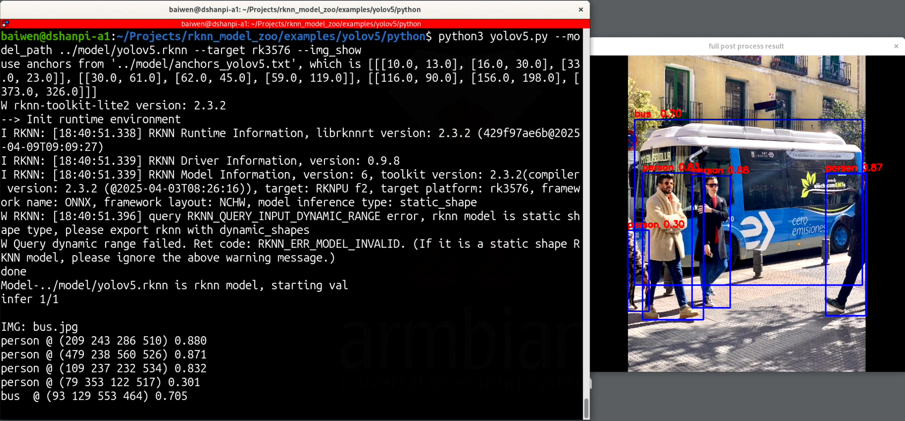
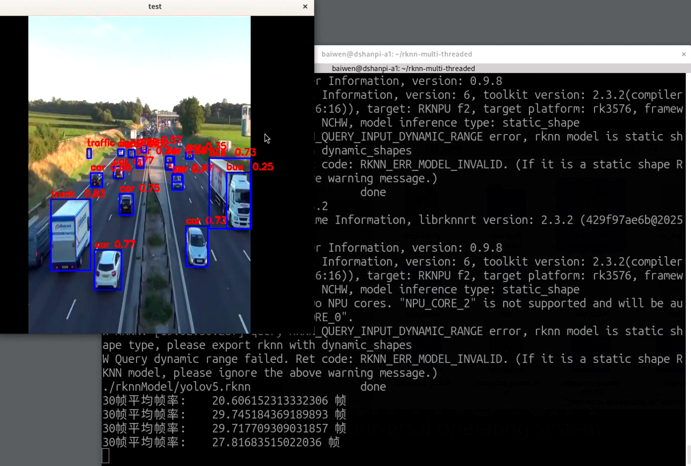
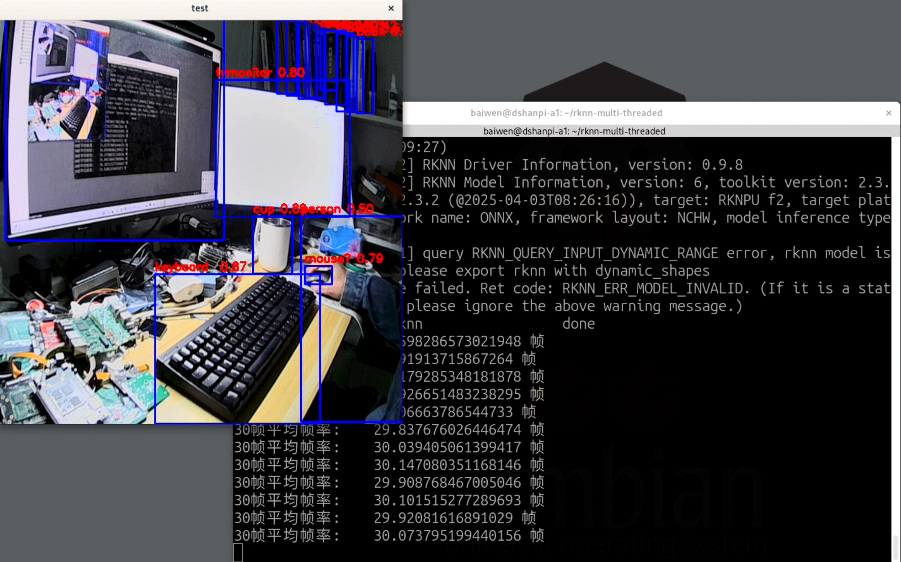
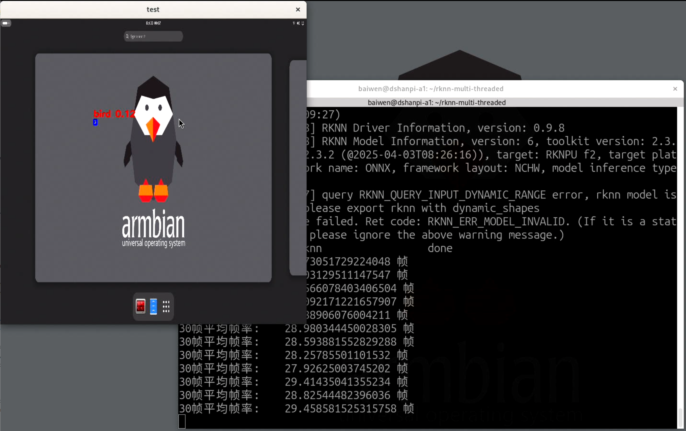
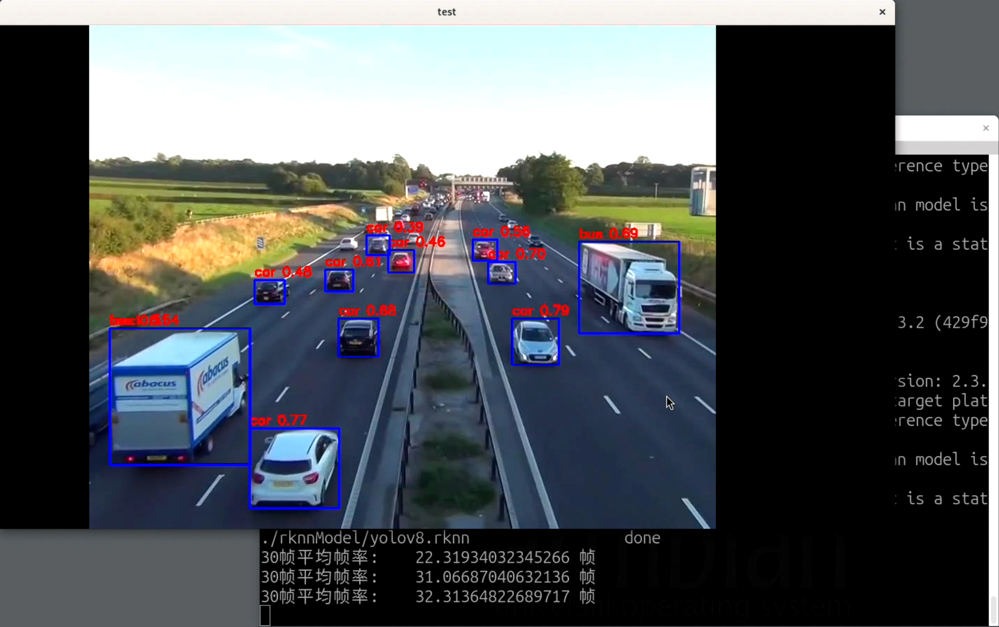
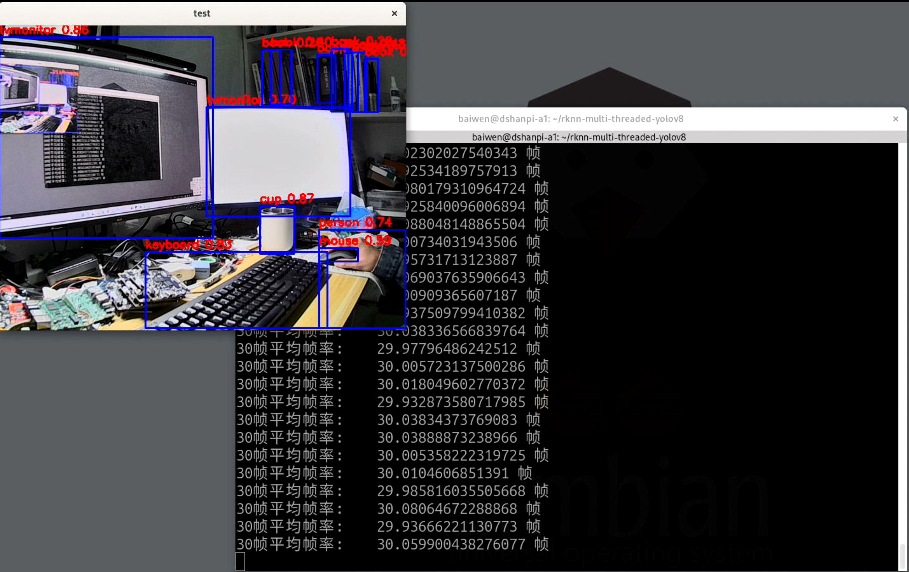
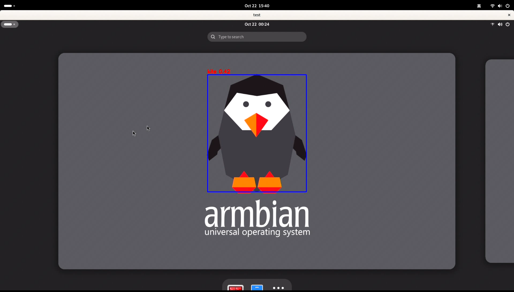
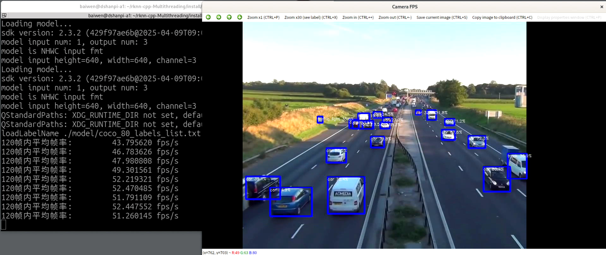
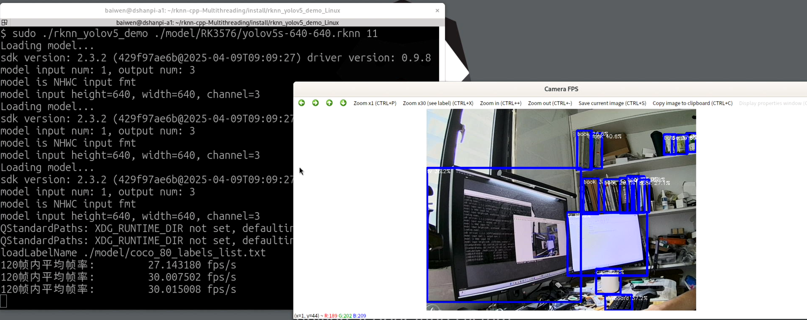
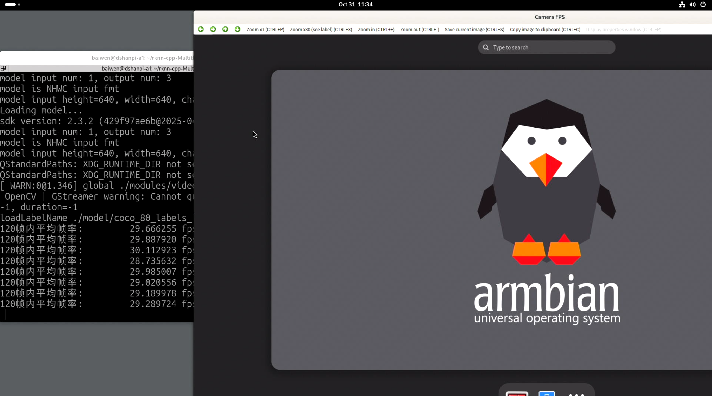

# 多线程加速推理

参考资料：

- Python：[leafqycc/rknn-multi-threaded: A simple demo of yolov5s running on rk3588/3588s using Python (about 72 frames). / 一个使用Python在rk3588/3588s上运行的yolov5s简单demo(大约72帧/s)。](https://github.com/leafqycc/rknn-multi-threaded)

## 1.YOLOV5推理

### 1.1 获取模型

进入模型目录：

```
cd ~/Projects/rknn_model_zoo/examples/yolov5/model
```

下载模型：

```
chmod +x download_model.sh
./download_model.sh
```

进入模型转换环境：

```
conda activate rknn-toolkit2
```

进入模型转换程序目录：

```
(rknn-toolkit2) baiwen@dshanpi-a1:~/Projects/rknn_model_zoo/examples/yolov5/model$ cd ../python/
(rknn-toolkit2) baiwen@dshanpi-a1:~/Projects/rknn_model_zoo/examples/yolov5/python$ ls
convert.py  yolov5.py
```

执行程序：

```
python convert.py ../model/yolov5s_relu.onnx rk3576
```

执行完成后可以在`model`目录下，看到转换完成后的`yolov5.rknn`。

修改模型测试程序`yolov5.py`，将原来的程序为：

```
        if platform in ['pytorch', 'onnx']:
            input_data = img.transpose((2,0,1))
            input_data = input_data.reshape(1,*input_data.shape).astype(np.float32)
            input_data = input_data/255.
        else:
            input_data = img
```

修改为：

```
       # preprocee if not rknn model
        if platform in ['pytorch', 'onnx']:
            input_data = img.transpose((2,0,1))
            input_data = input_data.reshape(1,*input_data.shape).astype(np.float32)
            input_data = input_data/255.
        else:
            #input_data = img
            input_data = np.expand_dims(img, 0).copy()      # [1, H, W, C]
            input_data = np.ascontiguousarray(input_data)
```

执行测试程序：

```
python yolov5.py --model_path ../model/yolov5.rknn --target rk3576 --img_show
```

运行效果：



### 1.2 多线程推理

- 下载源码工程：网盘链接 https://pan.baidu.com/s/1pUiBYfc6x4wv3phw1jcpyQ?pwd=2827 提取码: 2827

解压压缩包：

```
tar -xzvf rknn-multi-threaded.tar.gz
```

解压完成后，进入源码目录：

```
cd rknn-multi-threaded
```

下载测试视频：链接 https://pan.baidu.com/s/1NfSPEs3t2FOblPmukcqGJw?pwd=tupe 提取码: tupe

下载后放在源码目录下，如下所示：

```
baiwen@dshanpi-a1:~/rknn-multi-threaded$ ls
720p60hz.mp4  func.py  LICENSE  main.py  performance.sh  __pycache__  README.md  rkcat.sh  rknnModel  rknnpool.py
```

将`yolov5.rknn`模型拷贝至`rknnModel`目录下，如下所示：

```
baiwen@dshanpi-a1:~/rknn-multi-threaded$ ls rknnModel/
yolov5.rknn
```

运行程序：

```
python3 main.py
```

运行效果如下：



### 1.3 视频流推理

#### 1.3.1 USB 摄像头推理

修改源码，将原来的：

```
cap = cv2.VideoCapture('./720p60hz.mp4')
#cap = cv2.VideoCapture(0)
```

修改为:

```
#cap = cv2.VideoCapture('./720p60hz.mp4')
cap = cv2.VideoCapture(11)
```

> 注意：请确认您接入的USB摄像头的设备号，如果不确定可在执行 ls /dev/video* ,拔插USB摄像头确认设备号。我这里使用的是/dev/video11，所以代码中填入设备号11。

重新运行程序，运行效果：



#### 1.3.2 HDMI IN 推理

修改源码，将原来的：

```
cap = cv2.VideoCapture('./720p60hz.mp4')
#cap = cv2.VideoCapture(0)
```

修改为:

```
gst_str = (
    "v4l2src device=/dev/video0 ! "
    "video/x-raw,format=NV12,width=1920,height=1080 ! "
    "videoconvert ! "                   # NV12 → RGB
    "appsink"
)
cap = cv2.VideoCapture(gst_str, cv2.CAP_GSTREAMER)
```

重新运行程序，将另一台开发板的HDMI OUT接入开发板的HDMI IN，下面为运行效果：



## 2.YOLOV8推理

### 2.1 获取模型

​	参考《AI进阶应用》->《目标检测模型部署》章节。

### 2.2 多线程推理

- 下载源码：网盘链接 https://pan.baidu.com/s/1dkih5aXYub0elBpmQv3Fjw?pwd=41p3 提取码: 41p3

解压压缩包：

```
tar -xzvf rknn-multi-threaded-yolov8.tar.gz
```

解压完成后，进入源码目录：

```
cd rknn-multi-threaded-yolov8
```

下载测试视频：链接 https://pan.baidu.com/s/1NfSPEs3t2FOblPmukcqGJw?pwd=tupe 提取码: tupe

下载后放在源码目录下，如下所示：

```
baiwen@dshanpi-a1:~/rknn-multi-threaded-yolov8$ ls
720p60hz.mp4  func.py  LICENSE  main.py  performance.sh  __pycache__  README.md  rkcat.sh  rknnModel  rknnpool.py
```

将`yolov5.rknn`模型拷贝至`rknnModel`目录下，如下所示：

```
baiwen@dshanpi-a1:~/rknn-multi-threaded-yolov8$ ls rknnModel/
yolov8.rknn
```

运行程序：

```
python3 main.py
```

运行效果如下：



### 1.3 视频流推理

#### 1.3.1 USB 摄像头推理

修改源码，将原来的：

```
cap = cv2.VideoCapture('./720p60hz.mp4')
#cap = cv2.VideoCapture(0)
```

修改为:

```
#cap = cv2.VideoCapture('./720p60hz.mp4')
cap = cv2.VideoCapture(11)
```

> 注意：请确认您接入的USB摄像头的设备号，如果不确定可在执行 ls /dev/video* ,拔插USB摄像头确认设备号。我这里使用的是/dev/video11，所以代码中填入设备号11。

重新运行程序，运行效果：



#### 1.3.2 HDMI IN 推理

修改源码，将原来的：

```
cap = cv2.VideoCapture('./720p60hz.mp4')
#cap = cv2.VideoCapture(0)
```

修改为:

```
gst_str = (
    "v4l2src device=/dev/video0 ! "
    "video/x-raw,format=NV12,width=1920,height=1080 ! "
    "videoconvert ! "                   # NV12 → RGB
    "appsink"
)
cap = cv2.VideoCapture(gst_str, cv2.CAP_GSTREAMER)
```

重新运行程序，将另一台开发板的HDMI OUT接入开发板的HDMI IN，下面为运行效果：




## 3.C++版YOLOV5推理

- 参考资料：[leafqycc/rknn-cpp-Multithreading: A simple demo of yolov5s running on rk3588/3588s using c++ (about 142 frames). / 一个使用c++在rk3588/3588s上运行的yolov5s简单demo(142帧/s)。](https://github.com/leafqycc/rknn-cpp-Multithreading)

### 3.1 多线程推理

- 获取源码链接: https://pan.baidu.com/s/1v-Ah6N6QnhPt998-BYKAHA?pwd=228x 提取码: 228x

将源码传输至DshanPI A1端，如下所示：

```
baiwen@dshanpi-a1:~$ ls
rknn-cpp-Multithreading.tar.gz
```

解压源码：

```
tar -xzvf rknn-cpp-Multithreading.tar.gz
```

解压完成后进入源码目录：

```
cd rknn-cpp-Multithreading
```

执行编译脚本：

```
./build-linux_RK3576.sh
```

执行结果如下所示：

```
baiwen@dshanpi-a1:~/rknn-cpp-Multithreading$ ./build-linux_RK3576.sh
CMake Deprecation Warning at CMakeLists.txt:1 (cmake_minimum_required):
  Compatibility with CMake < 3.5 will be removed from a future version of
  CMake.

  Update the VERSION argument <min> value or use a ...<max> suffix to tell
  CMake that the project does not need compatibility with older versions.


-- The C compiler identification is GNU 13.3.0
-- The CXX compiler identification is GNU 13.3.0
-- Detecting C compiler ABI info
-- Detecting C compiler ABI info - done
-- Check for working C compiler: /usr/bin/aarch64-linux-gnu-gcc - skipped
-- Detecting C compile features
-- Detecting C compile features - done
-- Detecting CXX compiler ABI info
-- Detecting CXX compiler ABI info - done
-- Check for working CXX compiler: /usr/bin/aarch64-linux-gnu-g++ - skipped
-- Detecting CXX compile features
-- Detecting CXX compile features - done
-- Found OpenCV: /usr (found version "4.6.0")
-- Configuring done (1.6s)
-- Generating done (0.0s)
-- Build files have been written to: /home/baiwen/rknn-cpp-Multithreading/build/build_linux_aarch64
[ 40%] Building CXX object CMakeFiles/rknn_yolov5_demo.dir/src/rkYolov5s.cc.o
[ 40%] Building CXX object CMakeFiles/rknn_yolov5_demo.dir/src/preprocess.cc.o
[ 80%] Building CXX object CMakeFiles/rknn_yolov5_demo.dir/src/postprocess.cc.o
[ 80%] Building CXX object CMakeFiles/rknn_yolov5_demo.dir/src/main.cc.o
[100%] Linking CXX executable rknn_yolov5_demo
[100%] Built target rknn_yolov5_demo
[100%] Built target rknn_yolov5_demo
Install the project...
-- Install configuration: ""
-- Installing: /home/baiwen/rknn-cpp-Multithreading/install/rknn_yolov5_demo_Linux/./rknn_yolov5_demo
-- Installing: /home/baiwen/rknn-cpp-Multithreading/install/rknn_yolov5_demo_Linux/lib/librknnrt.so
-- Installing: /home/baiwen/rknn-cpp-Multithreading/install/rknn_yolov5_demo_Linux/lib/librga.so
-- Installing: /home/baiwen/rknn-cpp-Multithreading/install/rknn_yolov5_demo_Linux/.//model
-- Installing: /home/baiwen/rknn-cpp-Multithreading/install/rknn_yolov5_demo_Linux/.//model/coco_80_labels_list.txt
-- Installing: /home/baiwen/rknn-cpp-Multithreading/install/rknn_yolov5_demo_Linux/.//model/RK3576
-- Installing: /home/baiwen/rknn-cpp-Multithreading/install/rknn_yolov5_demo_Linux/.//model/RK3576/yolov5s-640-640.rknn
/home/baiwen/rknn-cpp-Multithreading
```

编译完成后，可以看到编译工作目录`build`和安装目录`install`:

```
baiwen@dshanpi-a1:~/rknn-cpp-Multithreading$ ls
720p60hz.mp4  build  build-linux_RK3576.sh  CMakeLists.txt  include  install  LICENSE  model  performance.sh  README.md  src
```

进入可执行程序目录：

```
cd install/rknn_yolov5_demo_Linux/
```

执行程序：

```
sudo ./rknn_yolov5_demo ./model/RK3576/yolov5s-640-640.rknn ../../720p60hz.mp4
```

运行效果如下：



### 3.2 视频流推理

#### 3.2.1 USB 摄像头推理

程序默认支持USB摄像头推理，修改执行命令即可，在终端执行：

```
sudo ./rknn_yolov5_demo ./model/RK3576/yolov5s-640-640.rknn 11
```

- 其中`11`为摄像头设备号，请确认你的摄像头的设备号,可通过拔插USB摄像头并执行 `ls /dev/video*`确定。

运行效果如下：



#### 3.2.2 HDMI IN推理

修改源码，找到`src/main.cc`文件。

1.在文件顶部增加头文件

```
#include <string>
```

2.你原来打开 `capture open` 的那几行替换成下面这段：

原来的：

```
    if (is_integer(src)) {
        int cam_idx = std::stoi(src);
        // 优先用 V4L2 后端（Linux）
        if (!capture.open(cam_idx, cv::CAP_V4L2)) {
            fprintf(stderr, "Open camera index %d failed via V4L2. 可尝试：/dev/video%d 或检查权限（加入video组）。\n", cam_idx, cam_idx);
            return -1;
        }
    } else if (src.rfind("/dev/video", 0) == 0) {
        // 传了设备文件路径
        if (!capture.open(src, cv::CAP_V4L2)) {
            fprintf(stderr, "Open device %s failed via V4L2.\n", src.c_str());
            return -1;
        }
    } else {
        // 当作文件/RTSP/GStreamer管道字符串
        if (!capture.open(src, cv::CAP_ANY)) {
            fprintf(stderr, "Open source '%s' failed.\n", src.c_str());
            return -1;
        }
    }
```

修改为：

```
cv::VideoCapture capture;

std::string gst_str =
    "v4l2src device=/dev/video0 ! "
    "video/x-raw,format=NV12,width=1920,height=1080,framerate=30/1 ! "
    "videoconvert ! video/x-raw,format=BGR ! "
    "appsink drop=1 sync=false max-buffers=2";

if (!capture.open(gst_str, cv::CAP_GSTREAMER)) {
    fprintf(stderr, "Open GStreamer pipeline failed.\n");
    return -1;
}
```

3.重新编译：

```
./build-linux_RK3576.sh
```

4.运行程序：

```
sudo ./rknn_yolov5_demo ./model/RK3576/yolov5s-640-640.rknn 0
```

运行效果：


