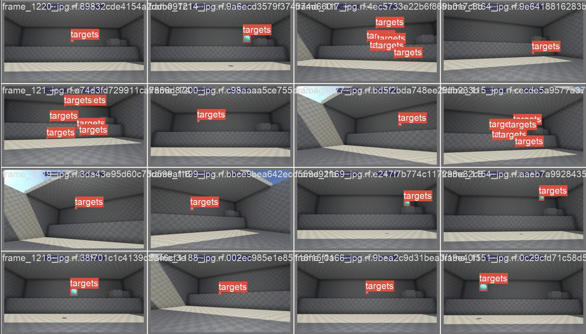
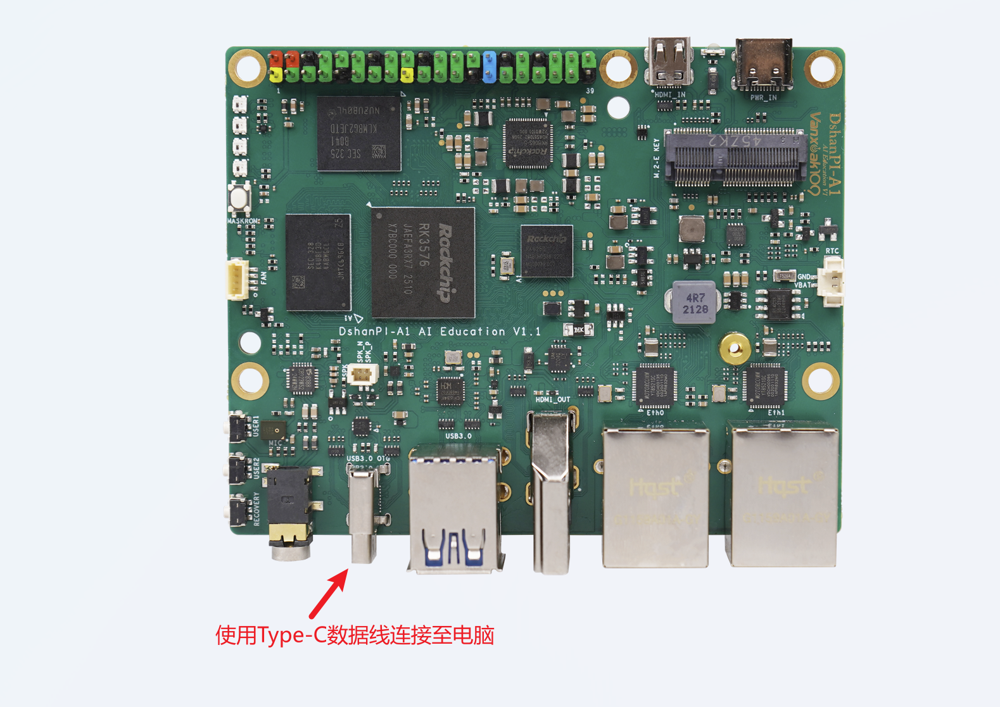
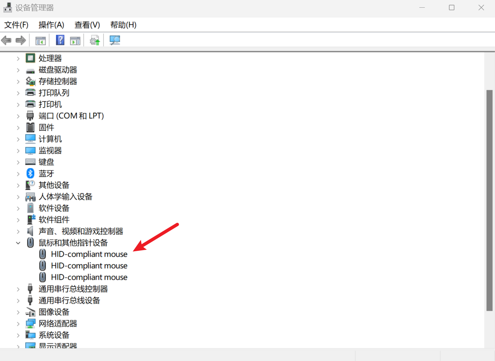

# YOLOV8+HID实现自动瞄准

​	本篇文章记录了一个从“视觉感知 → 决策与控制 → 外设执行”的完整闭环实践：以 YOLOv8 完成特定目标检测训练与端侧部署（ONNX→RKNN），通过 HDMI-IN + GStreamer/OpenCV 采集画面，在 Linux Gadget 框架下模拟 HID 鼠标，实现基于检测结果的自动瞄准与点击。内容覆盖数据集准备与训练、模型转换与推理、HID 设备创建与事件发送，以及稳定性相关的平滑、死区、节流等工程化细节，力求给出一套可复现、可调参的端到端方案。自动瞄准根本就是小菜一碟！

适读人群包括：

- 需要在嵌入式平台做实时目标检测与人机自动化联动的开发者
- 对 USB Gadget/HID、GStreamer、边缘 AI 推理有一定基础的开发者。
- 建议具备 Conda/PyTorch 基础、Linux 终端操作经验，并预先完成 RKNN 环境搭建与 HDMI/OTG 连接测试。

## 1.YOLOV8模型部署

在开始前学习《AI进阶应用》中的《目标检测模型部署》，这一小节详细描述了模型获取和模型转换部署。那么如果识别特定目标，就需要准备数据集使用YOLOV8进行模型训练。

- YOLOV8模型训练参考工程：百度网盘链接: https://pan.baidu.com/s/1cLRsPlBA8K7KJja6XtHrxw?pwd=k4yq 提取码: k4yq 

### 1.1 模型训练

> 模型训练建议使用GPU加速训练，下面教程是基于Window下使用Conda创建环境，如果您的主机不是Windows或者下面的教程无法在您的主机上实现，可在自行在网上检索`YOLOV8 模型训练`相关教程。

**1.安装AnaConda**

进入AnaConda的官网[https://www.anaconda.com/ ](https://www.anaconda.com/)，下载AnaConda安装包。

**2.搭建YOLOV8环境**

打开`Anaconda Prompt`终端，创建Python3.11的Conda环境，输入

```
conda create -n yolov8-gpu-test python=3.11
```

安装pytorch和cuda

```
conda install pytorch torchvision torchaudio pytorch-cuda=12.1 -c pytorch -c nvidia -y
```

安装yolov8依赖库

```
pip install ultralytics==8.2.0
```


**3.获取yolov8 v8.2.0源码**

```
git clone -b v8.2.0 https://github.com/ultralytics/ultralytics.git
```


**4.准备数据集**

这里以`AimLab`数据集为例,这里使用已经标注好的数据集[aimlab Dataset > Overview](https://universe.roboflow.com/darknet-arduino-serial-aim-correction-dasac/aimlab-ujx7l)。这里可使用我提前下载好的数据集：

百度网盘链接: https://pan.baidu.com/s/1H3-BO9ros8aLhWAiVCOj1g?pwd=xn87 提取码: xn87

> 如果您想使用自己的数据集进行训练，可以下载 [X-AnyLabeling](https://github.com/CVHub520/X-AnyLabeling) 完成标注，标注完成后的数据转换成yolov8官方支持的训练数据格式。

在yolov8项目同级目录下，新建datasets目录，在这个目录下新建`AimLab`目录，存放数据集文件，目录结构如下：

```
$ tree
.
|-- datasets
|   `-- AimLab
|       |-- test
|       |-- train
|       |-- valid
|-- ultralytics-8.2.0
|   |-- CITATION.cff
|   |-- CONTRIBUTING.md
|   |-- LICENSE
|   |-- README.md
|   |-- README.zh-CN.md
|   |-- docker
|   |-- docs
|   |-- examples
|   |-- mkdocs.yml
|   |-- pyproject.toml
|   |-- runs
|   |-- tests
|   |-- ultralytics
|   `-- yolov8n.pt
```

将数据集的`data.yaml`重命名`aimlab.yaml`为并放到`ultralytics/cfg/datasets/`目录下。修改`aimlab.yaml`数据集描述文件，指定数据集路径：

```
path: ../../datasets/AimLab
train: train/images
val: valid/images
test: test/images

nc: 1
names: ['targets']
```


**5.训练模型**

```
yolo detect train data=ultralytics/cfg/datasets/aimlab.yaml model=yolov8n.pt epochs=500 imgsz=640
```

训练完成后可以在`runs/detect/train*/weights`目录下看到训练完成的模型文件。以下为训练过程图片：




**6.导出ONNX模型**

安装ONNX库：

```
pip install onnx
pip install onnxruntime
pip install onnxsim
```

指定导出ONNX模型

```
yolo export model=runs/detect/train/weights/best.pt format=onnx imgsz=640
```

导出完成后可以在`runs\detect\train\weights\best.onnx`看到模型文件。


### 1.2 模型转换

> 模型转换需要使用RKNN的模型转换环境，如果之前没用搭建过RKNN环境，请参考《AI进阶应用》的《RKNN环境搭建》章节。

将训练完成并导出的ONNX模型传输至`~/Projects/rknn_model_zoo/examples/yolov8/model`目录下，使用如下命令进行模型转换

```
#进入yolov8模型转换目录
cd ~/Projects/rknn_model_zoo/examples/yolov8/python

#执行模型转换
python3 convert.py ../model/best.onnx rk3576
```

执行完成后可以在`model`目录下看到转换后的`yolov8.rknn`模型文件。

### 1.3 端侧推理

1.将`~/Projects/rknn_model_zoo/examples/yolov8/python/yolov8.py`源码中的

```
CLASSES = ("person", "bicycle", "car","motorbike ","aeroplane ","bus ","train","truck ","boat","traffic light",
           "fire hydrant","stop sign ","parking meter","bench","bird","cat","dog ","horse ","sheep","cow","elephant",
           "bear","zebra ","giraffe","backpack","umbrella","handbag","tie","suitcase","frisbee","skis","snowboard","sports ball","kite",
           "baseball bat","baseball glove","skateboard","surfboard","tennis racket","bottle","wine glass","cup","fork","knife ",
           "spoon","bowl","banana","apple","sandwich","orange","broccoli","carrot","hot dog","pizza ","donut","cake","chair","sofa",
           "pottedplant","bed","diningtable","toilet ","tvmonitor","laptop  ","mouse    ","remote ","keyboard ","cell phone","microwave ",
           "oven ","toaster","sink","refrigerator ","book","clock","vase","scissors ","teddy bear ","hair drier", "toothbrush ")
```

修改为：

```
CLASSES = ("target")
```


2.将需要推理的图片拷贝到当前目录下


2.执行推理代码：

```
python3 yolov8.py --model_path ../model/yolov8.rknn --target rk3576 --img_folder ./ --img_show
```

运行效果图如下：


## 2.模拟键鼠

开始前请提前将DshanPI A1的OTG使用Type-C数据线连接至电脑端。



### 2.1 HID模拟

1.安装依赖库：

```
sudo apt update
sudo apt install libusbgx-dev   
# 加载核心 gadget 框架
sudo modprobe libcomposite
```

2.新建脚本目录

```
sudo mkdir -p /opt/hid-gadget
```

新建脚本文件`init.sh`：

```
#!/bin/bash
# absolute.sh - Create an absolute mouse HID gadget

GADGET_DIR=/sys/kernel/config/usb_gadget/g1

# 清理旧 gadget
if [ -d "$GADGET_DIR" ]; then
    echo "Cleaning up old gadget..."
    echo "" > $GADGET_DIR/UDC 2>/dev/null
    rm -rf $GADGET_DIR
fi

# 创建 gadget
mkdir -p $GADGET_DIR
cd $GADGET_DIR

# 设置 USB ID
echo 0x1d6b > idVendor     # Linux Foundation
echo 0x0104 > idProduct    # Custom
echo 0x0100 > bcdDevice
echo 0x0200 > bcdUSB

# 创建字符串描述符
mkdir -p strings/0x409
echo "0123456789" > strings/0x409/serialnumber
echo "Test Manufacturer" > strings/0x409/manufacturer
echo "Absolute Mouse" > strings/0x409/product

# 创建配置
mkdir -p configs/c.1
mkdir -p configs/c.1/strings/0x409
echo "Config 1: HID" > configs/c.1/strings/0x409/configuration
echo 120 > configs/c.1/MaxPower

# 创建 HID 函数
mkdir -p functions/hid.usb0
echo 1 > functions/hid.usb0/protocol      # Mouse
echo 2 > functions/hid.usb0/subclass      # Boot Interface Subclass
echo 8 > functions/hid.usb0/report_length # 报告长度（字节）

# report descriptor 
echo -ne '\x05\x01\x09\x02\xa1\x01\x09\x01\xa1\x00\x05\x09\x19\x01\x29\x03\x15\x00\x25\x01\x75\x01\x95\x03\x81\x02\x75\x05\x95\x01\x81\x03\x05\x01\x09\x30\x09\x31\x15\x00\x26\xff\x7f\x75\x10\x95\x02\x81\x02\xc0\xc0' > functions/hid.usb0/report_desc

# 绑定 HID 函数到配置
ln -s functions/hid.usb0 configs/c.1/

# 激活 gadget
UDC_NAME=$(ls /sys/class/udc | head -n 1)
if [ -z "$UDC_NAME" ]; then
    echo "Error: No UDC found! Make sure your board supports USB OTG."
    exit 1
fi

echo $UDC_NAME > UDC
```

增加可执行权限：

```
sudo chmod +x /opt/hid-gadget/init.sh
```

运行脚本：

```
sudo /opt/hid-gadget/init.sh
```

增加权限：

```
sudo chmod 666 /dev/hidg0
```

运行完成后可以在电脑端的设备管理器中看到鼠标设备。



### 2.2 功能测试

新建测试程序`hid.py`：

```
#!/usr/bin/env python3
# absolute-hid.py - Test absolute HID mouse

import time
import struct
import os

HID_DEVICE = "/dev/hidg0"

# 检查设备是否存在
if not os.path.exists(HID_DEVICE):
    print(f"Error: {HID_DEVICE} does not exist. Run absolute.sh first.")
    exit(1)

# 打开设备
fd = open(HID_DEVICE, "wb")

def send_absolute(x, y, buttons=0):
    """
    发送鼠标事件
    x, y: 绝对坐标 (0 - 32767)
    buttons: 按钮状态 (bit0:left, bit1:right, bit2:middle)
    """
    # HID 报告: buttons(1) + X(2) + Y(2)
    report = struct.pack('<BHH', buttons, x, y)
    fd.write(report)
    fd.flush()

try:
    # 循环移动鼠标画一个正方形
    max_val = 32767
    step = 8000
    positions = [
        (step, step),
        (max_val-step, step),
        (max_val-step, max_val-step),
        (step, max_val-step),
        (step, step)
    ]

    while True:
        for x, y in positions:
            send_absolute(x, y)
            time.sleep(0.5)

except KeyboardInterrupt:
    print("Exiting...")

finally:
    fd.close()
```

运行程序：

```
python3 hid.py
```

运行效果：


可以看到鼠标在四边形的四个角移动。

## 3.实现自动瞄准

### 3.1 获取视频流进行推理

我们需要从HDMI IN获取视频流，所以在开始前请阅读《应用开发》->《摄像头与显示应用》->《HDMI IN与摄像头》,此章节详细描述了HDMI IN的使用。同时还需要阅读《多媒体应用》->《GStreamer与OpenCV》，此章节详细描述了在OpenCV中使用HDMI IN作为视频流输入。

> 注意：开始前请提前将HDMI IN连接至主机画面。


开始前请测试HDMI IN是否有数据流，打开终端输入：

```
baiwen@dshanpi-a1:~$ v4l2-ctl -d /dev/video0 --set-fmt-video=width=1920,height=1080,pixelformat=NV12 --stream-mmap --stream-to=camera.nv12 --stream-count=1
<
```

如果可以正常获取图像并查看生成的`camera.nv12`，如果图片正常即HDMI IN接口连接正常。


进入端侧推理目录：

```
cd ~/Projects/rknn_model_zoo/examples/yolov8/python
```

修改yolov8.py源码：

```
import os
import cv2
import sys
import argparse

# add path
realpath = os.path.abspath(__file__)
_sep = os.path.sep
realpath = realpath.split(_sep)
sys.path.append(os.path.join(realpath[0]+_sep, *realpath[1:realpath.index('rknn_model_zoo')+1]))

from py_utils.coco_utils import COCO_test_helper
import numpy as np


OBJ_THRESH = 0.25
NMS_THRESH = 0.45

# The follew two param is for map test
# OBJ_THRESH = 0.001
# NMS_THRESH = 0.65

IMG_SIZE = (640, 640)  # (width, height), such as (1280, 736)

CLASSES = ("target")

coco_id_list = [1, 2, 3, 4, 5, 6, 7, 8, 9, 10, 11, 13, 14, 15, 16, 17, 18, 19, 20, 21, 22, 23, 24, 25, 27, 28, 31, 32, 33, 34,
         35, 36, 37, 38, 39, 40, 41, 42, 43, 44, 46, 47, 48, 49, 50, 51, 52, 53, 54, 55, 56, 57, 58, 59, 60, 61, 62, 63,
         64, 65, 67, 70, 72, 73, 74, 75, 76, 77, 78, 79, 80, 81, 82, 84, 85, 86, 87, 88, 89, 90]


def filter_boxes(boxes, box_confidences, box_class_probs):
    """Filter boxes with object threshold.
    """
    box_confidences = box_confidences.reshape(-1)
    candidate, class_num = box_class_probs.shape

    class_max_score = np.max(box_class_probs, axis=-1)
    classes = np.argmax(box_class_probs, axis=-1)

    _class_pos = np.where(class_max_score* box_confidences >= OBJ_THRESH)
    scores = (class_max_score* box_confidences)[_class_pos]

    boxes = boxes[_class_pos]
    classes = classes[_class_pos]

    return boxes, classes, scores

def nms_boxes(boxes, scores):
    """Suppress non-maximal boxes.
    # Returns
        keep: ndarray, index of effective boxes.
    """
    x = boxes[:, 0]
    y = boxes[:, 1]
    w = boxes[:, 2] - boxes[:, 0]
    h = boxes[:, 3] - boxes[:, 1]

    areas = w * h
    order = scores.argsort()[::-1]

    keep = []
    while order.size > 0:
        i = order[0]
        keep.append(i)

        xx1 = np.maximum(x[i], x[order[1:]])
        yy1 = np.maximum(y[i], y[order[1:]])
        xx2 = np.minimum(x[i] + w[i], x[order[1:]] + w[order[1:]])
        yy2 = np.minimum(y[i] + h[i], y[order[1:]] + h[order[1:]])

        w1 = np.maximum(0.0, xx2 - xx1 + 0.00001)
        h1 = np.maximum(0.0, yy2 - yy1 + 0.00001)
        inter = w1 * h1

        ovr = inter / (areas[i] + areas[order[1:]] - inter)
        inds = np.where(ovr <= NMS_THRESH)[0]
        order = order[inds + 1]
    keep = np.array(keep)
    return keep

def dfl(position):
    # Distribution Focal Loss (DFL)
    #import torch
    #x = torch.tensor(position)
    #n,c,h,w = x.shape
    #p_num = 4
    #mc = c//p_num
    #y = x.reshape(n,p_num,mc,h,w)
    #y = y.softmax(2)
    #acc_metrix = torch.tensor(range(mc)).float().reshape(1,1,mc,1,1)
    #y = (y*acc_metrix).sum(2)
    #return y.numpy()
    n, c, h, w = position.shape
    p_num = 4
    mc = c // p_num

    # [N, 4, mc, H, W]
    y = position.reshape(n, p_num, mc, h, w)

    # softmax over mc
    exp_x = np.exp(y - np.max(y, axis=2, keepdims=True))
    y = exp_x / np.sum(exp_x, axis=2, keepdims=True)

    # 加权平均 (等价于 torch.arange(mc))
    acc_matrix = np.arange(mc, dtype=np.float32).reshape(1, 1, mc, 1, 1)
    y = (y * acc_matrix).sum(axis=2)  # [N, 4, H, W]

    return y


def box_process(position):
    grid_h, grid_w = position.shape[2:4]
    col, row = np.meshgrid(np.arange(0, grid_w), np.arange(0, grid_h))
    col = col.reshape(1, 1, grid_h, grid_w)
    row = row.reshape(1, 1, grid_h, grid_w)
    grid = np.concatenate((col, row), axis=1)
    stride = np.array([IMG_SIZE[1]//grid_h, IMG_SIZE[0]//grid_w]).reshape(1,2,1,1)

    position = dfl(position)
    box_xy  = grid +0.5 -position[:,0:2,:,:]
    box_xy2 = grid +0.5 +position[:,2:4,:,:]
    xyxy = np.concatenate((box_xy*stride, box_xy2*stride), axis=1)

    return xyxy

def post_process(input_data):
    boxes, scores, classes_conf = [], [], []
    defualt_branch=3
    pair_per_branch = len(input_data)//defualt_branch
    # Python 忽略 score_sum 输出
    for i in range(defualt_branch):
        boxes.append(box_process(input_data[pair_per_branch*i]))
        classes_conf.append(input_data[pair_per_branch*i+1])
        scores.append(np.ones_like(input_data[pair_per_branch*i+1][:,:1,:,:], dtype=np.float32))

    def sp_flatten(_in):
        ch = _in.shape[1]
        _in = _in.transpose(0,2,3,1)
        return _in.reshape(-1, ch)

    boxes = [sp_flatten(_v) for _v in boxes]
    classes_conf = [sp_flatten(_v) for _v in classes_conf]
    scores = [sp_flatten(_v) for _v in scores]

    boxes = np.concatenate(boxes)
    classes_conf = np.concatenate(classes_conf)
    scores = np.concatenate(scores)

    # filter according to threshold
    boxes, classes, scores = filter_boxes(boxes, scores, classes_conf)

    # nms
    nboxes, nclasses, nscores = [], [], []
    for c in set(classes):
        inds = np.where(classes == c)
        b = boxes[inds]
        c = classes[inds]
        s = scores[inds]
        keep = nms_boxes(b, s)

        if len(keep) != 0:
            nboxes.append(b[keep])
            nclasses.append(c[keep])
            nscores.append(s[keep])

    if not nclasses and not nscores:
        return None, None, None

    boxes = np.concatenate(nboxes)
    classes = np.concatenate(nclasses)
    scores = np.concatenate(nscores)

    return boxes, classes, scores


def draw(image, boxes, scores, classes):
    for box, score, cl in zip(boxes, scores, classes):
        top, left, right, bottom = [int(_b) for _b in box]
        print("%s @ (%d %d %d %d) %.3f" % (CLASSES[cl], top, left, right, bottom, score))
        cv2.rectangle(image, (top, left), (right, bottom), (255, 0, 0), 2)
        cv2.putText(image, '{0} {1:.2f}'.format(CLASSES[cl], score),
                    (top, left - 6), cv2.FONT_HERSHEY_SIMPLEX, 0.6, (0, 0, 255), 2)

def setup_model(args):
    model_path = args.model_path
    if model_path.endswith('.pt') or model_path.endswith('.torchscript'):
        platform = 'pytorch'
        from py_utils.pytorch_executor import Torch_model_container
        model = Torch_model_container(args.model_path)
    elif model_path.endswith('.rknn'):
        platform = 'rknn'
        from py_utils.rknn_executor import RKNN_model_container 
        model = RKNN_model_container(args.model_path, args.target, args.device_id)
    elif model_path.endswith('onnx'):
        platform = 'onnx'
        from py_utils.onnx_executor import ONNX_model_container
        model = ONNX_model_container(args.model_path)
    else:
        assert False, "{} is not rknn/pytorch/onnx model".format(model_path)
    print('Model-{} is {} model, starting val'.format(model_path, platform))
    return model, platform

def img_check(path):
    img_type = ['.jpg', '.jpeg', '.png', '.bmp']
    for _type in img_type:
        if path.endswith(_type) or path.endswith(_type.upper()):
            return True
    return False

if __name__ == '__main__':
    parser = argparse.ArgumentParser(description='YOLOv8-Seg Real-time Demo')
    parser.add_argument('--model_path', type=str, required=True,
                        help='model path, could be .pt or .rknn file')
    parser.add_argument('--target', type=str, default='rk3566',
                        help='target RKNPU platform')
    parser.add_argument('--device_id', type=str, default=None,
                        help='device id')
    args = parser.parse_args()

    # 1. 初始化模型
    model, platform = setup_model(args)
    print('Model ready.')

    # 2. 打开摄像头
    
    #cap = cv2.VideoCapture(0,cv2.CAP_V4L2)
    cap = cv2.VideoCapture("v4l2src device=/dev/video0 ! videoconvert ! appsink", cv2.CAP_GSTREAMER)
    if not cap.isOpened():
        print('Cannot open camera.')
        exit(-1)

    # 3. 实时循环
    while True:
        ret, frame = cap.read()
        if not ret:
            break

        h0, w0 = frame.shape[:2]

        # 3-1 LetterBox 预处理
        co_helper = COCO_test_helper(enable_letter_box=True)
        img = co_helper.letter_box(frame.copy(), IMG_SIZE, pad_color=(0, 0, 0))
        img = cv2.cvtColor(img, cv2.COLOR_BGR2RGB)
        img = np.expand_dims(img, 0)

        # 3-2 构造输入
        if platform in ['pytorch', 'onnx']:
            input_data = img.transpose(2, 0, 1).astype(np.float32) / 255.
            input_data = np.expand_dims(input_data, 0)
        else:
            input_data = img

        # 3-3 推理
        outputs = model.run([input_data])
        boxes, classes, scores = post_process(outputs)

        # 3-4 画框
        vis = frame.copy()
        if boxes is not None:
            boxes_real = co_helper.get_real_box(boxes)
            draw(vis, boxes_real, scores, classes)

        # 3-5 实时显示
        cv2.imshow('YOLOv8', vis)
        if cv2.waitKey(1) & 0xFF == ord('q'):
            break

    cap.release()
    cv2.destroyAllWindows()
    model.release()
```

运行程序获取：

```
python3 yolov8.py --model_path ../model/yolov8.rknn --target rk3576
```

运行后 HDMI OUT的电脑端可打开一张数据集的图片。


### 3.2 自瞄源码示例

```
#!/usr/bin/env python3
# -*- coding: utf-8 -*-

import os
import cv2
import sys
import argparse
import struct
import time
import numpy as np

# --------------------------------------------------
# Path setup (robust search for 'rknn_model_zoo')
# --------------------------------------------------
def append_model_zoo_root():
    try:
        here = os.path.abspath(os.path.dirname(__file__))
    except NameError:
        here = os.getcwd()
    root = here
    found = False
    while True:
        parent = os.path.dirname(root)
        if os.path.basename(root) == 'rknn_model_zoo':
            found = True
            break
        if parent == root:
            break
        root = parent
    if found:
        sys.path.append(root)
    else:
        print("Warning: 'rknn_model_zoo' not found in ancestors; relying on installed packages.")

append_model_zoo_root()

from py_utils.coco_utils import COCO_test_helper

# --------------------------------------------------
# Config
# --------------------------------------------------
OBJ_THRESH   = 0.25
NMS_THRESH   = 0.45
IMG_SIZE     = (640, 640)
CLASSES      = ("target",)

SCREEN_W, SCREEN_H = 1920, 1080

# Aim smoothing
SMOOTH_FACTOR = 0      # 0.5–0.9; lower = more responsive
DEADZONE      = 2      # Deadzone (pixels)
AIM_STEP      = 0.1    # Fraction per frame to move toward target (0–1)
CENTER_THRESH = 12     # Pixel threshold to consider centered (for click)
SEND_COOLDOWN = 0.08   # Min interval between position reports (seconds)
POS_EPS_PX    = 2      # Position change threshold (px); below = do not send

# Click cooldown
CLICK_COOLDOWN = 0.35  # Min interval between clicks (seconds)

# Absolute HID report range
ABS_MAX = 32767

# --------------------------------------------------
# HID mouse (absolute mode: <BHH>)
# --------------------------------------------------
def _clip_abs(v: int) -> int:
    return max(0, min(ABS_MAX, int(v)))

def pixels_to_abs(x_px: int, y_px: int, screen_w=SCREEN_W, screen_h=SCREEN_H):
    """
    Pixel coordinates (0..W-1, 0..H-1) → absolute coordinates (0..32767).
    Use (N-1) in the denominator so the max pixel maps to ABS_MAX.
    """
    ax = round(x_px * ABS_MAX / max(1, (screen_w - 1)))
    ay = round(y_px * ABS_MAX / max(1, (screen_h - 1)))
    return _clip_abs(ax), _clip_abs(ay)

def move_mouse_to(hid_fd, target_x_px, target_y_px, screen_w, screen_h, cur_pos, horizontal_only=False):
    """
    Move the mouse to screen pixel coordinates (absolute reports).
    cur_pos: current screen pixel position (tracking only; not sent in the report)
    """
    cx, cy = cur_pos
    tx, ty = int(target_x_px), int(target_y_px)
    if horizontal_only:
        ty = cy

    if hid_fd is None:
        mode = "H-ONLY" if horizontal_only else "FULL"
        print(f"[SIM] move [{mode}] cur=({cx},{cy}) -> tgt=({tx},{ty})")
        return (tx, ty)

    ax, ay = pixels_to_abs(tx, ty, screen_w, screen_h)
    try:
        # buttons=0 (move only; no click)
        report = struct.pack('<BHH', 0x00, ax, ay)
        hid_fd.write(report)
        hid_fd.flush()
        return (tx, ty)
    except Exception as e:
        print(f"Mouse move failed: {e}")
        return (cx, cy)

def click_mouse(hid_fd, at_x_px: int, at_y_px: int, screen_w=SCREEN_W, screen_h=SCREEN_H, press_ms=100, retries=0):
    """
    Absolute-position click: requires screen pixel coordinates.
    - press_ms: hold duration in milliseconds
    - retries: retry attempts for transient write failures
    """
    if hid_fd is None:
        print(f"[SIM] click at ({at_x_px},{at_y_px})")
        return

    ax, ay = pixels_to_abs(int(at_x_px), int(at_y_px), screen_w, screen_h)

    for attempt in range(retries + 1):
        try:
            # Left button down (bit0=1) with coordinates
            hid_fd.write(struct.pack('<BHH', 0x01, ax, ay))
            hid_fd.flush()
            time.sleep(press_ms / 1000.0)
            # Left button up
            hid_fd.write(struct.pack('<BHH', 0x00, ax, ay))
            hid_fd.flush()
            return
        except Exception as e:
            print(f"Mouse click failed (attempt {attempt+1}): {e}")
            time.sleep(0.02)

# --------------------------------------------------
# Post-processing helpers
# --------------------------------------------------
def filter_boxes(boxes, box_confidences, box_class_probs):
    # boxes: (N,4) xyxy
    # box_confidences: (N,) or (N,1..)
    # box_class_probs: (N,C)
    box_confidences = box_confidences.reshape(-1)
    class_max_score = np.max(box_class_probs, axis=-1)
    classes = np.argmax(box_class_probs, axis=-1)
    mask = class_max_score * box_confidences >= OBJ_THRESH
    scores = (class_max_score * box_confidences)[mask]
    return boxes[mask], classes[mask], scores

def nms_boxes(boxes, scores, iou_thr=NMS_THRESH):
    if boxes.size == 0:
        return np.array([], dtype=np.int64)
    x1, y1 = boxes[:, 0], boxes[:, 1]
    x2, y2 = boxes[:, 2], boxes[:, 3]
    areas = np.maximum(0, x2 - x1) * np.maximum(0, y2 - y1)
    order = scores.argsort()[::-1]
    keep = []
    while order.size > 0:
        i = order[0]
        keep.append(i)
        xx1 = np.maximum(x1[i], x1[order[1:]])
        yy1 = np.maximum(y1[i], y1[order[1:]])
        xx2 = np.minimum(x2[i], x2[order[1:]])
        yy2 = np.minimum(y2[i], y2[order[1:]])
        inter = np.maximum(0.0, xx2 - xx1) * np.maximum(0.0, yy2 - yy1)
        iou = inter / (areas[i] + areas[order[1:]] - inter + 1e-9)
        inds = np.where(iou <= iou_thr)[0]
        order = order[inds + 1]
    return np.array(keep, dtype=np.int64)

def dfl(position):
    # position: (n,c,h,w), where c = 4 * mc
    n, c, h, w = position.shape
    p_num = 4
    mc = c // p_num
    y = position.reshape(n, p_num, mc, h, w)
    exp_y = np.exp(y - np.max(y, axis=2, keepdims=True))
    y = exp_y / np.sum(exp_y, axis=2, keepdims=True)
    acc = np.arange(mc, dtype=np.float32).reshape(1, 1, mc, 1, 1)
    return (y * acc).sum(axis=2)  # (n, 4, h, w)

def box_process(position):
    # position: (n,c,h,w) where c contains 4 DFL components
    n, c, h, w = position.shape
    col, row = np.meshgrid(np.arange(w), np.arange(h))
    grid = np.concatenate([col.reshape(1, 1, h, w), row.reshape(1, 1, h, w)], axis=1)
    stride = np.array([IMG_SIZE[1] // h, IMG_SIZE[0] // w]).reshape(1, 2, 1, 1)
    position = dfl(position)  # (n,4,h,w) distances [left, top, right, bottom]
    xy1 = grid + 0.5 - position[:, :2]
    xy2 = grid + 0.5 + position[:, 2:4]
    xyxy = np.concatenate([xy1 * stride, xy2 * stride], axis=1)  # (n,4,h,w)
    return xyxy

def post_process(input_data):
    """
    Based on the "3-branch + DFL" assumption:
    input_data is ordered per branch: [box_head0, cls_head0, box_head1, cls_head1, box_head2, cls_head2, ...]
    If your model outputs differ, adapt here to:
    - decode per-cell xyxy (in the network input coordinate system)
    - obtain class logits/probabilities
    - object/confidence (use 1 if there is no explicit objectness head)
    """
    if input_data is None or len(input_data) == 0:
        return None, None, None

    # Try splitting into 3 branches by default
    branches = 3
    per_branch = max(1, len(input_data) // branches)

    boxes_list, scores_list, classes_conf_list = [], [], []

    def flatten(x):
        # (n,c,h,w) -> (h*w, c)  (n is usually 1 here)
        if x.ndim == 4:
            x = np.squeeze(x, axis=0)
            x = x.transpose(1, 2, 0).reshape(-1, x.shape[0])
        elif x.ndim == 3:
            x = x.transpose(1, 2, 0).reshape(-1, x.shape[0])
        elif x.ndim == 2:
            pass
        else:
            x = x.reshape(x.shape[0], -1)
        return x

    try:
        for i in range(branches):
            box_head = input_data[per_branch * i]
            cls_head = input_data[min(per_branch * i + 1, len(input_data)-1)]

            # box_head: (1,4*mc,h,w) → decode to (1,4,h,w), then flatten to (H*W,4)
            xyxy = box_process(box_head)  # (1,4,h,w)
            xyxy = np.squeeze(xyxy, axis=0)  # (4,h,w)
            xyxy = xyxy.transpose(1, 2, 0).reshape(-1, 4)  # (H*W,4)

            # cls_head: (1,C,h,w) or (1,(obj+cls),h,w); assume per-class scores here
            cls_flat = flatten(cls_head)  # (H*W, C)

            # If there is no objectness head, use ones as placeholders
            obj = np.ones((cls_flat.shape[0], 1), dtype=cls_flat.dtype)

            boxes_list.append(xyxy)
            classes_conf_list.append(cls_flat)
            scores_list.append(obj)

        boxes = np.concatenate(boxes_list, axis=0) if boxes_list else None
        classes_conf = np.concatenate(classes_conf_list, axis=0) if classes_conf_list else None
        scores = np.concatenate(scores_list, axis=0) if scores_list else None

        if boxes is None or classes_conf is None or scores is None:
            return None, None, None

        boxes, classes, scores = filter_boxes(boxes, scores, classes_conf)
        if boxes.size == 0:
            return None, None, None

        nboxes, nclasses, nscores = [], [], []
        for c in set(classes.tolist()):
            idx = np.where(classes == c)[0]
            b, s = boxes[idx], scores[idx]
            keep = nms_boxes(b, s)
            if keep.size:
                nboxes.append(b[keep])
                nclasses.append(classes[idx][keep])
            nscores.append(s[keep])

        if not nboxes:
            return None, None, None

        return np.concatenate(nboxes), np.concatenate(nclasses), np.concatenate(nscores)
    except Exception as e:
        print(f"post_process failed: {e}")
        return None, None, None

def draw(image, boxes, scores, classes):
    """
    boxes: (N,4) in xyxy (x1,y1,x2,y2) on original image coordinates
    """
    for box, score, cl in zip(boxes, scores, classes):
        x1, y1, x2, y2 = map(int, box)
        name = CLASSES[cl] if cl < len(CLASSES) else str(cl)
        print(f"{name} @ ({x1},{y1},{x2},{y2}) {score:.3f}")
        cv2.rectangle(image, (x1, y1), (x2, y2), (255, 0, 0), 2)
        cv2.putText(image, f"{name} {score:.2f}", (x1, max(0, y1 - 6)),
                    cv2.FONT_HERSHEY_SIMPLEX, 0.6, (0, 0, 255), 2)

# --------------------------------------------------
# Utility
# --------------------------------------------------
def map_to_screen(cx, cy, img_w, img_h, screen_w, screen_h):
    # Convert image pixel coordinates (model-input or original image) to screen pixel coordinates
    sx = int(round(cx * screen_w / img_w))
    sy = int(round(cy * screen_h / img_h))
    return sx, sy

def setup_model(args):
    path = args.model_path
    if path.endswith(('.pt', '.torchscript')):
        from py_utils.pytorch_executor import Torch_model_container
        return Torch_model_container(path), 'pytorch'
    elif path.endswith('.rknn'):
        from py_utils.rknn_executor import RKNN_model_container
        return RKNN_model_container(path, args.target, args.device_id), 'rknn'
    elif path.endswith('.onnx'):
        from py_utils.onnx_executor import ONNX_model_container
        return ONNX_model_container(path), 'onnx'
    else:
        raise ValueError(f"{path} is not a supported model")

# --------------------------------------------------
# Main
# --------------------------------------------------
def main():
    parser = argparse.ArgumentParser(description='YOLOv8 real-time aimbot (absolute HID)')
    parser.add_argument('--model_path', required=True, help='.pt / .rknn / .onnx')
    parser.add_argument('--target', default='rk3566', help='RKNPU target')
    parser.add_argument('--device_id', default=None)
    parser.add_argument('--horizontal_test', action='store_true', help='only X axis')
    parser.add_argument('--camera', default="v4l2src device=/dev/video0 ! videoconvert ! appsink",
                        help='GStreamer pipeline or numeric camera index')
    args = parser.parse_args()

    # HID device open (absolute mode)
    try:
        mouse_fd = open("/dev/hidg0", "wb")
        print("Mouse device initialized (absolute HID)")
    except Exception as e:
        print(f"Mouse device init failed: {e}")
        print("Running in simulation mode")
        mouse_fd = None

    # Model
    model, platform = setup_model(args)
    print('Model ready:', platform)

    # Camera
    if args.camera.isdigit():
        cap = cv2.VideoCapture(int(args.camera))
    else:
        cap = cv2.VideoCapture(args.camera, cv2.CAP_GSTREAMER)

    if not cap.isOpened():
        print('Failed to open camera')
        sys.exit(-1)

    # LetterBox helper (instantiate once outside the loop)
    co_helper = COCO_test_helper(enable_letter_box=True)

    # Current mouse pixel position (tracking only)
    cur_mouse = (SCREEN_W // 2, SCREEN_H // 2)
    last_target = None
    last_send_time   = 0.0
    last_sent_pos    = None  # (x, y) in screen pixels
    last_click_time  = 0.0
    last_good_target = None  # Last valid target in screen pixels

    try:
        while True:
            ret, frame = cap.read()
            if not ret:
                print("Camera read failed")
                break

            h0, w0 = frame.shape[:2]

            # ---- Preprocess (letterbox to IMG_SIZE) ----
            lb_img = co_helper.letter_box(frame, IMG_SIZE, pad_color=(0, 0, 0))
            rgb = cv2.cvtColor(lb_img, cv2.COLOR_BGR2RGB)
            inp = np.expand_dims(rgb, 0)  # (1,H,W,3)

            # Some RKNN containers normalize internally; switch here if you want a unified path
            if platform in ['pytorch', 'onnx']:
                input_data = inp.transpose(0, 3, 1, 2).astype(np.float32) / 255.0
            else:
                input_data = inp  # Keep as-is if RKNN container handles normalization internally

            # ---- Inference ----
            outputs = model.run([input_data])

            # ---- Post-process ----
            boxes, classes, scores = post_process(outputs)

            vis = frame.copy()

            if boxes is not None and len(boxes):
                # Map boxes back to original frame coordinates
                boxes_real = co_helper.get_real_box(boxes)
                draw(vis, boxes_real, scores, classes)

                # Pick a target (highest score)
                best_idx = int(np.argmax(scores))
                x1, y1, x2, y2 = boxes_real[best_idx]
                cx = (x1 + x2) / 2.0
                cy = (y1 + y2) / 2.0

                # Image coords → screen pixel coords
                target_x, target_y = map_to_screen(cx, cy, w0, h0, SCREEN_W, SCREEN_H)

                # Exponential moving average smoothing
                if last_target is None:
                    smoothed_target = (target_x, target_y)
                else:
                    smoothed_target = (
                        last_target[0] * SMOOTH_FACTOR + target_x * (1 - SMOOTH_FACTOR),
                        last_target[1] * SMOOTH_FACTOR + target_y * (1 - SMOOTH_FACTOR)
                    )
                last_target = smoothed_target
                target_x, target_y = smoothed_target
                last_good_target = (target_x, target_y)   # Record after smoothing

                # Step from current mouse position toward target by a ratio
                screen_cx, screen_cy = SCREEN_W // 2, SCREEN_H // 2  # You can use cur_mouse as the origin if preferred

                dx = target_x - screen_cx
                dy = target_y - screen_cy
                dist = np.hypot(dx, dy)
                if dist < 30:
                    AIM_STEP = 0.05
                elif dist < 80:
                    AIM_STEP = 0.10
                else:
                    AIM_STEP = np.clip(dist / 1550, 0.1, 0.12)

                # Deadzone to ignore tiny jitters
                if abs(dx) < DEADZONE and abs(dy) < DEADZONE:
                    pass  # No movement
                else:
                    # (1) Compute next screen pixel position (step + clamp to bounds)
                    move_x = int(round(cur_mouse[0] + dx * AIM_STEP))
                    move_y = int(round(cur_mouse[1] + dy * AIM_STEP))
                    move_x = max(0, min(SCREEN_W - 1, move_x))
                    move_y = max(0, min(SCREEN_H - 1, move_y))

                    # (2) Debounce + cooldown before sending report
                    now = time.time()
                    pos_changed = (
                        last_sent_pos is None or
                        abs(move_x - last_sent_pos[0]) > POS_EPS_PX or
                        abs(move_y - last_sent_pos[1]) > POS_EPS_PX
                    )

                    if pos_changed and (now - last_send_time) >= SEND_COOLDOWN:
                        cur_mouse = move_mouse_to(
                            mouse_fd, move_x, move_y, SCREEN_W, SCREEN_H, cur_mouse,
                            horizontal_only=args.horizontal_test
                        )
                        last_send_time = now
                        last_sent_pos  = (move_x, move_y)

                box_w = x2 - x1
                box_h = y2 - y1
                CENTER_THRESH = max(8, min(15, (box_w + box_h) / 4))
                if abs(dx) < CENTER_THRESH and abs(dy) < CENTER_THRESH:
                    print(f"[DEBUG] Entered click window  dx={dx:.1f} dy={dy:.1f}")
                    now = time.time()
                    if now - last_click_time >= CLICK_COOLDOWN:
                        print("[DEBUG] Cooldown passed, FIRE")
                        click_mouse(mouse_fd, int(cur_mouse[0]), int(cur_mouse[1]))
                        last_click_time = now

            else:
                print("No target detected, skip mouse move.")

            cv2.imshow('YOLOv8', vis)
            if cv2.waitKey(1) & 0xFF == ord('q'):
                break
    finally:
        cap.release()
        cv2.destroyAllWindows()
        try:
            model.release()
        except Exception:
            pass
        if mouse_fd:
            mouse_fd.close()
            print("Mouse device closed")

if __name__ == '__main__':
    main()
```

由于不同的电脑运行程序后效果可能会有所差异，可通过调整下面几个参数来实现较优效果

```
SMOOTH_FACTOR：目标坐标指数平滑系数。
DEADZONE：像素死区，小于该距离不移动，用于抑制轻微抖动。
AIM_STEP：每帧朝目标移动的比例，上限越大移动越快，易冲过目标。
CENTER_THRESH：判定“已居中”的像素半径，大于该值不触发点击。
SEND_COOLDOWN：连续两次 HID 坐标报告的最小时间间隔，越短越流畅。
POS_EPS_PX：位置变化阈值，低于该像素差不再发送报告，防止微抖。
```

如果出现移动过头或者摇头晃脑的状态，可调节`AIM_STEP`参数

```
AIM_STEP = np.clip(dist / 1550, 0.1, 0.12)
分母 1550：数值越大移动越慢，越小移动越快
下限 0.1：末段最小步长，越小越精细
上限 0.12：大距离最大步长，越小越不易冲过目标
```


### 3.3 程序运行

在HDMI OUT的电脑端运行[Aim Lab](https://aimlabs.com/)，这里使用`任务`中的`反应射击`为例。

打开DshanPI A1的终端执行：

```
python3 yolov8.py --model ../model/yolov8.rknn
```

运行效果：


运行成功后，会程序会自动检测目标，并控制鼠标移动至目标区域并射击。
