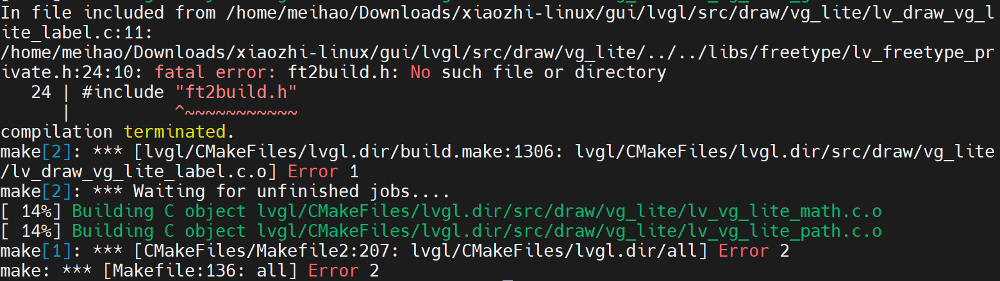
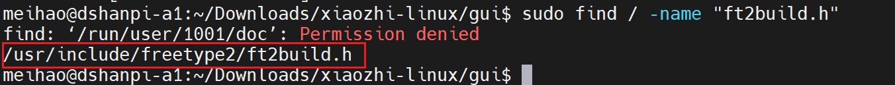
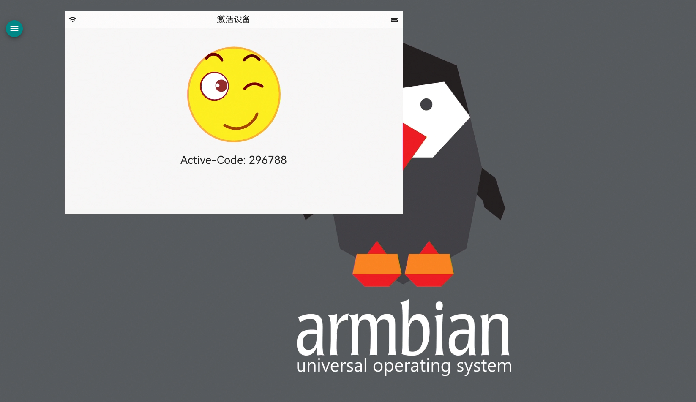
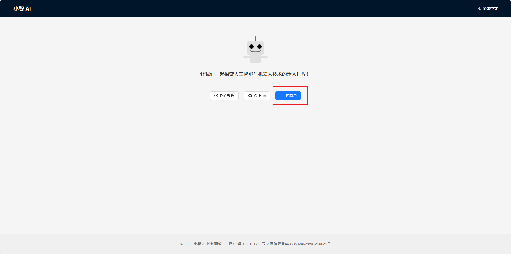
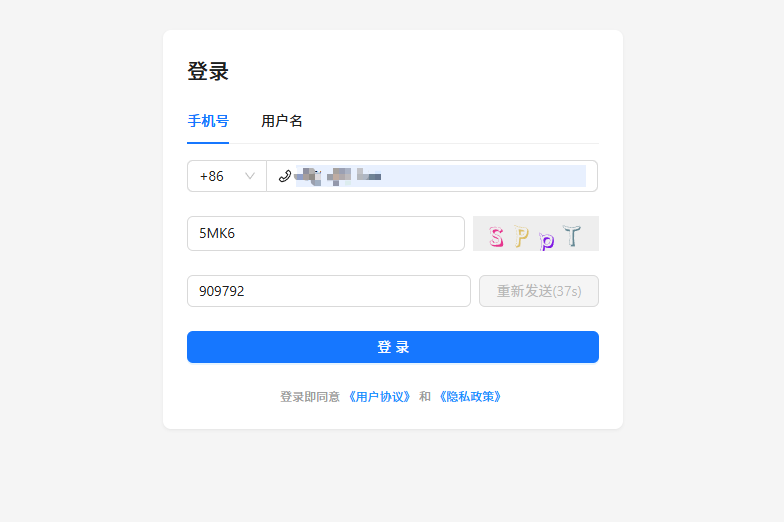
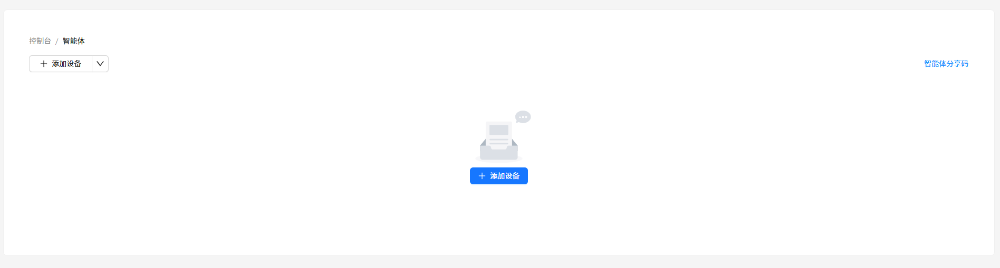
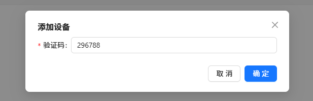
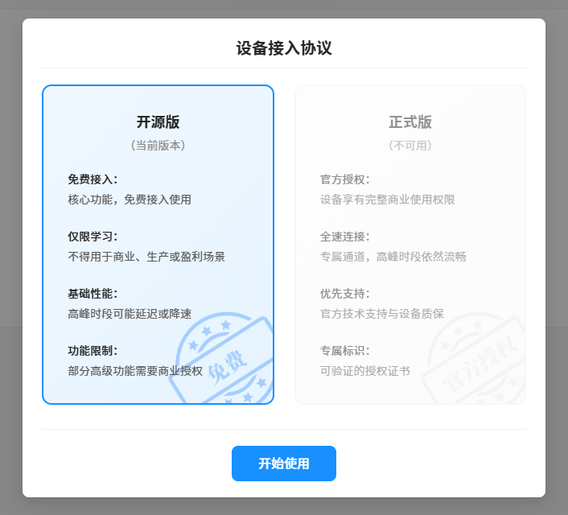
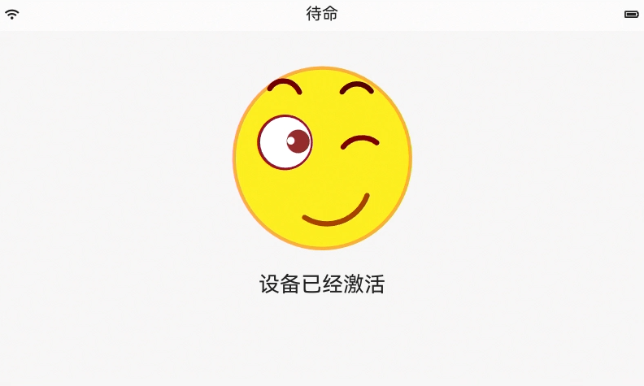

# AI小智

本章奉上 AI 小智完整源码，并手把手教你如何在 DshanPi-A1 Armbian 系统上完成编译与部署，从零到运行，一站式搞定。

AI小智源码下载链接如下：

[xiaozhi-linux.tar.gz](https://dl.100ask.net/Hardware/MPU/RK3576-DshanPi-A1/AI-xiaozhi/xiaozhi-linux.tar.gz)

## 一、项目概述

**项目名称:** xiaozhi-linux (小智Linux智能语音助手)

**开发团队:** 深圳百问网科技有限公司 

**目标平台:** Linux嵌入式设备 (主要面向DshanPi-A1) 

**许可协议:** GPL-3.0 和 MIT混合许可 

**核心功能:** 实时语音交互、云端AI语音识别与合成、图形界面显示 


## 二、系统架构

项目采用**三进程分布式架构**，通过**UDP进程间通信(IPC)**实现模块协同：


**1. control_center (核心控制中心)**

- **职责:** 系统大脑,负责业务逻辑协调
- 主要功能:
  - **设备激活:** 通过HTTP POST请求到 `api.tenclass.net`,使用UUID和MAC地址激活设备
  - **WebSocket通信:** 与云端AI服务保持长连接,实时传输语音流和控制指令
  - **状态机管理:** 维护设备状态(待机→聆听→回答等10种状态)
  - **IPC通信:** 作为中枢与GUI和音频模块双向通信
- 关键技术栈:
  - WebSocket客户端 (websocketpp库)
  - HTTP客户端
  - JSON解析 (nlohmann/json)
  - UUID生成

**2. gui (图形界面模块)**

- **职责:** 用户视觉交互界面
- **基于技术:** LVGL 9.x+ (轻量级图形库)
- 界面元素:
  - 状态栏: WiFi图标、状态文本、电池图标
  - 表情图片: 根据AI情绪动态切换(调皮、思考、搞笑等)
  - 对话文本: 显示语音识别和AI回复内容
- 关键特性:
  - 使用FreeType渲染鸿蒙字体(HarmonyOS*Sans*SC*Regular.ttf)*
  - 支持多语言配置
  - 线程安全的UI更新(lvgl_lock/unlock)

**3. sound_app (音频处理模块)**

- **职责:** 实时音频采集与播放

- 核心流程:

  `麦克风 → ALSA录音 → Opus编码 → UDP上传 → control_center control_center → UDP下发 → Opus解码 → ALSA播放 → 扬声器`

- 音频参数:

  - 采样率: 44100Hz (录音) / 16000Hz (网络传输)
  - 通道: 双声道录音 → 单声道压缩上传
  - 格式: Opus编码,每帧60ms

- 依赖库:

  - ALSA (Advanced Linux Sound Architecture)
  - Opus编解码器

##  三、通信机制

**1. UDP端口分配** (定义在`xiaozhi-linux/control_center/cfg.h`)

```
AUDIO_PORT_UP:   5676  (sound_app → control_center) 
AUDIO_PORT_DOWN: 5677  (control_center → sound_app) 
UI_PORT_UP:      5678  (gui → control_center) 
UI_PORT_DOWN:    5679  (control_center → gui)
```

**2. 消息格式** (JSON)

- **状态同步:**  `{"state": 5}` (5=kDeviceStateListening)
- **文本显示:**  `{"text": "你好,有什么可以帮到你呢?"}`
- **情绪控制:**  `{"emotion": "happy"}`
- **音频数据:**  二进制Opus流

**3. WebSocket协议**

- **连接地址:**  `wss://api.tenclass.net:443/xiaozhi/v1/`
- **认证头部:**
  - `Device-Id`: 无线网卡MAC地址
  - `Client-Id`: 本地生成的UUID
  - `Protocol-Version`: "1"
- **消息类型:**
  - `hello`（xiaozhi-linux/control_center/websocket_client.h）: 初始握手,协商音频参数
  - `listen`: 开始/停止聆听指令
  - `stt`: 语音识别结果(Speech-to-Text)
  - `tts`: 语音合成状态(Text-to-Speech)
  - `llm`: AI回复及情绪标签
  - `iot`: 设备描述符和状态上报

## 四、构建与部署

在 DshanPi-A1 Armbian 系统中编译这个项目的步骤如下：

1. **编译 control_center 模块**

~~~bash
cd control_center
sudo apt update
sudo apt install libwebsocketpp-dev libboost-all-dev libssl-dev libcurl4-openssl-dev -y
make
~~~

2. **编译 sound_app 模块**

~~~bash
cd sound_app
sudo apt update
sudo apt install libasound2-dev libopus-dev libspeexdsp-dev -y
make
~~~

3. **编译 gui 模块**

~~~bash
cd gui
sudo chmod +x build.sh
sudo apt update
sudo apt install libfreetype6-dev libsdl2-dev
./build.sh
~~~

编译过程中，如果需要了以下问题：

- 缺少 "ft2build.h"



执行 `sudo find / -name "ft2build.h"` 可以看到该头文件是存在的。



出现问题的原因是：源码中包含的头文件路径中不存在 `“freetype2”`

解决办法：

进入 `/usr/include/freetype2/`，把当前路径下内容全部移动到上一级路径：

~~~bash
cd /usr/include/freetype2/
sudo mv * ..
~~~

再重新编译即可。编译完成后，可执行程序位于 `bin/lvgl_xiaozhi` 。

4. **运行程序**

进入 `xiaozhi-linux`，执行以下指令

~~~bash
./sound_app/sound_app &
./control_center/control_center &
sudo cp ./xiaozhi /usr/share -rfvd
./gui/bin/lvgl_xiaozhi
~~~

如果不是在桌面环境下运行上面这些指令，例如，在SSH或者串口终端环境下，运行gui程序需要执行以下指令：

~~~bash
meihao@dshanpi-a1:~/Downloads/xiaozhi-linux$ export XDG_RUNTIME_DIR=/run/user/$(id -u)
meihao@dshanpi-a1:~/Downloads/xiaozhi-linux$ export WAYLAND_DISPLAY=wayland-0
meihao@dshanpi-a1:~/Downloads/xiaozhi-linux$ sudo systemd-run --collect --uid=$(loginctl show-session 3 -p Name --value) \
  --setenv=XDG_RUNTIME_DIR=$XDG_RUNTIME_DIR \
  --setenv=WAYLAND_DISPLAY=$WAYLAND_DISPLAY \
  --slice=user-$(id -u).slice \
  --pty \
  --working-directory=/home/meihao/Downloads/xiaozhi-linux \
  ./gui/bin/lvgl_xiaozhi
~~~

桌面便会出现gui窗口：



`Activation Code: 296788` 是设备激活码，我们需要前往 [小智控制台](https://xiaozhi.me/) 激活设备，操作步骤如下：

① **点击 `控制台`**



② **登录账号**



③ **添加设备**



④ **输入设备激活码**



⑥ **使用开源版本**



即可看到设备已经激活



激活成功后，就可以开始和你的小智进行激情聊天了。

