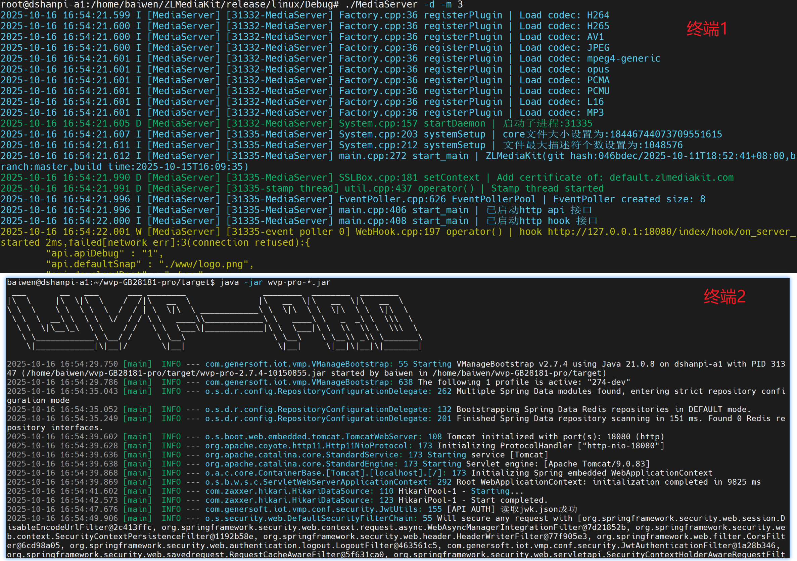
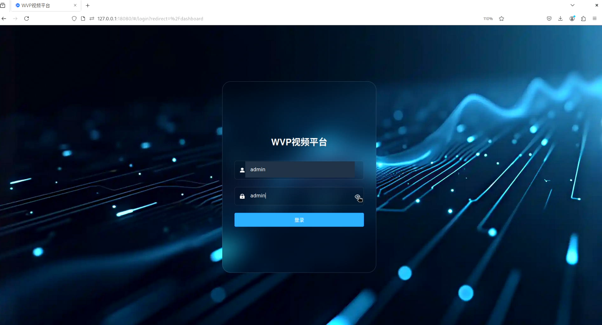
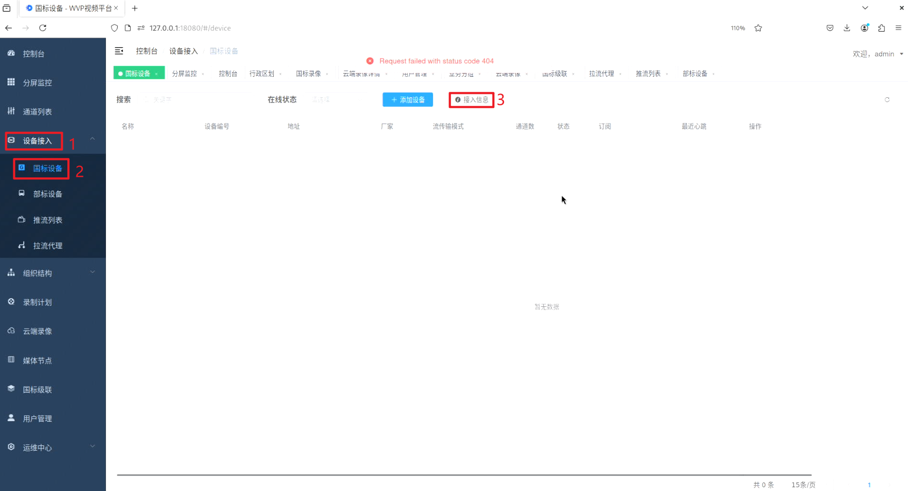
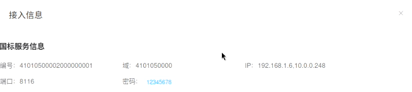
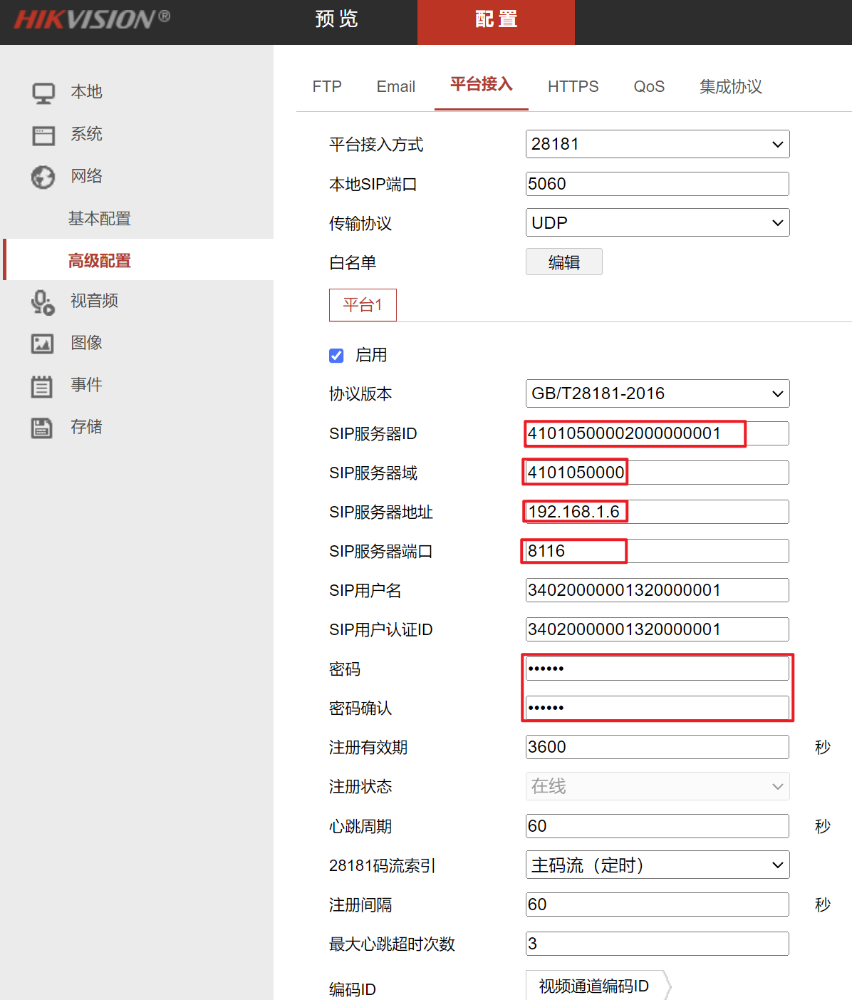
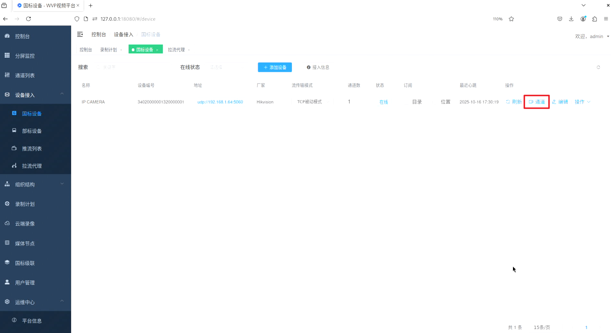
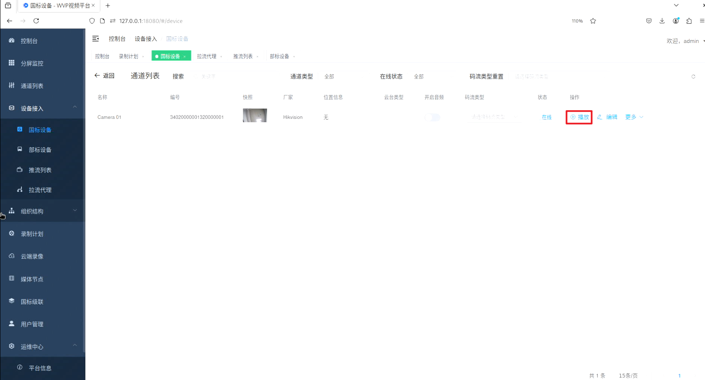
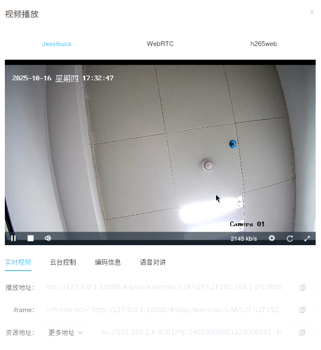

# 网络视频平台部署

参考链接：

- [WVP-PRO文档](https://doc.wvp-pro.cn/#/)
- [ZLM使用文档](https://github.com/ZLMediaKit/ZLMediaKit)

​	WEB VIDEO PLATFORM是一个基于GB28181-2016、部标808、部标1078标准实现的开箱即用的网络视频平台，负责实现核心信令与设备管理后台部分，支持NAT穿透，支持海康、大华、宇视等品牌的IPC、NVR接入。支持国标级联，支持将不带国标功能的摄像机/直播流/直播推流转发到其他国标平台。

​	ZLMediaKit 是一个基于 C++11 打造的高性能、可商用级的流媒体框架与服务器，既能作为标准 C API/多语言封装（Java/C# 等）的 SDK 嵌入业务，也能直接以自带的 MediaServer 开箱部署；它采用多线程与异步网络 IO 设计，强调稳定与极致性能，支持 RTSP/RTMP/HLS/HTTP-FLV/WebSocket-FLV/HTTP-TS/WebSocket-TS/HTTP-fMP4/WebSocket-fMP4/MP4/WebRTC/GB28181 等多协议并实现灵活互转，覆盖 H264/H265/AAC/G711/OPUS/MP3 等主流编解码和多轨道模式.

​	那么把一台台摄像头稳定地搬到浏览器里，其实离不开两块“基石”：WVP-GB28181-Pro 负责国标/部标的信令与设备管理，ZLMediaKit 负责音视频的收、转、发与多协议分发。前者让海康、大华、宇视等设备统一说话，后者让 RTSP/RTMP/HLS/WebRTC 等各端顺畅取流。

​	这篇文章按“能复现、好排障”的思路展开：从环境与依赖，到 ZLM 编译与配置、WVP 前后端构建与数据库初始化，再到 secret 对齐、端口与网段、RTP 多端口/TCP-Active、分屏播放等常见问题的定位与修复。本文作为部署参考，阅读文档你会得到一套可商用、可扩展的网络视频平台：能接、能看、能录、能回放，也能级联到上级平台，既开箱即用，又便于长期运维。

## 1.环境搭建

1.安装基础依赖

```
sudo apt update
sudo apt-get install -y openjdk-11-jre git maven nodejs npm
```

2.安装mysql

```
sudo apt install -y mysql-server
sudo systemctl enable --now mysql
sudo systemctl status mysql
```

3.安装redis

```
sudo apt install -y redis-server
sudo systemctl enable --now redis-server
sudo systemctl status redis-server
```


## 2.编译ZLMediaKit·

### 2.1 编译

下载源码：

```
# 国内用户推荐从同步镜像网站gitee下载 
git clone --depth 1 https://gitee.com/xia-chu/ZLMediaKit
cd ZLMediaKit
# 千万不要忘记执行这句命令
git submodule update --init
```

安装编译器：

```
sudo apt-get install build-essential
sudo apt-get install cmake
```

安装依赖库：

```
sudo apt-get install libssl-dev -y
sudo apt-get install libsdl-dev -y
sudo apt-get install libavcodec-dev -y
sudo apt-get install libavutil-dev -y
sudo apt-get install ffmpeg -y
```

构建与编译项目：

```
mkdir build
cd build
cmake ..
make -j4
```


<details>
<summary>构建与编译过程 </summary>
<div>

```

baiwen@dshanpi-a1:~/ZLMediaKit$ mkdir build
baiwen@dshanpi-a1:~/ZLMediaKit$ cd build
baiwen@dshanpi-a1:~/ZLMediaKit/build$ cmake ..
CMake Deprecation Warning at CMakeLists.txt:24 (cmake_minimum_required):
  Compatibility with CMake < 3.5 will be removed from a future version of
  CMake.

  Update the VERSION argument <min> value or use a ...<max> suffix to tell
  CMake that the project does not need compatibility with older versions.


-- The C compiler identification is GNU 13.3.0
-- The CXX compiler identification is GNU 13.3.0
-- Detecting C compiler ABI info
-- Detecting C compiler ABI info - done
-- Check for working C compiler: /usr/bin/cc - skipped
-- Detecting C compile features
-- Detecting C compile features - done
-- Detecting CXX compiler ABI info
-- Detecting CXX compiler ABI info - done
-- Check for working CXX compiler: /usr/bin/c++ - skipped
-- Detecting CXX compile features
...
baiwen@dshanpi-a1:~/ZLMediaKit/build$ make -j4
/usr/bin/cmake -S/home/baiwen/ZLMediaKit -B/home/baiwen/ZLMediaKit/build --check-build-system CMakeFiles/Makefile.cmake 0
/usr/bin/cmake -E cmake_progress_start /home/baiwen/ZLMediaKit/build/CMakeFiles /home/baiwen/ZLMediaKit/build//CMakeFiles/progress.marks
make  -f CMakeFiles/Makefile2 all
make[1]: Entering directory '/home/baiwen/ZLMediaKit/build'
make  -f 3rdpart/CMakeFiles/jsoncpp.dir/build.make 3rdpart/CMakeFiles/jsoncpp.dir/depend
make  -f 3rdpart/CMakeFiles/mov.dir/build.make 3rdpart/CMakeFiles/mov.dir/depend
make  -f 3rdpart/CMakeFiles/flv.dir/build.make 3rdpart/CMakeFiles/flv.dir/depend
make  -f 3rdpart/CMakeFiles/mpeg.dir/build.make 3rdpart/CMakeFiles/mpeg.dir/depend
make[2]: Entering directory '/home/baiwen/ZLMediaKit/build'
...

make[2]: Leaving directory '/home/baiwen/ZLMediaKit/build'
make  -f api/tests/CMakeFiles/api_tester_websocket.dir/build.make api/tests/CMakeFiles/api_tester_websocket.dir/build
make[2]: Entering directory '/home/baiwen/ZLMediaKit/build'
[ 99%] Built target api_tester_h264_pusher
[ 99%] Building C object api/tests/CMakeFiles/api_tester_websocket.dir/websocket.c.o
cd /home/baiwen/ZLMediaKit/build/api/tests && /usr/bin/cc -DENABLE_HLS -DENABLE_MP4 -DENABLE_OPENSSL -DENABLE_RTPPROXY -DENABLE_SRT -DENABLE_VERSION -DHAVE_MMSG_HDR -DHAVE_RECVMMSG_API -DHAVE_SENDMMSG_API -I/home/baiwen/ZLMediaKit/build -I/home/baiwen/ZLMediaKit/3rdpart -I/home/baiwen/ZLMediaKit/build/api -I/home/baiwen/ZLMediaKit/api/include -I/home/baiwen/ZLMediaKit/3rdpart/jsoncpp/include -I/home/baiwen/ZLMediaKit/3rdpart/media-server/libflv/include -I/home/baiwen/ZLMediaKit/3rdpart/media-server/libmov/include -I/home/baiwen/ZLMediaKit/3rdpart/media-server/libmpeg/include -I/home/baiwen/ZLMediaKit/3rdpart/ZLToolKit/src -I/home/baiwen/ZLMediaKit/src -I/home/baiwen/ZLMediaKit/ext-codec/.. -I/home/baiwen/ZLMediaKit/srt -I/home/baiwen/ZLMediaKit/srt/.. -g -fPIC -Wall -Wextra -Wno-unused-function -Wno-unused-parameter -Wno-unused-variable -Wno-deprecated-declarations -Wno-error=extra -Wno-error=missing-field-initializers -Wno-error=type-limits -Wno-comment -g3 -MD -MT api/tests/CMakeFiles/api_tester_websocket.dir/websocket.c.o -MF CMakeFiles/api_tester_websocket.dir/websocket.c.o.d -o CMakeFiles/api_tester_websocket.dir/websocket.c.o -c /home/baiwen/ZLMediaKit/api/tests/websocket.c
[ 99%] Linking CXX executable /home/baiwen/ZLMediaKit/release/linux/Debug/api_tester_server
[100%] Linking CXX executable /home/baiwen/ZLMediaKit/release/linux/Debug/api_tester_websocket
cd /home/baiwen/ZLMediaKit/build/api/tests && /usr/bin/cmake -E cmake_link_script CMakeFiles/api_tester_server.dir/link.txt --verbose=1
cd /home/baiwen/ZLMediaKit/build/api/tests && /usr/bin/cmake -E cmake_link_script CMakeFiles/api_tester_websocket.dir/link.txt --verbose=1
/usr/bin/c++ -g -rdynamic CMakeFiles/api_tester_websocket.dir/websocket.c.o -o /home/baiwen/ZLMediaKit/release/linux/Debug/api_tester_websocket  -Wl,-rpath,/home/baiwen/ZLMediaKit/release/linux/Debug /home/baiwen/ZLMediaKit/release/linux/Debug/libmk_api.so -Wl,--start-group /home/baiwen/ZLMediaKit/release/linux/Debug/libext-codec.a /home/baiwen/ZLMediaKit/release/linux/Debug/libsrt.a /home/baiwen/ZLMediaKit/release/linux/Debug/libzlmediakit.a -lssl -lcrypto -lpthread /home/baiwen/ZLMediaKit/release/linux/Debug/libjsoncpp.a /home/baiwen/ZLMediaKit/release/linux/Debug/libflv.a /home/baiwen/ZLMediaKit/release/linux/Debug/libmov.a /home/baiwen/ZLMediaKit/release/linux/Debug/libmpeg.a /home/baiwen/ZLMediaKit/release/linux/Debug/libzltoolkit.a -Wl,--end-group
/usr/bin/c++ -g -rdynamic CMakeFiles/api_tester_server.dir/server.c.o -o /home/baiwen/ZLMediaKit/release/linux/Debug/api_tester_server  -Wl,-rpath,/home/baiwen/ZLMediaKit/release/linux/Debug /home/baiwen/ZLMediaKit/release/linux/Debug/libmk_api.so -Wl,--start-group /home/baiwen/ZLMediaKit/release/linux/Debug/libext-codec.a /home/baiwen/ZLMediaKit/release/linux/Debug/libsrt.a /home/baiwen/ZLMediaKit/release/linux/Debug/libzlmediakit.a -lssl -lcrypto -lpthread /home/baiwen/ZLMediaKit/release/linux/Debug/libjsoncpp.a /home/baiwen/ZLMediaKit/release/linux/Debug/libflv.a /home/baiwen/ZLMediaKit/release/linux/Debug/libmov.a /home/baiwen/ZLMediaKit/release/linux/Debug/libmpeg.a /home/baiwen/ZLMediaKit/release/linux/Debug/libzltoolkit.a -Wl,--end-group
make[2]: Leaving directory '/home/baiwen/ZLMediaKit/build'
make[2]: Leaving directory '/home/baiwen/ZLMediaKit/build'
[100%] Built target api_tester_server
[100%] Built target api_tester_websocket
make[1]: Leaving directory '/home/baiwen/ZLMediaKit/build'
/usr/bin/cmake -E cmake_progress_start /home/baiwen/ZLMediaKit/build/CMakeFiles 0
```

</div>
</details>


进入二进制目标文件目录：

```
cd ../ && cd release/linux/Debug
```

可以看到如下目录：

```
baiwen@dshanpi-a1:~/ZLMediaKit/build$ cd ../ && cd release/linux/Debug
baiwen@dshanpi-a1:~/ZLMediaKit/release/linux/Debug$ ls
api_tester_h264_media_server  api_tester_websocket  libflv.a      libsrt.a         test_bench_forward  test_httpApi     test_pusherMp4  test_wsServer
api_tester_h264_pusher        bom                   libjsoncpp.a  libzlmediakit.a  test_bench_proxy    test_httpClient  test_rtp        www
api_tester_httpclient         config.ini            libmk_api.so  libzltoolkit.a   test_bench_pull     test_http_head   test_server
api_tester_pusher             default.pem           libmov.a      MediaServer      test_bench_push     test_ps          test_sortor
api_tester_server             libext-codec.a        libmpeg.a     tab              test_flv            test_pusher      test_wsClient
```

打开`config.ini`配置文件：

```
[api]
apiDebug=1
defaultSnap=./www/logo.png
downloadRoot=./www
secret=T7vwC5TF0GFge71RO1HRSHDNIjqkCs3N
snapRoot=./www/snap/
[http]
allow_cross_domains=1
allow_ip_range=::1,127.0.0.1,172.16.0.0-172.31.255.255,192.168.0.0-192.168.255.255,10.0.0.0-10.255.255.255
charSet=utf-8
dirMenu=1
forbidCacheSuffix=
forwarded_ip_header=
keepAliveSecond=30
maxReqSize=40960
notFound=<html><head><title>404 Not Found</title></head><body bgcolor="white"><center><h1>您访问的资源不存在！</h1></center><hr><center>ZLMediaKit(git hash:046bdec/2025-10-11T18:52:41+08:00,branch:master,build time:2025-10-15T16:09:35)</center></body></html>
port=80
rootPath=./www
sendBufSize=65536
sslport=443
virtualPath=
[general]
broadcast_player_count_changed=0
check_nvidia_dev=1
enableVhost=0
enable_ffmpeg_log=0
flowThreshold=1024
listen_ip=::
maxStreamWaitMS=15000
mediaServerId=your_server_id
mergeWriteMS=0
resetWhenRePlay=1
streamNoneReaderDelayMS=20000
unready_frame_cache=100
wait_add_track_ms=3000
wait_audio_track_data_ms=1000
wait_track_ready_ms=10000
```

请记住配置文件中的`secret`和`port`。将其中的secret修改为

```
secret=TWSYFgYJOQWB4ftgeYut8DW4wbs7pQnj
```

将其中的`mediaServerId`修改为：

```
mediaServerId=zlmediakit-local
```

将其中的`listen_ip`修改为：

```
listen_ip=0.0.0.0
```


### 2.2 运行

1.进入root环境

```
su
```


2.启动MediaServer进程

```
#通过-h可以了解启动参数
./MediaServer -h
#以守护进程模式启动
./MediaServer -d
```


## 3.编译WVP-PRO

获取WVP-PRO源码

```
git clone https://github.com/648540858/wvp-GB28181-pro.git
```

### 3.1 编译前端页面

进入项目里的前端子目录，使用 npm 安装当前目录的依赖，进行生产环境打包。

```
cd wvp-GB28181-pro/web/
npm --registry=https://registry.npmmirror.com install
npm run build:prod
```

<details>
<summary>npm install 运行效果 </summary>
<div>

```
baiwen@dshanpi-a1:~/wvp-GB28181-pro/web$ npm --registry=https://registry.npmmirror.com install
npm WARN EBADENGINE Unsupported engine {
npm WARN EBADENGINE   package: '@achrinza/node-ipc@9.2.2',
npm WARN EBADENGINE   required: { node: '8 || 10 || 12 || 14 || 16 || 17' },
npm WARN EBADENGINE   current: { node: 'v18.19.1', npm: '9.2.0' }
npm WARN EBADENGINE }
npm WARN deprecated stable@0.1.8: Modern JS already guarantees Array#sort() is a stable sort, so this library is deprecated. See the compatibility table on MDN: https://developer.mozilla.org/en-US/docs/Web/JavaScript/Reference/Global_Objects/Array/sort#browser_compatibility
npm WARN deprecated source-map-url@0.4.1: See https://github.com/lydell/source-map-url#deprecated
npm WARN deprecated urix@0.1.0: Please see https://github.com/lydell/urix#deprecated
npm WARN deprecated har-validator@5.1.5: this library is no longer supported
npm WARN deprecated request-promise-native@1.0.9: request-promise-native has been deprecated because it extends the now deprecated request package, see https://github.com/request/request/issues/3142
npm WARN deprecated resolve-url@0.2.1: https://github.com/lydell/resolve-url#deprecated
npm WARN deprecated @types/minimatch@6.0.0: This is a stub types definition. minimatch provides its own type definitions, so you do not need this installed.
npm WARN deprecated abab@2.0.6: Use your platform's native atob() and btoa() methods instead
npm WARN deprecated move-concurrently@1.0.1: This package is no longer supported.
npm WARN deprecated domexception@1.0.1: Use your platform's native DOMException instead
npm WARN deprecated @hapi/topo@3.1.6: This version has been deprecated and is no longer supported or maintained
npm WARN deprecated @hapi/bourne@1.3.2: This version has been deprecated and is no longer supported or maintained
npm WARN deprecated inflight@1.0.6: This module is not supported, and leaks memory. Do not use it. Check out lru-cache if you want a good and tested way to coalesce async requests by a key value, which is much more comprehensive and powerful.
npm WARN deprecated copy-concurrently@1.0.5: This package is no longer supported.
npm WARN deprecated rimraf@2.7.1: Rimraf versions prior to v4 are no longer supported
npm WARN deprecated figgy-pudding@3.5.2: This module is no longer supported.
npm WARN deprecated q@1.5.1: You or someone you depend on is using Q, the JavaScript Promise library that gave JavaScript developers strong feelings about promises. They can almost certainly migrate to the native JavaScript promise now. Thank you literally everyone for joining me in this bet against the odds. Be excellent to each other.
npm WARN deprecated
npm WARN deprecated (For a CapTP with native promises, see @endo/eventual-send and @endo/captp)
npm WARN deprecated @babel/plugin-proposal-class-properties@7.18.6: This proposal has been merged to the ECMAScript standard and thus this plugin is no longer maintained. Please use @babel/plugin-transform-class-properties instead.
npm WARN deprecated eslint-loader@2.2.1: This loader has been deprecated. Please use eslint-webpack-plugin
npm WARN deprecated source-map-resolve@0.5.3: See https://github.com/lydell/source-map-resolve#deprecated
npm WARN deprecated rimraf@2.6.3: Rimraf versions prior to v4 are no longer supported
npm WARN deprecated consolidate@0.15.1: Please upgrade to consolidate v1.0.0+ as it has been modernized with several long-awaited fixes implemented. Maintenance is supported by Forward Email at https://forwardemail.net ; follow/watch https://github.com/ladjs/consolidate for updates and release changelog
npm WARN deprecated left-pad@1.3.0: use String.prototype.padStart()
npm WARN deprecated glob@7.2.3: Glob versions prior to v9 are no longer supported
npm WARN deprecated w3c-hr-time@1.0.2: Use your platform's native performance.now() and performance.timeOrigin.
npm WARN deprecated fs-write-stream-atomic@1.0.10: This package is no longer supported.
npm WARN deprecated html-webpack-plugin@3.2.0: 3.x is no longer supported
npm WARN deprecated sane@4.1.0: some dependency vulnerabilities fixed, support for node < 10 dropped, and newer ECMAScript syntax/features added
npm WARN deprecated babel-eslint@10.1.0: babel-eslint is now @babel/eslint-parser. This package will no longer receive updates.
npm WARN deprecated uuid@3.4.0: Please upgrade  to version 7 or higher.  Older versions may use Math.random() in certain circumstances, which is known to be problematic.  See https://v8.dev/blog/math-random for details.
npm WARN deprecated @hapi/address@2.1.4: Moved to 'npm install @sideway/address'
npm WARN deprecated webpack-chain@6.5.1: Package no longer supported. Contact Support at https://www.npmjs.com/support for more info.
npm WARN deprecated @hapi/hoek@8.5.1: This version has been deprecated and is no longer supported or maintained
npm WARN deprecated request@2.88.2: request has been deprecated, see https://github.com/request/request/issues/3142
npm WARN deprecated @hapi/joi@15.1.1: Switch to 'npm install joi'
npm WARN deprecated svgo@1.2.2: This SVGO version is no longer supported. Upgrade to v2.x.x.
npm WARN deprecated vue@2.6.10: Vue 2 has reached EOL and is no longer actively maintained. See https://v2.vuejs.org/eol/ for more details.
npm WARN deprecated vue@2.6.11: Vue 2 has reached EOL and is no longer actively maintained. See https://v2.vuejs.org/eol/ for more details.
npm WARN deprecated eslint@6.7.2: This version is no longer supported. Please see https://eslint.org/version-support for other options.
npm WARN deprecated core-js@2.6.12: core-js@<3.23.3 is no longer maintained and not recommended for usage due to the number of issues. Because of the V8 engine whims, feature detection in old core-js versions could cause a slowdown up to 100x even if nothing is polyfilled. Some versions have web compatibility issues. Please, upgrade your dependencies to the actual version of core-js.
npm WARN deprecated core-js@3.6.5: core-js@<3.23.3 is no longer maintained and not recommended for usage due to the number of issues. Because of the V8 engine whims, feature detection in old core-js versions could cause a slowdown up to 100x even if nothing is polyfilled. Some versions have web compatibility issues. Please, upgrade your dependencies to the actual version of core-js.

added 1935 packages in 3m

171 packages are looking for funding
  run `npm fund` for details
```

</div>
</details>

<details>
<summary>npm build 运行效果</summary>
<div>

```
baiwen@dshanpi-a1:~/wvp-GB28181-pro/web$ npm run build:prod

> vue-admin-template@4.4.0 build:prod
> vue-cli-service build


⠴  Building for production...

 WARNING  Compiled with 2 warnings                                                                                                                    下午4:51:39

 warning

asset size limit: The following asset(s) exceed the recommended size limit (244 KiB).
This can impact web performance.
Assets:
  static/js/chunk-0ff5d20c.2415b3c2.js (303 KiB)
  static/js/chunk-485a5cd6.19413fe1.js (251 KiB)
  static/js/chunk-5f8d388e.0cf4e838.js (437 KiB)
  static/js/chunk-b642199a.549afc6a.js (338 KiB)
  static/js/chunk-elementUI.bf44d8ef.js (754 KiB)
  static/js/chunk-libs.b9fae914.js (995 KiB)
  static/js/h265web/missile.js (325 KiB)
  static/js/ZLMRTCClient.js (266 KiB)
  static/js/h265web/h265webjs-v20221106.js (1.25 MiB)
  static/js/jessibuca/decoder.wasm (1 MiB)
  libDecoder.wasm (2.28 MiB)
  static/js/h265web/missile-v20221120.wasm (2.01 MiB)
  static/images/bg19.png (3.01 MiB)

 warning

entrypoint size limit: The following entrypoint(s) combined asset size exceeds the recommended limit (244 KiB). This can impact web performance.
Entrypoints:
  app (2.11 MiB)
      static/css/chunk-elementUI.c1c3b808.css
      static/js/chunk-elementUI.bf44d8ef.js
      static/css/chunk-libs.da744d2b.css
      static/js/chunk-libs.b9fae914.js
      static/css/app.b826f8b9.css
      static/js/app.7a07b4f5.js


  File                                      Size             Gzipped

  ../src/main/resources/static/static/js    1279.63 KiB      317.84 KiB
  /h265web/h265webjs-v20221106.js
  ../src/main/resources/static/static/js    994.82 KiB       318.98 KiB
  /chunk-libs.b9fae914.js
  ../src/main/resources/static/static/js    754.13 KiB       193.54 KiB
  /chunk-elementUI.bf44d8ef.js
  ../src/main/resources/static/static/js    437.28 KiB       147.97 KiB
  /chunk-5f8d388e.0cf4e838.js
  ../src/main/resources/static/static/js    337.73 KiB       112.93 KiB
  /chunk-b642199a.549afc6a.js
  ../src/main/resources/static/static/js    324.78 KiB       56.38 KiB
  /h265web/missile.js
  ../src/main/resources/static/static/js    303.08 KiB       77.90 KiB
  /chunk-0ff5d20c.2415b3c2.js
  ../src/main/resources/static/static/js    265.94 KiB       57.22 KiB
  /ZLMRTCClient.js
  ../src/main/resources/static/static/js    251.15 KiB       44.80 KiB
  /chunk-485a5cd6.19413fe1.js
  ../src/main/resources/static/static/js    212.55 KiB       73.37 KiB
  /jessibuca/jessibuca.js
  ../src/main/resources/static/static/js    166.81 KiB       54.96 KiB
  /chunk-2d0e4fee.2e0e4b40.js
  ../src/main/resources/static/static/js    144.56 KiB       32.33 KiB
  /app.7a07b4f5.js
  ../src/main/resources/static/static/js    107.19 KiB       36.14 KiB
  /jessibuca/decoder.js
  ../src/main/resources/static/static/js    89.92 KiB        18.51 KiB
  /chunk-5c52f93f.c6feaff2.js
  ../src/main/resources/static/static/js    78.31 KiB        15.87 KiB
  /chunk-03885090.4334fa75.js
  ../src/main/resources/static/static/js    70.80 KiB        14.52 KiB
  /chunk-6bf15dac.e812eec8.js
  ../src/main/resources/static/static/js    64.81 KiB        13.69 KiB
  /chunk-4cadd9ba.e0ae2221.js
  ../src/main/resources/static/static/js    58.25 KiB        12.61 KiB
  /chunk-d20e86a2.01b655ee.js
  ../src/main/resources/static/static/js    43.27 KiB        14.24 KiB
  /chunk-02f6c073.59cc5720.js
  ../src/main/resources/static/static/js    36.74 KiB        9.78 KiB
  /chunk-1efaead5.a560f92b.js
  ../src/main/resources/static/static/js    34.76 KiB        7.26 KiB
  /chunk-625ddceb.a56df8a3.js
  ../src/main/resources/static/static/js    34.18 KiB        9.02 KiB
  /chunk-46f68df1.b1f89100.js
  ../src/main/resources/static/static/js    31.40 KiB        7.56 KiB
  /chunk-0ff966be.c749fbe6.js
  ../src/main/resources/static/static/js    29.81 KiB        6.50 KiB
  /chunk-675011ec.e9b277bc.js
  ../src/main/resources/static/static/js    29.36 KiB        6.77 KiB
  /chunk-ae23c5e4.01e6e74d.js
  ../src/main/resources/static/static/js    26.31 KiB        7.29 KiB
  /chunk-592de512.18537e2e.js
  ../src/main/resources/static/static/js    20.93 KiB        5.17 KiB
  /chunk-4a77eaae.80b7bad3.js
  ../src/main/resources/static/static/js    18.70 KiB        4.34 KiB
  /chunk-cc032ec0.67b88f3e.js
  ../src/main/resources/static/static/js    17.79 KiB        6.02 KiB
  /chunk-6501207a.6c8e23f4.js
  ../src/main/resources/static/static/js    17.21 KiB        6.48 KiB
  /chunk-3985bb13.e9df148b.js
  ../src/main/resources/static/static/js    16.31 KiB        5.73 KiB
  /chunk-56d2b424.d7a00b49.js
  ../src/main/resources/static/static/js    16.01 KiB        4.83 KiB
  /chunk-4ccf6855.2d67e376.js
  ../src/main/resources/static/static/js    15.58 KiB        5.68 KiB
  /chunk-b2c967f8.e2b67590.js
  ../src/main/resources/static/static/js    13.84 KiB        3.41 KiB
  /chunk-2d0bd647.b56425cc.js
  ../src/main/resources/static/static/js    13.84 KiB        3.50 KiB
  /chunk-2d21023e.e397f678.js
  ../src/main/resources/static/static/js    12.89 KiB        3.88 KiB
  /chunk-aa54436a.8e2f4ff0.js
  ../src/main/resources/static/static/js    12.44 KiB        4.67 KiB
  /chunk-656f8763.9cb14be6.js
  ../src/main/resources/static/static/js    12.20 KiB        3.63 KiB
  /chunk-77885324.7829397d.js
  ../src/main/resources/static/static/js    12.16 KiB        3.69 KiB
  /chunk-4c6f5ab0.7eb6c126.js
  ../src/main/resources/static/static/js    10.57 KiB        3.62 KiB
  /chunk-85aefeec.b0ab14d3.js
  ../src/main/resources/static/static/js    8.95 KiB         3.23 KiB
  /chunk-0180ce12.9e953841.js
  ../src/main/resources/static/static/js    5.66 KiB         1.97 KiB
  /chunk-506d2652.bed3823e.js
  ../src/main/resources/static/static/js    3.11 KiB         1.34 KiB
  /chunk-3fb678f6.b82d3ab3.js
  ../src/main/resources/static/static/js    2.14 KiB         1.16 KiB
  /chunk-3b4a2238.7417b5e9.js
  ../src/main/resources/static/static/js    1.74 KiB         0.73 KiB
  /chunk-159c7f2c.3257fdc8.js
  ../src/main/resources/static/static/js    1.13 KiB         0.63 KiB
  /chunk-2d0d03f9.62c62c5e.js
  ../src/main/resources/static/static/js    0.89 KiB         0.47 KiB
  /h265web/index.js
  ../src/main/resources/static/static/js    0.54 KiB         0.42 KiB
  /config.js
  ../src/main/resources/static/static/cs    235.75 KiB       35.86 KiB
  s/chunk-elementUI.c1c3b808.css
  ../src/main/resources/static/static/cs    30.32 KiB        6.93 KiB
  s/app.b826f8b9.css
  ../src/main/resources/static/static/cs    5.77 KiB         1.45 KiB
  s/chunk-485a5cd6.3305b2aa.css
  ../src/main/resources/static/static/cs    4.82 KiB         1.61 KiB
  s/chunk-libs.da744d2b.css
  ../src/main/resources/static/static/cs    4.64 KiB         0.83 KiB
  s/chunk-159c7f2c.3c7f5ad9.css
  ../src/main/resources/static/static/cs    4.60 KiB         1.25 KiB
  s/chunk-1efaead5.103d9cd6.css
  ../src/main/resources/static/static/cs    3.71 KiB         0.91 KiB
  s/chunk-d20e86a2.62bffeac.css
  ../src/main/resources/static/static/cs    3.58 KiB         0.87 KiB
  s/chunk-03885090.9aacf70d.css
  ../src/main/resources/static/static/cs    3.51 KiB         0.84 KiB
  s/chunk-4cadd9ba.a0fe5a75.css
  ../src/main/resources/static/static/cs    3.51 KiB         0.84 KiB
  s/chunk-5c52f93f.689c904c.css
  ../src/main/resources/static/static/cs    3.51 KiB         0.84 KiB
  s/chunk-6bf15dac.689c904c.css
  ../src/main/resources/static/static/cs    2.92 KiB         0.81 KiB
  s/chunk-592de512.1be8c2c8.css
  ../src/main/resources/static/static/cs    2.24 KiB         0.71 KiB
  s/chunk-02f6c073.5e1d60fa.css
  ../src/main/resources/static/static/cs    2.09 KiB         0.64 KiB
  s/chunk-656f8763.a28516d9.css
  ../src/main/resources/static/static/cs    1.81 KiB         0.67 KiB
  s/chunk-3fb678f6.8f0da4fd.css
  ../src/main/resources/static/static/cs    1.74 KiB         0.58 KiB
  s/chunk-0ff966be.1d05b526.css
  ../src/main/resources/static/static/cs    1.36 KiB         0.53 KiB
  s/chunk-4ccf6855.309d68d9.css
  ../src/main/resources/static/static/cs    1.26 KiB         0.47 KiB
  s/chunk-4c6f5ab0.0412f404.css
  ../src/main/resources/static/static/cs    1.26 KiB         0.47 KiB
  s/chunk-77885324.0412f404.css
  ../src/main/resources/static/static/cs    1.26 KiB         0.47 KiB
  s/chunk-aa54436a.0412f404.css
  ../src/main/resources/static/static/cs    0.67 KiB         0.30 KiB
  s/chunk-cc032ec0.91d9bce8.css
  ../src/main/resources/static/static/cs    0.58 KiB         0.35 KiB
  s/chunk-ae23c5e4.506ed07b.css
  ../src/main/resources/static/static/cs    0.43 KiB         0.27 KiB
  s/chunk-506d2652.17e52fdc.css
  ../src/main/resources/static/static/cs    0.32 KiB         0.22 KiB
  s/chunk-4a77eaae.dc4d8eca.css
  ../src/main/resources/static/static/cs    0.15 KiB         0.14 KiB
  s/chunk-0180ce12.a77bad16.css
  ../src/main/resources/static/static/cs    0.15 KiB         0.14 KiB
  s/chunk-b2c967f8.a77bad16.css
  ../src/main/resources/static/static/cs    0.11 KiB         0.10 KiB
  s/chunk-625ddceb.b9c794e2.css
  ../src/main/resources/static/static/cs    0.11 KiB         0.11 KiB
  s/chunk-3b4a2238.7d86a804.css
  ../src/main/resources/static/static/cs    0.04 KiB         0.06 KiB
  s/chunk-85aefeec.34968814.css

  Images and other types of assets omitted.

 DONE  Build complete. The ../src/main/resources/static directory is ready to be deployed.
 INFO  Check out deployment instructions at https://cli.vuejs.org/guide/deployment.html
```

</div>
</details>

编译如果报错, 一般都是网络问题, 导致的依赖包下载失败。


### 3.2 生成可执行jar

进入项目源码目录，**解析并下载依赖** 到本地仓库

```
#回到源码根目录
cd ~/wvp-GB28181-pro
#下载依赖包
mvn package
```

<details>
<summary>编译效果 </summary>
<div>

```
baiwen@dshanpi-a1:~/wvp-GB28181-pro$ mvn package
Downloaded from nexus-aliyun: https://maven.aliyun.com/repository/public/org/apache/commons/commons-lang3/3.7/commons-lang3-3.7.jar (500 kB at 430 kB/s)
Downloaded from nexus-aliyun: https://maven.aliyun.com/repository/public/com/google/guava/guava/28.2-android/guava-28.2-android.jar (2.6 MB at 2.1 MB/s)
[INFO] Replacing main artifact with repackaged archive
[INFO]
[INFO] --- maven-resources-plugin:3.2.0:copy-resources (copy-resources) @ wvp-pro ---
[INFO] Using 'UTF-8' encoding to copy filtered resources.
[INFO] Using 'UTF-8' encoding to copy filtered properties files.
[INFO] Copying 4 resources
[INFO] ------------------------------------------------------------------------
[INFO] BUILD SUCCESS
[INFO] ------------------------------------------------------------------------
[INFO] Total time:  02:02 min
[INFO] Finished at: 2025-10-15T16:57:52+08:00
[INFO] ------------------------------------------------------------------------
```

</div>
</details>

### 3.3 生成war

进入项目根目录，用 **Maven** 执行打包。

```
cd wvp-GB28181-pro
mvn package -P war
```


<details>
<summary>编译效果 </summary>
<div>

```
baiwen@dshanpi-a1:~/wvp-GB28181-pro$ mvn package -P war
[INFO] Scanning for projects...
[WARNING]
[WARNING] Some problems were encountered while building the effective model for com.genersoft:wvp-pro:war:2.7.4
....

[INFO] Packaging webapp
[INFO] Assembling webapp [wvp-pro] in [/home/baiwen/wvp-GB28181-pro/target/wvp-pro-2.7.4-10150859]
[INFO] Processing war project
[INFO] Building war: /home/baiwen/wvp-GB28181-pro/target/wvp-pro-2.7.4-10150859.war
[INFO]
[INFO] --- spring-boot-maven-plugin:2.7.2:repackage (repackage) @ wvp-pro ---
[INFO] Replacing main artifact with repackaged archive
[INFO]
[INFO] --- maven-resources-plugin:3.2.0:copy-resources (copy-resources) @ wvp-pro ---
[INFO] Using 'UTF-8' encoding to copy filtered resources.
[INFO] Using 'UTF-8' encoding to copy filtered properties files.
[INFO] Copying 4 resources
[INFO] ------------------------------------------------------------------------
[INFO] BUILD SUCCESS
[INFO] ------------------------------------------------------------------------
[INFO] Total time:  01:18 min
[INFO] Finished at: 2025-10-15T17:00:40+08:00
[INFO] ------------------------------------------------------------------------
```

</div>
</details>


## 4.配置WVP-PRO

### 4.1 初始化SQL

**1.创建SQL库和用户**

用**系统管理员权限**执行，启动 **MySQL/MariaDB 客户端**程序，以 **MySQL 用户名 `root`** 登录。

```
sudo mysql -uroot -p
```

:::tip

注意：执行后需要输入用户名的密码和root用户密码！

:::

在 MySQL 提示符内执行：

```
CREATE DATABASE wvp DEFAULT CHARACTER SET utf8mb4 COLLATE utf8mb4_unicode_ci;
CREATE USER 'wvp'@'localhost' IDENTIFIED BY '你的强密码';
GRANT ALL PRIVILEGES ON wvp.* TO 'wvp'@'localhost';
FLUSH PRIVILEGES;
EXIT;
```

例如我这里执行下面的命令：

```
CREATE DATABASE IF NOT EXISTS wvp
  DEFAULT CHARACTER SET utf8mb4
  COLLATE utf8mb4_unicode_ci;

-- 为 localhost（走 socket）
CREATE USER IF NOT EXISTS 'mvp'@'localhost'
  IDENTIFIED WITH mysql_native_password BY '123456';
GRANT ALL PRIVILEGES ON wvp.* TO 'mvp'@'localhost';

-- 为 127.0.0.1（走 TCP）
CREATE USER IF NOT EXISTS 'mvp'@'127.0.0.1'
  IDENTIFIED WITH mysql_native_password BY '123456';
GRANT ALL PRIVILEGES ON wvp.* TO 'mvp'@'127.0.0.1';

FLUSH PRIVILEGES;
EXIT;
```

确认是否可以登录：

```
mysql -h 127.0.0.1 -u mvp -p -e "SELECT 1;"
```

:::tip

注意：这里会需要让你输入创建用户的密码，例如我之前创建的用户为wvp,密码为：123456。则我这里输入123456

:::

运行效果：

```
baiwen@dshanpi-a1:~/wvp-GB28181-pro$ mysql -h 127.0.0.1 -u mvp -p -e "SELECT 1;"
Enter password:
+---+
| 1 |
+---+
| 1 |
+---+
```

**2.导入初始化脚本**

```
cd ~/wvp-GB28181-pro
mysql -h 127.0.0.1 -u mvp -p wvp < "./数据库/2.7.4/初始化-mysql-2.7.4.sql"
```

:::tip

注意：这里会需要让你输入创建用户的密码，例如我之前创建的用户为wvp,密码为：123456。则我这里输入123456

:::

验证是否可用

```
mysql -u wvp -p -e "USE wvp; SHOW TABLES;"
```

<details>
<summary>运行效果 </summary>
<div>

```
baiwen@dshanpi-a1:~/wvp-GB28181-pro$ mysql -u wvp -p -e "USE wvp; SHOW TABLES;"
Enter password:
+----------------------------+
| Tables_in_wvp              |
+----------------------------+
| wvp_cloud_record           |
| wvp_common_group           |
| wvp_common_region          |
| wvp_device                 |
| wvp_device_alarm           |
| wvp_device_channel         |
| wvp_device_mobile_position |
| wvp_jt_channel             |
| wvp_jt_terminal            |
| wvp_media_server           |
| wvp_platform               |
| wvp_platform_channel       |
| wvp_platform_group         |
| wvp_platform_region        |
| wvp_record_plan            |
| wvp_record_plan_item       |
| wvp_stream_proxy           |
| wvp_stream_push            |
| wvp_user                   |
| wvp_user_api_key           |
| wvp_user_role              |
+----------------------------+
```

</div>
</details>


**3.重启系统**

在终端自行系统重启命令：

```
reboot
```


### 4.2 修改配置文件

**1.修改sql配置信息**

找到`wvp-GB28181-pro/target`目录下的`application-dev.yml`配置文件。将此配置文件拷贝一份命名为`application-274-dev.yml`。

```
cp application-dev.yml application-274-dev.yml
```

修改配置文件中的：

```
datasource:
    type: com.zaxxer.hikari.HikariDataSource
    driver-class-name: com.mysql.cj.jdbc.Driver
    url: jdbc:mysql://127.0.0.1:3306/wvp273数据库统合?useUnicode=true&characterEncoding=UTF8&rewriteBatchedStatements=true&serverTimezone=PRC&useSSL=false&allowMultiQueries=true&allowPublicKeyRetrieval=true
    username: root
    password: 12345678

```

修改为：

```
datasource:
    type: com.zaxxer.hikari.HikariDataSource
    driver-class-name: com.mysql.cj.jdbc.Driver
    url: jdbc:mysql://127.0.0.1:3306/wvp?useUnicode=true&characterEncoding=UTF8&rewriteBatchedStatements=true&serverTimezone=PRC&useSSL=false&allowMultiQueries=true
    username: mvp
    password: 123456
```

修改sql数据库`url`、数据库新增的用户及密码。

**2.修改zlm服务器配置**

修改配置文件中的：

```
media:
  id: zlmediakit-local
  # [必须修改] zlm服务器的内网IP
  ip: 192.168.1.10
  # [必须修改] zlm服务器的http.port
  http-port: 9092
  # [必选选] zlm服务器的hook.admin_params=secret
  secret: TWSYFgYJOQWB4ftgeYut8DW4wbs7pQnj
  # 启用多端口模式, 多端口模式使用端口区分每路流，兼容性更好。 单端口使用流的ssrc区分， 点播超时建议使用多端口测试
  rtp:
    # [可选] 是否启用多端口模式, 开启后会在portRange范围内选择端口用于媒体流传输
    enable: true
    # [可选] 在此范围内选择端口用于媒体流传输, 必须提前在zlm上配置该属性，不然自动配置此属性可能不成功
    port-range: 40000,45000 # 端口范围
    # [可选] 国标级联在此范围内选择端口发送媒体流,
    send-port-range: 50000,55000 # 端口范围
```

修改为：

```
media:
  id: zlmediakit-local
  # [必须修改] zlm服务器的内网IP
  ip: 192.168.1.6
  # [必须修改] zlm服务器的http.port
  http-port: 80
  # [必选选] zlm服务器的hook.admin_params=secret
  secret: TWSYFgYJOQWB4ftgeYut8DW4wbs7pQnj
  # 启用多端口模式, 多端口模式使用端口区分每路流，兼容性更好。 单端口使用流的ssrc区分， 点播超时建议使用多端口测试
  rtp:
    # [可选] 是否启用多端口模式, 开启后会在portRange范围内选择端口用于媒体流传输
    enable: true
    # [可选] 在此范围内选择端口用于媒体流传输, 必须提前在zlm上配置该属性，不然自动配置此属性可能不成功
    port-range: 40000,45000 # 端口范围
    # [可选] 国标级联在此范围内选择端口发送媒体流,
    send-port-range: 50000,55000 # 端口范围
```


**3.运行程序**

```
java -jar wvp-pro-*.jar
```


:::tip

注意：正常访问视频控制台需要运行两个程序，需要同时打开两个终端，一个终端运行ZLMediaKit程序，另一个终端运行wvp程序。程序部署参考链接：[部署](https://doc.wvp-pro.cn/#/_content/introduction/deployment)

:::




## 4.访问视频监控平台

打开火狐浏览器


访问网址：[http://127.0.0.1:18080](http://127.0.0.1:18080)，或者局域网内访问`开发板的IP地址+端口18080`,假设开发板的ip为192.168.1.6，则局域网内的设备访问：[http://192.168.1.6:18080](http://192.168.1.6:18080)。即可登录MVP视频平台。

用户名和密码都为`admin`



登录成功后可进入WVP控制台。


下面访问国标设备摄像头，我这里以海康威视摄像头为例。如果您使用的其他国标设备可参考官方文档：[接入设备](https://doc.wvp-pro.cn/#/_content/ability/device)

①.点击`设备接入`，再选择`国标设备`后，最后点击接入信息即可。



即可看到如下信息：



将接入信息的填入海康威视摄像头的配置界面，如下所示：



填写保存后，回到WVP视频平台可以看到对应的设备。



选择`通道`后，可以看到视频流通道，可点击播放



可以看到预览画面。



更多用法请参考：[通道管理](https://doc.wvp-pro.cn/#/_content/ability/channel)


## 5.参考工程

- 工程获取网盘链接: https://pan.baidu.com/s/1PcwZPSRA_qmlBzmAgANuWA?pwd=2r97 提取码: 2r97 

此工程为在DshanPI A1开发板已验证通过，设备IP为：192.168.1.6。

如果您想使用此参考工程，请修改`wvp-GB28181-pro\target`目录下的`application-274-dev.yml`配置，例如修改ID、IP、端口等信息。

如果您想使用此参考工程，还请修改`ZLMediaKit/release/linux/Debug/`目录下的`config.ini`配置，例如修改ID、IP、端口等信息。


项目目录工程如下所示：

```
baiwen@dshanpi-a1:~$ tree -L 2
├── wvp-GB28181-pro
│   ├── bin
│   ├── bootstrap.sh
│   ├── buildPackage.sh
│   ├── doc
│   ├── docker
│   ├── install.sh
│   ├── libs
│   ├── LICENSE
│   ├── pom.xml
│   ├── README.md
│   ├── run.sh
│   ├── src
│   ├── target
│   ├── web
│   ├── zlm.md
│   ├── 打包
│   └── 数据库
├── ZLMediaKit
│   ├── 3rdpart
│   ├── Android
│   ├── api
│   ├── AUTHORS
│   ├── build
│   ├── build_docker_images.sh
│   ├── cmake
│   ├── CMakeLists.txt
│   ├── conf
│   ├── default.pem
│   ├── docker
│   ├── dockerfile
│   ├── ext-codec
│   ├── golang
│   ├── k8s_readme.md
│   ├── LICENSE
│   ├── package
│   ├── player
│   ├── postman
│   ├── README_en.md
│   ├── README.md
│   ├── release
│   ├── resource.rc
│   ├── server
│   ├── sources.list
│   ├── src
│   ├── srt
│   ├── tests
│   ├── tools
│   ├── webrtc
│   ├── www
│   └── ZLMVersion.h.ini
```

运行说明，需打开两个终端。

终端1

```
#进入root权限
su

#进入ZLMediaKit可执行文件目录
cd ZLMediaKit/release/linux/Debug/

#执行程序
./MediaServer -d -m 3
```


终端2:

```
#进入wvp程序目录
cd wvp-GB28181-pro/target/

#启动服务
java -jar wvp-pro-*.jar
```


## 6.常见问题

​	如果在编译或者开发中遇到问题，可前往官方仓库查询是否有相同的问题：[GitHub · Where software is built](https://github.com/648540858/wvp-GB28181-pro/issues)
