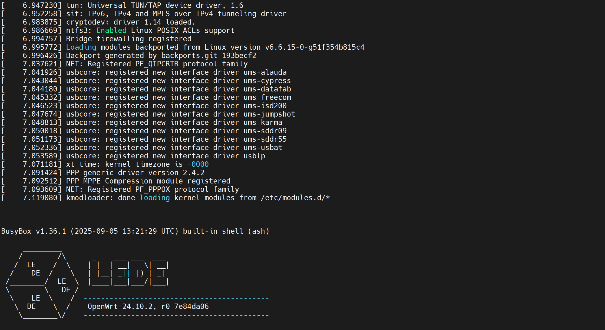

# 烧录系统

本章节将讲解如何把我们提供的 OpenWrt 系统镜像烧录至 EMMC。

## 准备工作

### 1. 硬件准备

烧录系统镜像，除了dshanpi-a1板子，还需要准备 **TypeC-3.2 10Gbps速率USB线 、30W PD电源适配器** （建议韦东山店铺购买，其他的没测试）。如下所示：

| TypeC-3.2 10Gbps速率USB线：                                  | 30W PD电源适配器：                                           |
| ------------------------------------------------------------ | ------------------------------------------------------------ |
|  |  |

### 2. 软件下载

软件上，我们需要在 PC 端下载 **系统镜像、烧录工具和驱动安装工具包** 。下载链接如下：

> 按住 `ctrl` 键，鼠标 `左键` 点击链接，即可一键下载

- **OpenWrt 系统镜像：** [DshanPi-A1_OpenWrt_Image](https://dl.100ask.net/Hardware/MPU/RK3576-DshanPi-A1/openwrt-rockchip-armv8-100ask_dshanpia1-squashfs-sysupgrade.7z)
- **烧录工具 RKDevTool：**  [RKDevTool_Release_v3.32.zip](https://dl.100ask.net/Hardware/MPU/RK3576-DshanPi-A1/RKDevTool_Release_v3.32.zip)
- **驱动安装工具包 DriverAssitant：** [DriverAssitant_v5.1.1.zip](https://dl.100ask.net/Hardware/MPU/RK3576-DshanPi-A1/DriverAssitant_v5.1.1.zip)
- **DshanPi-A1 引导固件：** [rk3576_spl_loader_v1.09.107.bin](https://dl.100ask.net/Hardware/MPU/RK3576-DshanPi-A1/rk3576_spl_loader_v1.09.107.bin)

### 3. 烧录驱动安装

在烧录之前，我们需要先安装烧录驱动，在前面下载的资料里找到驱动安装工具包 **`DriverAssitant_vxxx`** ，打开启动下载程序 **`DriverInstall.exe`** ，点击驱动安装即，如下：

> 如果之前安装过了，这里可以选择跳过。

## 系统镜像烧录

准备工作完成后，

① 接上 **usb3.0 otg** 线（数据线另一端接电脑的 USB3.0 蓝色接口），

② 按住 **`MASKROM`** 按键，**先不松开** ，

③ 再接上电源，dshanpi-a1 就会进入 **`MASKROM`** 烧录模式。参照下图操作：

### 运行烧录工具

打开烧录工具 ，参考下图配置烧录工具：

- ① 勾上前两个选项；
- ② 第二个选项设置为 **`EMMC`** ；
- ③ 地址默认都设置为 **`0x00000000`** ；
- ④ 名字照着上图设置；
- ⑤ Loader的路径设置为前面我们下载的引导固件 **`rk3576_spl_loader_v1.09.107.bin`** ；
- ⑥ Systerm的路径设置为前面我们下载的系统镜像 **`openWrt_xxx.img`** ；
- ⑦ 勾上强制按地址写；
- ⑧ 点击执行（一定要显示为 **MASKROM** 模型才可以烧录）。

开始烧录后，需要给点耐心，等待烧录工具右下角出现 **下载完成** ，即表明烧录完成。

### 启动logs

烧录完成后，会自行启动系统，如下：

## 初次启动设置

### 访问路由后台

1. 参考下图所示，不同的网口对应不同的功能，刷写系统完成后，请先将网线连接至 红色①所示 LAN口，此时通过电脑浏览器访问http://192.168.1.1/ 即可打开此系统的默认登录界面

浏览器有如下页面： 默认用户名 root 默认密码password 

如果你的默认上层光猫/路由的IP地址范围是192.168.1.x 那么openwrt系统会自动跳转到192.168.100.1 用于区分不同的路由网关登录地址。

登录路由器后，可以看到如下首页，根据自己需要设置对应的连接方式。

对于常规家庭网络环境，上层都是运营商送的 光猫路由器 设备，我们只需要设置为 连接现有路由器即可。如下所示已经正常获取到IP地址等。

### 开启WiFi 热点

如果需要使用配套的WiFi模组作为WIFI热点使用，则需要参考如下步骤，配置无线，点击 网络--> 无线，找到右侧识别出来的 设备，红色② 的编辑按钮，配置WiFi热点信息。

如下所示，一定要把WiFi设备的 工作频率设置为如下红框一致的模式 带宽 信道 通道宽度，如果配置不一致会导致WiFi无法作为AP热点使用。

设置完成后，可以保存，自动会复位，等待约30秒，手机WiFi就可以扫到对应的无线设备，连接即可。

## 常见问题与解决方案

- **问题：执行烧录操作后烧录工具没有显示MASKROM设备？**
  - **解决方案：** 检查设备管理器是否出现以下设备，烧录驱动是否安装，如果安装了，插拔一下 usb3.0 otg 接口的数据线或者重启电脑。

