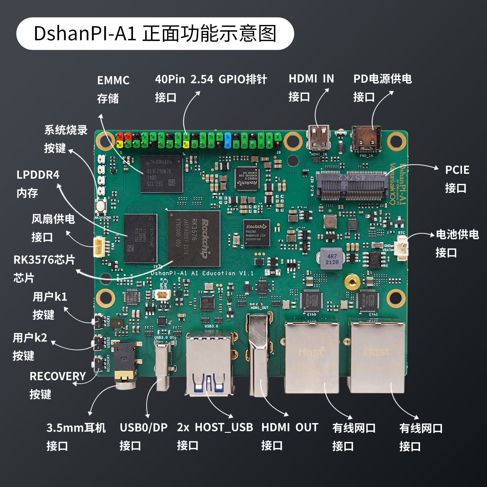
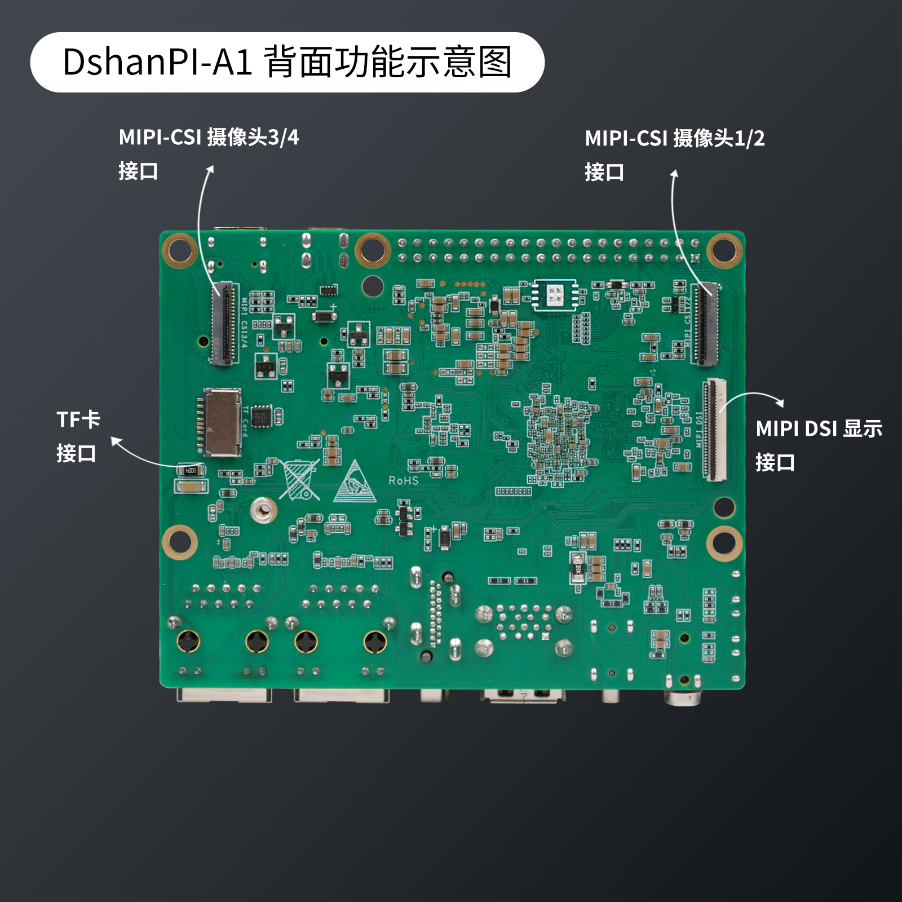
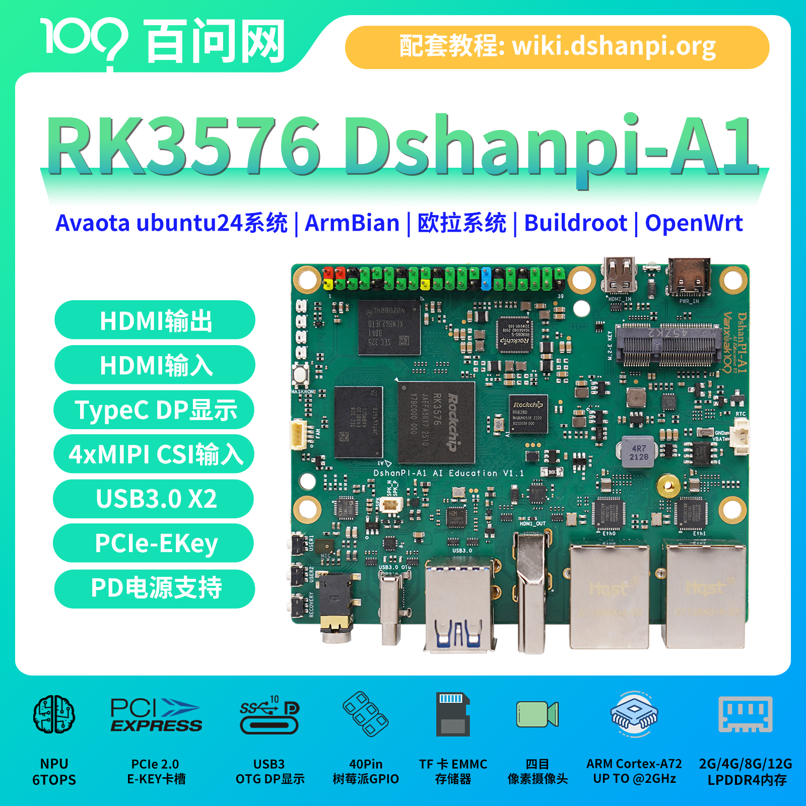
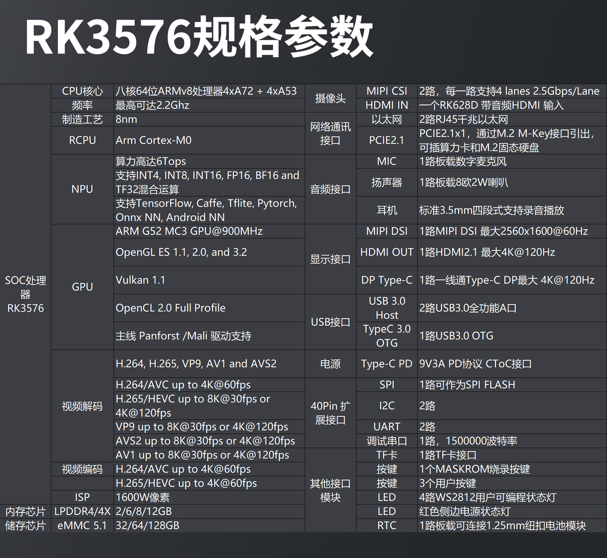
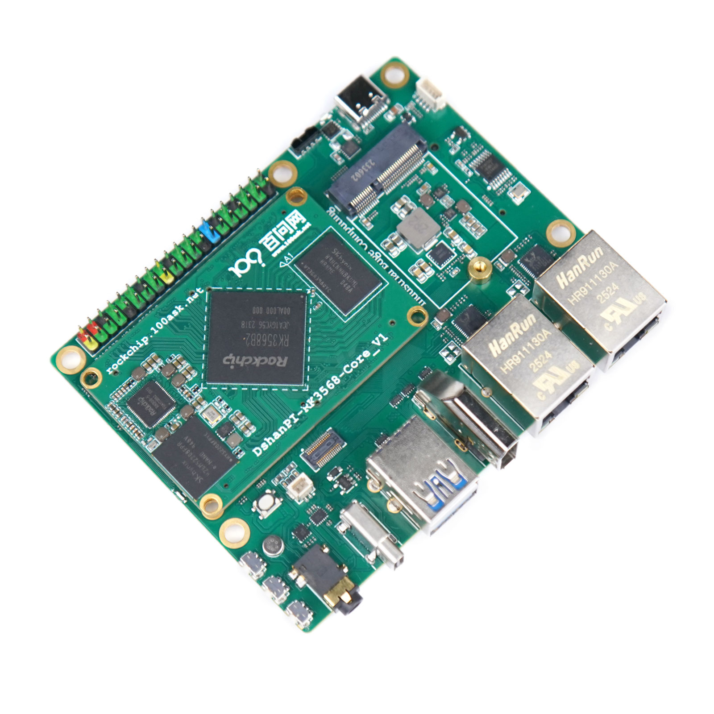

# DshanPi-A1介绍

DshanPi-A1 聚焦 AI 教育场景，以“单板计算机  + 专题项目（付费）”的一体化形态，为从入门到高阶的教学需求提供可持续演进的软硬件生态。
提供中高端性能 SBC 体验，包括 PCIe、USB3.0、双千兆、HDMI、HDMI-IN、DP等丰富的接口。

:::tip
- 源码仓库：https://github.com/dshanpi/
- QQ交流群：798273638
- 商品链接：https://detail.tmall.com/item.htm?id=953384132961
- 镜像站点：https://dl.100ask.net/Hardware/MPU/RK3576-DshanPi-A1/
:::

## DShanPl-A1 Education

DShanPl-A1 Education专为人工智能教育及项目开发深度优化，基于瑞芯微的RK3576处理器设计，集成了4个Cortex-A72和4个Cortex-A53及支持NEON指令集,支持8K@30fps的H.265,VP9AVS2
和 AV1解码器,4k@60fps的H.264解码器和4K@60fps的AV1解码器;还支持4K@60fps的H.264和H.265编码器。内置3D GPU,能够完全兼容OpenGl ES1.1/2.0/3.2、0penCL2.0和Vulkan 1.1。内嵌的NPU算力高达6TopS,支持INT4/INT8/INT16/FP16混合运算。

import Tabs from '@theme/Tabs';
import TabItem from '@theme/TabItem';

<Tabs>
  <TabItem value="apple" label="正面功能示意图" default>
    
  </TabItem>
  <TabItem value="orange" label="正面功能示意图">
    
  </TabItem>
  <TabItem value="banana" label="产品宣传主图">
    
  </TabItem>
</Tabs>

### 规格参数

DshanPI-A1 Education RK3576 SBC详细规格参数介绍： 

### 系统支持的外设驱动

✅: 支持—  ❌: 暂不支持 —  🚫: 无计划支持   —⚠：支持但未完整测试

| 系统版本       | Armbian  | Buildroot  | OpenWrt-LEDE | ArchLinux  | OpenEuler | Fedora |
|--------------------|-------------------|----------------|---------------|--------------------|------------------------|---------------------|
| SPI            | ✅                | ✅             | ✅            | ✅                 | ✅                     | ✅                  |
| I2C            | ✅                | ✅             | ✅            | ✅                 | ✅                     | ✅                  |
| PWM            | ✅                | ✅             | ✅            | ✅                 | ✅                     | ✅                  |
| UART           | ✅                | ✅             | ✅            | ✅                 | ✅                     | ✅                  |
| MMC            | ✅                | ✅             | ✅            | ✅                 | 🚫                     | ✅                  |
| GPIO           | ✅                | ✅             | ✅            | ✅                 | ✅                     | ✅                  |
| NPU            | ✅                | ⚠             | ⚠            | ✅                 | 🚫                     | 🚫                  |
| USB2.0         | ✅                | ✅             | ✅            | ✅                 | 🚫                     | 🚫                  |
| USB3.0         | ✅                | ✅             | ✅            | ✅                 | 🚫                     | 🚫                  |
| PCI-e         | ✅                | ✅             | ✅            | ✅                 | 🚫                     | 🚫                  |
| 视频编码       | ✅                | ✅             | ✅            | ❌                 | 🚫                     | 🚫                  |
| 视频解码       | ✅                | ✅             | ✅            | ❌                 | 🚫                     | 🚫                  |
| MIPI CSI       | ❌                | ✅             | ❌            | ❌                 | 🚫                     | 🚫                  |
| Audio          | ✅                | ❌             | ❌            | ❌                 | 🚫                     | 🚫                  |
| WIFI           | ✅                | ✅             | ✅            | ✅                 | 🚫                     | 🚫                  |

## DShanPl-R1+

:::tip
进度：批量生产中
:::

DshanPI-R1+ RK3568 SBC 产品图： 

