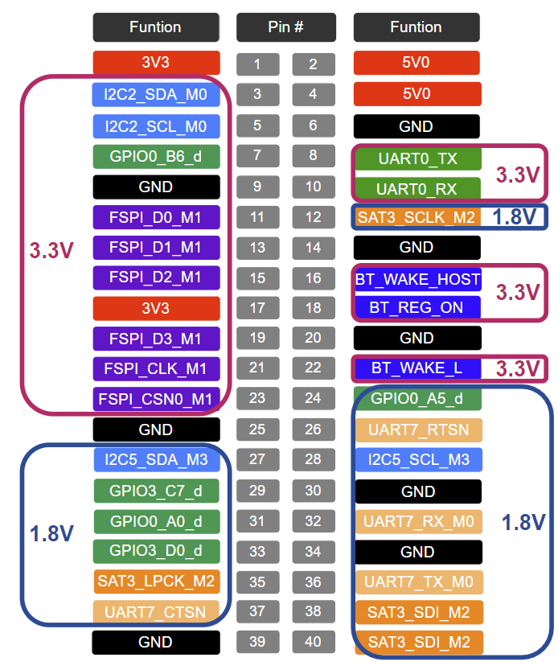
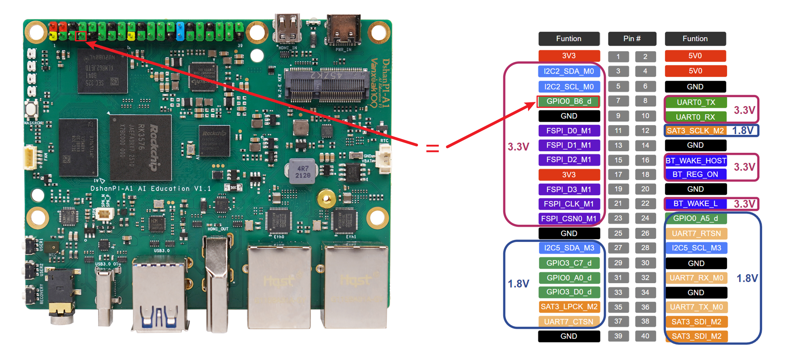

# GPIO

GPIO（General Purpose Input/Output）就是芯片上可以 **“自己决定当输入还是当输出”** 的通用管脚。

- **输出** → 输出高/低电平，点灯、继电器、蜂鸣器。
- **输入** → 读取高/低电平，按键、红外、传感器信号。
- **可编程** → 通过寄存器或库函数随时切换方向、电平、中断。

每个 SoC/单片机都有几十个甚至上百个 GPIO，是硬件世界与软件世界最直接的“握手口”。

## 1.命名规则

Rockchip 采用 “**bank + port + index**” 三段式命名：
`GPIO<bank>_<port><index>`

- bank：`0~4 → 对应 gpio0~4`
- port：A=0, B=1, C=2, D=3
- index：0~7

1.把名字换成全局编号（sysfs 或 kernel 用），公式：

```
global = bank × 32 + port × 8 + index
```

举例：`GPIO0_B6`

```
0 × 32 + 1 × 8 + 6 = 14 --> /sys/class/gpio/gpio14
```

2.把名字换成 libgpiod库中 的 line offset定义：

libgpiod 以 **每个控制器为 1 个 chip**，因此：

- chip 名称：`gpio0`
- line offset：就是 `port × 8 + index` = `1 × 8 + 6 = 14`


## 2.引脚分布

在板子上拥有40Pin的拓展引脚，你可以通过下图所示的硬件接口图进行确定，更多详细功能可以通过硬件原理图确定。

> 注意：如果模块的接收电压是3V3请接入3V3，如果模块的接收电压是1V8请接入1V8。禁止将1V8的模块接入3V3的引脚，会导致模块烧毁！




## 3.使用GPIO sysfs控制

下面以拓展排针上的GPIO0_B6为例。



**1.将GPIO导出到用户空间**

```
#使用root权限
sudo su
#这里以GPIO0_B6为例
echo 14 > /sys/class/gpio/export  
```

导出完成后即可执行以下命令，进入对应gpio的设备目录：

```
cd /sys/class/gpio/gpio14
```

对于其他的IO设备，可按照 /sys/class/gpio/gpioN（N=1,2,3,5,...）格式访问。


**2.查看目录：**

```
root@dshanpi-a1:/sys/class/gpio/gpio14# ls
active_low  device  direction  edge  power  subsystem  uevent  value
```

作用如下：

| 名称             | 类型     | 作用说明                                                     |
| ---------------- | -------- | ------------------------------------------------------------ |
| **`active_low`** | 文件     | 极性控制。                                                   |
| **`device`**     | 符号链接 | 指向 `/sys/devices/...` 下的真实设备节点，内核内部用，用户一般不用管。 |
| **`direction`**  | 文件     | 设置引脚方向。                                               |
| **`edge`**       | 文件     | 中断触发方式（仅输入有效）。                                 |
| **`power`**      | 目录     | 电源管理属性，通常为空；挂起/唤醒相关，用户很少改。          |
| **`subsystem`**  | 符号链接 | 指向 `/sys/class/gpio` 自身，方便脚本快速定位。              |
| **`uevent`**     | 文件     | 内核热插拔事件属性，udev 规则用；普通用户无需操作。          |
| **`value`**      | 文件     | 读写引脚电平。                                               |


**3.控制GPIO引脚**

1.设置GPIO的方向，选择方向指南（二选一）

```
# 设置 GPIO 为输入
echo in > direction
# 设置 GPIO 为输出
echo out > direction
```

2.控制GPIO电平

```
# 获取引脚输入
cat value  
# 设置引脚输出
echo 1 > value
echo 0 > value
```

注意：如果是1V8的引脚高电平为1V8，如果是3V3的引脚高电平为3V3。

运行完成后取消占用，可执行

```
echo 14 > /sys/class/gpio/unexport  
```


## 4.使用Python程序控制

安装python3 libgpiod库

```
sudo apt update
sudo apt install python3-libgpiod
```

### 4.1 输出控制示例

```
#!/usr/bin/env python3
import gpiod
import time

CHIP_NAME   = "gpio0"     # /dev/gpiochip0
LINE_OFFSET = 14          # GPIO0_B6

chip = gpiod.Chip(CHIP_NAME)
line = chip.get_line(LINE_OFFSET)

# 申请为输出，默认低电平
line.request(consumer="rk3576-gpio", type=gpiod.LINE_REQ_DIR_OUT, default_vals=[0])

try:
    while True:
        line.set_value(1)
        time.sleep(0.5)
        line.set_value(0)
        time.sleep(0.5)
except KeyboardInterrupt:
    pass
finally:
    line.release()
```

运行方式：

```
sudo python gpio-out.py
```

运行效果：可使用万用表测量GPIO0_B6，可观察到其电压值在0和3.3V之间循环。


### 4.2 输入控制示例

```
#!/usr/bin/env python3
import gpiod
import time

# gpio0 芯片
chip  = gpiod.Chip("gpio0")
# 输出脚：GPIO0_B6 (offset 14)
led   = chip.get_line(14)
# 输入脚：GPIO0_A0 (offset 0)
btn   = chip.get_line(0)

# 申请输出，默认高
led.request(consumer="led",
            type=gpiod.LINE_REQ_DIR_OUT,
            default_vals=[1])

# 申请输入，启用下降沿中断
btn.request(consumer="btn",
            type=gpiod.LINE_REQ_EV_FALLING_EDGE)

print("上电：GPIO0_B6 = 高")
print("按下 GPIO0_A0 后：GPIO0_B6 拉低，松开恢复高")
print("Ctrl+C 退出")

try:
    while True:
        ev = btn.event_wait(sec=1)   # 阻塞等 1 秒
        if ev and btn.event_read().event_type == gpiod.LineEvent.FALLING_EDGE:
            led.set_value(0)         # 按下 -> 低
            print("按键按下 → GPIO0_B6 = 低")
            # 简单消抖：等待按钮松开
            while btn.get_value() == 0:
                time.sleep(0.01)
            led.set_value(1)         # 松开 -> 高
            print("按键松开 → GPIO0_B6 = 高")
except KeyboardInterrupt:
    pass
finally:
    led.release()
    btn.release()
```

运行方式：

```
sudo python3 gpio-in.py
```

运行效果：默认GPIO0_B6为高电平，当您按下用户按键USER1时会变为低电平。

```
baiwen@dshanpi-a1:~$ sudo python3 gpio-in.py
扩展排针 GPIO0_B6 默认为高
按下 GPIO0_A0 时 GPIO0_B6 拉低，松开恢复高
Ctrl+C 退出
按键按下 → GPIO0_B6 = 低
按键松开 → GPIO0_B6 = 高
按键按下 → GPIO0_B6 = 低
按键松开 → GPIO0_B6 = 高
按键按下 → GPIO0_B6 = 低
按键松开 → GPIO0_B6 = 高
按键按下 → GPIO0_B6 = 低
按键松开 → GPIO0_B6 = 高
```

按键位置如下图所示：


## 5.使用C语言控制

安装c libgpiod库

```
sudo apt update
sudo apt install libgpiod-dev gpiod
```

### 5.1 输出控制示例

GPIO的高低电平循环示例：

```
#include <gpiod.h>
#include <stdio.h>
#include <unistd.h>
#include <signal.h>

static volatile int running = 1;
void handle_sig(int sig) { running = 0; }

int main(void)
{
    const char *chip_name = "gpiochip0";
    const unsigned int line_offset = 14;   /* GPIO0_B6 */

    struct gpiod_chip *chip;
    struct gpiod_line *line;

    chip = gpiod_chip_open_by_name(chip_name);
    if (!chip) { perror("open chip"); return 1; }

    line = gpiod_chip_get_line(chip, line_offset);
    if (!line) { perror("get line"); gpiod_chip_close(chip); return 1; }

    /* 申请输出，默认低电平 */
    if (gpiod_line_request_output(line, "rk3576-gpio", 0) < 0) {
        perror("request output"); gpiod_chip_close(chip); return 1;
    }

    signal(SIGINT, handle_sig);   /* Ctrl+C 退出 */

    while (running) {
        gpiod_line_set_value(line, 1);
        usleep(500000);       /* 0.5 s */
        gpiod_line_set_value(line, 0);
        usleep(500000);
    }

    gpiod_line_release(line);
    gpiod_chip_close(chip);
    puts("\n结束");
    return 0;
}
```

编译程序

```
gcc gpio-out.c -o gpio-out -lgpiod
```

运行:

```
sudo ./gpio-out
```

运行效果：可使用万用表测量GPIO0_B6，可观察到其电压值在0和3.3V之间循环。

### 5.2 输入控制示例

```
#include <gpiod.h>
#include <stdio.h>
#include <unistd.h>
#include <signal.h>
#include <stdbool.h>

static volatile sig_atomic_t running = 1;
void sig_handler(int sig) { running = 0; }

int main(void)
{
    const char *chip_name = "gpiochip0";
    const unsigned int ext_offset = 14;   /* GPIO0_B6 扩展排针 */
    const unsigned int key_offset = 0;    /* GPIO0_A0 按键 */

    struct gpiod_chip *chip;
    struct gpiod_line *ext, *key;

    /* 捕获 Ctrl+C */
    signal(SIGINT, sig_handler);

    /* 打开 gpiochip0 */
    chip = gpiod_chip_open_by_name(chip_name);
    if (!chip) { perror("open chip"); return 1; }

    /* 排针：输出，默认高 */
    ext = gpiod_chip_get_line(chip, ext_offset);
    if (!ext || gpiod_line_request_output(ext, "ext_pin", 1) < 0) {
        perror("request ext"); gpiod_chip_close(chip); return 1;
    }

    /* 按键：输入，下降沿中断 */
    key = gpiod_chip_get_line(chip, key_offset);
    if (!key || gpiod_line_request_falling_edge_events(key, "btn") < 0) {
        perror("request key"); gpiod_chip_close(chip); return 1;
    }

    puts("扩展排针 GPIO0_B6 默认为高");
    puts("按下 GPIO0_A0 时 GPIO0_B6 拉低，松开恢复高");
    puts("Ctrl+C 退出");

    while (running) {
        if (gpiod_line_event_wait(key, NULL) == 0) {   /* 等到下降沿 */
            struct gpiod_line_event ev;
            gpiod_line_event_read(key, &ev);           /* 清事件 */

            gpiod_line_set_value(ext, 0);              /* 拉低 */
            puts("按键按下 → GPIO0_B6 = 低");

            /* 等待松开（防抖） */
            while (gpiod_line_get_value(key) == 0 && running)
                usleep(10000);                         /* 10 ms */

            gpiod_line_set_value(ext, 1);              /* 恢复高 */
            puts("按键松开 → GPIO0_B6 = 高");
        }
    }

    /* 释放资源 */
    gpiod_line_release(ext);
    gpiod_line_release(key);
    gpiod_chip_close(chip);
    puts("结束");
    return 0;
}
```

编译程序

```
gcc gpio-in.c -o gpio-in -lgpiod
```

运行：

```
sudo ./gpio-in
```

运行效果：默认GPIO0_B6为高电平，当您按下用户按键USER1时会变为低电平。

```

baiwen@dshanpi-a1:~$ sudo ./gpio-in
扩展排针 GPIO0_B6 默认为高
按下 GPIO0_A0 时 GPIO0_B6 拉低，松开恢复高
Ctrl+C 退出
按键按下 → GPIO0_B6 = 低
按键松开 → GPIO0_B6 = 高
按键按下 → GPIO0_B6 = 低
按键松开 → GPIO0_B6 = 高
按键按下 → GPIO0_B6 = 低
按键松开 → GPIO0_B6 = 高
```

按键位置如下图所示：

