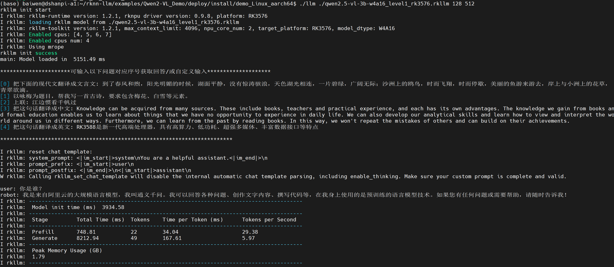
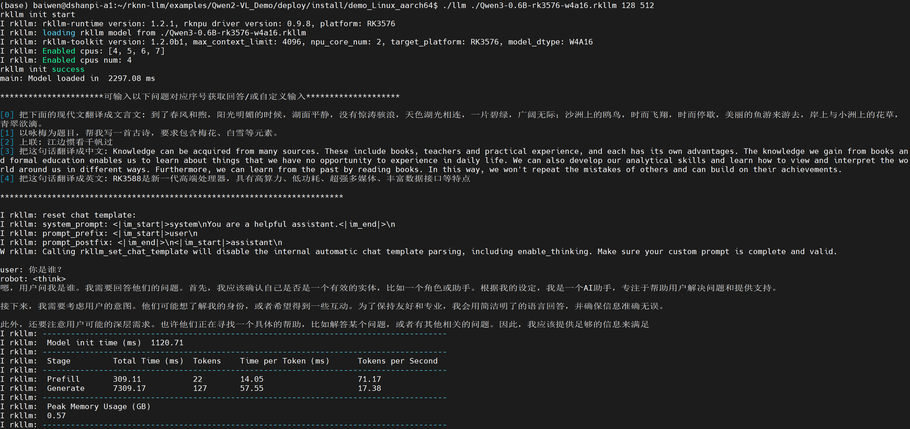
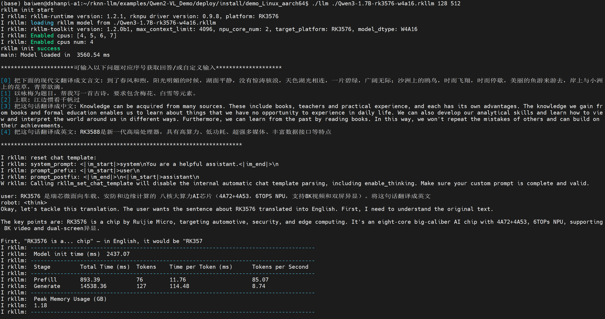

# Qwen-VL

## 1.编译可执行程序

1.进入源码目录

```
cd ~/rknn-llm/examples/Qwen2-VL_Demo/deploy
```


2.修改交叉编译工具链

```
vi build-linux.sh
```

将原本的：

```
set -e
rm -rf build
mkdir build && cd build

GCC_COMPILER=~/opts/gcc-arm-10.2-2020.11-x86_64-aarch64-none-linux-gnu
cmake .. -DCMAKE_CXX_COMPILER=${GCC_COMPILER}/bin/aarch64-none-linux-gnu-g++  \
        -DCMAKE_C_COMPILER=${GCC_COMPILER}/bin/aarch64-none-linux-gnu-gcc \
        -DCMAKE_BUILD_TYPE=Release \
        -DCMAKE_SYSTEM_NAME=Linux \
        -DCMAKE_SYSTEM_PROCESSOR=aarch64 \

make -j8
make install
```

修改为：

```
set -e
rm -rf build
mkdir build && cd build

GCC_COMPILER=aarch64-linux-gnu
cmake .. -DCMAKE_CXX_COMPILER=${GCC_COMPILER}-g++  \
        -DCMAKE_C_COMPILER=${GCC_COMPILER}-gcc \
        -DCMAKE_BUILD_TYPE=Release \
        -DCMAKE_SYSTEM_NAME=Linux \
        -DCMAKE_SYSTEM_PROCESSOR=aarch64 \

make -j8
make install
```

3.安装cmake

```
sudo apt install cmake -y
```


4.增加可执行权限并执行编译

```
chmod +x build-linux.sh
./build-linux.sh
```

运行效果：

```
 baiwen@dshanpi-a1:~/rknn-llm/examples/Qwen2-VL_Demo/deploy$ ./build-linux.sh
-- The C compiler identification is GNU 11.4.0
-- The CXX compiler identification is GNU 11.4.0
-- Detecting C compiler ABI info
-- Detecting C compiler ABI info - done
-- Check for working C compiler: /usr/bin/aarch64-linux-gnu-gcc - skipped
-- Detecting C compile features
-- Detecting C compile features - done
-- Detecting CXX compiler ABI info
-- Detecting CXX compiler ABI info - done
-- Check for working CXX compiler: /usr/bin/aarch64-linux-gnu-g++ - skipped
-- Detecting CXX compile features
-- Detecting CXX compile features - done
-- Found OpenCV: /home/baiwen/rknn-llm/examples/Qwen2-VL_Demo/deploy/3rdparty/opencv-linux-aarch64 (found version "3.4.5")
-- Configuring done
-- Generating done
-- Build files have been written to: /home/baiwen/rknn-llm/examples/Qwen2-VL_Demo/deploy/build
[ 12%] Building CXX object CMakeFiles/llm.dir/src/llm.cpp.o
[ 25%] Building CXX object CMakeFiles/demo.dir/src/image_enc.cc.o
[ 37%] Building CXX object CMakeFiles/demo.dir/src/main.cpp.o
[ 50%] Building CXX object CMakeFiles/imgenc.dir/src/image_enc.cc.o
[ 62%] Building CXX object CMakeFiles/imgenc.dir/src/img_encoder.cpp.o
cc1plus: warning: /home/baiwen/rknn-llm/examples/Qwen2-VL_Demo/deploy/src/image_enc.h: not a directory
cc1plus: warning: /home/baiwen/rknn-llm/examples/Qwen2-VL_Demo/deploy/src/image_enc.h: not a directory
cc1plus: warning: /home/baiwen/rknn-llm/examples/Qwen2-VL_Demo/deploy/src/image_enc.h: not a directory
cc1plus: warning: /home/baiwen/rknn-llm/examples/Qwen2-VL_Demo/deploy/src/image_enc.h: not a directory
cc1plus: warning: /home/baiwen/rknn-llm/examples/Qwen2-VL_Demo/deploy/src/image_enc.h: not a directory
[ 75%] Linking CXX executable llm
[ 75%] Built target llm
[ 87%] Linking CXX executable imgenc
[100%] Linking CXX executable demo
[100%] Built target imgenc
[100%] Built target demo
Consolidate compiler generated dependencies of target imgenc
[ 37%] Built target imgenc
Consolidate compiler generated dependencies of target llm
[ 62%] Built target llm
Consolidate compiler generated dependencies of target demo
[100%] Built target demo
Install the project...
-- Install configuration: "Release"
-- Installing: /home/baiwen/rknn-llm/examples/Qwen2-VL_Demo/deploy/install/demo_Linux_aarch64/./imgenc
-- Set runtime path of "/home/baiwen/rknn-llm/examples/Qwen2-VL_Demo/deploy/install/demo_Linux_aarch64/./imgenc" to ""
-- Installing: /home/baiwen/rknn-llm/examples/Qwen2-VL_Demo/deploy/install/demo_Linux_aarch64/./llm
-- Set runtime path of "/home/baiwen/rknn-llm/examples/Qwen2-VL_Demo/deploy/install/demo_Linux_aarch64/./llm" to ""
-- Installing: /home/baiwen/rknn-llm/examples/Qwen2-VL_Demo/deploy/install/demo_Linux_aarch64/./demo
-- Set runtime path of "/home/baiwen/rknn-llm/examples/Qwen2-VL_Demo/deploy/install/demo_Linux_aarch64/./demo" to ""
-- Installing: /home/baiwen/rknn-llm/examples/Qwen2-VL_Demo/deploy/install/demo_Linux_aarch64/lib/librknnrt.so
-- Installing: /home/baiwen/rknn-llm/examples/Qwen2-VL_Demo/deploy/install/demo_Linux_aarch64/lib/librkllmrt.so
-- Installing: /home/baiwen/rknn-llm/examples/Qwen2-VL_Demo/deploy/install/demo_Linux_aarch64/./demo.jpg
```

5.进入可执行文件目录

```
cd install/demo_Linux_aarch64/
```


6.将预训练和转换完成的模型文件传输至开发板端中

```
baiwen@dshanpi-a1:~/rknn-llm/examples/Qwen2-VL_Demo/deploy/install/demo_Linux_aarch64$ ls
demo      imgenc  llm                               qwen2.5-vl-3b-w4a16_level1_rk3576.rkllm  Qwen3-1.7B-rk3576-w4a16.rkllm
demo.jpg  lib     qwen2_5_vl_3b_vision_rk3576.rknn  Qwen3-0.6B-rk3576-w4a16.rkllm            Qwen3-4B-rk3576-w4a16.rkllm
```


## 2.模型推理

### 2.1 Qwen2.5-vl-3B

1.导入依赖和环境变量

```
export LD_LIBRARY_PATH=./lib
export RKLLM_LOG_LEVEL=1
```

2.执行程序

```
./llm ./qwen2.5-vl-3b-w4a16_level1_rk3576.rkllm 128 512
```

> argv[1]`model_path`RKLLM 转换后的模型文件路径，例如 `./qwen2.5-vl-3b-w4a16_level1_rk3576.rkllm`。
>
> argv[2]`max_new_tokens`每次生成回答时最多输出多少个 token（整数）。例如 512。
>
> argv[3]`max_context_len`模型一次能接受的最大上下文长度（提示 + 已生成的文本）。例如 2048。

运行效果如下：




### 2.2 Qwen3-0.6B

1.导入依赖和环境变量

```
export LD_LIBRARY_PATH=./lib
export RKLLM_LOG_LEVEL=1
```

2.执行程序

```
./llm ./Qwen3-0.6B-rk3576-w4a16.rkllm 128 512
```

运行效果如下：



### 2.2 Qwen3-1.7B

1.导入依赖和环境变量

```
export LD_LIBRARY_PATH=./lib
export RKLLM_LOG_LEVEL=1
```

2.执行程序

```
./llm ./Qwen3-1.7B-rk3576-w4a16.rkllm 128 512
```

运行效果如下：



### 2.2 Qwen3-4B

1.导入依赖和环境变量

```
export LD_LIBRARY_PATH=./lib
export RKLLM_LOG_LEVEL=1
```

2.执行程序

```
./llm ./Qwen3-4B-rk3576-w4a16.rkllm 128 512
```

运行效果如下：

