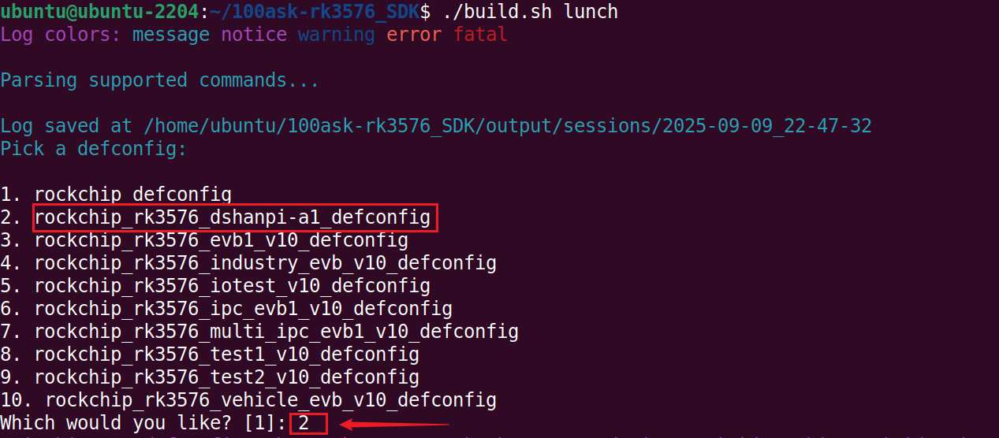

# Buildroot系统构建

本章节将讲解如何基于DshanPi-A1 Buildroot SDK快速构建系统镜像。

> **buildroot相关内容不过多讲解，仅供有能力自行开发的用户使用!!!**

## 1. 获取虚拟机

> 注意：提供的虚拟机包含了 buildroot sdk，环境也已搭建好，Ubuntu默认版本是22.04，不要升级系统版本！！！

获取链接如下：

https://pan.baidu.com/s/15M8zuHOwl_SITl6cSk_7Vg?pwd=eaax 提取码: eaax

## 2. 编译SDK

打开虚拟机（虚拟机用户名ubunt，密码ubuntu），新建终端，执行以下命令，进入SDK根目录：

~~~bash
cd ~/100ask-rk3576_SDK/
~~~

如下：

~~~bash
.
├── app
├── buildroot
├── build.sh -> device/rockchip/common/scripts/build.sh
├── common -> device/rockchip/common
├── device
├── docs
├── external
├── kernel -> /home/ubuntu/100ask-rk3576_SDK/kernel-6.1
├── kernel-6.1
├── Makefile -> device/rockchip/common/Makefile
├── prebuilts
├── README.md -> device/rockchip/common/README.md
├── rkbin
├── rkflash.sh -> device/rockchip/common/scripts/rkflash.sh
├── tools
└── u-boot

12 directories, 4 files
~~~

编译SDK命令只需两条：

**① 选择板级配置文件**

在SDK根目录下，执行以下命令，选择 **`rockchip_rk3576_dshanpi-a1_defconfig`** ：

~~~bash
./build.sh lunch
~~~

如下：

**② 编译SDK**

继续在当前路径下，执行以下命令，编译SDK:

~~~bash
./build.sh
~~~

编译耗时因电脑性能而异，请耐心等待。完成后如下：

编译完成，镜像将自动生成于以下路径。

~~~bash
cd ~/100ask-rk3576_SDK/output/update/Image/
~~~

如下：

~~~bash
.
├── boot.img -> ../../../kernel-6.1/boot.img
├── MiniLoaderAll.bin -> ../../../u-boot/rk3576_spl_loader_v1.05.105.bin
├── misc.img -> ../../misc.img
├── oem.img -> ../../extra-parts/oem.img
├── package-file
├── parameter.txt -> ../../../device/rockchip/.chips/rk3576/parameter.txt
├── recovery.img -> ../../recovery/ramboot.img
├── rootfs.img -> ../../../buildroot/output/rockchip_rk3576/images/rootfs.ext2
├── uboot.img -> ../../../u-boot/uboot.img
├── update.img
├── update.raw.img
└── userdata.img -> ../../extra-parts/userdata.img

0 directories, 12 files
~~~

其中 `update.img` 正是用于烧录到 DshanPi-A1 的最终镜像。

## 3. SDK命令使用

在SDK根目录下，执行以下命令，可以看到 `./build.sh` 的使用参数：

~~~bash
cd ~/100ask-rk3576_SDK/
./build.sh help
~~~

如下：

~~~bash
Log colors: message notice warning error fatal

Usage: build.sh [OPTIONS]
Available options:
chip[:<chip>[:<config>]]          	choose chip
defconfig[:<config>]              	choose defconfig
 *_defconfig                      	switch to specified defconfig
    available defconfigs:
	rockchip_defconfig
	rockchip_rk3576_dshanpi-a1_defconfig
	rockchip_rk3576_evb1_v10_defconfig
	rockchip_rk3576_industry_evb_v10_defconfig
	rockchip_rk3576_iotest_v10_defconfig
	rockchip_rk3576_ipc_evb1_v10_defconfig
	rockchip_rk3576_multi_ipc_evb1_v10_defconfig
	rockchip_rk3576_test1_v10_defconfig
	rockchip_rk3576_test2_v10_defconfig
	rockchip_rk3576_vehicle_evb_v10_defconfig
 olddefconfig                     	resolve any unresolved symbols in .config
 savedefconfig                    	save current config to defconfig
 menuconfig                       	interactive curses-based configurator
config                            	modify SDK defconfig
print-parts                        	print partitions
list-parts                         	alias of print-parts
mod-parts                          	interactive partition table modify
edit-parts                         	edit raw partitions
new-parts:<offset>:<name>:<size>...	re-create partitions
insert-part:<idx>:<name>[:<size>]  	insert partition
del-part:(<idx>|<name>)            	delete partition
move-part:(<idx>|<name>):<idx>     	move partition
rename-part:(<idx>|<name>):<name>  	rename partition
resize-part:(<idx>|<name>):<size>  	resize partition
misc                              	pack misc image
kernel-6.1[:dry-run]             	build kernel 6.1
kernel[:dry-run]                 	build kernel
recovery-kernel[:dry-run]        	build kernel for recovery
modules[:dry-run]                	build kernel modules
linux-headers[:dry-run]          	build linux-headers
kernel-config[:dry-run]          	modify kernel defconfig
kconfig[:dry-run]                	alias of kernel-config
kernel-make[:<arg1>:<arg2>]      	run kernel make
kmake[:<arg1>:<arg2>]            	alias of kernel-make
wifibt[:<dst dir>[:<chip>]]       	build Wifi/BT
amp                              	build and pack amp system
buildroot-config[:<config>]       	modify buildroot defconfig
bconfig[:<config>]                	alias of buildroot-config
buildroot-make[:<arg1>:<arg2>]    	run buildroot make
bmake[:<arg1>:<arg2>]             	alias of buildroot-make
rootfs[:<rootfs type>]            	build default rootfs
buildroot                         	build buildroot rootfs
yocto                             	build yocto rootfs
debian                            	build debian rootfs
recovery                          	build recovery
security-createkeys               	create keys for security
security-misc                     	build misc with system encryption key
security-ramboot                  	build security ramboot
security-system                   	build security system
loader[:dry-run]                 	build loader (u-boot)
uboot[:dry-run]                  	build u-boot
u-boot[:dry-run]                 	alias of uboot
uefi[:dry-run]                   	build uefi
extra-parts                       	pack extra partition images
firmware                          	pack and check firmwares
edit-package-file                 	edit package-file
edit-ota-package-file             	edit package-file for OTA
updateimg                         	build update image
ota-updateimg                     	build update image for OTA
all                               	build images
release                           	release images and build info
all-release                       	build and release images
shell                             	setup a shell for developing
cleanall                          	cleanup
clean[:module[:module]]...        	cleanup modules
    available modules:
	all
	amp
	config
	extra-parts
	firmware
	kernel
	loader
	misc
	recovery
	rootfs
	security
	updateimg
post-rootfs <rootfs dir>          	trigger post-rootfs hook scripts
help                              	usage

Default option is 'all'.
~~~

