# 开发环境搭建

> 目前VMware个人使用已经完全免费，网上很多安装教程，这里默认安装了该软件

本章节将讲解如何在VMware虚拟机上搭建ubuntu系统环境，为后面编译SDK准备。

## 获取ubuntu系统

### 下载系统镜像

使用浏览器打开 [ubuntu20.04下载地址](https://www.linuxvmimages.com/images/ubuntu-2004/)，找到如下箭头所示位置，点击 **VMware Image** 下载。

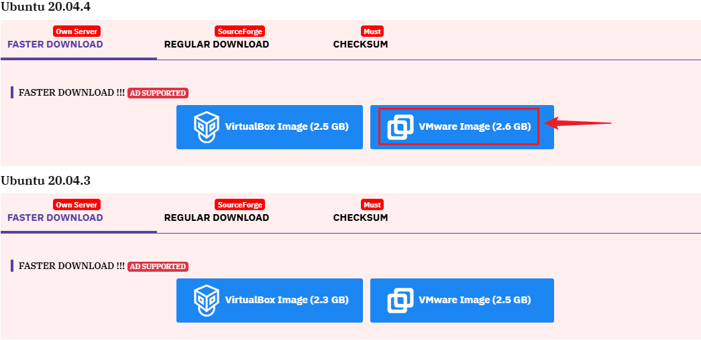

进入下载界面，等待倒计时完成，会自动下载。

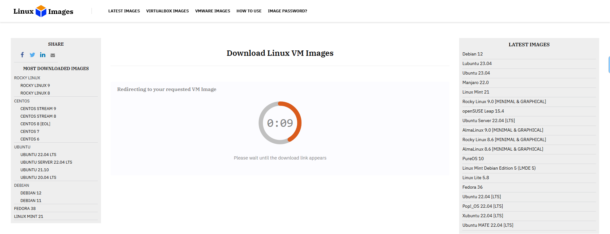

下载过程可能会执行10 到 30 分钟，具体要依据网速而定。

### 运行ubuntu系统

下载完成后，会得到一个压缩包 `Ubuntu_20.04.4_VM.7z`，解压，可以看到以下内容：

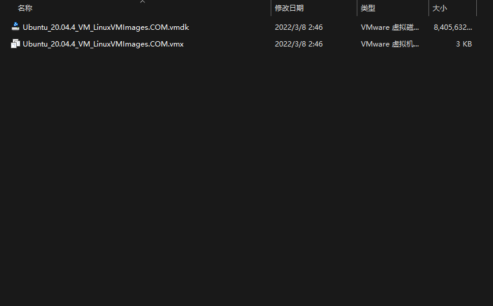

打开安装好的虚拟机 VMware Workstation Pro ，左上角 **文件** -> **打开**，

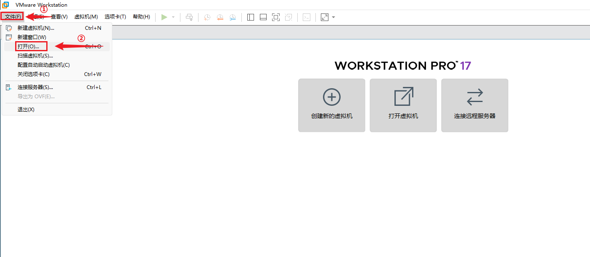

找到之前解压的ubuntu系统文件夹，选择.vmx文件，然后打开。

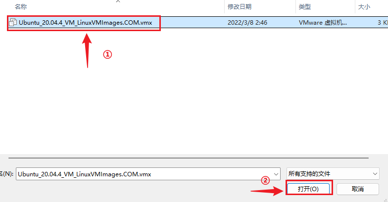

根据电脑性能来调节内存和处理器，如果电脑性能不高，使用默认的即可。

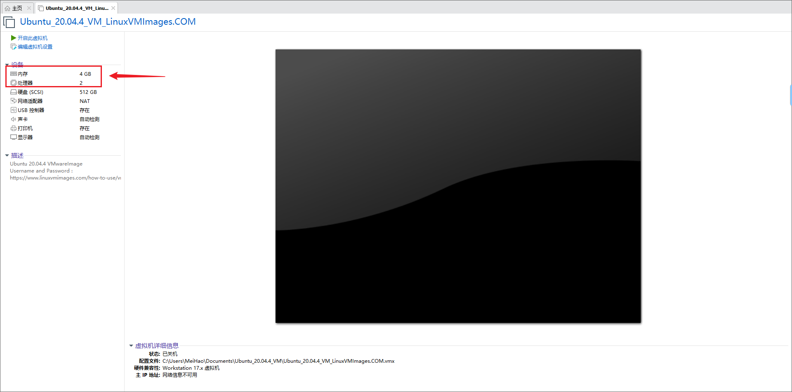

设置好之后，点击开启此虚拟机。

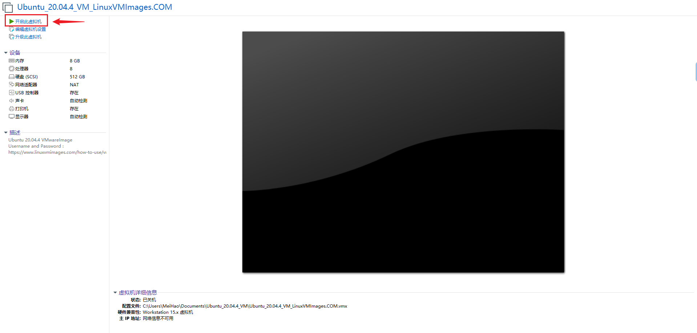

后面会弹出以下信息，选择我已复制该虚拟机，等待系统启动。

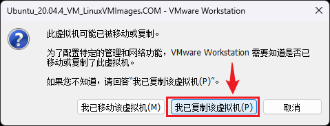

启动完成后，输入密码回车，**密码默认是`ubuntu`**。

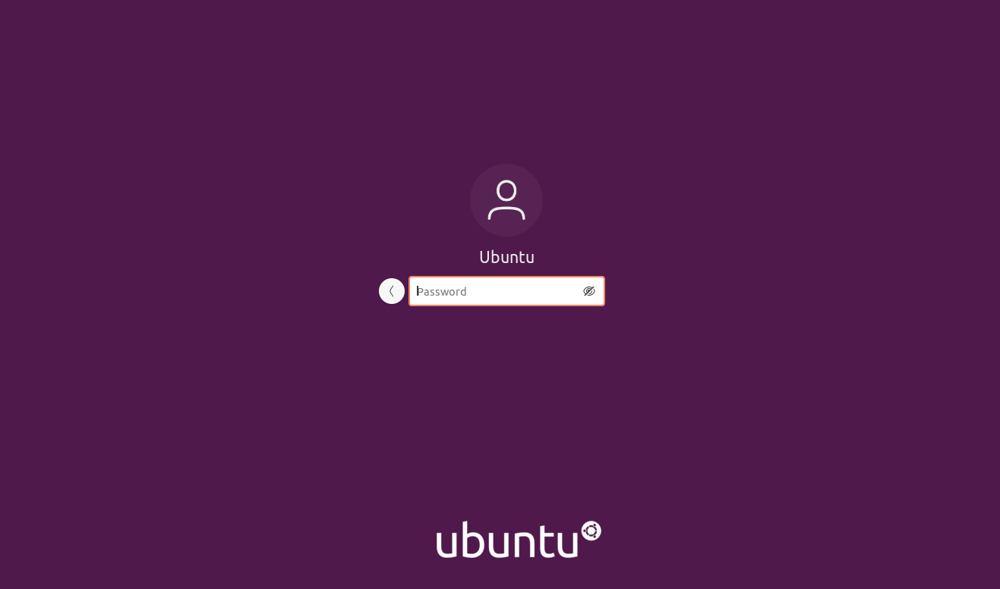

见到以下画面，启动ubuntu系统第一步完成。

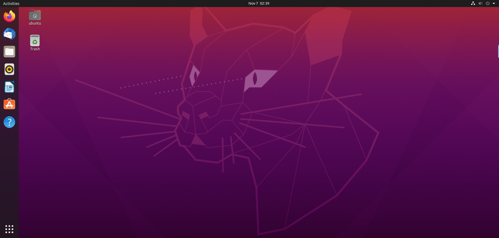

## 配置系统环境

### 更换软件源

进入ubuntu系统后，首先需要换源，原本的软件源是国外的，我们需要换成国内，否则很多依赖无法下载。

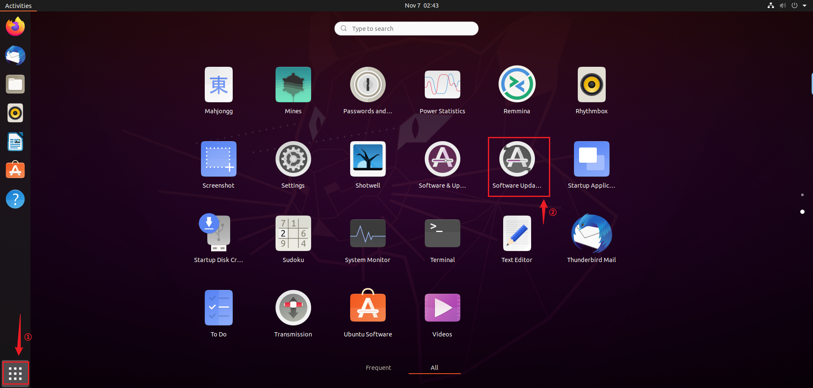

选择 `Settings`，

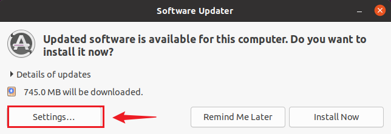

找到`Ubuntu Software`，点击②箭头，选择`Other`。

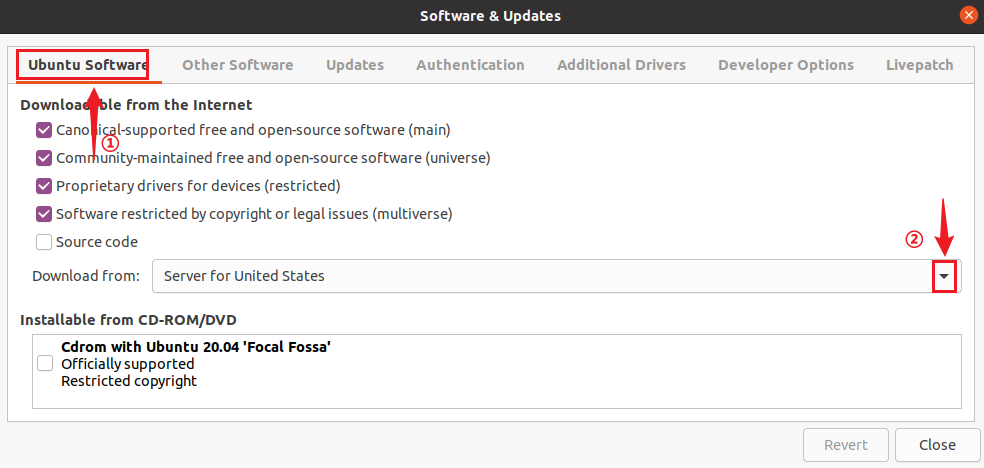

国内的源有很多，这里使用的是阿里源，

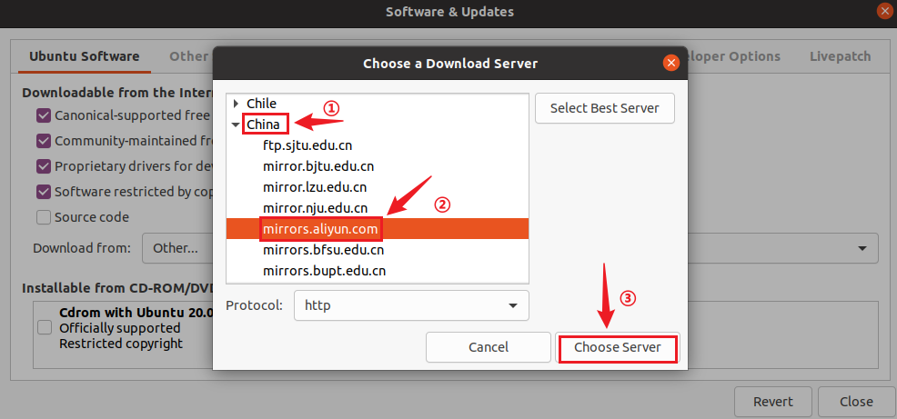

确定选择之后，需要输入密码，**密码还是`ubuntu`**。

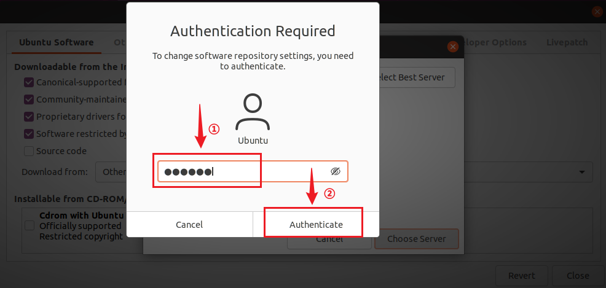

可以看到软件源已经配置为阿里云源，然后关闭软件即可。

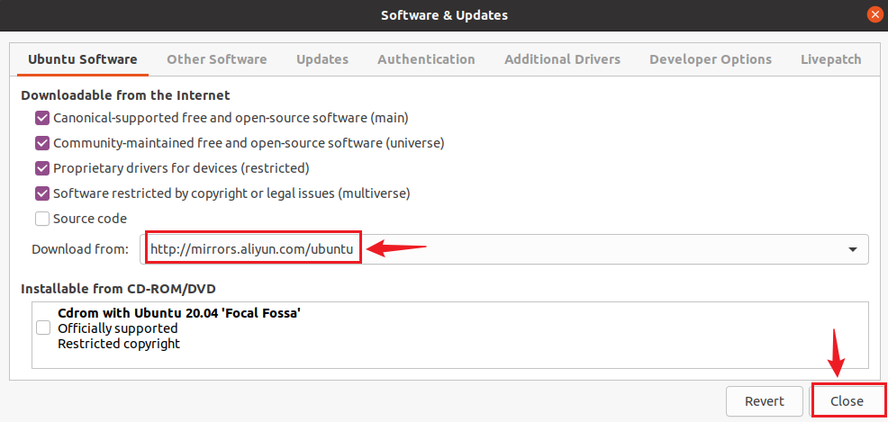

最后会跳出以下信息，选择`Reload`，等待刷新完成。

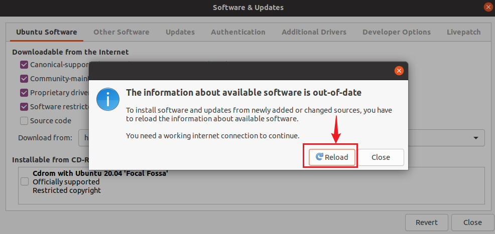

刷新完成后，输入快捷键`ctrl + alt + t`，打开终端，执行`sudo apt update`，可以看到是使用阿里云源来更新系统软件包列表。

~~~bash
sudo apt update
~~~

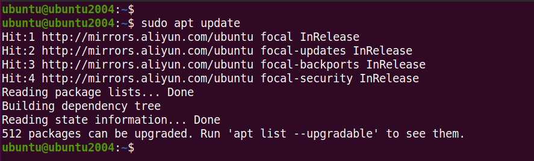

### 下载工具包

> ubuntu 的复制粘贴快捷键分别是 `ctrl + shift + c`和`ctrl + shift + v`

在开发的过程中，经常会在 ubuntu 和 windows 之间互相复制粘贴，正常情况下是无法进行复制粘贴，需要下载一个工具包，来实现这个功能。手动执行以下指令：

~~~bash
sudo apt update
sudo apt install open-vm-tools
sudo apt install open-vm-tools-desktop
sudo reboot
~~~

重启之后，就可以进行 ubuntu 和 windows 之间的复制粘贴了。

