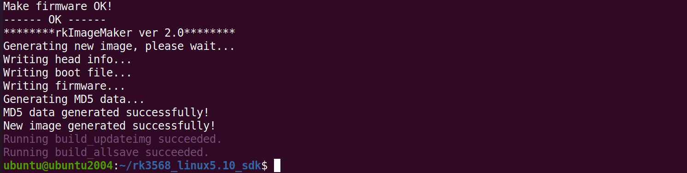
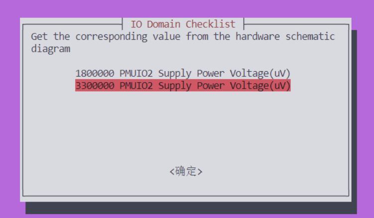

# 编译固件

## 1.选择板级配置文件

进入 SDK 包根目录，执行以下指令：

~~~bash
./build.sh lunch
~~~

选择 `100ask_rk3568_defconfig`

~~~bash
ubuntu@ubuntu2004:~/rk3568_linux5.10_sdk$ ./build.sh lunch
Pick a defconfig:

1. rockchip_defconfig
2. 100ask_rk3568_defconfig
3. rockchip_rk3566_evb2_lp4x_v10_32bit_defconfig
4. rockchip_rk3566_evb2_lp4x_v10_defconfig
5. rockchip_rk3568_evb1_ddr4_v10_32bit_defconfig
6. rockchip_rk3568_evb1_ddr4_v10_defconfig
7. rockchip_rk3568_uvc_evb1_ddr4_v10_defconfig
Which would you like? [1]: 2
Switching to defconfig: /home/ubuntu/rk3568_linux5.10_sdk/device/rockchip/.chip/100ask_rk3568_defconfig
make: Entering directory '/home/ubuntu/rk3568_linux5.10_sdk/device/rockchip/common'
#
# configuration written to /home/ubuntu/rk3568_linux5.10_sdk/output/.config
#
make: Leaving directory '/home/ubuntu/rk3568_linux5.10_sdk/device/rockchip/common'
Using prebuilt GCC toolchain: /home/ubuntu/rk3568_linux5.10_sdk/prebuilts/gcc/linux-x86/aarch64/gcc-arm-10.3-2021.07-x86_64-aarch64-none-linux-gnu/bin/aarch64-none-linux-gnu-
~~~

## 2.编译

在当前目录下，执行编译所有：

~~~bash
./build.sh
~~~

这个过程耗时较长，具体多久，根据电脑性能决定。

在编译过程，可能你会遇到一下界面，

这里需要选择相应的电压，根据以下电压设置进行选择，

~~~bash
&pmu_io_domains {
        status = "okay";
        pmuio2-supply = <&vcc3v3_pmu>;
        vccio1-supply = <&vccio_acodec>; /*3v3*/
        vccio3-supply = <&vccio_sd>;     /*3v3*/
        vccio4-supply = <&vcc_1v8>;
        vccio5-supply = <&vcc_3v3>;
        vccio6-supply = <&vcc_1v8>;
        vccio7-supply = <&vcc_3v3>;
};
~~~

如果电压值选择不正确，会提示编译错误。

## 3.打包固件

编译时长较久，等待编译完成后，SDK会自动把用于烧录的镜像 update.img 打包到 output/update/Image/ 下，

如下：

~~~bash
ubuntu@ubuntu2004:~/rk3568_linux5.10_sdk/output/update/Image$ ls -lah
total 2.2G
drwxrwxr-x 2 ubuntu ubuntu 4.0K Jan 13 05:53 .
drwxrwxr-x 3 ubuntu ubuntu 4.0K Jan 13 05:53 ..
lrwxrwxrwx 1 ubuntu ubuntu   24 Jan 13 05:53 boot.img -> ../../../kernel/boot.img
lrwxrwxrwx 1 ubuntu ubuntu   47 Jan 13 05:53 MiniLoaderAll.bin -> ../../../u-boot/rk356x_spl_loader_v1.16.112.bin
lrwxrwxrwx 1 ubuntu ubuntu   56 Jan 13 05:53 misc.img -> ../../../device/rockchip/common/images/wipe_all-misc.img
lrwxrwxrwx 1 ubuntu ubuntu   22 Jan 13 05:53 oem.img -> ../../firmware/oem.img
-rw-rw-r-- 1 ubuntu ubuntu  203 Jan 13 05:53 package-file
lrwxrwxrwx 1 ubuntu ubuntu   73 Jan 13 05:53 parameter.txt -> ../../../device/rockchip/.chips/rk3566_rk3568/parameter-buildroot-fit.txt
lrwxrwxrwx 1 ubuntu ubuntu   67 Jan 13 05:53 rootfs.img -> ../../../buildroot/output/rockchip_rk3568_100ask/images/rootfs.ext2
lrwxrwxrwx 1 ubuntu ubuntu   25 Jan 13 05:53 uboot.img -> ../../../u-boot/uboot.img
-rw-rw-r-- 1 ubuntu ubuntu 1.1G Jan 13 05:53 update.img
-rw-rw-r-- 1 ubuntu ubuntu 1.1G Jan 13 05:53 update.raw.img
lrwxrwxrwx 1 ubuntu ubuntu   27 Jan 13 05:53 userdata.img -> ../../firmware/userdata.img
~~~