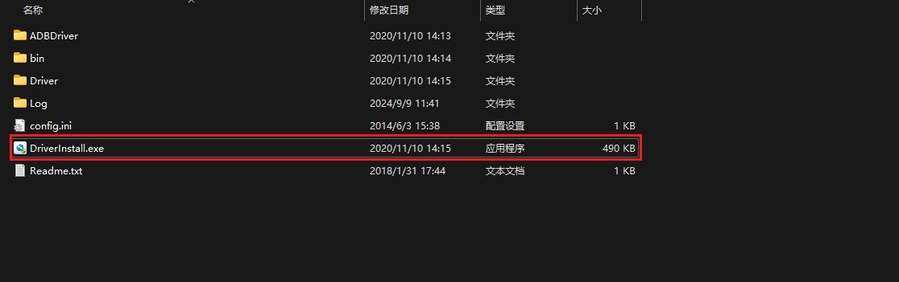
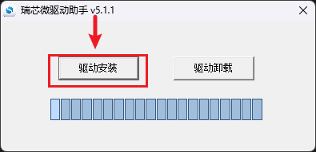
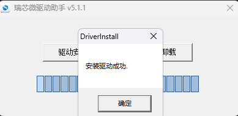
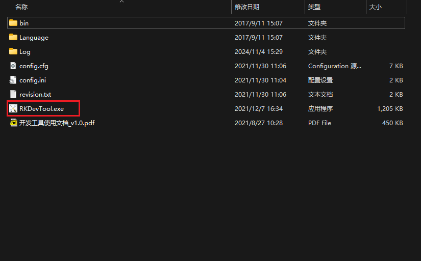
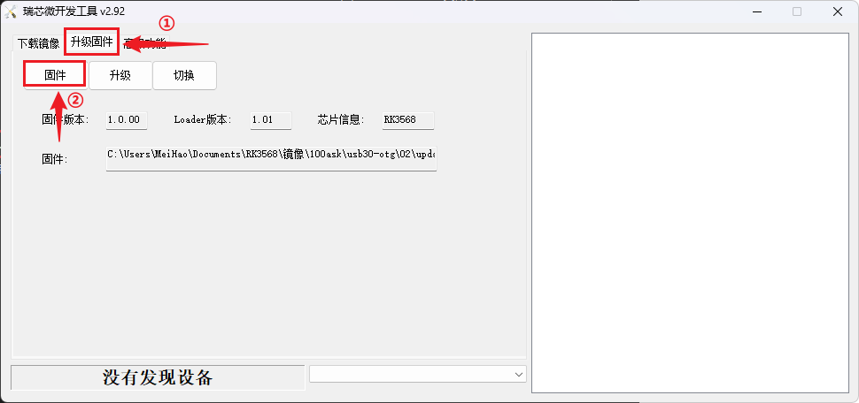
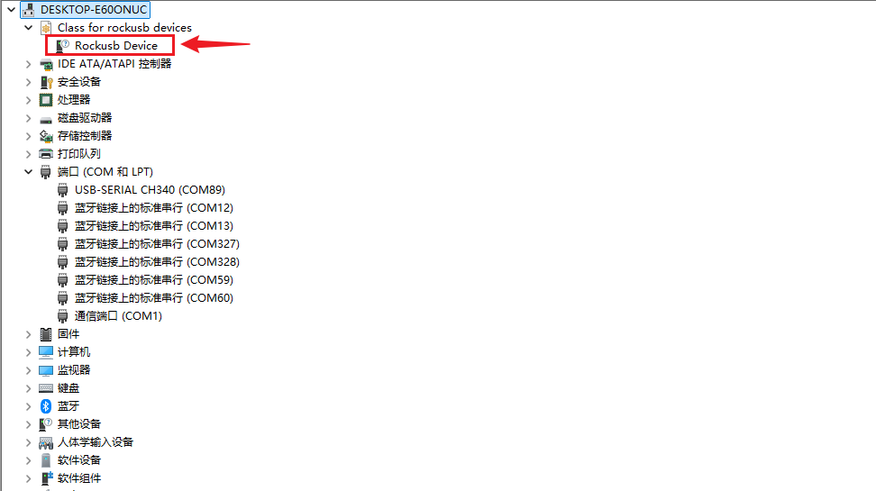
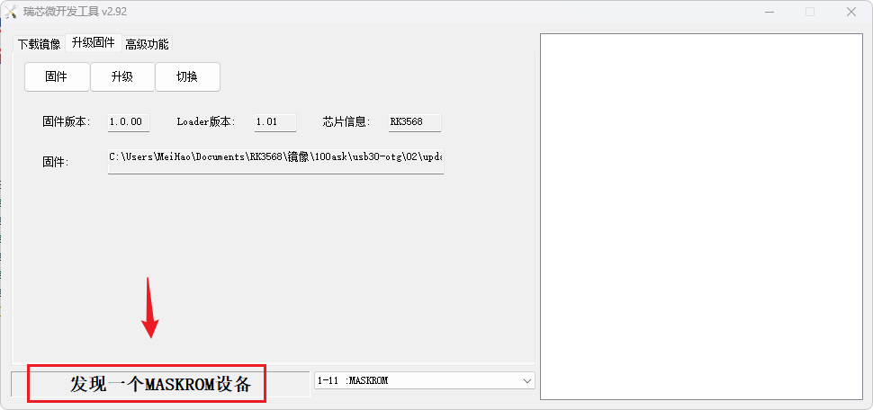
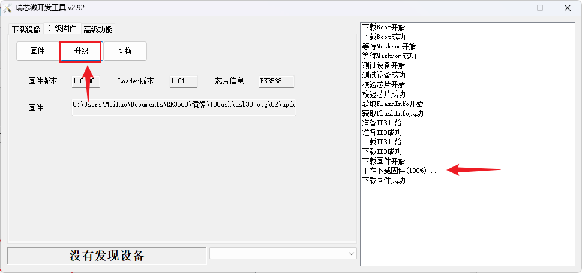

# 更新系统固件

## 烧写固件至EMMC

### 准备工作

**硬件：**

- TypeC线 x1
- TTL转串口模块 x1
- 12v电源适配器 x1

**软件：**

- 烧录工具 [RKDevTool_Release_v2.92.zip](https://dl.100ask.net/Hardware/MPU/RK3568-DshanPI-R1/RKDevTool_Release_v2.92.zip)
- 烧录驱动 [DriverAssitant_v5.1.1.zip](https://dl.100ask.net/Hardware/MPU/RK3568-DshanPI-R1/DriverAssitant_v5.1.1.zip)
- 镜像 [DshanPI-R1-RK3568-DefaultSystem_V1.7z](https://dl.100ask.net/Hardware/MPU/RK3568-DshanPI-R1/Images/DshanPI-R1-RK3568-DefaultSystem_V1.7z)

### 安装烧录工具 

进行烧录之前，下载烧录驱动的文件夹 `DriverAssitant_v5.1.1.zip`，解压文件夹，打开可以看到以下文件，

双击打开程序 `DriverInstall.exe`，点击驱动安装。

安装成功后，点击**确定**，然后关闭驱动助手。驱动自此安装完成。

### 连接开发板

烧录系统前，需要连接好开发板。如果不清楚如何连接开发板登录串口终端，可以先阅读《启动开发板》章节。

### 运行软件烧写

将下载下来的文件 RKDevTool_Release_v2.92 解压，同时也将 DshanPI-R1-RK3568-DefaultSystem_V1.img 镜像下载下来，也进行解压，保存在一个能找得到的路径下，该镜像目前支持开发板所有文档描述的功能，对应md5值是`2e44379638a60c2691df65a354d5ff86`。文件解压之后，得到一个名为 RKDevTool_Release_v2.92 的文件夹，有以下文件，双击点击 `RKDevTool.exe`，打开烧录工具：

打开之后，点击 **①升级固件**，然后点击 **②固件** 找到下载解压的镜像文件`DshanPI-R1-RK3568-DefaultSystem_V1.img`(这个镜像也可以在SDK生成)，

选择好镜像之后，接下来需要**长按**物理按键`BOOT`，不要松开，然后点击物理按键`RESET`，这个时候可以看到设备管理器会出现以下设备：

证明烧录驱动安装成功，同样烧录软件会出现以下标识。

出现这个标识之后，就可以松开物理按键`BOOT`了，然后点击升级，等待升级完成。

### 启动系统

烧录完成后，可以看到串口打印信息如下：

~~~bash
DDR V1.16 6f71c736ce typ 23/03/02-20:01:48
In
LP4/4x derate en, other dram:1x trefi
ddrconfig:0
LP4 MR14:0x4d
LPDDR4, 324MHz
BW=32 Col=10 Bk=8 CS0 Row=16 CS=1 Die BW=16 Size=2048MB
tdqss: cs0 dqs0: 72ps, dqs1: -48ps, dqs2: -24ps, dqs3: -96ps,

change to: 324MHz
PHY drv:clk:38,ca:38,DQ:30,odt:0
vrefinner:41%, vrefout:41%
dram drv:40,odt:0
clk skew:0x60

change to: 528MHz
PHY drv:clk:38,ca:38,DQ:30,odt:0
vrefinner:41%, vrefout:41%
dram drv:40,odt:0
clk skew:0x58

change to: 780MHz
PHY drv:clk:38,ca:38,DQ:30,odt:0
vrefinner:41%, vrefout:41%
dram drv:40,odt:0
clk skew:0x58

change to: 1560MHz(final freq)
PHY drv:clk:38,ca:38,DQ:30,odt:60
vrefinner:16%, vrefout:29%
dram drv:40,odt:80
vref_ca:00000068
clk skew:0x13
cs 0:
the read training result:
DQS0:0x2f, DQS1:0x2e, DQS2:0x34, DQS3:0x2f,
min  :0x10  0xf 0x13  0xf  0x2  0x5  0x8  0x3 , 0xd  0xa  0x3  0x1  0xd  0x9  0xd  0x8 ,
      0x14 0x13  0xd  0xa  0x5  0x2  0x3  0x8 , 0xe  0xa  0x8  0x2 0x10  0xf  0xd  0xd ,
mid  :0x28 0x28 0x2b 0x27 0x1a 0x1d 0x21 0x1b ,0x23 0x21 0x1a 0x19 0x24 0x22 0x24 0x1f ,
      0x2d 0x2d 0x26 0x24 0x1d 0x1c 0x1b 0x20 ,0x27 0x24 0x22 0x1b 0x29 0x2a 0x27 0x29 ,
max  :0x41 0x41 0x44 0x3f 0x32 0x36 0x3a 0x33 ,0x3a 0x38 0x31 0x31 0x3c 0x3b 0x3b 0x36 ,
      0x47 0x47 0x40 0x3f 0x36 0x36 0x34 0x38 ,0x41 0x3f 0x3d 0x35 0x42 0x46 0x42 0x46 ,
range:0x31 0x32 0x31 0x30 0x30 0x31 0x32 0x30 ,0x2d 0x2e 0x2e 0x30 0x2f 0x32 0x2e 0x2e ,
      0x33 0x34 0x33 0x35 0x31 0x34 0x31 0x30 ,0x33 0x35 0x35 0x33 0x32 0x37 0x35 0x39 ,
the write training result:
DQS0:0x21, DQS1:0xa, DQS2:0xf, DQS3:0x0,
min  :0x71 0x73 0x77 0x70 0x60 0x65 0x6a 0x68 0x66 ,0x57 0x57 0x50 0x50 0x5a 0x57 0x59 0x56 0x51 ,
      0x68 0x67 0x60 0x5e 0x58 0x55 0x57 0x5a 0x5b ,0x59 0x58 0x56 0x4f 0x5c 0x5d 0x59 0x5e 0x52 ,
mid  :0x8d 0x8e 0x91 0x8c 0x7b 0x7f 0x85 0x82 0x80 ,0x73 0x72 0x68 0x69 0x73 0x70 0x72 0x6f 0x69 ,
      0x84 0x84 0x7b 0x7a 0x73 0x6f 0x72 0x75 0x76 ,0x75 0x73 0x70 0x69 0x75 0x77 0x73 0x78 0x6d ,
max  :0xa9 0xaa 0xac 0xa8 0x96 0x9a 0xa0 0x9c 0x9b ,0x90 0x8d 0x81 0x82 0x8c 0x89 0x8b 0x88 0x82 ,
      0xa0 0xa2 0x97 0x97 0x8e 0x8a 0x8d 0x91 0x92 ,0x92 0x8e 0x8b 0x84 0x8e 0x91 0x8e 0x93 0x88 ,
range:0x38 0x37 0x35 0x38 0x36 0x35 0x36 0x34 0x35 ,0x39 0x36 0x31 0x32 0x32 0x32 0x32 0x32 0x31 ,
      0x38 0x3b 0x37 0x39 0x36 0x35 0x36 0x37 0x37 ,0x39 0x36 0x35 0x35 0x32 0x34 0x35 0x35 0x36 ,
CA Training result:
cs:0 min  :0x4f 0x49 0x44 0x39 0x44 0x38 0x4d ,0x4f 0x43 0x43 0x35 0x42 0x37 0x4e ,
cs:0 mid  :0x8b 0x8b 0x7d 0x7b 0x7d 0x77 0x77 ,0x88 0x86 0x7b 0x76 0x7a 0x77 0x78 ,
cs:0 max  :0xc7 0xce 0xb6 0xbe 0xb6 0xb7 0xa2 ,0xc1 0xc9 0xb3 0xb8 0xb3 0xb8 0xa2 ,
cs:0 range:0x78 0x85 0x72 0x85 0x72 0x7f 0x55 ,0x72 0x86 0x70 0x83 0x71 0x81 0x54 ,
out
U-Boot SPL board init
U-Boot SPL 2017.09-gaaca6ffec1-211203 #zzz (Dec 03 2021 - 18:42:16)
unknown raw ID phN
unrecognized JEDEC id bytes: 00, 00, 00
Trying to boot from MMC2
MMC error: The cmd index is 1, ret is -110
Card did not respond to voltage select!
mmc_init: -95, time 17
spl: mmc init failed with error: -95
Trying to boot from MMC1
SPL: A/B-slot: _a, successful: 0, tries-remain: 7
Trying fit image at 0x4000 sector
## Verified-boot: 0
## Checking atf-1 0x00040000 ... sha256(fc070f5a40...) + OK
## Checking uboot 0x00a00000 ... sha256(33de32218e...) + OK
## Checking fdt 0x00b39220 ... sha256(fcfda359c0...) + OK
## Checking atf-2 0xfdcc1000 ... sha256(b7e96f5509...) + OK
## Checking atf-3 0x0006c000 ... sha256(fd59386129...) + OK
## Checking atf-4 0xfdcd0000 ... sha256(415b5d518f...) + OK
## Checking atf-5 0xfdcce000 ... sha256(4d791bf003...) + OK
## Checking atf-6 0x0006a000 ... sha256(6e9d32ba23...) + OK
## Checking optee 0x08400000 ... sha256(af414b9c9f...) + OK
Jumping to U-Boot(0x00a00000) via ARM Trusted Firmware(0x00040000)
Total: 316.19 ms

INFO:    Preloader serial: 2
NOTICE:  BL31: v2.3():v2.3-578-gaef7950e4:huan.he
NOTICE:  BL31: Built : 14:05:25, Apr 19 2023
INFO:    GICv3 without legacy support detected.
INFO:    ARM GICv3 driver initialized in EL3
INFO:    pmu v1 is valid 220114
INFO:    dfs DDR fsp_param[0].freq_mhz= 1560MHz
INFO:    dfs DDR fsp_param[1].freq_mhz= 324MHz
INFO:    dfs DDR fsp_param[2].freq_mhz= 528MHz
INFO:    dfs DDR fsp_param[3].freq_mhz= 780MHz
INFO:    BL31: Initialising Exception Handling Framework
INFO:    BL31: Initializing runtime services
INFO:    BL31: Initializing BL32
I/TC:
I/TC: OP-TEE version: 3.13.0-651-gd84087907 #hisping.lin (gcc version 10.2.1 20201103 (GNU Toolchain for the A-profile Architecture 10.2-2020.11 (arm-10.16))) #5 Fri Sep 16 15:39:33 CST 2022 aarch64
I/TC: Primary CPU initializing
I/TC: Primary CPU switching to normal world boot
INFO:    BL31: Preparing for EL3 exit to normal world
INFO:    Entry point address = 0xa00000
INFO:    SPSR = 0x3c9

U-Boot 2017.09 (Oct 29 2024 - 02:48:54 -0400)

Model: Rockchip RK3568 Evaluation Board
PreSerial: 2, raw, 0xfe660000
DRAM:  2 GiB
Sysmem: init
Relocation Offset: 7d23f000
Relocation fdt: 7b9f8f00 - 7b9fece0
CR: M/C/I
Using default environment

dwmmc@fe2b0000: 1, dwmmc@fe2c0000: 2, sdhci@fe310000: 0
Bootdev(atags): mmc 0
MMC0: HS200, 200Mhz
PartType: EFI
DM: v1
boot mode: None
FIT: no signed, no conf required
DTB: rk-kernel.dtb
HASH(c): OK
I2c0 speed: 100000Hz
vsel-gpios- not found! Error: -2
vdd_cpu init 900000 uV
PMIC:  RK8090 (on=0x10, off=0x00)
vdd_logic init 900000 uV
vdd_gpu init 900000 uV
vdd_npu init 900000 uV
io-domain: OK
INFO:    ddr dmc_fsp already initialized in loader.
Warn: can't find connect driver
Warn: can't get connect driver
Could not find baseparameter partition
Model: Rockchip RK3568 EVB1 DDR4 V10 Board
Rockchip UBOOT DRM driver version: v1.0.1
VOP have 2 active VP
vp0 have layer nr:3[1 3 5 ], primary plane: 5
vp1 have layer nr:3[0 2 4 ], primary plane: 4
vp2 have layer nr:0[], primary plane: 0
Using display timing dts
dsi@fe060000:  detailed mode clock 25600 kHz, flags[8000000a]
    H: 0480 0490 0495 0515
    V: 0800 0805 0810 0830
bus_format: 100e
VOP update mode to: 480x800p60, type: MIPI0 for VP1
VP1 set crtc_clock to 25583KHz
VOP VP1 enable Smart0[654x270->480x270@0x265] fmt[2] addr[0x7df04000]
final DSI-Link bandwidth: 480 Mbps x 2
hdmi@fe0a0000 disconnected
CLK: (sync kernel. arm: enter 816000 KHz, init 816000 KHz, kernel 0N/A)
  apll 1416000 KHz
  dpll 780000 KHz
  gpll 1188000 KHz
  cpll 1000000 KHz
  npll 1200000 KHz
  vpll 614000 KHz
  hpll 24000 KHz
  ppll 200000 KHz
  armclk 1416000 KHz
  aclk_bus 150000 KHz
  pclk_bus 100000 KHz
  aclk_top_high 500000 KHz
  aclk_top_low 400000 KHz
  hclk_top 150000 KHz
  pclk_top 100000 KHz
  aclk_perimid 300000 KHz
  hclk_perimid 150000 KHz
  pclk_pmu 100000 KHz
Net:   eth1: ethernet@fe010000, eth0: ethernet@fe2a0000
Hit key to stop autoboot('CTRL+C'):  0
ANDROID: reboot reason: "(none)"
optee api revision: 2.0
TEEC: Waring: Could not find security partition
Not AVB images, AVB skip
No valid android hdr
Android image load failed
Android boot failed, error -1.
## Booting FIT Image at 0x7a0ebac0 with size 0x0170c400
Fdt Ramdisk skip relocation
## Loading kernel from FIT Image at 7a0ebac0 ...
   Using 'conf' configuration
## Verified-boot: 0
   Trying 'kernel' kernel subimage
     Description:  unavailable
     Type:         Kernel Image
     Compression:  uncompressed
     Data Start:   0x7a10e4c0
     Data Size:    24025096 Bytes = 22.9 MiB
     Architecture: AArch64
     OS:           Linux
     Load Address: 0x00280000
     Entry Point:  0x00280000
     Hash algo:    sha256
     Hash value:   dea086f7273fdc1774dd51eae36a776433e07f9d0ddcb91bc98f9b927f3d629a
   Verifying Hash Integrity ... sha256+ OK
## Loading fdt from FIT Image at 7a0ebac0 ...
   Using 'conf' configuration
   Trying 'fdt' fdt subimage
     Description:  unavailable
     Type:         Flat Device Tree
     Compression:  uncompressed
     Data Start:   0x7a0ec2c0
     Data Size:    139587 Bytes = 136.3 KiB
     Architecture: AArch64
     Load Address: 0x08300000
     Hash algo:    sha256
     Hash value:   6917a5bf548d302c7f345c5e31a6af49f3fedd2e6ae571333e490bc188c98e81
   Verifying Hash Integrity ... sha256+ OK
   Loading fdt from 0x08300000 to 0x08300000
   Booting using the fdt blob at 0x08300000
   Loading Kernel Image from 0x7a10e4c0 to 0x00280000 ... OK
   kernel loaded at 0x00280000, end = 0x01969808
  'reserved-memory' ramoops@110000: addr=110000 size=f0000
   Using Device Tree in place at 0000000008300000, end 0000000008325142
vp1 adjust cursor plane from 0 to 1
vp0, plane_mask:0x2a, primary-id:5, curser-id:1
vp1 adjust cursor plane from 1 to 0
vp1, plane_mask:0x15, primary-id:4, curser-id:0
vp2, plane_mask:0x0, primary-id:0, curser-id:-1
Adding bank: 0x00200000 - 0x08400000 (size: 0x08200000)
Adding bank: 0x09400000 - 0x80000000 (size: 0x76c00000)
Total: 1654.965 ms

Starting kernel ...

[    0.000000] Booting Linux on physical CPU 0x0000000000 [0x412fd050]
[    0.000000] Linux version 4.19.232 (ubuntu@ubuntu2004) (gcc version 10.3.1 20210621 (GNU Toolchain for the A-profile Architecture 10.3-2021.07 (arm-10.29)), GNU ld (GNU Toolchain for the A-profile Architecture 10.3-2021.07 (arm-10.29)) 2.36.1.20210621) #13 SMP Tue Oct 29 02:27:45 EDT 2024
[    0.000000] Machine model: Rockchip RK3568 EVB1 DDR4 V10 Board
[    0.000000] earlycon: uart8250 at MMIO32 0x00000000fe660000 (options '')
[    0.000000] bootconsole [uart8250] enabled
[    0.000000] cma: Reserved 16 MiB at 0x000000007ec00000
[    0.000000] psci: probing for conduit method from DT.
[    0.000000] psci: PSCIv1.1 detected in firmware.
[    0.000000] psci: Using standard PSCI v0.2 function IDs
[    0.000000] psci: Trusted OS migration not required
[    0.000000] psci: SMC Calling Convention v1.2
[    0.000000] percpu: Embedded 23 pages/cpu s54184 r8192 d31832 u94208
[    0.000000] Detected VIPT I-cache on CPU0
[    0.000000] CPU features: detected: Virtualization Host Extensions
[    0.000000] CPU features: detected: Speculative Store Bypassing Safe (SSBS)
[    0.000000] Built 1 zonelists, mobility grouping on.  Total pages: 511496
[    0.000000] Kernel command line: storagemedia=emmc androidboot.storagemedia=emmc androidboot.mode=normal  androidboot.verifiedbootstate=orange rw rootwait earlycon=uart8250,mmio32,0xfe660000 console=ttyFIQ0 root=PARTUUID=614e0000-0000
[    0.000000] Dentry cache hash table entries: 262144 (order: 9, 2097152 bytes)
[    0.000000] Inode-cache hash table entries: 131072 (order: 8, 1048576 bytes)
[    0.000000] mem auto-init: stack:off, heap alloc:off, heap free:off
[    0.000000] Memory: 1999424K/2078720K available (14590K kernel code, 2022K rwdata, 5220K rodata, 1600K init, 558K bss, 62912K reserved, 16384K cma-reserved)
[    0.000000] SLUB: HWalign=64, Order=0-3, MinObjects=0, CPUs=4, Nodes=1
[    0.000000] ftrace: allocating 52639 entries in 206 pages
[    0.000000] rcu: Hierarchical RCU implementation.
[    0.000000] rcu:     RCU event tracing is enabled.
[    0.000000] rcu:     RCU restricting CPUs from NR_CPUS=8 to nr_cpu_ids=4.
[    0.000000] rcu: Adjusting geometry for rcu_fanout_leaf=16, nr_cpu_ids=4
[    0.000000] NR_IRQS: 64, nr_irqs: 64, preallocated irqs: 0
[    0.000000] GICv3: GIC: Using split EOI/Deactivate mode
[    0.000000] GICv3: Distributor has no Range Selector support
[    0.000000] GICv3: no VLPI support, no direct LPI support
[    0.000000] ITS [mem 0xfd440000-0xfd45ffff]
[    0.000000] ITS@0x00000000fd440000: allocated 8192 Devices @7e500000 (indirect, esz 8, psz 64K, shr 0)
[    0.000000] ITS@0x00000000fd440000: allocated 32768 Interrupt Collections @7e510000 (flat, esz 2, psz 64K, shr 0)
[    0.000000] ITS: using cache flushing for cmd queue
[    0.000000] GIC: using LPI property table @0x000000007e520000
[    0.000000] GICv3: CPU0: found redistributor 0 region 0:0x00000000fd460000
[    0.000000] CPU0: using LPI pending table @0x000000007e530000
[    0.000000] GIC: using cache flushing for LPI property table
[    0.000000] random: random: get_random_bytes called from start_kernel+0x358/0x4e0 with crng_init=0
[    0.000000] arch_timer: cp15 timer(s) running at 24.00MHz (phys).
[    0.000000] clocksource: arch_sys_counter: mask: 0xffffffffffffff max_cycles: 0x588fe9dc0, max_idle_ns: 440795202592 ns
[    0.000004] sched_clock: 56 bits at 24MHz, resolution 41ns, wraps every 4398046511097ns
[    0.009717] Console: colour dummy device 80x25
[    0.014625] Calibrating delay loop (skipped), value calculated using timer frequency.. 48.00 BogoMIPS (lpj=80000)
[    0.025894] pid_max: default: 32768 minimum: 301
[    0.031074] Mount-cache hash table entries: 4096 (order: 3, 32768 bytes)
[    0.038443] Mountpoint-cache hash table entries: 4096 (order: 3, 32768 bytes)
[    0.047429] ASID allocator initialised with 32768 entries
[    0.053472] rcu: Hierarchical SRCU implementation.
[    0.060597] Platform MSI: interrupt-controller@fd440000 domain created
[    0.068150] PCI/MSI: /interrupt-controller@fd400000/interrupt-controller@fd440000 domain created
[    0.078358] smp: Bringing up secondary CPUs ...
I/TC: Secondary CPU 1 initializing
I/TC: Secondary CPU 1 switching to normal world boot
I/TC: Secondary CPU 2 initializing
I/TC: Secondary CPU 2 switching to normal world boot
I/TC: Secondary CPU 3 initializing
I/TC: Secondary CPU 3 switching to normal world boot
[    0.091566] Detected VIPT I-cache on CPU1
[    0.091593] GICv3: CPU1: found redistributor 100 region 0:0x00000000fd480000
[    0.091629] CPU1: using LPI pending table @0x000000007e6b0000
[    0.091670] CPU1: Booted secondary processor 0x0000000100 [0x412fd050]
[    0.099960] Detected VIPT I-cache on CPU2
[    0.099983] GICv3: CPU2: found redistributor 200 region 0:0x00000000fd4a0000
[    0.100022] CPU2: using LPI pending table @0x000000007e710000
[    0.100056] CPU2: Booted secondary processor 0x0000000200 [0x412fd050]
[    0.108335] Detected VIPT I-cache on CPU3
[    0.108355] GICv3: CPU3: found redistributor 300 region 0:0x00000000fd4c0000
[    0.108390] CPU3: using LPI pending table @0x000000007e730000
[    0.108422] CPU3: Booted secondary processor 0x0000000300 [0x412fd050]
[    0.108518] smp: Brought up 1 node, 4 CPUs
[    0.189791] SMP: Total of 4 processors activated.
[    0.194954] CPU features: detected: GIC system register CPU interface
[    0.202024] CPU features: detected: Privileged Access Never
[    0.208140] CPU features: detected: LSE atomic instructions
[    0.214256] CPU features: detected: User Access Override
[    0.220087] CPU features: detected: 32-bit EL0 Support
[    0.225725] CPU features: detected: RAS Extension Support
[    0.231765] CPU: All CPU(s) started at EL2
[    0.236284] alternatives: patching kernel code
[    0.245672] devtmpfs: initialized
[    0.266545] Registered cp15_barrier emulation handler
[    0.272124] Registered setend emulation handler
[    0.277320] clocksource: jiffies: mask: 0xffffffff max_cycles: 0xffffffff, max_idle_ns: 6370867519511994 ns
[    0.288028] futex hash table entries: 1024 (order: 4, 65536 bytes)
[    0.295290] pinctrl core: initialized pinctrl subsystem
[    0.301790] NET: Registered protocol family 16
[    0.309459] cpuidle: using governor menu
[    0.313782] Registered FIQ tty driver
[    0.318216] hw-breakpoint: found 6 breakpoint and 4 watchpoint registers.
[    0.326878] DMA: preallocated 256 KiB pool for atomic allocations
[    0.335796] ramoops: dmesg-0 0x20000@0x0000000000110000
[    0.341577] ramoops: console 0x80000@0x0000000000130000
[    0.347323] ramoops: pmsg    0x50000@0x00000000001b0000
[    0.353069] console [pstore-1] enabled
[    0.357186] pstore: Registered ramoops as persistent store backend
[    0.363974] ramoops: attached 0xf0000@0x110000, ecc: 0/0
[    0.392849] rockchip-gpio fdd60000.gpio: probed gpio0 (fdd60000.gpio)
[    0.400362] rockchip-gpio fe740000.gpio: probed gpio1 (fe740000.gpio)
[    0.407840] rockchip-gpio fe750000.gpio: probed gpio2 (fe750000.gpio)
[    0.415317] rockchip-gpio fe760000.gpio: probed gpio3 (fe760000.gpio)
[    0.422793] rockchip-gpio fe770000.gpio: probed gpio4 (fe770000.gpio)
[    0.429938] rockchip-pinctrl pinctrl: probed pinctrl
[    0.444688] cryptd: max_cpu_qlen set to 1000
[[    0.450729] console [ttyFIQ0] enabled
    0.450729] console [ttyFIQ0] enabled
[    0.458412] bootconsole [uart8250] disabled
[    0.458412] bootconsole [uart8250] disabled
[    0.463176] Registered fiq debugger ttyFIQ0
[    0.463886] vcc3v3_sys: supplied by dc_12v
[    0.464171] vcc5v0_sys: supplied by dc_12v
[    0.464449] vcc5v0_usb: supplied by dc_12v
[    0.464820] vcc5v0_host: supplied by vcc5v0_usb
[    0.465128] vcc3v3_lcd0_n: supplied by vcc3v3_sys
[    0.465425] vcc3v3_lcd1_n: supplied by vcc3v3_sys
[    0.465716] vcc2v5-sys: supplied by vcc3v3_sys
[    0.465997] vcc3v3_vga: supplied by vcc3v3_sys
[    0.466286] pcie30_avdd0v9: supplied by vcc3v3_sys
[    0.466607] pcie30_avdd1v8: supplied by vcc3v3_sys
[    0.466900] vcc3v3_bu: supplied by vcc5v0_sys
[    0.467931] pcie20_3v3: supplied by dc_12v
[    0.468455] rk_iommu fde4b000.iommu: version = 2
[    0.468899] rk_iommu fdea0800.iommu: version = 2
[    0.469189] rk_iommu fded0480.iommu: version = 2
[    0.469516] rk_iommu fdee0800.iommu: version = 2
[    0.469827] rk_iommu fdef0800.iommu: version = 2
[    0.470099] rk_iommu fdf40f00.iommu: version = 2
[    0.470427] rk_iommu fdf80800.iommu: version = 2
[    0.470711] rk_iommu fdff1a00.iommu: version = 2
[    0.470991] rk_iommu fe043e00.iommu: version = 2
[    0.471667] SCSI subsystem initialized
[    0.471884] usbcore: registered new interface driver usbfs
[    0.471937] usbcore: registered new interface driver hub
[    0.471983] usbcore: registered new device driver usb
[    0.472110] media: Linux media interface: v0.10
[    0.472167] videodev: Linux video capture interface: v2.00
[    0.472238] pps_core: LinuxPPS API ver. 1 registered
[    0.472254] pps_core: Software ver. 5.3.6 - Copyright 2005-2007 Rodolfo Giometti <giometti@linux.it>
[    0.472278] PTP clock support registered
[    0.472540] arm-scmi firmware:scmi: SCMI Protocol v2.0 'rockchip:' Firmware version 0x0
[    0.474349] Advanced Linux Sound Architecture Driver Initialized.
[    0.474750] Bluetooth: Core ver 2.22
[    0.474794] NET: Registered protocol family 31
[    0.474808] Bluetooth: HCI device and connection manager initialized
[    0.474826] Bluetooth: HCI socket layer initialized
[    0.474842] Bluetooth: L2CAP socket layer initialized
[    0.474875] Bluetooth: SCO socket layer initialized
[    0.476255] rockchip-cpuinfo cpuinfo: SoC            : 35682000
[    0.476282] rockchip-cpuinfo cpuinfo: Serial         : cca7b8659f061daf
[    0.477149] clocksource: Switched to clocksource arch_sys_counter
[    0.537431] thermal thermal_zone1: power_allocator: sustainable_power will be estimated
[    0.537728] NET: Registered protocol family 2
[    0.537883] IP idents hash table entries: 32768 (order: 6, 262144 bytes)
[    0.538806] tcp_listen_portaddr_hash hash table entries: 1024 (order: 3, 40960 bytes)
[    0.538858] TCP established hash table entries: 16384 (order: 5, 131072 bytes)
[    0.538953] TCP bind hash table entries: 16384 (order: 7, 524288 bytes)
[    0.539321] TCP: Hash tables configured (established 16384 bind 16384)
[    0.539478] UDP hash table entries: 1024 (order: 4, 98304 bytes)
[    0.539579] UDP-Lite hash table entries: 1024 (order: 4, 98304 bytes)
[    0.539809] NET: Registered protocol family 1
[    0.540320] RPC: Registered named UNIX socket transport module.
[    0.540335] RPC: Registered udp transport module.
[    0.540347] RPC: Registered tcp transport module.
[    0.540358] RPC: Registered tcp NFSv4.1 backchannel transport module.
[    0.542487] hw perfevents: enabled with armv8_pmuv3 PMU driver, 7 counters available
[    0.544166] Initialise system trusted keyrings
[    0.544326] workingset: timestamp_bits=61 max_order=19 bucket_order=0
[    0.549337] squashfs: version 4.0 (2009/01/31) Phillip Lougher
[    0.550017] NFS: Registering the id_resolver key type
[    0.550053] Key type id_resolver registered
[    0.550067] Key type id_legacy registered
[    0.550106] ntfs: driver 2.1.32 [Flags: R/O].
[    0.550270] jffs2: version 2.2. (NAND) © 2001-2006 Red Hat, Inc.
[    0.550440] fuse init (API version 7.27)
[    0.550774] SGI XFS with security attributes, no debug enabled
[    0.552838] NET: Registered protocol family 38
[    0.552872] Key type asymmetric registered
[    0.552887] Asymmetric key parser 'x509' registered
[    0.552929] Block layer SCSI generic (bsg) driver version 0.4 loaded (major 243)
[    0.552946] io scheduler noop registered
[    0.552958] io scheduler deadline registered
[    0.553059] io scheduler cfq registered (default)
[    0.553076] io scheduler mq-deadline registered
[    0.553088] io scheduler kyber registered
[    0.554053] rockchip-csi2-dphy csi2-dphy0: csi2 dphy0 probe successfully!
[    0.554193] rockchip-csi2-dphy-hw fe870000.csi2-dphy-hw: csi2 dphy hw probe successfully!
[    0.556140] phy phy-fe8b0000.usb2-phy.0: Linked as a consumer to regulator.5
[    0.556276] phy phy-fe8b0000.usb2-phy.1: Linked as a consumer to regulator.5
[    0.556376] phy phy-fe8b0000.usb2-phy.1: No vbus specified for otg port
[    0.563526] rk-pcie 3c0000000.pcie: Linked as a consumer to regulator.14
[    0.563773] rk-pcie 3c0000000.pcie: missing legacy IRQ resource
[    0.563801] rk-pcie 3c0000000.pcie: use outband MSI support
[    0.563865] rk-pcie 3c0000000.pcie: Missing *config* reg space
[    0.563885] rk-pcie 3c0000000.pcie: host bridge /pcie@fe260000 ranges:
[    0.563915] rk-pcie 3c0000000.pcie:   err 0xf4000000..0xf40fffff -> 0xf4000000
[    0.563925] rk-pcie 3c0000000.pcie:    IO 0xf4100000..0xf41fffff -> 0xf4100000
[    0.563947] rk-pcie 3c0000000.pcie:   MEM 0xf4200000..0xf5ffffff -> 0xf4200000
[    0.563954] pwm-backlight backlight: backlight supply power not found, using dummy regulator
[    0.563965] rk-pcie 3c0000000.pcie:   MEM 0x300000000..0x33fffffff -> 0x300000000
[    0.564035] pwm-backlight backlight: Linked as a consumer to regulator.0
[    0.564263] pwm-backlight backlight1: backlight1 supply power not found, using dummy regulator
[    0.564332] pwm-backlight backlight1: Linked as a consumer to regulator.0
[    0.564560] mpp_service mpp-srv: unknown mpp version for missing VCS info
[    0.564578] mpp_service mpp-srv: probe start
[    0.565922] iommu: Adding device fdf40000.rkvenc to group 5
[    0.565964] mpp_rkvenc fdf40000.rkvenc: Linked as a consumer to fdf40f00.iommu
[    0.566147] mpp_rkvenc fdf40000.rkvenc: probing start
[    0.566428] mpp_rkvenc fdf40000.rkvenc: venc regulator not ready, retry
[    0.566444] rkvenc_init:1199: failed to add venc devfreq
[    0.567599] iommu: Adding device fdea0400.vdpu to group 1
[    0.567635] mpp_vdpu2 fdea0400.vdpu: Linked as a consumer to fdea0800.iommu
[    0.567787] mpp_vdpu2 fdea0400.vdpu: probe device
[    0.568204] mpp_vdpu2 fdea0400.vdpu: probing finish
[    0.568667] iommu: Adding device fdee0000.vepu to group 3
[    0.568699] mpp_vepu2 fdee0000.vepu: Linked as a consumer to fdee0800.iommu
[    0.568864] mpp_vepu2 fdee0000.vepu: probe device
[    0.569270] mpp_vepu2 fdee0000.vepu: probing finish
[    0.569725] iommu: Adding device fdef0000.iep to group 4
[    0.569756] mpp-iep2 fdef0000.iep: Linked as a consumer to fdef0800.iommu
[    0.569881] mpp-iep2 fdef0000.iep: probe device
[    0.570194] mpp-iep2 fdef0000.iep: allocate roi buffer failed
[    0.570355] mpp-iep2 fdef0000.iep: probing finish
[    0.570842] iommu: Adding device fded0000.jpegd to group 2
[    0.570875] mpp_jpgdec fded0000.jpegd: Linked as a consumer to fded0480.iommu
[    0.571002] mpp_jpgdec fded0000.jpegd: probe device
[    0.571426] mpp_jpgdec fded0000.jpegd: probing finish
[    0.571912] iommu: Adding device fdf80200.rkvdec to group 6
[    0.571944] mpp_rkvdec2 fdf80200.rkvdec: Linked as a consumer to fdf80800.iommu
[    0.572151] mpp_rkvdec2 fdf80200.rkvdec: probing start
[    0.572182] mpp_rkvdec2 fdf80200.rkvdec: 16 task capacity link mode detected
[    0.572475] mpp_rkvdec2 fdf80200.rkvdec: shared_niu_a is not found!
[    0.572491] rkvdec2_init:925: No niu aclk reset resource define
[    0.572507] mpp_rkvdec2 fdf80200.rkvdec: shared_niu_h is not found!
[    0.572519] rkvdec2_init:928: No niu hclk reset resource define
[    0.572575] mpp_rkvdec2 fdf80200.rkvdec: vdec regulator not ready, retry
[    0.572588] rkvdec2_init:942: failed to add vdec devfreq
[    0.572766] mpp_rkvdec2 fdf80200.rkvdec: probe sub driver failed
[    0.573052] mpp_service mpp-srv: probe success
[    0.576688] dma-pl330 fe530000.dmac: Loaded driver for PL330 DMAC-241330
[    0.576715] dma-pl330 fe530000.dmac:         DBUFF-128x8bytes Num_Chans-8 Num_Peri-32 Num_Events-16
[    0.578658] dma-pl330 fe550000.dmac: Loaded driver for PL330 DMAC-241330
[    0.578682] dma-pl330 fe550000.dmac:         DBUFF-128x8bytes Num_Chans-8 Num_Peri-32 Num_Events-16
[    0.579954] rockchip-system-monitor rockchip-system-monitor: system monitor probe
[    0.580785] Serial: 8250/16550 driver, 10 ports, IRQ sharing disabled
[    0.581548] fe6c0000.serial: ttyS8 at MMIO 0xfe6c0000 (irq = 64, base_baud = 1500000) is a 16550A
[    0.583785] random: fast init done
[    0.584075] iommu: Adding device fe040000.vop to group 8
[    0.584113] rockchip-vop2 fe040000.vop: Linked as a consumer to fe043e00.iommu
[    0.584344] random: crng init done
[    0.588135] rockchip-drm display-subsystem: Linked as a consumer to fe040000.vop
[    0.589036] rockchip-drm display-subsystem: Linked as a consumer to fe0a0000.hdmi
[    0.589390] rockchip-drm display-subsystem: Linked as a consumer to fe060000.dsi
[    0.590579] rockchip-drm display-subsystem: dmc is disabled
[    0.590823] rockchip-vop2 fe040000.vop: [drm:vop2_bind] vp0 assign plane mask: 0x2a, primary plane phy id: 5
[    0.590847] rockchip-vop2 fe040000.vop: [drm:vop2_bind] vp1 assign plane mask: 0x15, primary plane phy id: 4
[    0.590867] rockchip-vop2 fe040000.vop: [drm:vop2_bind] vp2 assign plane mask: 0x0, primary plane phy id: -1
[    0.590965] [drm] unsupported AFBC format[3432564e]
[    0.591021] rockchip-vop2 fe040000.vop: [drm:vop2_bind] Cluster1-win0 as cursor plane for vp0
[    0.591146] rockchip-vop2 fe040000.vop: [drm:vop2_bind] Cluster0-win0 as cursor plane for vp1
[    0.591225] [drm] failed to init overlay plane Cluster0-win1, ret:-13
[    0.591239] [drm] failed to init overlay plane Cluster1-win1, ret:-13
[    0.591378] rockchip-drm display-subsystem: bound fe040000.vop (ops 0xffffff8008f9e100)
[    0.591571] dwhdmi-rockchip fe0a0000.hdmi: Detected HDMI TX controller v2.11a with HDCP (DWC HDMI 2.0 TX PHY)
[    0.592119] dwhdmi-rockchip fe0a0000.hdmi: registered DesignWare HDMI I2C bus driver
[    0.592647] rockchip-drm display-subsystem: bound fe0a0000.hdmi (ops 0xffffff8008fa2930)
[    0.592694] dw-mipi-dsi fe060000.dsi: [drm:dw_mipi_dsi_bind] *ERROR* Failed to find panel or bridge: -517
[    0.597083] panel-simple-dsi fe060000.dsi.0: Linked as a consumer to regulator.6
[    0.597180] panel-simple-dsi fe060000.dsi.0: fe060000.dsi.0 supply vsp not found, using dummy regulator
[    0.597265] panel-simple-dsi fe060000.dsi.0: Linked as a consumer to regulator.0
[    0.597306] panel-simple-dsi fe060000.dsi.0: fe060000.dsi.0 supply vsn not found, using dummy regulator
[    0.598444] mali fde60000.gpu: Kernel DDK version g7p1-01bet0
[    0.598481] cacheinfo: Unable to detect cache hierarchy for CPU 0
[    0.598577] mali fde60000.gpu: Device initialization Deferred
[    0.599094] brd: module loaded
[    0.605115] loop: module loaded
[    0.605476] zram: Added device: zram0
[    0.605583] lkdtm: No crash points registered, enable through debugfs
[    0.609218] rk_gmac-dwmac fe010000.ethernet: no regulator found
[    0.609244] rk_gmac-dwmac fe010000.ethernet: clock input or output? (output).
[    0.609260] rk_gmac-dwmac fe010000.ethernet: TX delay(0x4f).
[    0.609273] rk_gmac-dwmac fe010000.ethernet: RX delay(0x26).
[    0.609290] rk_gmac-dwmac fe010000.ethernet: integrated PHY? (no).
[    0.609562] rk_gmac-dwmac fe010000.ethernet: init for RGMII
[    0.609778] rk_gmac-dwmac fe010000.ethernet: User ID: 0x30, Synopsys ID: 0x51
[    0.609797] rk_gmac-dwmac fe010000.ethernet:         DWMAC4/5
[    0.609812] rk_gmac-dwmac fe010000.ethernet: DMA HW capability register supported
[    0.609826] rk_gmac-dwmac fe010000.ethernet: RX Checksum Offload Engine supported
[    0.609838] rk_gmac-dwmac fe010000.ethernet: TX Checksum insertion supported
[    0.609850] rk_gmac-dwmac fe010000.ethernet: Wake-Up On Lan supported
[    0.609884] rk_gmac-dwmac fe010000.ethernet: TSO supported
[    0.609897] rk_gmac-dwmac fe010000.ethernet: Enable RX Mitigation via HW Watchdog Timer
[    0.609911] rk_gmac-dwmac fe010000.ethernet: TSO feature enabled
[    0.740747] mdio_bus stmmac-1: MDIO device at address 0 is missing.
[    0.742060] rk_gmac-dwmac fe2a0000.ethernet: no regulator found
[    0.742084] rk_gmac-dwmac fe2a0000.ethernet: clock input or output? (output).
[    0.742099] rk_gmac-dwmac fe2a0000.ethernet: TX delay(0x3c).
[    0.742113] rk_gmac-dwmac fe2a0000.ethernet: RX delay(0x2f).
[    0.742128] rk_gmac-dwmac fe2a0000.ethernet: integrated PHY? (no).
[    0.742402] rk_gmac-dwmac fe2a0000.ethernet: init for RGMII
[    0.742618] rk_gmac-dwmac fe2a0000.ethernet: User ID: 0x30, Synopsys ID: 0x51
[    0.742635] rk_gmac-dwmac fe2a0000.ethernet:         DWMAC4/5
[    0.742650] rk_gmac-dwmac fe2a0000.ethernet: DMA HW capability register supported
[    0.742663] rk_gmac-dwmac fe2a0000.ethernet: RX Checksum Offload Engine supported
[    0.742675] rk_gmac-dwmac fe2a0000.ethernet: TX Checksum insertion supported
[    0.742685] rk_gmac-dwmac fe2a0000.ethernet: Wake-Up On Lan supported
[    0.742719] rk_gmac-dwmac fe2a0000.ethernet: TSO supported
[    0.742729] rk_gmac-dwmac fe2a0000.ethernet: Enable RX Mitigation via HW Watchdog Timer
[    0.742743] rk_gmac-dwmac fe2a0000.ethernet: TSO feature enabled
[    0.875769] usbcore: registered new interface driver rndis_wlan
[    0.875834] usbcore: registered new interface driver rtl8150
[    0.875881] usbcore: registered new interface driver r8152
[    0.875926] usbcore: registered new interface driver asix
[    0.875979] usbcore: registered new interface driver ax88179_178a
[    0.876019] usbcore: registered new interface driver cdc_ether
[    0.876063] usbcore: registered new interface driver rndis_host
[    0.876116] usbcore: registered new interface driver cdc_ncm
[    0.876162] usbcore: registered new interface driver cdc_mbim
[    0.877283] dwc3 fcc00000.dwc3: Failed to get clk 'ref': -2
[    0.878300] dwc3 fd000000.dwc3: Failed to get clk 'ref': -2
[    0.880100] ehci_hcd: USB 2.0 'Enhanced' Host Controller (EHCI) Driver
[    0.880129] ehci-pci: EHCI PCI platform driver
[    0.880199] ehci-platform: EHCI generic platform driver
[    0.882438] ehci-platform fd800000.usb: EHCI Host Controller
[    0.882626] ehci-platform fd800000.usb: new USB bus registered, assigned bus number 1
[    0.882912] ehci-platform fd800000.usb: irq 11, io mem 0xfd800000
[    0.893843] ehci-platform fd800000.usb: USB 2.0 started, EHCI 1.00
[    0.894043] usb usb1: New USB device found, idVendor=1d6b, idProduct=0002, bcdDevice= 4.19
[    0.894063] usb usb1: New USB device strings: Mfr=3, Product=2, SerialNumber=1
[    0.894077] usb usb1: Product: EHCI Host Controller
[    0.894090] usb usb1: Manufacturer: Linux 4.19.232 ehci_hcd
[    0.894101] usb usb1: SerialNumber: fd800000.usb
[    0.894527] hub 1-0:1.0: USB hub found
[    0.894577] hub 1-0:1.0: 1 port detected
[    0.897085] ehci-platform fd880000.usb: EHCI Host Controller
[    0.897269] ehci-platform fd880000.usb: new USB bus registered, assigned bus number 2
[    0.897526] ehci-platform fd880000.usb: irq 13, io mem 0xfd880000
[    0.910508] ehci-platform fd880000.usb: USB 2.0 started, EHCI 1.00
[    0.910706] usb usb2: New USB device found, idVendor=1d6b, idProduct=0002, bcdDevice= 4.19
[    0.910723] usb usb2: New USB device strings: Mfr=3, Product=2, SerialNumber=1
[    0.910737] usb usb2: Product: EHCI Host Controller
[    0.910749] usb usb2: mount: /userMdata: can't find LABEL=useradata.
nufacturer: Linux 4.19.232 ehci_hcd
[    0.910760] usb usb2: SerialNumber: fd880000.usb
[    0.911121] hub 2-0:1.0: USB hub found
[    0.911166] hub 2-0:1.0: 1 port detected
[    0.911834] ohci_hcd: USB 1.1 'Open' Host Controller (OHCI) Driver
[    0.911864] ohci-platform: OHCI generic platform driver
[    0.912083] ohci-platform fd840000.usb: Generic Platform OHCI controller
[    0.912241] ohci-platform fd840000.usb: new USB bus registered, assigned bus number 3
[    0.912492] ohci-platform Starting syslogd: fd840000.usb: irq 12, io mem 0xfd840000
[    0.9OK
71319] usb usb3: New USB device found, idVendor=1d6b, idProduct=0001Starting klogd: , bcdDevice= 4.19
[    0.971340] usb OK
usb3: New USB device strings: Mfr=3, Product=2, SerialNumber=1
[    0.971354] usb usb3: Product: GeRunning syscntl: eric Platform OHCI controller
[    0.971366] usb usb3: Manufacturer: Linux 4.19.232 ohci_hcd
[    0.971377] usb usb3: SeriaOK
lNumber: fd840000.usb
b found971775] hub 3-0:1.0: USB hu/usr/bin/modetest
[    0.971819] hub 3-0:1.0: 1 port detected
[    0.972269] ohci-platform fd8c0000.usb: Generic Platform OHCI controller
[    0.972429] ohci-platform fd8c0000.usb: new USB bus registered, assigned bus number 4
[    0.972645] ohci-platform fd8c0000.usb: irq 14, io mem 0xfd8c0000
[    1.031318] usb usb4: New USB device found, idVendor=1d6b, idProduct=0001, bcdDevice= 4.19
[    1.031331] usb usb4: New USB device strings: Mfr=3, Product=2, SerialNumber=1
[    1.031346] usb usb4: Product: Generic Platform OHCI controller
[    1.031358] usb usb4: Manufacturer: Linux 4.Populating /dev using udev: 19.232 ohci_hcd
[    1.031371] usb usb4: SerialNumber: fd8c0000.usb
[    1.031764] hub 4-0:1.0: USB hub found
[    1.031804] hub 4-0:1.0: 1 port detected
[    1.033163] usbcore: registered new interface driver cdc_acm
[    1.033180] cdc_acm: USB Abstract Control Model driver for USB modems and ISDN adapters
[    1.033236] usbcore: registered new interface driver cdc_wdm
[    1.033470] usbcore: registered new interface driver uas
[    1.033583] usbcore: registered new interface driver usb-storage
[    1.033681] usbcore: registered new interface driver usbserial_generic
[    1.033714] usbserial: USB Serial support registered for generic
[    1.033764] usbcore: registered new interface driver cp210x
[    1.033794] usbserial: USB Serial support registered for cp210x
[    1.033891] usbcore: registered new interface driver ftdi_sio
[    1.033925] usbserial: USB Serial support registered for FTDI USB Serial Device
[    1.034081] usbcore: registered new interface driver keyspan
[    1.034113] usbserial: USB Serial support registered for Keyspan - (without firmware)
[    1.034144] usbserial: USB Serial support registered for Keyspan 1 port adapter
[    1.034173] usbserial: USB Serial support registered for Keyspan 2 port adapter
[    1.034206] usbserial: USB Serial support registered for Keyspan 4 port adapter
[    1.034259] usbcore: registered new interface driver option
[    1.034290] usbserial: USB Serial support registered for GSM modem (1-port)
[    1.034493] usbcore: registered new interface driver oti6858
[    1.034524] usbserial: USB Serial support registered for oti6858
[    1.034576] usbcore: registered new interface driver pl2303
[    1.034607] usbserial: USB Serial support registered for pl2303
[    1.034664] usbcore: registered new interface driver qcserial
[    1.034696] usbserial: USB Serial support registered for Qualcomm USB modem
[    1.034760] usbcore: registered new interface driver sierra
[    1.034791] usbserial: USB Serial support registered for Sierra USB modem
[    1.036217] usbcore: registered new interface driver usbtouchscreen
[    1.036292] cyttsp5_loader_init: Parade TTSP FW Loader Driver (Built TTDA.03.08.874312) rc=0
[    1.036308] cyttsp5_device_access_init: Parade TTSP Device Access Driver (Built TTDA.03.08.874312) rc=0
[    1.036668] .. rk pwm remotectl v2.0 init
[    1.036937] input: fe700030.pwm as /devices/platform/fe700030.pwm/input/input0
[    1.037277] remotectl-pwm fe700030.pwm: pwm version is 0x2130000
[    1.037343] remotectl-pwm fe700030.pwm: Controller support pwrkey capture
[    1.037907] i2c /dev entries driver
[    1.038861] fan53555-regulator 0-001c: Failed to get chip ID!
[    1.040176] rk808 0-0020: chip id: 0x8090
[    1.040225] rk808 0-0020: No cache defaults, reading back from HW
[    1.063930] rk808 0-0020: source: on=0x10, off=0x00
[    1.063952] rk808 0-0020: support dcdc3 fb mode:-22, 63
[    1.063969] rk808 0-0020: support pmic reset mode:0,0
[    1.069212] rk808-regulator rk808-regulator: there is no dvs0 gpio
[    1.069253] rk808-regulator rk808-regulator: there is no dvs1 gpio
[    1.069684] vdd_logic: supplied by vcc3v3_sys
[    1.070396] vdd_gpu: supplied by vcc3v3_sys
[    1.070716] vcc_ddr: supplied by vcc3v3_sys
[    1.070992] vdd_npu: supplied by vcc3v3_sys
[    1.071609] vcc_1v8: supplied by vcc3v3_sys
[    1.071873] vdda0v9_image: supplied by vcc3v3_sys
[    1.072474] vdda_0v9: supplied by vcc3v3_sys
[    1.072745] vdda0v9_pmu: supplied by vcc3v3_sys
[    1.073012] vccio_acodec: supplied by vcc3v3_sys
[    1.073619] vccio_sd: supplied by vcc3v3_sys
[    1.073930] vcc3v3_pmu: supplied by vcc3v3_sys
[    1.074543] vcca_1v8: supplied by vcc3v3_sys
[    1.074820] vcca1v8_pmu: supplied by vcc3v3_sys
[    1.075083] vcca1v8_image: supplied by vcc3v3_sys
[   done
 1.075693] vcc_3v3: supplied by vcc3v3_sys
[    1.076280] vcc3v3_sd: supplied by vcc3v3_sys
[    1.076659] rk817-battery rk817-battery: FaileInitializing random number generator...  to find matching dt id
[    1.076897] rk817-charger rk817-charger: Failed to find matching dt id
[    1.079968] input: rk805 pwrkey as /devices/platform/fdd40000.i2c/done.
i2c-0/0-0020/rk805-pwrkey/input/input1
[    1.086028] rk808-rtc rk808-rtc: registered as rtc0
[    1.087750] rk808-rtc rk808-rtc: setting system clock to 2017-08-04 16:11:20 UTC (1501863080)
[    1.089468] fusb302 1-0022: Can't get property of role, set role to default DRP
[    1.098342] fusb302 1-0022: port 0 probe success with role ROLE_MODE_DRP, try_roleWill now mount all partitions in /etc/fstab
 ROLE_MODE_NONE
[    1.098475] input: Typec_Headphone as /devices/platform/fe5a0000.i2c/i2c-1/1-0022/input/input2
[    1.099466] i2c i2c-4: 1 i2c clients have been registered at 0x36
[    1.101801] iommu: Adding device fdff0000.rkisp to group 7
[    1.101845] rkisp_hw fdff0000.rkisp: Linked as a consumer to fdff1a00.iommu
[    1.102019] rkisp_hw fdff0000.rkisp: is_thunderboot: 0
[    1.102038] rkisp_hw fdff0000.rkisp: max input:0x0@0fps
[    1.102067] rkisp_hw fdff0000.rkisp: can't request region for resource [mem 0xfdff0000-0xfdffffff]
[    1.102788] rkisp rkisp-vir0: rkisp driver version: v01.08.00
[    1.103044] rkisp rkisp-vir0: Entity type for entityNote: Create /.skip_fsck t o skip fsck
 - The check might take a while if didn't shutdown properrly!
kisp-isp-subdev was not initialized!
[    1.1Handling /dev/root / ext4 rw,noauto 1
03069] rkisp rkis/usr/bipn/disk-helper: li-ne 328: findmnt: vcommand not ifound
r0: Entity type for entity rkisp-csi-subdev was not initialized!
[    1.104702] usbcore: registered new interface driver uvcvideo
[    1.104723] USB Video Class driver (1.1.1)
[    1.105018] rockchip-iodomain fdc20000.syscon:io-domains: Linked as a consumer to regulator.25
[    1.105060] rockchip-iodomain fdc20000.syscon:io-domains: pmuio2(3300000 uV) supplied by vcc3v3_pmu
[    1.105149] rockchipChecking /dev/mmcblk0p6(ex-t4)
iodomain fdc20000.syscon:io-domains: Linked as a consumer to regulator.23
[    1.105183] rockchip-iodomain fdc20000.syscon:io-domains: vccio1(3300000 uV) supplied by vccio_acodec
[    1.105303] rockchip-iodomain fdc20000.syscon:io-domains: Linked as a consumer to regulator.24
[    1.105331] rockchip-iodomain fdc20000.syscon:io-domains: vccio3(3300000 uV) supplied by vccio_sd
[    1.105409] rockchip-iodomain fdc20000.syscon:io-domains: Linked as a consumer to regulator.19
[    1.105442] rocke2fsck 1.46.5 (30-Dec-2021)
chip-iodomain fdc20000.syscon:io-dom/dev/mmcablk0p6: clean, 6832/3932i16 files, 10468s2/1572864 blocks
: vccio4(1800000 uV) supplied by vcc_1v8
[    1.105523] rockchip-iodomain fdc20000.syscon:io-domains: Linked as a consumer to regulator.29
[    1.105552] rockchip-iodomain fdc20000.syscon:io-domains: vccio5(3300000 uV) supplied by vcc_3v3
[    1.105654] rockchip-iHandling tmpfs /tmp tmpfs mode=1777 0
odomain fdc20000.syscon:io-domains: vccio6(1800000 uV) supplied by vcc_1v8
[    1.105754] rockchip-iodomain fdc20000.syscon:io-domains: vccio7(3300000 uV) supplied by vcc_3v3
[    1.108631] rockchip-thermal fe710000.tsadc: tsadc is probed successfully!
[    1.Handling t1mpfs /run tm0pfs mode=0755,nosuid,n9odev6 0
26] Bluetooth: HCI UART driver ver 2.3
[    1.109650] Bluetooth: HCI UART protocol H4 registered
[    1.109662] Bluetooth: HCI UART protocol ATH3K registered
[    1.109735] usbcore: registered new interface driver bfusb
[    1.109794] usbcore: rHandling proc /peroc proc defaults 0
gistered new interface driver btusb
[    1.110076] cpu cpu0: leakage=31
[    1.110128] cpu cpu0: pvtm = 88060, from nvmem
[    1.110148] cpu cpu0: pvtm-volt-sel=1
[    1.111638] sdhci: Secure Digital Host Controller Interface driver
[Handling devtmpfs /dev devtmpfs defaults 0
    1.111660] sdhci: Copyright(c) Pierre Ossman
[    1.111672] Synopsys Designware Multimedia Card Interface Driver
[    1.112552] dwmmc_rockchip fe000000.dwmmc: IDMAC supports 32-bit address mode.
[    1.112767] dwmmc_rockchip fe000000.dwmmc:Handling devpts /dev/pts devpts mode=0620,p tmxmode=0666,gid=5U 0
sing internal DMA controller.
[    1.112789] dwmmc_rockchip fe000000.dwmmc: Version ID is 270a
[    1.112860] dwmmc_rockchip fe000000.dwmmc: DW MMC controller at irq 42,32 bit host data width,256 deep fifo
[    1.1130Handling tmpfs /dev/shm tmpfs nosuid,nodev,noexec 0
12] dwmmc_rockchip fe000000.dwmmc: allocated mmc-pwrseq
[    1.113032] mmc_host mmc3: card is non-removable.
[    1.326293] fusb302 1-0022: CC connected in CC1 as UFP
[    1.330913] mmc_host mmc3: Bus speed (slot 0) = 375000Hz Handling sysfs /sys sysfs defau(lts 0
slot req 400000Hz, actual 375000HZ div = 0)
[    1.344182] dwmmc_rockchip fe2b0000.dwmmc: IDMAC supports 32-bit address mode.
[    1.344729] dwmmc_rockchip fe2b0000.dwmmc: Using internal DMA controller.
[    1.344755] dwmmc_rockchip fe2b00Handling configfs /sys/kernel/config configfs defaults 0
00.dwmmc: Version ID is 270a
[    1.344822] dwmmc_rockchip fe2b0000.dwmmc: DW MMC controller at irq 50,32 bit host data width,256 deep fifo
[    1.344963] dwmmc_rockchip fe2b0000.dwmmc: Linked as a consumer to regulator.30Handling debugfs /sys/kernel/debug debugfs defaults 0

[    1.345041] dwmmc_rockchip fe2b0000.dwmmc: Linked as a consumer to regulator.24
[    1.358151] mmc_host mmc1: Bus speed (slot 0) = 375000Hz (slot req 400000Hz, actual 375000HZ div = 0)
[    1.371081] sdhci-pltfm: SDHCHandling pstore /sys/fs/pstore pstore defaults 0
platform and OF driver helper
[    1.372384] mmc0: Unknown controller version (5). You may experience problems.
[    1.373448] cryptodev: driver 1.12 loaded.
[    1.373525] hidraw: raw HID events driver (C) Jiri Kosina
[    1.373922Handling /dev/block/by-name/oem /oem ext2 defaults 2
 usbcore: registered new interface driver usbhid
[    1.373933] usbhid: USB HID core driver
[    1.374902] rockchip,bus bus-npu: Linked as a consumer to regulator.15
[    1.374932] rockchip,bus bus-npu: Failed to get leakage
[    1.374998] rockchip,bus bus-npu: pvtm = 88060, from nvmem
[    1.375024] rockchip,bus bus-npu: pvtm-volt-sel=1
[    1.375295] rockchip,bus bus-npu: avs=0
[    1.378132] mmc3: queuing unknown CIS tuple 0x80 (2 bytes)
[    1.378730] rockchip-saradc fe720000.saradc: Linked as a consumer to regulator.26
[    1.379815] mmc3: queuing unknown CIS tuple 0x80 (3 bytes)
[    1.379873] optee: probing for conduit method from DT.
[    1.379907] optee: revision 3.13 (d8408790)
Checking /dev/mmcblk0p7(ext2)
[    1.380267] optee: initialized driver
[    1.380290] rksfc_base v1.1 2016-01-08
[    1.380843] rksfc fe3000e2fsck 1.46.5 (30-Dec-2021)
oem was not cleanly unmounted, check forced.
Pass 1: Checking inodes, blocks, and sizes
00.sfc: rksfc_probe clk rate = 99000000
[    1.380936] rkflash_dev_init enter
[    1.380962] sfc nor id: 0 0 0
[    1.380970] rkflash[1] is invalid
[    1.380972] rkflash_dev_init enter
[    1.380997] sfc_nand id: 0 0 0
[    1.381008] rkflash[2] is invalid
[    1.381645] usbcore: registered new interface driver snd-usb-audio
[    1.381663] mmc3: queuing unknown CIS tuple 0x80 (3 bytes)
[    1.383492] rk817-codec rk817-codec: DMA mask not set
[    1.385073] mmc3: queuing unknown CIS tuple 0x80 (7 bytes)
[    1.389057] mmc3: queuing unknown CIS tuple 0x81 (9 bytes)
[    1.389464] Initializing XFRM netlink socket
[    1.389872] NET: Registered protocol family 10
[    1.390657] Segment RoutiPass 2:n Checking directory stgructure
Pas s w3: Checking directory iconnectivity
hPass 5: Checking group summary information
oem: 19/22784 files (5.3% non-contig uous), 18103/131072 blocks
Mounting /dev/mmcblk0p7(ext2) on /oIem with -o defaults
Pv6
[    1.390724] NET: Registered protocol family 17
[    1.390751] NET: Registered protocol family 15
[    1.390873] Bluetooth: RFCOMM socket layer initialized
[    1.390915] Bluetooth: RFCOMM ver 1.11
[    1.390937] Bluetooth: HIDP (Human Interface EmHandling /dev/block/by-naume/userdata /userdata ext2 lefaults 2
ation) ver 1.2
[    1.390955] Bluetooth: HIDP socket layer initialized
[    1.390998] [BT_RFKILL]: Enter rfkill_rk_init
[    1.391012] [WLAN_RFKILL]: Enter rfkill_wlan_init
[    1.391612] [WLAN_RFKILL]: Enter rfkill_wlan_probe
[    1.391667] [WLAN_RFKILL]: wlan_platdata_parse_dt: wifi_chip_type = ap6256
[    1.391682] [WLAN_RFKILL]: wlan_platdata_parse_dt: enable wifi power control.
[    1.391695] [WLAN_RFKILL]: wlan_platdata_parse_dt: wifi power controled Checking /dev/mmcblbk0p8(ext2)
y gpio.
[    1.391737] [WLAN_RFKILL]: wlan_platdata_parse_dt: WIFI,host_wake_irq = 124, flags = 0.
[    1e2fsck 1.46.5 (30.-Dec-2021)
 unmounted, check forced.an_platdata_parse_dt: The ref_wifi_clk not found !/dev/mmcblk0p8 was not cleanly
Pass 1: Checking inodes, blocks, and size
                                         s
[    1.391768] [WLAN_RFKILL]: rfkill_wlan_probe: init gpio
[    1.391782] [WLAN_RFKILL]: rfkill_set_wifi_bt_power: 1
[    1.391793] [WLAN_RFKILL]: Exit rfkill_wlan_probe
[    1.392442] [BT_RFKILL]: bluetooth_platdata_parse_dt: get property: uart_rts_gpios = 73.
[    1.392479] [BT_RFKILL]: bluetooth_platdata_parse_dt: get property: BT,reset_gpio = 96.
[    1.392518] [BT_RFKILL]: bluetooth_platdata_parse_dt: get property: BT,wake_gpio = 98.
[    1.392540] [BT_RFKILL]: bluetooth_platdata_parse_dt: get property: BT,wake_host_irq = 97.
[    1.392608] [BT_RFKILL]: Request irq for bt wakeup host
[    1.392701] [BT_RFKILL]: ** disable irq
[    1.392839] [BT_RFKILL]: bt_default device registered.
[    1.392981] Key type dns_resolver registered
[    1.393191] flash vendor_init_thread!
[    1.393207] flash vendor storage:20170308 ret = -1
[    1.394037] os04a10 4-0036: driver version: 00.01.05
[    1.394063] os04a10 4-0036:  Get hdr mode failed! no hdr default
[    1.394137] os04a10 4-0036: could not get default pinstate
[    1.394152] os04a10 4-0036: could not get sleep pinstate
[    1.394215] os04a10 4-0036: 4-0036 supply avdd not found, using dummy regulator
[    1.394323] os04a10 4-0036: Linked as a consumer to regulator.0
[    1.394374] os04a10 4-0036: 4-0036 supply dovdd not found, using dummy regulator
[    1.394450] os04a10 4-0036: 4-0036 supply dvdd not found, using dummy regulator
[    1.403220] mmc0: SDHCI controller on fe310000.sdhci [fe310000.sdhci] using ADMA
[    1.404575] os04a10 4-0036: Unexpected sensor id(000000), ret(-5)
[    1.405181] ov5695 4-0036-1: driver version: 00.01.04
[    1.405298] ov5695 4-0036-1: 4-0036-1 supply avdd not found, using dummy regulator
[    1.405363] ov5695 4-0036-1: Linked as a consumer to regulator.0
[    1.405410] ov5695 4-0036-1: 4-0036-1 supply dovdd not found, using dummy regulator
[    1.405523] ov5695 4-0036-1: 4-0036-1 supply dvdd not found, using dummy regulator
[    1.406474] ov5695 4-0036-1: Unexpected sensor id(000000), ret(-5)
[    1.407093] gc8034 4-0037: driver version: 00.01.06
[    1.407198] gc8034 4-0037: Failed to get power-gpios, maybe no use
[    1.407293] gc8034 4-0037: 4-0037 supply avdd not found, using dummy regulator
[    1.407351] gc8034 4-0037: Linked as a consumer to regulator.0
[    1.407395] gc8034 4-0037: 4-0037 supply dovdd not found, using dummy regulator
[    1.407473] gc8034 4-0037: 4-0037 supply dvdd not found, using dummy regulator
[    1.407571] gc8034 4-0037: lane_num(4)  pixel_rate(319887360)
[    1.407593] gc8034 4-0037: could not get default pinstate
[    1.407606] gc8034 4-0037: could not get sleep pinstate
[    1.412654] gc8034 4-0037: gc8034 read reg:0xf0 failed !
[    1.412835] gc8034 4-0037: gc8034 read reg:0xf1 failed !
[    1.412851] gc8034 4-0037: Unexpected sensor id(000000), ret(-6)
[    1.414076] Loading compiled-in X.509 certificates
[    1.414705] pstore: Using compression: deflate
[    1.415688] rga2: Driver loaded successfully ver:3.2.63318
[    1.416066] rga2: Module initialized.
[    1.435088] mmc0: Host Software Queue enabled
[    1.435136] mmc0: new HS200 MMC card at address 0001
[    1.436296] mmcblk0: mmc0:0001 HAG4a2 14.7 GiB
[    1.437249] mmcblk0boot0: mmc0:0001 HAG4a2 partition 1 4.00 MiB
[    1.438067] mmcblk0boot1: mmc0:0001 HAG4a2 partition 2 4.00 MiB
[    1.438410] mmcblk0rpmb: mmc0:0001 HAG4a2 partition 3 4.00 MiB, chardev (238:0)
[    1.441421]  mmcblk0: p1 p2 p3 p4 p5 p6 p7 p8
[    1.445611] phy phy-fe8a0000.usb2-phy.7: Linked as a consumer to regulator.5
[    1.445886] phy phy-fe8a0000.usb2-phy.8: No vbus specified for otg port
[    1.447501] mpp_rkvenc fdf40000.rkvenc: probing start
[    1.447891] mpp_rkvenc fdf40000.rkvenc: Linked as a consumer to regulator.15
[    1.447922] mpp_rkvenc fdf40000.rkvenc: Failed to get leakage
[    1.447983] mpp_rkvenc fdf40000.rkvenc: pvtm = 88060, from nvmem
[    1.448004] mpp_rkvenc fdf40000.rkvenc: pvtm-volt-sel=1
[    1.448213] mpp_rkvenc fdf40000.rkvenc: avs=0
[    1.448353] mpp_rkvenc fdf40000.rkvenc: failed to find power_model node
[    1.448371] mpp_rkvenc fdf40000.rkvenc: failed to initialize power model
[    1.448384] mpp_rkvenc fdf40000.rkvenc: failed to get dynamic-coefficient
[    1.448761] mpp_rkvenc fdf40000.rkvenc: probing finish
[    1.449129] mpp_rkvdec2 fdf80200.rkvdec: probing start
[    1.449171] mpp_rkvdec2 fdf80200.rkvdec: 16 task capacity link mode detected
[    1.449520] mpp_rkvdec2 fdf80200.rkvdec: shared_niu_a is not found!
[    1.449552] rkvdec2_init:925: No niu aclk reset resource define
[    1.449570] mpp_rkvdec2 fdf80200.rkvdec: shared_niu_h is not found!
[    1.449583] rkvdec2_init:928: No niu hclk reset resource define
[    1.449714] mpp_rkvdec2 fdf80200.rkvdec: Linked as a consumer to regulator.15
[    1.449782] mpp_rkvdec2 fdf80200.rkvdec: leakage=49
[    1.449803] mpp_rkvdec2 fdf80200.rkvdec: leakage-volt-sel=0
[    1.449849] mpp_rkvdec2 fdf80200.rkvdec: pvtm = 88060, from nvmem
[    1.449883] mpp_rkvdec2 fdf80200.rkvdec: pvtm-volt-sel=1
[    1.449923] mmc_host mmc3: Bus speed (slot 0) = 148500000Hz (slot req 150000000Hz, actual 148500000HZ div = 0)
[    1.450282] mpp_rkvdec2 fdf80200.rkvdec: avs=0
[    1.450611] mpp_rkvdec2 fdf80200.rkvdec: failed to find power_model node
[    1.450641] mpp_rkvdec2 fdf80200.rkvdec: failed to initialize power model
[    1.450668] mpp_rkvdec2 fdf80200.rkvdec: failed to get dynamic-coefficient
[    1.450858] mpp_rkvdec2 fdf80200.rkvdec: sram_start 0x00000000fdcc0000
[    1.450887] mpp_rkvdec2 fdf80200.rkvdec: rcb_iova 0x0000000010000000
[    1.450913] mpp_rkvdec2 fdf80200.rkvdec: sram_size 45056
[    1.450940] mpp_rkvdec2 fdf80200.rkvdec: rcb_size 65536
[    1.450968] mpp_rkvdec2 fdf80200.rkvdec: min_width 512
[    1.451125] mpp_rkvdec2 fdf80200.rkvdec: link mode probe finish
[    1.451265] mpp_rkvdec2 fdf80200.rkvdec: probing finish
[    1.455834] dwmmc_rockchip fe000000.dwmmc: Successfully tuned phase to 4
[    1.458917] mmc3: new ultra high speed SDR104 SDIO card at address 0001
[    1.459264] rockchip-drm display-subsystem: dmc is disabled
[    1.459553] rockchip-vop2 fe040000.vop: [drm:vop2_bind] vp0 assign plane mask: 0x2a, primary plane phy id: 5
[    1.459579] rockchip-vop2 fe040000.vop: [drm:vop2_bind] vp1 assign plane mask: 0x15, primary plane phy id: 4
[    1.459600] rockchip-vop2 fe040000.vop: [drm:vop2_bind] vp2 assign plane mask: 0x0, primary plane phy id: -1
[    1.459731] rockchip-vop2 fe040000.vop: [drm:vop2_bind] Cluster1-win0 as cursor plane for vp0
[    1.459847] rockchip-vop2 fe040000.vop: [drm:vop2_bind] Cluster0-win0 as cursor plane for vp1
[    1.459926] [drm] failed to init overlay plane Cluster0-win1, ret:-13
[    1.459941] [drm] failed to init overlay plane Cluster1-win1, ret:-13
[    1.460077] rockchip-drm display-subsystem: bound fe040000.vop (ops 0xffffff8008f9e100)
[    1.460267] dwhdmi-rockchip fe0a0000.hdmi: Detected HDMI TX controller v2.11a with HDCP (DWC HDMI 2.0 TX PHY)
[    1.461070] dwhdmi-rockchip fe0a0000.hdmi: registered DesignWare HDMI I2C bus driver
[    1.462736] rockchip-drm display-subsystem: bound fe0a0000.hdmi (ops 0xffffff8008fa2930)
[    1.462801] rockchip-drm display-subsystem: bound fe060000.dsi (ops 0xffffff8008fa3410)
[    1.462817] [drm] Supports vblank timestamp caching Rev 2 (21.10.2013).
[    1.462829] [drm] No driver support for vblank timestamp query.
[    1.463391] get_framebuffer_by_node: failed to get logo,offset
[    1.463411] get_framebuffer_by_node: failed to get logo,offset
[    1.471763] rockchip-drm display-subsystem: fb0:  frame buffer device
[    1.472645] [drm] Initialized rockchip 2.0.0 20140818 for display-subsystem on minor 0
[    1.473499] mali fde60000.gpu: Kernel DDK version g7p1-01bet0
[    1.473523] dwc3 fcc00000.dwc3: Failed to get clk 'ref': -2
[    1.473688] mali fde60000.gpu: Linked as a consumer to regulator.16
[    1.473873] mali fde60000.gpu: dev_pm_opp_set_regulators: no regulator (shadercores) found: -19
[    1.473979] mali fde60000.gpu: leakage=7
[    1.474029] mali fde60000.gpu: pvtm = 88060, from nvmem
[    1.474049] mali fde60000.gpu: pvtm-volt-sel=1
[    1.474531] mali fde60000.gpu: avs=0
[    1.474557] W : [File] : drivers/gpu/arm/bifrost/platform/rk/mali_kbase_config_rk.c; [Line] : 112; [Func] : kbase_platform_rk_init(); power-off-delay-ms not available.
[    1.474954] mali fde60000.gpu: GPU identified as 0x2 arch 7.4.0 r1p0 status 0
[    1.475044] mali fde60000.gpu: No priority control manager is configured
[    1.475063] mali fde60000.gpu: No memory group manager is configured
[    1.475591] mali fde60000.gpu: l=-2147483648 h=2147483647 hyst=0 l_limit=0 h_limit=0 h_table=0
[    1.476415] mali fde60000.gpu: Probed as mali0
[    1.479837] dwc3 fd000000.dwc3: Failed to get clk 'ref': -2
[    1.483989] xhci-hcd xhci-hcd.4.auto: xHCI Host Controller
[    1.484283] xhci-hcd xhci-hcd.4.auto: new USB bus registered, assigned bus number 5
[    1.484749] xhci-hcd xhci-hcd.4.auto: hcc params 0x0220fe64 hci version 0x110 quirks 0x0000011002010010
[    1.484819] xhci-hcd xhci-hcd.4.auto: irq 79, io mem 0xfd000000
[    1.485168] usb usb5: New USB device found, idVendor=1d6b, idProduct=0002, bcdDevice= 4.19
[    1.485186] usb usb5: New USB device strings: Mfr=3, Product=2, SerialNumber=1
[    1.485200] usb usb5: Product: xHCI Host Controller
[    1.485212] usb usb5: Manufacturer: Linux 4.19.232 xhci-hcd
[    1.485224] usb usb5: SerialNumber: xhci-hcd.4.auto
[    1.485743] hub 5-0:1.0: USB hub found
[    1.485797] hub 5-0:1.0: 1 port detected
[    1.486118] xhci-hcd xhci-hcd.4.auto: xHCI Host Controller
[    1.486270] xhci-hcd xhci-hcd.4.auto: new USB bus registered, assigned bus number 6
[    1.486295] xhci-hcd xhci-hcd.4.auto: Host supports USB 3.0 SuperSpeed
[    1.486383] usb usb6: We don't know the algorithms for LPM for this host, disabling LPM.
[    1.486535] usb usb6: New USB device found, idVendor=1d6b, idProduct=0003, bcdDevice= 4.19
[    1.486554] usb usb6: New USB device strings: Mfr=3, Product=2, SerialNumber=1
[    1.486568] usb usb6: Product: xHCI Host Controller
[    1.486580] usb usb6: Manufacturer: Linux 4.19.232 xhci-hcd
[    1.486592] usb usb6: SerialNumber: xhci-hcd.4.auto
[    1.486995] hub 6-0:1.0: USB hub found
[    1.487044] hub 6-0:1.0: 1 port detected
[    1.487848] input: adc-keys as /devices/platform/adc-keys/input/input3
[    1.488928] asoc-simple-card rk809-sound: ASoC: DAPM unknown pin Headphones
[    1.490164] rk817-codec rk817-codec: rk817_probe: chip_name:0x80, chip_ver:0x94
[    1.495366] asoc-simple-card rk809-sound: rk817-hifi <-> fe410000.i2s mapping ok
[    1.496115] input: rockchip,rk809-codec Headphones as /devices/platform/rk809-sound/sound/card0/input4
[    1.497866] rk-hdmi-sound hdmi-sound: i2s-hifi <-> fe400000.i2s mapping ok
[    1.498391] input: rockchip,hdmi rockchip,hdmi as /devices/platform/hdmi-sound/sound/card1/input5
[    1.501266] [dhd] _dhd_module_init: in Dongle Host Driver, version 101.10.361.24 (wlan=r892223-20220913-1)
[    1.501266] drivers/net/wireless/rockchip_wlan/rkwifi/bcmdhd compiled on Oct 28 2024 at 23:49:37
[    1.501266]
[    1.501310] [dhd] ANDROID_VERSION = 11
[    1.501353] [WLAN_RFKILL]: rockchip_wifi_get_oob_irq: Enter
[    1.501514] [dhd] dhd_wlan_init_gpio: WL_HOST_WAKE=-1, oob_irq=108, oob_irq_flags=0x4
[    1.501545] [dhd] dhd_wlan_init_gpio: WL_REG_ON=-1
[    1.501572] [dhd] STATIC-MSG) dhd_static_buf_init : 101.10.361.24 (wlan=r892223-20220916-1)
[    1.502210] [dhd] STATIC-MSG) dhd_init_wlan_mem : prealloc ok for index 0: 8137728(7947K)
[ Pass 2: Checking directory st ructure
Pass 3: Checking d irectory connectivity
Pass 4: Checking  reference counts
1.502260] [dhd] dhd_wifi_platform_load: Enter
[    1.502279] [dhd] Power-up adapter 'DHD generic adapter'
[    1.502596] [dhd] dummy_probe: enter
[    1.502765] iommu: Adding device fde40000.npu to group 0
[    1.502804] RKNPU fde40000.npu: Linked as a consumer to fde4b000.iommu
[    1.503349] RKNPU fde40000.npu: RKNPU: rknpu iommu is enabled, using iommu mode
[ Pa ss 5: Checking group summary infor mation
 1.503513] RKNPU fde40000.npu: Linked as a consumer to regulator.18
[   Free blocks count wrong (2157145, counted=2157141).
Fix? yes

 1.503590] RKNPU fde40000.npu: can't request region for resource [mem 0xfde40000-0xfde4ffff]
[    1.504030] [dhd] dummy_probe: enter
[    1.504303] [drm] Initialized rknpu 0.8.2 20220829 for fde40000.npu on minor 1
[    1.504425] RKNPU fde40000.npu: leakage=4
[    1.504479] RKNPU fde40000.npu: pvtm = 88060, from nvmem
[    1.504504] RKNPU fde40000.npu: pvtm-volt-sel=1
[    1.504593] [dhd] wifi_platform_set_power = 1, delay: 200 msec
[    1.504611] [dhd] ======== PULL WL_REG_ON(-1) HIGH! ========
[    1.504619] [WLAN_RFKILL]: rockchip_wifi_power: 1
[    1.504626] [WLAN_RFKILL]: rockchip_wifi_power: toggle = false
[Free inodes count wrong ( 549426, counted=549421).
Fix? yes

/dev/mmc lk0p8: ***** FILE SYSTEM WAS MODIFIED *****
/dev/mmcbl k0p8: 19/549440 files (0.0% non-contiguous), 39331/21961472 blocks
.504633] [WLAN_RFKILL]: wifi turn on power [GPIO-1-0]
[    1.505069] RKNPU fde40000.npu: avs=0
[    1.505740] RKNPU fde40000.npu: l=0 h=2147483647 hyst=5000 l_limit=0 h_limit=0 h_table=0
[    1.505789] RKNPU fde40000.npu: failed to find power_model node
[    1.505806] RKNPU fde40000.npu: RKNPU: failed to initialize power model
[    1.505814] RKNPU fde400Mounting /dev/mmcblk0p8(ext2) on /userdata with -o defaults
00.npu: RKNPU: failed to get dynamic-coefficient
[    1.507247] cfg80211: Loading compiled-in X.509 certificates for regulatory database
[    1.508650] cfg80211: Loaded X.509 cert 'sforshee: 00b28ddf47aef9cea7'
[    1.509631] rockchip-pm rockchip-suspend:Log saved to  /tmp/mount-all.log
not set pwm-regulator-config
[    1.509657] rockchip-suspend not set sleep-mode-config for mem-lite
[    1.509672] rockchip-suspend not set wakeup-config for mem-lite
[    1.509690] rockchip-suspend not set sleStarting seystepm message bus: -mode-config for mem-ultra
[    1.509701] rockchip-suspend not set wakeup-config for mem-ultra
[    1.509950] vendor storage:20190527 ret = 0
[    1.510398] I : [File] : drivers/gpu/arm/mali400/mali/linux/mali_kernel_linux.c; [Line] : 413; [Func] : done
tanim... le_init(); svn_rev_string_from_arm of this mali_ko is '', rk_ko_ver is '5', built at '23:49:00', on 'Oct 28 2024'.starting boo
         [    1.510903] Mali:
[    1.510905] Mali device driver loaded
[    1.510932] rkisp rkisp-vir0: clear unready subdev num: 3
[    1.510947] rockchip-csi2-dphy0: No link between dphy and sensor
[    1.511325] rockchip-csi2-dphy0: No link between dphy and sensor
[    1.511341] rkisp-vir0: update sensor failed
[    1.511537] ALSA device list:
[    1.511551]   #0: rockchip,rk809-codec
[    1.511563]   #1: rockchip,hdmi
[    1.511632] platform regulatory.0: Direct firmware load for regulatory.db failed with error -2
[    1.511653] cfg80211: failed to load regulatory.db
[    1.528017] EXT4-fs (mmcblk0p6): recovery complete
[    1.528600] EXT4-fs (mmcblk0p6): mounted filesystem with ordered data mode. Opts: (null)
[    1.528658] VFS: Mounted root (ext4 filesystem) on device 179:6.
[    1.528795] devtmpfs: mounted
[    1.531067] Freeing unused kernel memory: 1600K
[    1.578050] devfreq fde60000.gpu: Couldn't update Starting bootanim: 472...
frequency transition information.
[    1.Starting hook: /etc/bootanim.d/gst5-bootanim.sh...9
7213] rk-done.
pcie 3c0000000.pcie: PCIe Linking... LTSSM is 0x3
[    1.630586] Run /sbin/init as init process
[    1.640545] asoc-simple-card rk809-sound: ASoC: DAPM unknown pin Headphones
[    1.680226] EXT4-fs (mmcblk0p6): re-mounted. Opts: (null)
[    1.810563] [dhd] wifi_platform_bus_enumerate device present 1
[    1.810589] [dhd] ======== Card detection to detect SDIO card! ========
[    1.810603] mmc3:mmc host rescan start!
[    1.813657] EXT4-fs (mmcblk0p7): mounting ext2 file system using the ext4 subsystem
[    1.814976] EXT4-fs (mmcblk0p7): warning: mounting unchecked fs, running e2fsck is recommended
[    1.816294] EXT4-fs (mmcblk0p7): mounted filesystem without journal. Opts: (null)
[    1.826794] [dhd] bcmsdh_register: register client driver
[    1.827024] [dhd] bcmsdh_sdmmc_probe: Enter num=1
[    1.827181] [dhd] bcmsdh_sdmmc_probe: Enter num=2
[    1.827198] [dhd] bus num (host idx)=3, slot num (rca)=1
[    1.827213] [dhd] found adapter info 'DHD generic adapter'
[    1.827228] [dhd] STATIC-MSG) dhd_wlan_mem_prealloc : section 3, size 139264
[    1.827263] [dhd] succeed to alloc static buf
[    1.827275] [dhd] STATIC-MSG) dhd_wlan_mem_prealloc : section 4, size 0
[    1.827324] [dhd] sdioh_attach: set sd_f2_blocksize 256
[    1.827362] [dhd] sdioh_attach: sd clock rate = 150000000
[    1.827502] [dhd] dhdsdio_probe : no mutex held
[    1.827517] [dhd] dhdsdio_probe : set mutex lock
[    1.827597] [dhd] F1 signature read @0x18000000=0x15294345
[    1.830027] [dhd] F1 signature OK, socitype:0x1 chip:0x4345 rev:0x9 pkg:0x2
[    1.830641] [dhd] DHD: dongle ram size is set to 819200(orig 819200) at 0x198000
[    1.830708] [dhd] STATIC-MSG) dhd_wlan_mem_prealloc : section 7, size 35664
[    1.830765] [dhd] dhd_conf_set_chiprev : devid=0xa9bf, chip=0x4345, chiprev=9
[    1.830832] [dhd] STATIC-MSG) dhd_wlan_mem_prealloc : section 0, size 10320
[    1.831499] [dhd] STATIC-MSG) dhd_wlan_mem_prealloc : section 5, size 65536
[    1.832185] [dhd] STATIC-MSG) dhd_wlan_mem_prealloc : section 19, size 65728
[    1.832259] [dhd] STATIC-MSG) dhd_wlan_mem_prealloc : section 20, size 262144
[    1.832384] [dhd] STATIC-MSG) dhd_wlan_mem_prealloc : section 22, size 65536
[    1.832558] [dhd] dhd_attach(): thread:dhd_watchdog_thread:7c started
[    1.832688] [dhd] dhd_attach(): thread:dhd_dpc:7d started
[    1.832809] [dhd] dhd_attach(): thread:dhd_rxf:7e started
[    1.832826] [dhd] dhd_deferred_work_init: work queue initialized
[    1.832841] [dhd] dhd_tcpack_suppress_set: TCP ACK Suppress mode 0 -> mode 2
[    1.832857] [dhd] dhd_tcpack_suppress_set: TCPACK_INFO_MAXNUM=10, TCPDATA_INFO_MAXNUM=10
[    1.832915] [dhd] dhd_get_memdump_info: MEMDUMP ENABLED = 3
[    1.832938] [dhd] sdioh_cis_read: func_cis_ptr[0]=0x10ac
[    1.845238] [dhd] STATIC-MSG) dhd_wlan_mem_prealloc : section 1, size 10300
[    1.845266] [dhd] STATIC-MSG) dhd_wlan_mem_prealloc : section 2, size 65536
[    1.845340] [dhd] dhdsdio_probe_init: making DHD_BUS_DOWN
[    1.845536] [dhd] Dongle Host Driver, version 101.10.361.24 (wlan=r892223-20220913-1)
[    1.845536] drivers/net/wireless/rockchip_wlan/rkwifi/bcmdhd compiled on Oct 28 2024 at 23:49:37
[    1.845536]
[    1.846106] [dhd] Register interface [wlan0]  MAC: c0:84:7d:38:be:2f
[    1.846106]
[    1.846215] [dhd] [wlan0] wl_android_wifi_off : in g_wifi_on=1, on_failure=1
[    1.846230] [dhd] dhd_rtt_deinit: ENTER
[    1.846245] [dhd] dhd_rtt_deinit: EXIT, err = 0
[    1.846253] [dhd] dhd_bus_devreset: == Power OFF ==
[    1.846545] [dhd] dhd_bus_stop: making DHD_BUS_DOWN
[    1.846604] [dhd] bcmsdh_oob_intr_unregister: Enter
[    1.846618] [dhd] bcmsdh_oob_intr_unregister: irq is not registered
[    1.846633] [dhd] dhd_bus_devreset: making dhdpub up FALSE
[    1.846646] [dhd] dhd_txglom_enable: enable 0
[    1.846658] [dhd] dhd_bus_devreset: making DHD_BUS_DOWN
[    1.846722] [dhd] wifi_platform_set_power = 0, delay: 0 msec
[    1.846730] [dhd] ======== PULL WL_REG_ON(-1) LOW! ========
[    1.846738] [WLAN_RFKILL]: rockchip_wifi_power: 0
[    1.846757] [WLAN_RFKILL]: rockchip_wifi_power: toggle = false
[    1.846764] [WLAN_RFKILL]: rockchip_wifi_power: toggle = false
[    1.846771] [WLAN_RFKILL]: wifi shut off power [GPIO-1-1]
[    1.846778] [dhd] [wlan0] wl_android_wifi_off : out
[    1.846786] [dhd] dhdsdio_probe : mutex is released.
[    1.847475] [dhd] _dhd_module_init: Exit err=0
[    2.002342] udevd[164]: starting version 3.2.7
[    2.006272] udevd[164]: specified group 'kvm' unknown
[    2.018114] udevd[165]: starting eudev-3.2.7
[    2.539445] EXT4-fs (mmcblk0p6): re-mounted. Opts: (null)
[    2.580082] EXinsmod: can't insert '/system/lib/module4s/bcmdhd.ko': Invalid argument
-fs (mmcblk0p6): re-mounted. Opts: (null)
[    2.607215] rk-pcie 3c0000000.pcie: PCIe Linking... LTSSM is 0x3
[    2.7373St1arting network: 9] phy phy-fe8a0000.usb2-phy.8: charger = USB_SDP_CHARGER
[    3.018808] EXT4-fs (mmcblk0p7): mounting ext2 file system using the ext4 subsystem
[    3.020963] EXT4-fs (mmcblk0p7): mounted filesystem without journal. Opts: (null)
[    3.620519] rk-pcie 3c0000000.pcie: PCIe Linking... LTSSM is 0x3
[    4.237735] fusb302 1-0022: PD disabled
[    4.305142] EXT4-fs (mmcblk0p8): mounting ext2 file system using OK
the ext4 subsystem
[    4.308119] EXT4-fs (mmcblk0p8): mounted filesystem without journal. Opts: (null)
[    4.633881] rk-pcie 3c0000000.pcie: PCIe Linking... LTSSM is 0x3
Starting dhcpcd...
[    4.653587] bcmdhd: module is already loaded
[    4.840682] bcmdhd: module is already loaded
dev: loaded udev
[    4.964371] [dhd] WEXT-ERROR) wl_iw_get_essid : Error getting the SSID -36
no interfaces have a carrier
forked to background, child pid 530
[    5.114380] rk_gmac-dwmac fe010000.ethernet eth0: Could not attach to PHY
[    5.114423] rk_gmac-Starting ntpd: dwmac fe010000.ethernet eth0: stmmac_open: Cannot attach to PHY (error: -19)
[    5.115800] Generic PHY stmmac-0:00: attached PHY driver [Generic PHY] (mii_bus:phy_addr=stmmac-0:00, irq=POLL)
[    5.128176] dwmac4: Master AXI performs any burst length
[    5.128224] rk_gmac-dwmac fe2a0000.ethernet eth1: No Safety Features support found
[    5.128258] rk_gmac-dwmac fe2a0000.ethernet eth1: IEEE 1588-2008 Advanced Timestamp supported
[    5.128561] rk_gmac-dwmac fe2a0000.ethernet eth1: registered PTP clock
[    5.129095] IPv6: ADDRCONF(NETDEV_UP): eth1: link is not ready
[    5.129296] [dhd] dhd_pri_open : no mutex held
[    5.129310] [dhd] dhd_pri_open : set mutex lock
[    5.129319] [dhd] [wlan0] dhd_open : Enter
[    5.129327] [dhd] Dongle Host Driver, version 101.10.361.24 (wlan=r892223-20220913-1)
[    5.129327] drivers/net/wireless/rockchip_wlan/rkwifi/bcmdhd compiled on Oct 28 2024 at 23:49:37
[    5.129327]
[    5.129342] [dhd] dhd_open: ######### called for ifidx=0 #########
[    5.129358] [dhd] [wlan0] wl_android_wifi_on : in g_wifi_on=0
[    5.129376] [dhd] wifi_platform_set_power = 1, delay: 200 msec
[    5.129395] [dhd] ======== PULL WL_REG_ON(-1) HIGH! ========
[    5.129408] [WLAN_RFKILL]: rockchip_wifi_power: 1
[    5.129419] [WLAN_RFKILL]: rockchip_wifi_power: toggle = false
[    5.129430] [WLAN_RFKILL]: wifi turn on power [GPIO-1-0]
[    5.433887] sdio_reset_comm():
[    5.647224] rk-pcie 3c0000000.pcie: PCIe Linking... LTSSM is 0x3
[    5.653941] mmc_host mmc3: Bus speed (slot 0) = 375000Hz (slot req 400000Hz, actual 375000HZ div = 0)
[    5.670856] mmc_host mmc3: Bus speed (slot 0) = 375000Hz (slot req 375000Hz, actual 375000HZ div = 0)
[    5.697168] mmc3: queuing unknown CIS tuple 0x80 (2 bytes)
[    5.699125] mmc3: queuing unknown CIS tuple 0x80 (3 bytes)
[    5.701007] mmc3: queuing unknown CIS tuple 0x80 (3 bytes)
[    5.704157] mmc3: queuing unknown CIS tuple 0x80 (7 bytes)
[    5.708246] mmc3: queuing unknown CIS tuple 0x81 (9 bytes)
[    5.770099] mmc_host mmc3: Bus speed (slot 0) = 148500000Hz (slot req 150000000Hz, actual 148500000HZ div = 0)
[    5.776205] dwmmc_rockchip fe000000.dwmmc: Successfully tuned phase to 4
[    5.776276] [dhd] sdioh_start: set sd_f2_blocksize 256
[    5.776574] [dhd] dhd_bus_devreset: == Power ON ==
[    5.776691] [dhd] F1 signature read @0x18000000=0x15294345
[    5.779960] [dhd] F1 signature OK, socitype:0x1 chip:0x4345 rev:0x9 pkg:0x2
[    5.780669] [dhd] DHD: dongle ram size is set to 819200(orig 819200) at 0x198000
[    5.780747] [dhd] dhd_bus_devreset: making DHD_BUS_DOWN
[    5.780812] [dhd] dhdsdio_probe_init: making DHD_BUS_DOWN
[    5.780965] [dhd] dhd_conf_set_path_params : Final fw_path=/vendor/etc/firmware/fw_bcm43456c5_ag.bin
[    5.780982] [dhd] dhd_conf_set_path_params : Final nv_path=/vendor/etc/firmware/nvram_ap6256.txt
[    5.780994] [dhd] dhd_conf_set_path_params : Final clm_path=/vendor/etc/firmware/clm_bcm43456c5_ag.blob
[    5.781004] [dhd] dhd_conf_set_path_params : Final conf_path=/vendor/etc/firmware/config.txt
[    5.782498] [dhd] dhd_get_download_buffer: Open image file failed /vendor/etc/firmware/config.txt
[    5.782517] [dhd] dhd_conf_read_config : Ignore config file /vendor/etc/firmware/config.txt
[    5.783182] [dhd] dhd_os_open_image1: /vendor/etc/firmware/fw_bcm43456c5_ag.bin (508373 bytes) open success
[    5.831944] [dhd] dhd_os_open_image1: /vendor/etc/firmware/nvram_ap6256.txt (2424 bytes) open success
[    5.832228] [dhd] #AP6256_NVRAM_V1.2_09202018.txt
[    5.832717] [dhd] dhdsdio_write_vars: Download, Upload and compare of NVRAM succeeded.
[    5.911374] [dhd] dhd_bus_init: enable 0x06, ready 0x06 (waited 0us)
[    5.911619] [dhd] bcmsdh_oob_intr_register: HW_OOB irq=108 flags=0x4
[    5.911796] [dhd] dhd_get_memdump_info: MEMDUMP ENABLED = 3
[    5.913065] [dhd] wlc_ver_major 3, wlc_ver_minor 0
[    5.913659] [dhd] dhd_preinit_ioctls: preinit_status IOVAR not supported, use legacy preinit
[    5.913676] [dhd] dhd_tcpack_suppress_set: TCP ACK Suppress mode 2 -> mode 1
[    5.913689] [dhd] dhd_tcpack_suppress_set: TCPACK_INFO_MAXNUM=10, TCPDATA_INFO_MAXNUM=10
[    5.914271] [dhd] dhd_legacy_preinit_ioctls: use firmware generated mac_address c0:84:7d:38:be:2f
[    5.914346] [dhd] dhd_apply_default_clm: Ignore clm file /vendor/etc/firmware/clm_bcm43456c5_ag.blob
[    5.915846] [dhd] Firmware up: op_mode=0x0005, MAC=c0:84:7d:38:be:2f
[    5.919913] [dhd] dhd_legacy_preinit_ioctls: event_log_max_sets: 31 ret: -23
[    5.922094] [dhd] arp_enable:1 arp_ol:0
[    5.925945] [dhd]   Driver: 101.10.361.24 (wlan=r892223-20220913-1)
[    5.925945] [dhd]   Firmware: wl0: Sep  7 2018 14:33:37 version 7.45.96.27 (42b546f@shgit) (r) FWID 01-c958c084 es7.c5.n4.a3
[    5.925945] [dhd]   CLM: 9.2.9 (2016-02-03 04:34:31)
[    5.926171] [dhd] dhd_txglom_enable: enable 1
[    5.926188] [dhd] dhd_conf_set_txglom_params : txglom_mode=copy
[    5.926201] [dhd] dhd_conf_set_txglom_params : txgloOK
msize=36, deferred_tx_len=0
[    5.926212] [dhd] dhd_conf_set_txglom_params : txinrx_thres=128, starting weston.dhd_.. txminmaxdone.=
-1
[    5.926222] [dhd] dhd_conf_set_txglom_params : tx_max_offset=0, txctl_tmo_fix=300
[    5.926237] [dhd] dhd_conf_get_disable_proptx Starting dropbear sshd: : fw_proptx=1, disable_proptx=-1
[    5.927059] [dhd] dhd_wlfc_hostreorder_init(): successful bdcv2 tlv signaling, 64
[    5.928471] [dhd] dhd_pno_inOiK
: Support Android Location Service
[    5.928490] [dhd] dhd_rtt_init ENTRYStarting pulseaudio:
[  OK
  5.929050] [dhd] rtt_do_get_ioctl: failed to send getbuf proxd iovar (CMD ID : 1), status=-23
[    5.929066] [dhd] dhd_rtt_init : FTM is not supported
[    5.929078] [dhd] dhd_rtt_init EXIT, err = 0
[    5.949815] [dhd] dhd_legacy_preinit_ioctls: Failed to get preserve log # !
[    5.969815] [dhd] dhd_conf_map_country_list : CN/38
[    5.969835] [dhd] dhd_conf_set_country : set country CN, revision 38
[    5.972129] [dhd] CFG80211-ERROR) wl_cfg80211_event : Event handler is not created (WLC_E_COUNTRY_CODE_CHANGED)
[    5.972412] [dhd] dhd_conf_set_country : Country code: CN (CN/38)
[    5.977834] [dhd] [wlan0] wl_android_wifi_on : Success
[    6.018961] [dhd] CFG80211-ERROR) init_roam_cache : roamscan_modW: [peulseaudio] main.c: This program is niot intended to be run as root (unless --osystem is specifived).
ar failed. -23
[    6.018982] [dhd] CFG80211-ERROR) wl_cfg80211_up : Failed to enable RCC.
[    6.019726] [dhd] [wlan0] dhd_open : Exit ret=0
[    6.019741] [dhd] [wlan0] dhd_pri_open : txStarting /usr/bin/usbde vice start, log sqaved to /tueump/usbdevice.log
e started
[    6.019752] [dhd] dhd_pri_open : mutex is released.
E: [pulseaudio] alsa-ucm.c: [HDMI1] No mixer device name for JackControl "rockchip,hdmi Jack"
[    6.218230] dwhdmi-rockchip fe0a0000E: [pulseaudio] alsa-ucm.c: [HDMI1] No mix.er device name for JacdkControl "rockcmhip,hdmi Jack"
i: Rate 0 missing; compute N dynaE: [pulseaudiom] alsa-ucm.c: [HiDMI1] No mixer device name for JackContrcol "rockchip,hdmi Jack"
E: [pulseaudio] alsa-ucm.c: Failead to find a working milxer device ((null)l).
y
[    6.231614] dwhdmi-rockchip fe0a0000.hdmi: Rate 0 missing; compute N dynamically
E: [pulseaudio] alsa-ucm.c: [Headset] No mixer device name for JackControl "Mic Jack"
E: [pulseaudio] alsa-ucm.c: [Headset] JackHWMute set, but JackControl is missing
E: [pulseaudio] alsa-ucm.c: [Headphone] No mixer device name for JackControl "Headphones Jack"
Date: 2017-08-04 UTC
[16:11:25.694] weston 10.0.1
               https://wayland.freedesktop.org
               Bug reports to: https://gitlab.freedesktop.org/wayland/weston/issues/
               Build: 10.0.1
E: [pulseaudio] alsa-ucm.c: [Headphone] JackHWMute set, but JackControl is missing
[16:11:25.714] Command line: /usr/bin/weston
[16:11:25.726] OS: Linux, 4.19.232, #13 SMP Tue Oct 29 02:27:45 EDT 2024, aarch64
[16:11:25.734] Flight recorder: enabled
E: [pulseaudio] alsa-ucm.c: [Headphone] No mixer device name for JackControl "Headphones Jack"
[16:11:25.737] warning: XDG_RUNTIME_DIR "/var/run" is not configured
correctly.  Unix access mode must be 0700 (current mode is 0755),
and must be owned by the user UID 0 (current owner is UID 0).
E: [pulseaudio] alsa-ucm.c: [Headset] No mixer device name for JackControl "Mic Jack"
Refer to your distribution on how to get it, or
http://www.freedesktop.org/wiki/Specifications/basedir-spec
on how to implement it.
E: [pulseaudio] alsa-ucm.c: [Headphone] No mixer device name for JackControl "Headphones Jack"
[16:11:25.790] Using config file '/etc/xdg/weston/weston.ini'
E: [pulseaudio] alsa-ucm.c: Failed to find a working mixer device ((null)).
[16:11:25.800] Output repaint window is -1 ms maximum.
[16:11:25.812] Loading module '/usr/lib/libweston-10/drm-backend.so'
[16:11:25.820] initializing drm backend
[16:11:25.821] Entering mirror mode.
[16:11:25.824] Trying weston_launch launcher...
E: [pulseaudio] alsa-ucm.c: [Headset] No mixer device name for JackControl "Mic Jack"
[16:11:25.828] could not get launcher fd from env
E: [pulseaudio] alsa-ucm.c: Failed to find a working mixer device ((null)).
[16:11:25.841] Trying direct launcher...
[16:11:25.855] using /dev/dri/card0
[16:11:25.856] DRM: does not support atomic modesetting
[16:11:25.861] DRM: does not support GBM modifiers
[16:11:25.865] DRM: supports picture aspect ratio
[16:11:25.871] Loading module '/usr/lib/libweston-10/gl-renderer.so'
[16:11:25.880] EGL client extensions: EGL_EXT_client_extensions
               EGL_EXT_platform_base EGL_KHR_client_get_all_proc_addresses
               EGL_KHR_platform_gbm EGL_KHR_platform_wayland
               EGL_EXT_platform_wayland
[16:11:25.927] EGL version: 1.4 Bifrost-"g2p0-01eac0"
[16:11:25.928] EGL vendor: ARM
[16:11:25.930] EGL client APIs: OpenGL_ES
[16:11:25.933] EGL extensions: EGL_WL_bind_wayland_display
    [            EGL KHR_partial_update EGL_KHR_config_attribs EGL_KHR_image
                E GL_KHR_image_base6 EGL_KHR_fence_sync EGL_KHR_wait_sync
               EGL_KHR_gl_colorspace EGL_.KHR_get_all52_proc_addresses
               EGL_IMG_context_priority EGL_KHR5_no_conf06ig_context0
               EGL_EXT_image_]dma_buf_import
                EGL_EXT_image_dma_buf_import_modiffiers EGL_EXT_yuv_surface
       i        EGL_EXT_pixel_forlat_floatE: [epulseaudio] module-rescue-streams .c: module-rescue-stream is obsolete ands should no longer bey loaded. Please remosve it ftrom your configuration.
 EGL_ARMe_pixmapm_multisample_discard
               EGL_ARM_implicit_external_sync  EGL_KHR_gl_texture_2D_image
               EGLr_KHR_gl_renderbuffer_image EGL_KHR_create_context
               EGL_KHR_surfaceless_contextW: [pulseaudio] server-lookup.ce: Unable to contact D-Bus: org.freedesktop.DBugs.Error.NotSupported: Usingi X11 for dbrs-daemon autolasunch was disabled at compilte time, set your DBUS_SESSIeON_BUS_ADDRESS instead
-Bus: org.freedesktop.DBus.Error.NotSupported: Usi maind.c: Unable to contact D
                                                  ng X11 for dbus-daemon autolaunch was disabled at compile time, set your DBUS_SES[SION_BUS_ADDRESS instead

               EGL _EXT _image_gl_color spaceE: [pulseaudio] bluez5-util.c: GetManagedObjects() failed: org.freedesktop.DBus.Error.ServiceUnknown: The name org6.bluez was not provide.d by any .service files5
 EGL_EXT_create_context_robustness
[16:11:26.076] warning: Disabling render GP8U timel3ine and explicit synch6ronization due to missing EGL_ANDROID_native_fence_sync extension
04[1]6:11:26.088] EGL_KHR_surfaceless_contextr available
ead descriptors
[    6.583649] read strings
[    6.663874] rk-pcie 3c0000000.pcie: PCIe Linking... LTSSM is 0x3
[16:11:26.112] GL version: OpenGL ES 3.2 v1.g2p0-01eac0.a728b64d6b9d8cadf7f54eb4e167984c
[16:11:26.114] GLSL version: OpenGL ES GLSL ES 3.20
[16:11:26.119] GL vendor: ARM
[16:11:26.122] GL renderer: Mali-G52
[16:11:26.125] GL extensions: GL_ARM_rgba8Starting linuxptp daemon:  GL_ARM_mali_shader_binary
               GL_OES_depth24OK
 GL_OES_depth_textureStarting linuxptp system clock synchronization:
               GL_OES_depth_texture_cube_mapOK
 GL_OES_packed_depth_stencil
               GL_OES_rgb8_rgba8 GL_EXT_read_format_bgraStarting dnsmasq:
               GL_OES_compressed_paletted_texture
               GL_OES_compressed_ETC1_RGB8_texture GL_OES_standard_derivatives
               GL_OES_EGL_image GL_OES_EGL_image_externalOK

               GL_OES_EGL_image_external_essl3 GL_OES_EGL_sync
               GL_OES_texture_npot GL_OES_vertex_half_float
               GL_OES_required_internalformat GL_OES_vertex_array_objectStarting input-event-daemon:
               GL_OES_mapbuffer GL_EXT_texture_format_BGRA8888done

               GL_EXT_texture_rg GL_EXT_texture_type_2_10_10_10_REV
               GL_OES_fbo_render_mipmap GL_OES_element_index_uint
               GL_EXT_shadow_samplers GL_OES_texture_compression_astc
               GL_KHR_texture_compression_astc_ldr
               GL_KHR_texture_compression_astc_hdr
               GL_KHR_texture_compression_astc_sliced_3droot@RK356X:/#
               GL_EXT_texture_compression_astc_decode_mode
               GL_EXT_texture_compression_astc_decode_mode_rgb9e5 GL_KHR_debug
               GL_EXT_occlusion_query_boolean GL_EXT_disjoint_timer_query
               GL_EXT_blend_minmax GL_EXT_discard_framebuffer
               GL_OES_get_program_binary GL_OES_texture_3D
               GL_EXT_texture_storage GL_EXT_multisampled_render_to_texture
               GL_EXT_multisampled_render_to_texture2
               GL_OES_surfaceless_context GL_OES_texture_stencil8
               GL_EXT_shader_pixel_local_storage
               GL_ARM_shader_framebuffer_fetch
               GL_ARM_shad[er_framebuffer_fetch_depth_stencil
               GL_ARM_mali_program_binary GL_EXT_sRGB
               GL_EXT_sRGB_write_control GL_EXT_texture_sRGB_decode
                GL_EXT_texture_sRGB_R8 GL_EXT_texture_sRGB_R G8
               GL_KHR_blend_6equation_advanced
               GL_KHR_blend_equation_adva.nced_coherent
               GL_OES_texture_storage_multisample_2d_array
               GL_OES_shader_image_atomic GL_EXT_ro8bustness
               GL_EXT_7draw_buffers_indexed GL_OES_draw3_buffers_indexed
               GL_EXT_texture_borde5r_clamp GL_OES_texture_border_clamp
               GL_EXT_texture_cube_map_array G5L_OES_texture_cube_map_array
               GL_OES_sample_variab0les GL_OES_sample_shading
]               GL_OES_shade r_multisample_interpolation GL_EdXT_shader_io_blocks
               GL_OES_shader_io_blocks GL_EXT_tessellation_shader
c               GL_OES_tessellation_shader GL_EXT_primit3ive_bounding_box
                GL_OES_primitive_bounding_box GL_EXT_geometry_shader
     f          GL_OES_geometry_shaderc GL_ANDROID_extension_pack_ces31a
               GL_EXT_gpu_shader5 GL_OES_gpu_shader5 GL_EXT_texture_b0uffer
               G0L_OES_texture_buffer GL_EXT_copy_im0ge GL_OES_copy_image
     0          GL_EXT_shader_non_constant_global_0initializers
             . GL_EXT_color_buffer_hdalf_float GL_EXT_color_buffer_wfloat
c               GL_EXT_YUV_target GL_OVR_multi3view GL_OVR_multiview2
               GL_OVR_multiview_multisampled_ren:der_to_texture
                GL_KHR_robustness GL_KHdR_robust_buffer_access_behavior
               GL_EXT_edraw_elements_base_vertex
v               GL_OES_draw_elements_base_vertex GL_EXT_buffer_storage
               GL_EXT_itexture_filter_anisotropic
               GL_ARM_texture_unnormalized_coordinates
ce reset
[    6.973990] android_work: sent uevent USB_STATE=CONNECTED
[    6.991072] configfs-gadget gadget: high-speed config #1: b
[    6.991248] android_work: sent uevent USB_STATE=CONFIGURED
[16:11:26.604] GL ES 3.2 - renderer features:
               read-back format: BGRA
               wl_shm sub-image to texture: yes
               EGL Wayland extension: yes
[16:11:26.614] couldn't fstat launcher tty: Bad file descriptor
[16:11:26.640] event3  - adc-keys: is tagged by udev as: Keyboard
[16:11:26.640] event3  - adc-keys: device is a keyboard
[16:11:26.648] event1  - rk805 pwrkey: is tagged by udev as: Keyboard
[16:11:26.652] event1  - rk805 pwrkey: device is a keyboard
[16:11:26.659] event2  - Typec_Headphone: is tagged by udev as: Switch
[16:11:26.679] event2  - not using input device '/dev/input/event2'
[16:11:26.681] event0  - fe700030.pwm: is tagged by udev as: Keyboard
[16:11:26.686] event0  - fe700030.pwm: device is a keyboard
[16:11:26.693] event5  - rockchip,hdmi rockchip,hdmi: is tagged by udev as: Switch
[16:11:26.716] event5  - not using input device '/dev/input/event5'
[16:11:26.718] event4  - rockchip,rk809-codec Headphones: is tagged by udev as: Switch
[16:11:26.739] event4  - not using input device '/dev/input/event4'
[16:11:26.776] libinput: configuring device "adc-keys".
[16:11:26.776] libinput: configuring device "rk805 pwrkey".
[16:11:26.781] libinput: configuring device "fe700030.pwm".
[16:11:26.786] DRM: head 'HDMI-A-1' updated, connector 152 is disconnected.
[16:11:26.793] DRM: head 'HDMI-A-1' found, connector 152 is disconnected.
[16:11:26.800] DRM: head 'DSI-1' updated, connector 163 is connected, EDID make 'unknown', model 'unknown', serial 'unknown'
[16:11:26.811] DRM: head 'DSI-1' found, connector 163 is connected, EDID make 'unknown', model 'unknown', serial 'unknown'
[16:11:26.821] Registered plugin API 'weston_drm_output_api_v1' of size 24
[16:11:26.828] Color manager: no-op
[16:11:26.831] Output 'DSI-1' using color profile: built-in default sRGB SDR profile
[16:11:26.839] Chosen EGL config details: id:   9 rgba: 8 8 8 0 buf: 24 dep:  0 stcl: 0 int: 0-1 type: win|pbf|swap_preserved vis_id: XRGB8888 (0x34325258)
[16:11:26.852] Output DSI-1 (crtc 115) video modes:
               480x800@59.9, preferred, current, 25.6 MHz
[16:11:26.862] associating input device event3 with output DSI-1 (none by udev)
[16:11:26.869] associating input device event1 with output DSI-1 (none by udev)
[16:11:26.876] associating input device event0 with output DSI-1 (none by udev)
[16:11:26.883] Output 'DSI-1' enabled with head(s) DSI-1
[16:11:26.888] Compositor capabilities:
               arbitrary surface rotation: yes
               screen capture uses y-flip: yes
               cursor planes: no
               arbitrary resolutions: no
               view mask clipping: yes
               explicit sync: no
               color operations: no
               presentation clock: CLOCK_MONOTONIC, id 1
               presentation clock resolution: 0.000000001 s
[16:11:26.928] Loading module '/usr/lib/weston/desktop-shell.so'
[16:11:26.935] launching '/usr/libexec/weston-keyboard'
[16:11:26.939] Note: support for the deprecated wl_shell interface is disabled. If a legacy client still needs it, it can be re-enabled by passing -Ddeprecated-wl-shell=true to Meson when building Weston.
[16:11:26.955] launching '/usr/libexec/weston-desktop-shell'
[    7.619040] Freeing drm_logo memory: 732K
could not load cursor 'dnd-move'
could not load cursor 'dnd-move'
could not load cursor 'dnd-copy'
could not load cursor 'dnd-copy'
could not load cursor 'dnd-none'
could not load cursor 'dnd-none'
[    7.673875] rk-pcie 3c0000000.pcie: PCIe Linking... LTSSM is 0x3
ERROR loading icon from file '/usr/share/icons/hicolor/24x24/apps/chromium.png', error: 'file not found'
xkbcommon: ERROR: couldn't find a Compose file for locale "C"
could not create XKB compose table for locale 'C'.  Disabiling compose
xkbcommon: ERROR: couldn't find a Compose file for locale "C"
could not create XKB compose table for locale 'C'.  Disabiling compose
[    8.391758] adbd (1018): /proc/1018/oom_adj is deprecated, please use /proc/1018/oom_score_adj instead.
[    8.687276] rk-pcie 3c0000000.pcie: PCIe Linking... LTSSM is 0x3
[    9.700562] rk-pcie 3c0000000.pcie: PCIe Linking... LTSSM is 0x3
[   10.713893] rk-pcie 3c0000000.pcie: PCIe Linking... LTSSM is 0x3
[16:11:30.954] Detected a monitor change on head 'DSI-1', not bothering to do anything about it.
[   11.727219] rk-pcie 3c0000000.pcie: PCIe Link Fail
[   11.727251] rk-pcie 3c0000000.pcie: failed to initialize host

root@RK356X:/#
~~~
