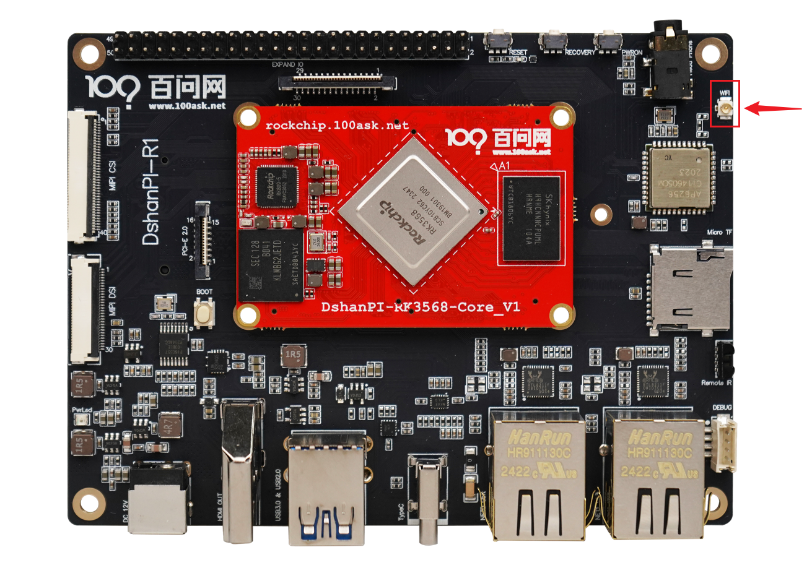
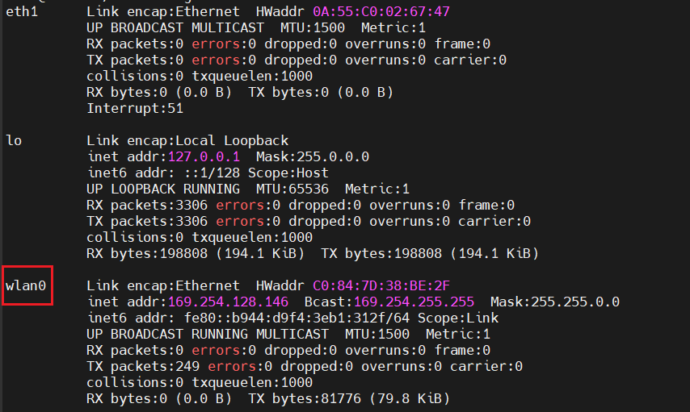
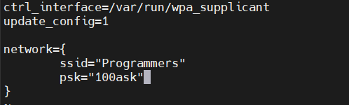
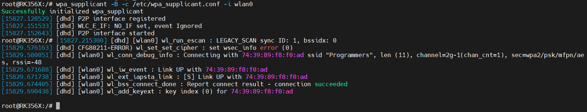
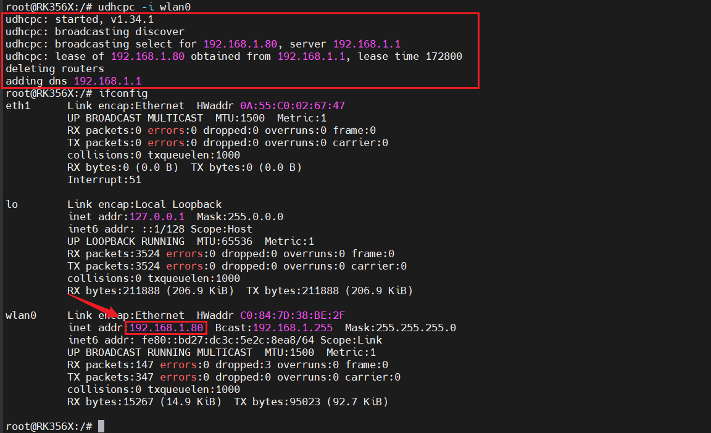

# WiFi联网

本章节将讲解如何使用开发板进行WiFi联网。100ask-RK3568无线联网功能来自 **AMPAK** 公司生产的集成 Wi-Fi 和蓝牙功能的无线通信模块AP6256。

## 准备工作

**硬件：**

- TypeC线 x1 
- TTL转串口模块 x1
- 12v电源适配器
- ipex 2.4G天线 X1

**软件：**

- 终端工具 MobaXterm

## 连接开发板

执行后面操作前，需要连接好开发板。如果不清楚如何连接开发板登录串口终端和安装ADB，可以先阅读《启动开发板》章节。基础连接之后，还需要接上一根ipex 2.4G天线，安装位置如下：

## 连接WiFi网络

### 开启WiFi功能

开发板默认已开启WiFi功能，执行以下指令可以查看到有`wlan0`节点：

~~~bash
ifconfig
~~~

### 扫描附近Wi-Fi

打开 `wlan0` 节点后，就可以在开发板上使用已经适配上的 `iw` 工具来扫描附近的无线网络设备。

执行如下指令：

~~~bash
iw dev wlan0 scan | grep SSID
~~~

可以看到以下扫到附近的无线网络设备，

~~~bash
root@RK356X:/# iw dev wlan0 scan | grep SSID
[15083.551113] [dhd] [wlan0] wl_run_escan : LEGACY_SCAN sync ID: 0, bssidx: 0
        SSID: Programmers
        SSID: DIRECT-MHDESKTOP-F024M1AmsMR
        SSID:
        SSID: MERCURY_62A2
        SSID: ChinaNet-kRAH
        SSID: DIRECT-d1-HP M132 LaserJet
        SSID: wifi1
        Extended capabilities: Extended Channel Switching, SSID List, 6, 6
        SSID: GW
        SSID: ChinaNet-Zivk
        SSID: ChinaNet-ccXn
        SSID: Programmers7
        SSID:
        SSID: WiFi
        SSID: pobo-5G
        Extended capabilities: HT Information Exchange Supported, Extended Channel Switching, TFS, WNM-Sleep Mode, TIM Broadcast, BSS Transition, SSID List, 6
        SSID: dingshun_5G
        SSID:
        SSID: wifi1_5G
        Extended capabilities: Extended Channel Switching, SSID List, 6, 6
        SSID: Voform
        Extended capabilities: Extended Channel Switching, BSS Transition, SSID List, 6
        SSID: \xe4\xb8\x80\xe7\x94\x9f\xe6\x89\x80\xe7\x88\xb1-5G
                HESSID: 32:95:e3:7a:46:27
root@RK356X:/#
~~~

能扫描到附近的无线网络设备，即可证明 无线通信模块AP6256 可以正常使用。接下来就可以开始连接能够使用的无线网络设备了。

### 连接Wi-Fi

连接无线网络设备，需要使用应用程序 `wpa_supplican`，该工具在开发板上也已适配。`wpa_supplicant` 连接Wi-Fi节点的时候会从配置文件中读取账号和密码，以及加密方式等， 所以我们在运行wpa_supplicant工具的时候要提前写好配置文件。 配置文件名称自定，但是要以 .conf 为后缀，并保存在 /etc/ 目录下，这边给出一个配置文件的例子。

执行以下指令，进入配置文件：

~~~bash
vi /etc/wpa_supplicant.conf
~~~

添加如下内容：

填写完成后，点击键盘`esc`键，进入vi的命令行模式，再输入`:wq`，保存退出。

- **ctrl_interface**：这是 `wpa_supplicant` 的配置选项，用于定义一个 Unix 域套接字的路径，通过这个套接字，其他程序可以与 `wpa_supplicant` 进行通信，发送命令和查询状态。`/var/run/wpa_supplicant` 是 `wpa_supplicant` 配置文件中的一个参数，用于指定控制接口的路径。
- **update_config** : 这个配置项指示 `wpa_supplicant` 在网络连接成功或失败时更新配置文件。当设置为 `1` 时，任何通过控制接口添加或修改的网络配置都会被永久保存到配置文件中，这样在下次启动 `wpa_supplicant` 时，这些更改仍然有效。
- **ssid** : 无线网络设备名。（需要根据实际情况填写）
- **psk** ：无线网络设备的连接密码。（需要根据实际情况填写）

退出完成后，执行以下指令，创建一个socket通信的目录。

~~~bash
mkdir -p /var/log/wpa_supplicant
~~~

完成以上操作，即可执行以下指令，连接无线网络设备：

~~~bash
wpa_supplicant -B -c /etc/wpa_supplicant.conf -i wlan0
~~~

### 获取ip地址

有以上这一些log信息打印，表明连接成功，正常情况无法自动获取ip，还需要使用`udhcpc`工具来分配ip地址，否则无法连接外网。

执行以下指令，获取ip地址：

~~~bash
udhcpc -i wlan0
~~~

ip地址获取成功，即可连接外网，测试如下：

~~~bash
root@RK356X:/# ping www.baidu.com
PING www.a.shifen.com (183.2.172.42) 56(84) bytes of data.
64 bytes from 183.2.172.42 (183.2.172.42): icmp_seq=1 ttl=53 time=11.7 ms
64 bytes from 183.2.172.42 (183.2.172.42): icmp_seq=2 ttl=53 time=15.1 ms
64 bytes from 183.2.172.42 (183.2.172.42): icmp_seq=3 ttl=53 time=28.4 ms
^C
--- www.a.shifen.com ping statistics ---
3 packets transmitted, 3 received, 0% packet loss, time 2002ms
rtt min/avg/max/mdev = 11.720/18.420/28.441/7.218 ms
root@RK356X:/#
~~~

