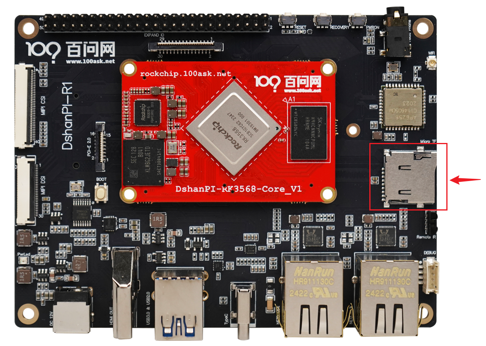
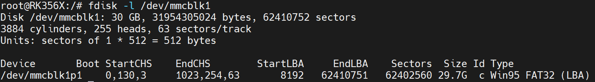
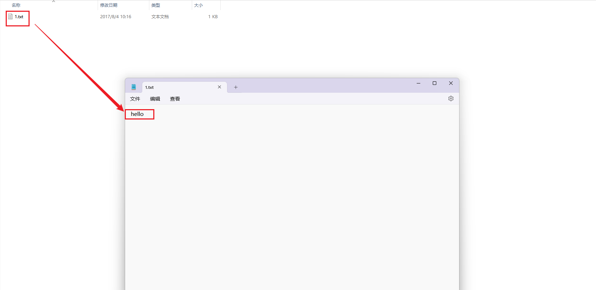

# TF卡测试指南

本章节将讲解如何在100ask-rk3568开发板上测试TF卡功能。

## 准备工作

**硬件：**

- 百问网RK3568开发板 x1
- TypeC线 x1 
- TTL转串口模块 x1
- 12v电源适配器
-  TF卡(32G) X1

**软件：**

- 软件：终端工具 MobaXterm

## 连接开发板

执行后面操作前，需要连接好开发板。如果不清楚如何连接开发板登录串口终端和安装ADB，可以先阅读《启动开发板》章节。

## 测试TF卡功能

登录开发板串口终端成功后，插入TF卡，连接图如下：

插入TF卡后，会显示如下信息，

~~~bash
root@RK356X:/# [  587.837925] mmc_host mmc1: Bus speed (slot 0) = 375000Hz (slot req 400000Hz, actual 375000HZ div = 0)
[  587.934652] mmc_host mmc1: Bus speed (slot 0) = 148500000Hz (slot req 150000000Hz, actual 148500000HZ div = 0)
[  588.046415] dwmmc_rockchip fe2b0000.dwmmc: Successfully tuned phase to 270
[  588.046447] mmc1: new ultra high speed SDR104 SDHC card at address 0001
[  588.048172] mmcblk1: mmc1:0001 SD16G 29.8 GiB
[  588.050354]  mmcblk1: p1
[  588.165587] FAT-fs (mmcblk1p1): utf8 is not a recommended IO charset for FAT filesystems, filesystem will be case sensitive!
~~~

可以看到系统检测出一个设备 `mmcblk1`，并发现该设备存在一个分区 `p1`，我们可以尝试挂载这个分区，往分区里写入内容。

先执行以下指令，查看该分区的文件系统类型是什么，

~~~bash
fdisk -l /dev/mmcblk1
~~~

从以上信息可知，`p1`分区的文件系统 `FAT32`，系统可以直接挂载该分区。（有些文件系统格式需要使用工具进行转化）

执行以下指令，挂载分区，把 `mmcblk1p1` 分区挂载在 `/mnt/sdcard/` 目录下。

~~~bash
mount /dev/mmcblk1p1 /mnt/sdcard/
~~~

进入 /mnt/sdcard/，可以看见TF卡里面的内容。

~~~bash
root@RK356X:/# cd /mnt/sdcard/
root@RK356X:/mnt/sdcard# ls
'System Volume Information'
root@RK356X:/mnt/sdcard#
~~~

创建一个文件`1.txt`，往文件写入内容，

~~~bash
root@RK356X:/mnt/sdcard# touch 1.txt
root@RK356X:/mnt/sdcard# ls
 1.txt  'System Volume Information'
root@RK356X:/mnt/sdcard# echo hello > 1.txt
root@RK356X:/mnt/sdcard# cat 1.txt
hello
root@RK356X:/mnt/sdcard#
~~~

卸载分区，在windows上查看是否有该文件以及被写入的内容，

~~~bash
root@RK356X:/mnt/sdcard# cd /
root@RK356X:/# sync
root@RK356X:/# umount /mnt/sdcard/
~~~

把TF卡拔出，插入windows，查看如下：

