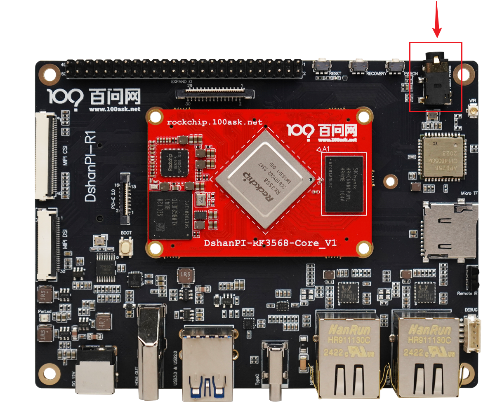
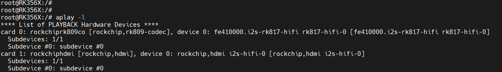

# 耳机播放功能

本章节将讲解在 100ask-RK3568 开发板上如何使用耳机播放功能。

## 准备工作

**硬件：**

- TypeC线 x1 
- TTL转串口模块 x1
- 12v电源适配器
-  插孔式耳机 X1

**软件：**

- 软件：终端工具 MobaXterm

## 连接开发板

执行后面操作前，需要连接好开发板。如果不清楚如何连接开发板登录串口终端和使用ADB，可以先阅读《启动开发板》章节。基础连接之后，还需要接上一根插孔式耳机，连接图如下：

## 前言

一个音频文件是如何从开发板到耳机，再从耳机播放出去？

简单来讲解一下：音频文件（如 `xxx.wav`）在开发板上存储为数字化音频数据文件。通过系统中的音频播放器（如 `aplay`），音频文件被解码为可播放的 PCM（脉冲编码调制）格式。解码后的 PCM 音频数据传输到音频驱动程序，再由驱动程序传递到声卡。声卡接收 PCM 数据后，通过内部的数模转换器 (DAC) 将数字信号转换为模拟信号。这些模拟信号再经过耳机插孔输出至耳机，使音频通过耳机实现高保真播放。

## 查看声卡设备

开发板可能存在多个声卡设备，后面操作涉及声卡选择。执行以下指令，可查询列出所有声卡及其设备信息，

~~~bash
aplay -l
~~~

**card 0**: `rockchip,rk809-codec`

- 描述：`fe410000.i2s-rk817-hifi rk817-hifi-0`
- 这是开发板音频接口，通常用于耳机或扬声器输出。
- 可以通过 `card 0` 来播放音频文件。

**card 1**: `rockchip,hdmi`

- 描述：`rockchip,hdmi i2s-hifi-0`
- 这是 HDMI 音频接口，如果通过 HDMI 输出音频，可以使用这个声卡。

## 配置声卡设备

### 列出声卡所有控制器

在开发板上，可以使用 `amixer` 工具列出声卡上的几个控制器。

~~~bash
#"-c 0" 指定 card0
root@RK356X:/# amixer controls -c 0
numid=1,iface=CARD,name='Headphones Jack'
numid=3,iface=MIXER,name='Capture MIC Path'
numid=2,iface=MIXER,name='Playback Path'
~~~

每个控制器有一个 `numid`（编号）和名称，描述了该声卡的特定控制功能：

**Headphones Jack**（numid=1）

- 这个控制项表示耳机插孔的音频输出设置，通常用于控制耳机插孔是否启用或禁用。

**Capture MIC Path**（numid=3）

- 这是用于麦克风输入的控制项，表示录音或声音捕获路径的配置。

**Playback Path**（numid=2）

- 这是音频回放路径的控制项，用于选择或调整播放的音频输出路径，比如耳机、扬声器等。

### 查询所有控制器信息

每个控制器都有对应的信息可以进行配置，先执行以下指令，查看每个控制器有哪些信息可配置，

~~~bash
#"-c 0" 指定 card0
root@RK356X:/# amixer contents -c 0
numid=1,iface=CARD,name='Headphones Jack'
  ; type=BOOLEAN,access=r-------,values=1
  : values=off
numid=3,iface=MIXER,name='Capture MIC Path'
  ; type=ENUMERATED,access=rw------,values=1,items=4
  ; Item #0 'MIC OFF'
  ; Item #1 'Main Mic'
  ; Item #2 'Hands Free Mic'
  ; Item #3 'BT Sco Mic'
  : values=2
numid=2,iface=MIXER,name='Playback Path'
  ; type=ENUMERATED,access=rw------,values=1,items=11
  ; Item #0 'OFF'
  ; Item #1 'RCV'
  ; Item #2 'SPK'
  ; Item #3 'HP'
  ; Item #4 'HP_NO_MIC'
  ; Item #5 'BT'
  ; Item #6 'SPK_HP'
  ; Item #7 'RING_SPK'
  ; Item #8 'RING_HP'
  ; Item #9 'RING_HP_NO_MIC'
  ; Item #10 'RING_SPK_HP'
  : values=2
~~~

声卡 `card 0` 的每个控制项详细信息，包括类型、可选项和当前的值。具体信息如下：

**Headphones Jack**（numid=1）

- 类型：`BOOLEAN`（布尔值），只读（`r-------`）。
- 当前状态：`off`，表示耳机插孔目前关闭。

**Capture MIC Path**（numid=3）

- 类型：`ENUMERATED`（枚举类型），读写（`rw------`）。
- 可选项：
  - `MIC OFF`：麦克风关闭
  - `Main Mic`：主麦克风
  - `Hands Free Mic`：免提麦克风
  - `BT Sco Mic`：蓝牙 SCO（同步连接导向）麦克风
- 当前值：`Hands Free Mic`（`values=2`），表示当前使用的是免提麦克风。

**Playback Path**（numid=2）

- 类型：`ENUMERATED`，读写。
- 可选项（共有 11 种音频播放路径）：
  - `OFF`：关闭播放
  - `RCV`：接收器
  - `SPK`：扬声器
  - `HP`：耳机
  - `HP_NO_MIC`：耳机无麦克风
  - `BT`：蓝牙
  - `SPK_HP`：扬声器和耳机
  - `RING_SPK`：铃声扬声器
  - `RING_HP`：铃声耳机
  - `RING_HP_NO_MIC`：铃声耳机无麦克风
  - `RING_SPK_HP`：铃声扬声器和耳机
- 当前值：`SPK`（`values=2`），表示当前播放路径设置为扬声器。

### 具体查询某个控制器

假设需要查询声卡0，控制器编号为2的内容，执行以下指令，

~~~bash
# -c 指定声卡 && cget 指定控制器
root@RK356X:/# amixer -c 0 cget numid=2
numid=2,iface=MIXER,name='Playback Path'
  ; type=ENUMERATED,access=rw------,values=1,items=11
  ; Item #0 'OFF'
  ; Item #1 'RCV'
  ; Item #2 'SPK'
  ; Item #3 'HP'
  ; Item #4 'HP_NO_MIC'
  ; Item #5 'BT'
  ; Item #6 'SPK_HP'
  ; Item #7 'RING_SPK'
  ; Item #8 'RING_HP'
  ; Item #9 'RING_HP_NO_MIC'
  ; Item #10 'RING_SPK_HP'
  : values=2
~~~

从上面可以看到 声卡0编号为2 的控制器 的值是2，也就是 'SPK'，这表明音频输出目前被设置为扬声器。

### 设置某个控制器值

假设需要设置声卡0，编号为2的控制器为耳机输出，执行以下指令，

~~~bash
# -c 指定声卡 && cget 指定控制器 && 'HP' 需要设置为'HP'
root@RK356X:/# amixer -c 0 cset numid=2 'HP'
numid=2,iface=MIXER,name='Playback Path'
  ; type=ENUMERATED,access=rw------,values=1,items=11
  ; Item #0 'OFF'
  ; Item #1 'RCV'
  ; Item #2 'SPK'
  ; Item #3 'HP'
  ; Item #4 'HP_NO_MIC'
  ; Item #5 'BT'
  ; Item #6 'SPK_HP'
  ; Item #7 'RING_SPK'
  ; Item #8 'RING_HP'
  ; Item #9 'RING_HP_NO_MIC'
  ; Item #10 'RING_SPK_HP'
  : values=3
~~~

可以看到 `values` 被设置成`3` 。

## 测试耳机播放

了解了上面内容之后，一般执行步骤如下：

~~~bash
# 设置输出为耳机输出
amixer -c 0 cset numid=2 'HP'
# 调节音量大小
amixer set Master 70%
# 播放音乐文件，hw:0,0 表示使用 card 0（第一张声卡）和 device 0（该声卡的第一个设备）。
aplay -D hw:0,0 /mnt/udisk/JJ.wav
~~~

