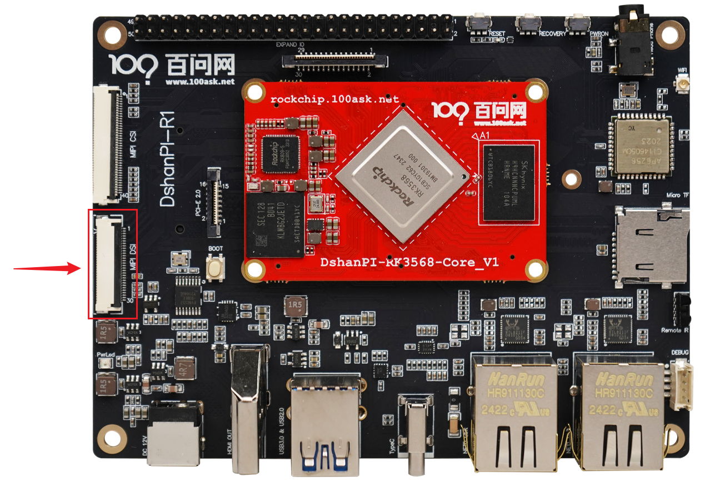
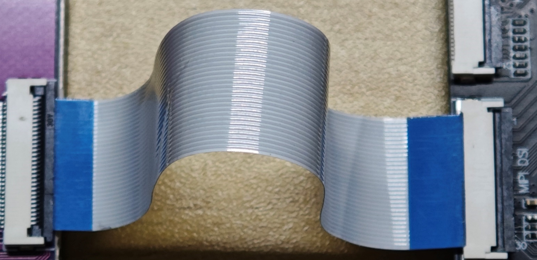
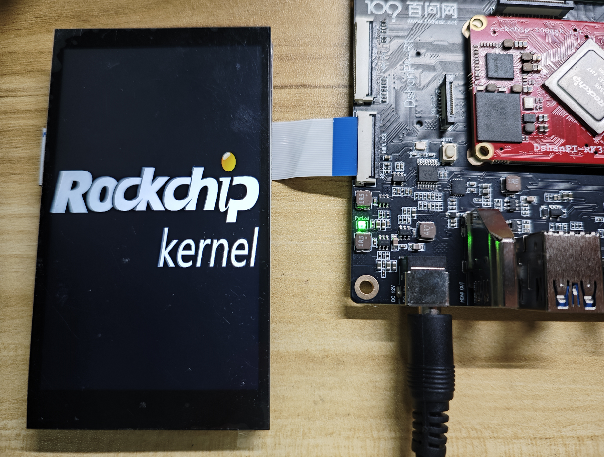

# MIPI屏显示测试

本章节将讲解如何在100ask-rk3568开发板上测试MIPI屏显示功能。

## 准备工作

**硬件：**

- TypeC线 x1 
- TTL转串口模块 x1
- 12v电源适配器
- 4寸MiPi屏 [购买链接](https://detail.tmall.com/item.htm?spm=a21n57.1.item.47.7a34523cQFFK9o&priceTId=2147815317249010973624408e1cac&utparam={"aplus_abtest":"be747d2137a72f53186e76e1e5eb9fdc"}&id=732427203033&ns=1&abbucket=7&xxc=taobaoSearch&pisk=fTiiKIxp7Vz6LLtU89r6ke-D3NYpWOZb5jIYMoF28WPCXrPv5j4mMXaqXlHttSl-i-ntDm0CmYMjXdZvClM_coRJw3hmCAZjun_RocjULRHF0irVsAr1QoRJwnbdLPOT0qFBFzeF88NUQ-z4upxUh8Z43rSwKWy0FZ5ZgjkeK-eVbSP406WUB-qV_5z4LyyzHSSa05PeK-NUgcCC07mqADRwqRyTUD-iXR4gimelmRoF2yVPdWScmKegSNHatiSqx2TkjeFwP9FbX5gzIjt5flzmPxemshjZiYiItJlymgFZdY385c-5lzqaOrnavt-ZLkFgzPaGIMMTb5zrfc6NXXU0s2oa-tSqdlP0uqcMsNNZWX47LyWDVJh8TAiZ-K1EQbFgbJzp4LDUu2n_PcdFjuuSBl3qGUQQjxuaxg7N8a-KviweHD7flPyQK7eZvmXlwJiZtpvhPFaadRdJKpbflPyQK7pHKa1_7Jw9w)

**软件：**

- 终端工具 MobaXterm

## 连接屏幕

> 注：先接屏幕再上电。

开发板MIPI屏的接口位置如下：

使用MIPI屏幕的排线，蓝色面朝上接入开发板 ，连接图如下：

## 登录串口终端

执行后面操作前，需要连接好开发板。如果不清楚如何连接开发板登录串口终端和使用ADB，可以先阅读《启动开发板》章节。

## MIPI屏显示

接好屏幕之后，启动开发板，会自动显示开机logo，如下图所示：

