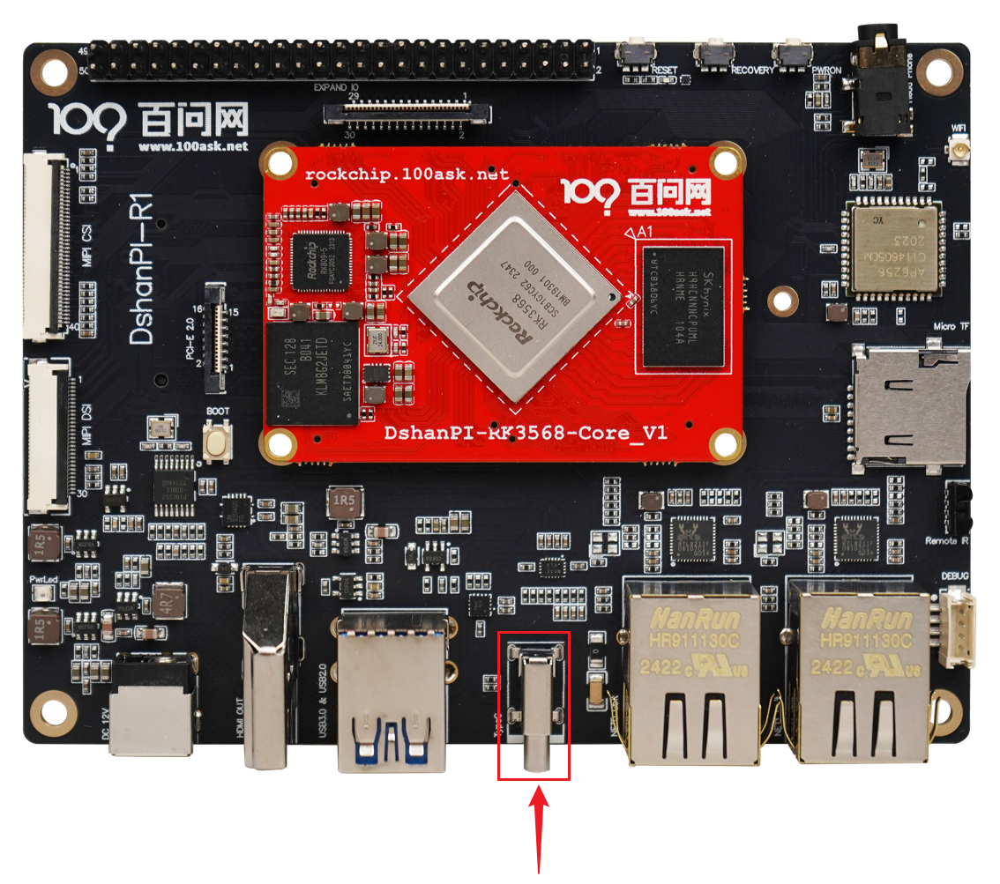
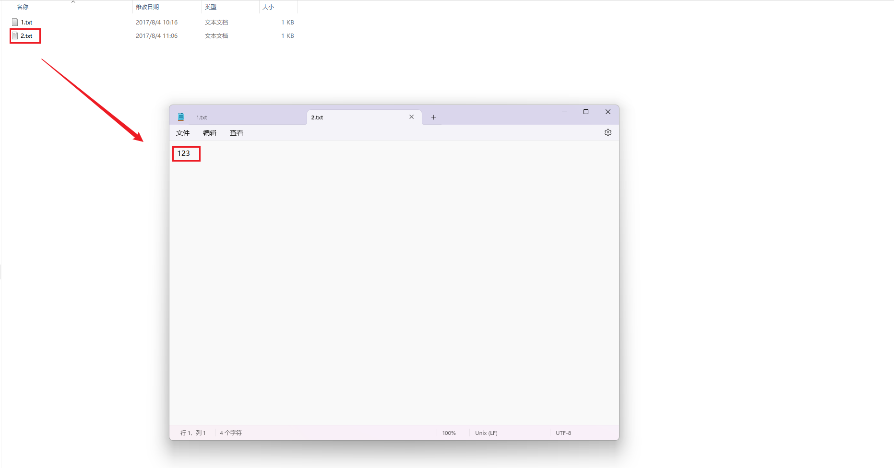

# USB_OTG功能测试

本章节将讲解如何在100ask-rk3568开发板上测试USB_OTG功能之一读取TF卡数据。

## 准备工作

**硬件：**

- TTL转串口模块 x1
- 12v电源适配器
- TF卡 X1
- 读卡器 X1
- typeC转usb线 X1

**软件：**

- 软件：终端工具 MobaXterm

## 登录串口终端

执行后面操作前，需要连接好开发板。如果不清楚如何连接开发板登录串口终端，可以先阅读《启动开发板》章节。

## 测试USB_OTG功能

基础连接之后，typeC转usb线的typeC端口接入板子上的otg口，TF卡插入读卡器，读卡器再接入typeC转usb线的usb端口。typeC位置如下：

插入读卡器后，会显示如下信息，

~~~bash
root@RK356X:/# [ 6655.385270] fusb302 1-0022: CC connected in CC1 as DFP
[ 6655.396162] xhci-hcd xhci-hcd.5.auto: xHCI Host Controller
[ 6655.396414] xhci-hcd xhci-hcd.5.auto: new USB bus registered, assigned bus number 7
[ 6655.399188] xhci-hcd xhci-hcd.5.auto: hcc params 0x0220fe64 hci version 0x110 quirks 0x0000031002010010
[ 6655.399240] xhci-hcd xhci-hcd.5.auto: irq 81, io mem 0xfcc00000
[ 6655.399541] usb usb7: New USB device found, idVendor=1d6b, idProduct=0002, bcdDevice= 4.19
[ 6655.399560] usb usb7: New USB device strings: Mfr=3, Product=2, SerialNumber=1
[ 6655.399574] usb usb7: Product: xHCI Host Controller
[ 6655.399587] usb usb7: Manufacturer: Linux 4.19.232 xhci-hcd
[ 6655.399599] usb usb7: SerialNumber: xhci-hcd.5.auto
[ 6655.400164] hub 7-0:1.0: USB hub found
[ 6655.400220] hub 7-0:1.0: 1 port detected
[ 6655.400563] xhci-hcd xhci-hcd.5.auto: xHCI Host Controller
[ 6655.401358] xhci-hcd xhci-hcd.5.auto: new USB bus registered, assigned bus number 8
[ 6655.401394] xhci-hcd xhci-hcd.5.auto: Host supports USB 3.0 SuperSpeed
[ 6655.401489] usb usb8: We don't know the algorithms for LPM for this host, disabling LPM.
[ 6655.401626] usb usb8: New USB device found, idVendor=1d6b, idProduct=0003, bcdDevice= 4.19
[ 6655.401644] usb usb8: New USB device strings: Mfr=3, Product=2, SerialNumber=1
[ 6655.401658] usb usb8: Product: xHCI Host Controller
[ 6655.401671] usb usb8: Manufacturer: Linux 4.19.232 xhci-hcd
[ 6655.401685] usb usb8: SerialNumber: xhci-hcd.5.auto
[ 6655.402298] hub 8-0:1.0: USB hub found
[ 6655.402358] hub 8-0:1.0: 1 port detected
[ 6655.730216] usb 8-1: new SuperSpeed Gen 1 USB device number 2 using xhci-hcd
[ 6655.749304] usb 8-1: New USB device found, idVendor=05e3, idProduct=0747, bcdDevice= 8.19
[ 6655.749329] usb 8-1: New USB device strings: Mfr=3, Product=4, SerialNumber=5
[ 6655.749339] usb 8-1: Product: USB Storage
[ 6655.749346] usb 8-1: Manufacturer: Generic
[ 6655.749354] usb 8-1: SerialNumber: 000000000819
[ 6655.751867] usb-storage 8-1:1.0: USB Mass Storage device detected
[ 6655.752729] scsi host0: usb-storage 8-1:1.0
[ 6656.765190] scsi 0:0:0:0: Direct-Access     Generic  STORAGE DEVICE   0819 PQ: 0 ANSI: 6
[ 6657.080548] sd 0:0:0:0: [sda] 62410752 512-byte logical blocks: (32.0 GB/29.8 GiB)
[ 6657.081183] sd 0:0:0:0: [sda] Write Protect is off
[ 6657.081861] sd 0:0:0:0: [sda] Write cache: disabled, read cache: enabled, doesn't support DPO or FUA
[ 6657.085833]  sda: sda1
[ 6657.091476] sd 0:0:0:0: [sda] Attached SCSI removable disk
[ 6657.213228] FAT-fs (sda1): utf8 is not a recommended IO charset for FAT filesystems, filesystem will be case sensitive!
[ 6660.991446] fusb302 1-0022: PD disabled
~~~

从以上信息可以看到，系统检测出一个 USB 存储设备`sda`，该设备有存在一个分区`sda1`，我们可以尝试挂载这个分区，往分区里写入内容。

执行以下指令，挂载分区，把 `sda1` 分区挂载在 `/mnt/sdcard` 目录下。

~~~bash
mount /dev/sda1 /mnt/sdcard/
~~~

 进入 /mnt/sdcard/，可以看见TF卡里面的内容。

~~~bash
root@RK356X:/# cd /mnt/sdcard/
root@RK356X:/mnt/sdcard# ls
 1.txt  'System Volume Information'
root@RK356X:/mnt/sdcard# cat 1.txt
hello
~~~

创建一个文件`2.txt`，往文件写入内容,

~~~bash
root@RK356X:/mnt/sdcard# touch 2.txt
root@RK356X:/mnt/sdcard# echo 123 > 2.txt
root@RK356X:/mnt/sdcard#
root@RK356X:/mnt/sdcard# cat 2.txt
123
~~~

卸载分区，

~~~bash
root@RK356X:/mnt/sdcard# cd /
root@RK356X:/# sync
root@RK356X:/# umount /mnt/sdcard
~~~

把读卡器拔出，插入PC机的usb口，在windows上查看是否有该文件以及被写入的内容，查看如下：

