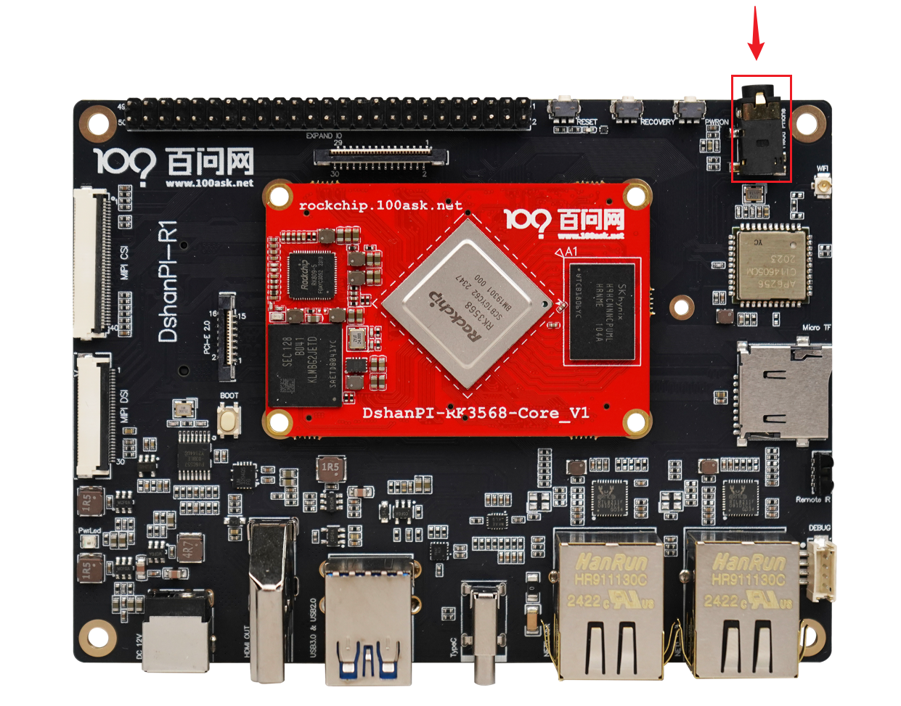
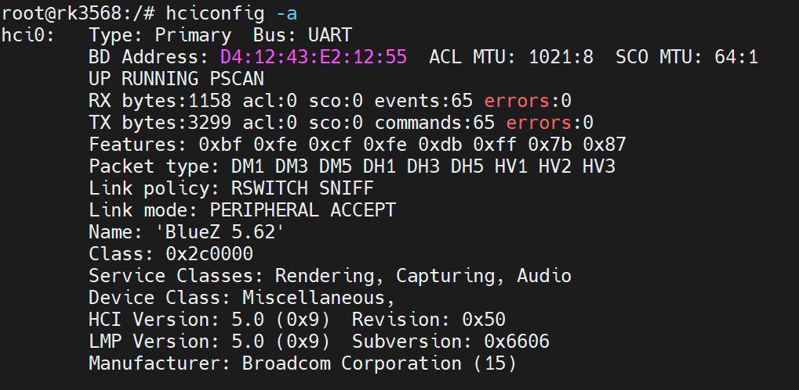
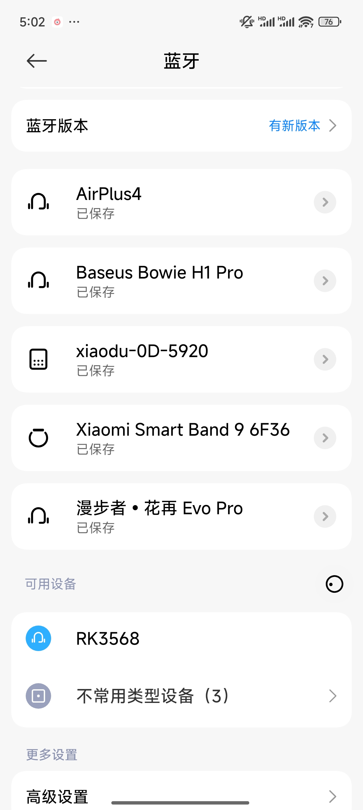
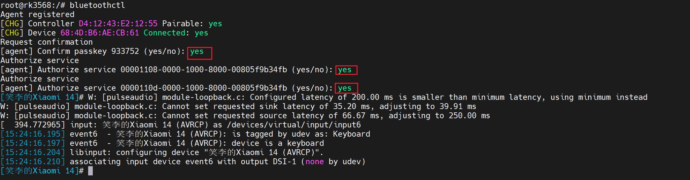
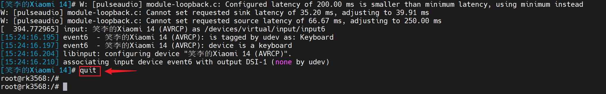

# 蓝牙功能测试

本章节将讲解如何在百问网rk3568开发板进行蓝牙功能测试，实现一个简易蓝牙耳机/音响。

> 开发板的蓝牙功能来自 **AMPAK** 公司生产的集成 Wi-Fi 和蓝牙功能的无线通信模块AP6256。

## 准备工作

**硬件：**

- TypeC线 x1 
- TTL转串口模块 x1
- 12v电源适配器 x1
- 耳机/带耳机口的音响 x1

**软件：**

- 终端工具 MobaXterm

## 连接开发板

执行后面操作前，需要连接好开发板。如果不清楚如何连接开发板、登录串口终端和安装使用ADB，可以先阅读《启动开发板》章节。基础连接之后，还需要接上一个耳机/带耳机口的音响，安装位置如下：

## 测试蓝牙功能

### 初始化蓝牙

登录串口终端，启动开发板之后，默认蓝牙会被自动初始化，可以使用以下指令查看，是否存在蓝牙设备：

~~~bash
hciconfig -a
~~~

如果初始化蓝牙设备成功，会出现`hci0`设备，如下：

如果没有蓝牙设备出现，执行以下指令，初始化蓝牙：

~~~bash
bt_init.sh
~~~

### 蓝牙音乐播放

确保蓝牙设备初始化成功后，可以使用 `hciconfig` 设置几个参数（可被发现、类型和蓝牙名称），方便手机连接蓝牙设备。

~~~bash
hciconfig hci0 piscan           #设置为可被发现
hciconfig hci0 class 0x240404   #设置为耳机类型
hciconfig hci0 name 'RK3568'    #设置开发板蓝牙名称(名字可以随意起)
hciconfig hci0 reset            #重置蓝牙适配器生效
~~~

打开手机蓝牙设置，刷新一下，可以看到有一个 `RK3568` 的蓝牙设备。

如果现在手机直接点击配对是无法成功的，我们需要执行以下指令，进入蓝牙交互界面：
~~~bash
bluetoothctl
~~~

进入交互界面后，在手机的蓝牙设置中，再点击配对 `RK3568` 蓝牙设备。点击后，交互界面会出现如下信息，需要输入==yes==。

自此，手机连接蓝牙成功。

手机成功连接上蓝牙后，就可以进入音乐软件，播放音乐。不过，会发现耳机这边没有声音出现，我们还需要做一些设置。

先退出蓝牙交互界面，执行`quit`。

需要设置音频输出通道为耳机，执行以下指令：

~~~bash
amixer -c 0 cset numid=2 'HP'
~~~

再次播放音乐，就可以从耳机中听到音乐了，一个简易的蓝牙耳机/音响自此完成。