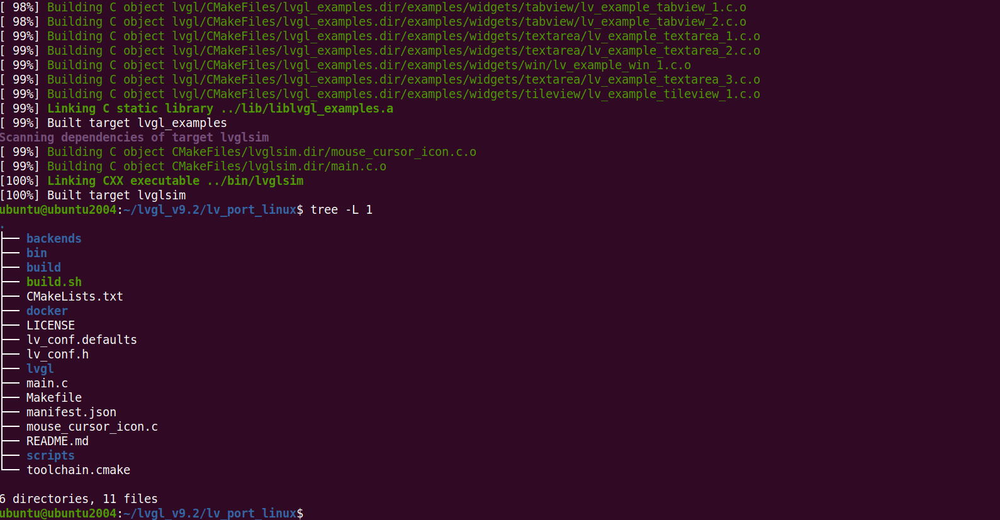
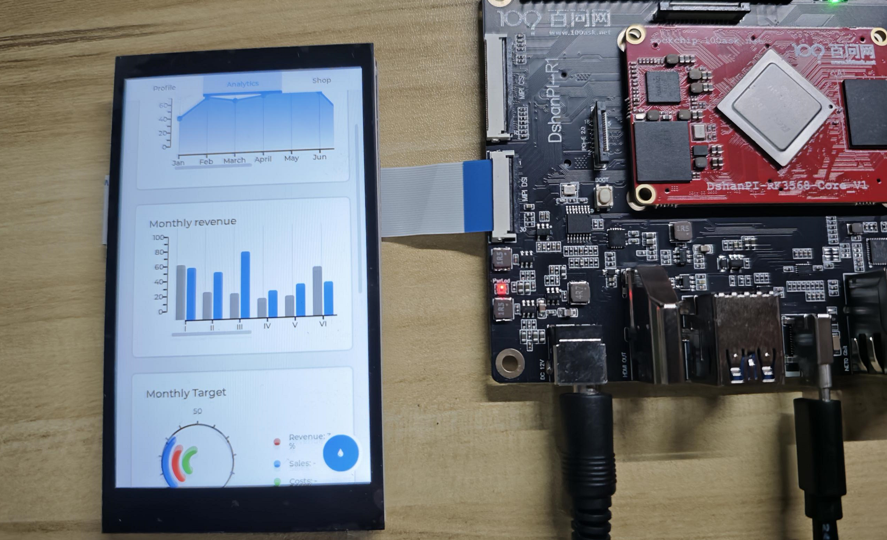
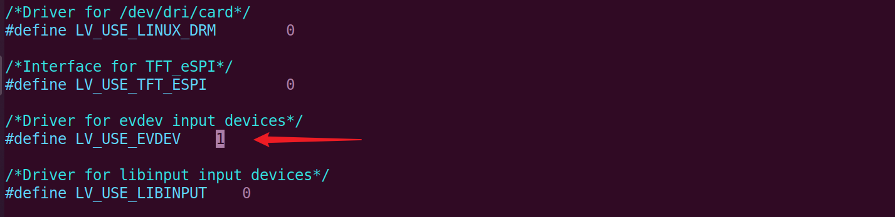

# 移植V9.2-LVGL

本章节将讲解如何移植 LVGL-v9.2 官方例程至 100ask-RK3568 开发板。

## 准备工作

**硬件：**

- TypeC线 x1 
- TTL转串口模块 x1
- 12v电源适配器
- 4寸MiPi屏 [购买链接](https://detail.tmall.com/item.htm?spm=a21n57.1.item.47.7a34523cQFFK9o&priceTId=2147815317249010973624408e1cac&utparam={"aplus_abtest":"be747d2137a72f53186e76e1e5eb9fdc"}&id=732427203033&ns=1&abbucket=7&xxc=taobaoSearch&pisk=fTiiKIxp7Vz6LLtU89r6ke-D3NYpWOZb5jIYMoF28WPCXrPv5j4mMXaqXlHttSl-i-ntDm0CmYMjXdZvClM_coRJw3hmCAZjun_RocjULRHF0irVsAr1QoRJwnbdLPOT0qFBFzeF88NUQ-z4upxUh8Z43rSwKWy0FZ5ZgjkeK-eVbSP406WUB-qV_5z4LyyzHSSa05PeK-NUgcCC07mqADRwqRyTUD-iXR4gimelmRoF2yVPdWScmKegSNHatiSqx2TkjeFwP9FbX5gzIjt5flzmPxemshjZiYiItJlymgFZdY385c-5lzqaOrnavt-ZLkFgzPaGIMMTb5zrfc6NXXU0s2oa-tSqdlP0uqcMsNNZWX47LyWDVJh8TAiZ-K1EQbFgbJzp4LDUu2n_PcdFjuuSBl3qGUQQjxuaxg7N8a-KviweHD7flPyQK7eZvmXlwJiZtpvhPFaadRdJKpbflPyQK7pHKa1_7Jw9w)

**软件：**

- 软件：终端工具 MobaXterm

## 连接开发板

执行后面操作前，需要连接好开发板。如果不清楚如何连接开发板登录串口终端和使用ADB，可以先阅读《启动开发板》章节。基础连接之后，还需要接上4寸MiPi屏（**先接上屏幕再给开发板上电**），MIPI屏连接参考《MIPI屏显示测试》章节。

## 交叉编译lvgl源码

> 这里源码指的是 lvgl官方 提供的 LVGL on top of Linux graphics stack 方案。

### 获取lvgl源码

在 Ubuntu 中，新建终端，创建一个目录 `~/lvgl_v9.2` 用于存放lvgl源码。

~~~bash
ubuntu@ubuntu2004:~$ mkdir lvgl_v9.2
ubuntu@ubuntu2004:~$ cd lvgl_v9.2
ubuntu@ubuntu2004:~/lvgl_v9.2$
~~~

在当前目录下，执行以下指令，获取lvgl源码。

~~~bash
git clone https://github.com/lvgl/lv_port_linux.git
cd lv_port_linux/
git submodule update --init --recursive
~~~

有这么一些文件：

~~~bash
ubuntu@ubuntu2004:~/lvgl_v9.2/lv_port_linux$ tree -L 1
.
├── backends
├── CMakeLists.txt
├── docker
├── LICENSE
├── lv_conf.defaults
├── lv_conf.h
├── lvgl
├── main.c
├── Makefile
├── manifest.json
├── mouse_cursor_icon.c
├── README.md
└── scripts

4 directories, 9 files
~~~

### 交叉编译工具准备

在目标设备上运行 lvgl 例程，需要使用相应的交叉编译工具来编译例程。100ask-RK3568开发板的交叉编译工具是(实际路径不一定相同)：

~~~
/home/ubuntu/100ask-RK3568-SDK/rk3568_4.19_v1.3.2/prebuilts/gcc/linux-x86/aarch64/gcc-arm-10.3-2021.07-x86_64-aarch64-none-linux-gnu/bin/aarch64-none-linux-gnu-gcc
~~~

在下面目录中，编写 `toolchain.cmake` ，方便用于指定交叉编译工具，

~~~bash
ubuntu@ubuntu2004:~/lvgl_v9.2/lv_port_linux$ vi toolchain.cmake
~~~

根据实际路径，填入以下内容，

~~~bash
set(CMAKE_SYSTEM_NAME Linux)
set(CMAKE_SYSTEM_PROCESSOR arm64)

set(tools "/home/ubuntu/100ask-RK3568-SDK/rk3568_4.19_v1.3.2/prebuilts/gcc/linux-x86/aarch64/gcc-arm-10.3-2021.07-x86_64-aarch64-none-linux-gnu")
set(CMAKE_C_COMPILER ${tools}/bin/aarch64-none-linux-gnu-gcc)
set(CMAKE_CXX_COMPILER ${tools}/bin/aarch64-none-linux-gnu-g++)
~~~

填写完成后，保存退出。

### 编译例程

指定交叉编译工具之后，为了更加方便执行编译操作，在下面的目录中，编写一个小脚本 `build.sh`，

~~~bash
ubuntu@ubuntu2004:~/lvgl_v9.2/lv_port_linux$ vi build.sh
~~~

填入以下内容，

~~~bash
rm -rf build
mkdir -p build
cd build/
cmake -DCMAKE_TOOLCHAIN_FILE="../toolchain.cmake" ..
make -j32
~~~

> 如果不清楚以上内容的作用，建议了解cmake一般是如何编译程序。

填写完成后，保存退出。

接着执行以下指令，为脚本 `build.sh` 设置执行权限，

~~~bash
ubuntu@ubuntu2004:~/lvgl_v9.2/lv_port_linux$ sudo chmod +x build.sh
~~~

一切准备就绪，启动脚本编译程序，

> 注意：
>
> cmake 版本要大于 3.12.4，否则编译报错

~~~bash
ubuntu@ubuntu2004:~/lvgl_v9.2/lv_port_linux$ ./build.sh
~~~

编译完成后，应用程序 `lvglsim` ，保存在当前目录 `bin/` 文件下。

~~~bash
ubuntu@ubuntu2004:~/lvgl_v9.2/lv_port_linux/bin$ ls
lvglsim
ubuntu@ubuntu2004:~/lvgl_v9.2/lv_port_linux/bin$ file lvglsim 
lvglsim: ELF 64-bit LSB executable, ARM aarch64, version 1 (GNU/Linux), dynamically linked, interpreter /lib/ld-linux-aarch64.so.1, for GNU/Linux 3.7.0, with debug_info, not stripped
ubuntu@ubuntu2004:~/lvgl_v9.2/lv_port_linux/bin$
~~~

## 上传程序并运行

在 Ubuntu 中，使用adb工具上传应用程序 `lvglsim` ，这里上传到开发板 `/mnt/udisk/` 路径下，

~~~bash
ubuntu@ubuntu2004:~/lvgl_v9.2/lv_port_linux$ adb push bin/lvglsim /mnt/udisk/
bin/lvglsim: 1 file pushed. 6.9 MB/s (2633648 bytes in 0.363s)
~~~

进入开发板终端（可串口和adb登录），在 `/mnt/udisk/` 路径下可以看到 `lvglsim`，

~~~bash
root@RK356X:/# cd /mnt/udisk/
root@RK356X:/mnt/udisk# ls
lvglsim
root@RK356X:/mnt/udisk#
~~~

在当前路径下，执行程序`lvglsim`，可以看到屏幕显示了 lvgl 例程，如下图：

## 添加触摸功能

在 lvgl 源码上添加触摸支持比较简单，在 Ubuntu 中，进入源码路径`/home/ubuntu/lvgl_v9.2/lv_port_linux`，在配置文件 `lv_conf.h` 里，启动下面的宏。

~~~bash
/*Driver for evdev input devices*/
#define LV_USE_EVDEV    1
~~~

修改完成后，保存退出，重新编译上传程序。

在开发板终端上，先设置环境变量，指定触摸设备节点，

~~~bash
root@RK356X:/mnt/udisk# export LV_LINUX_EVDEV_POINTER_DEVICE="/dev/input/event2"
~~~

然后即可运行应用程序`lvglsim` 。

