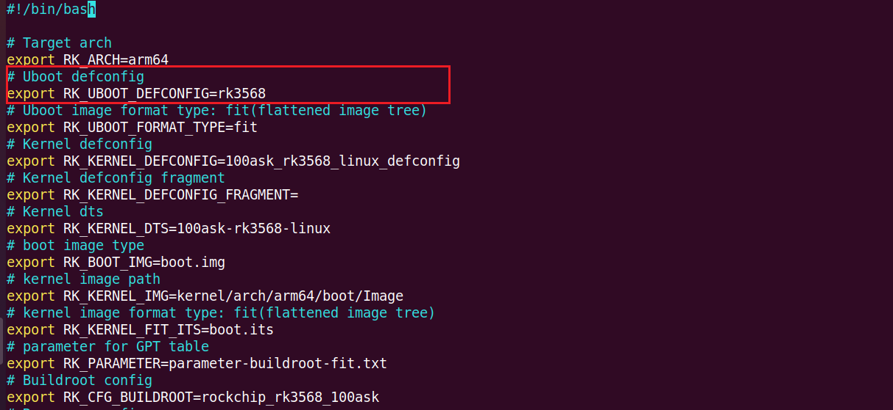
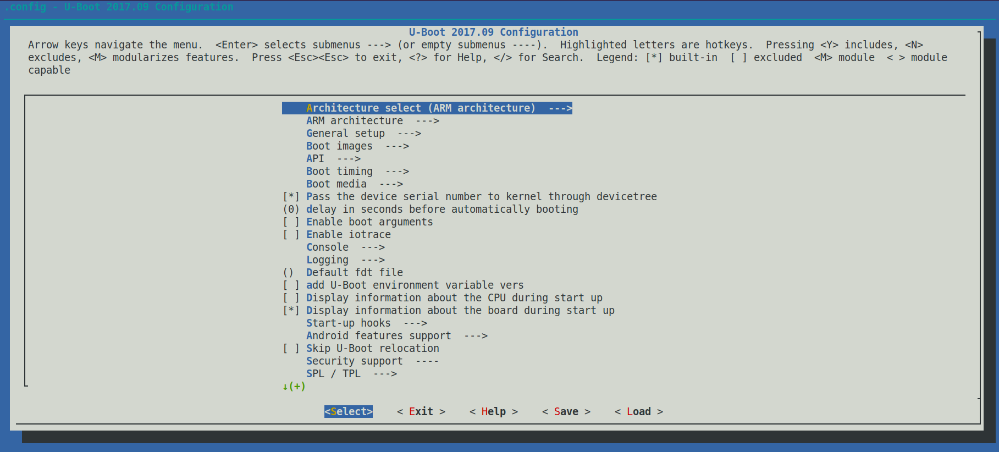
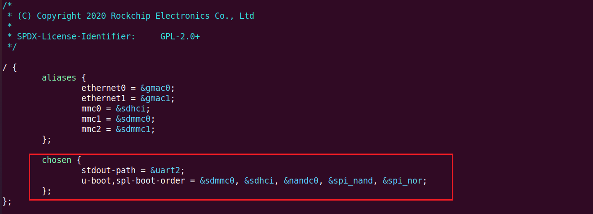
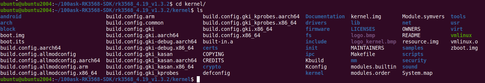
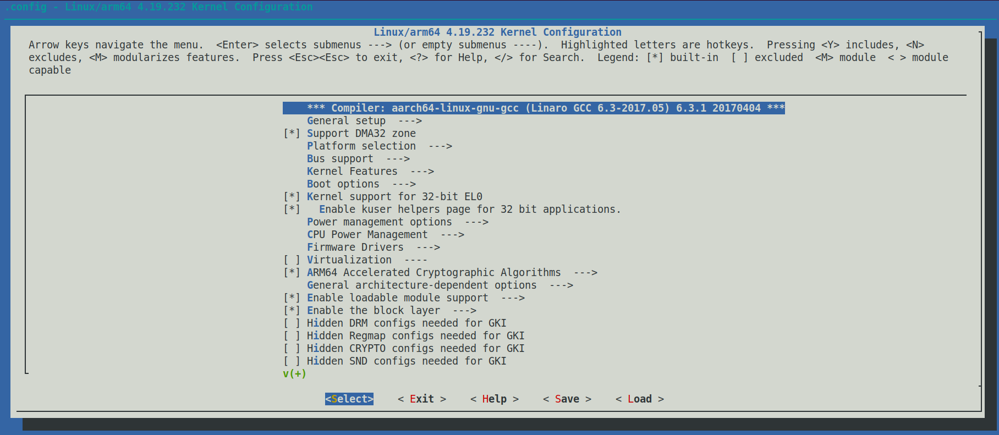
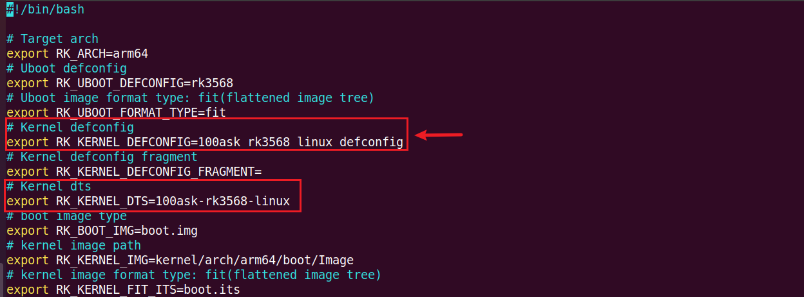
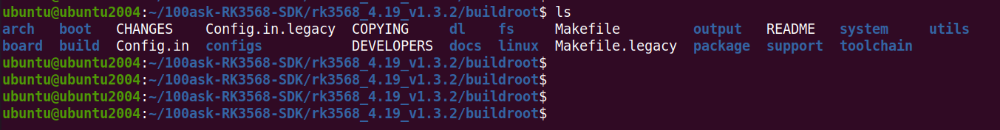
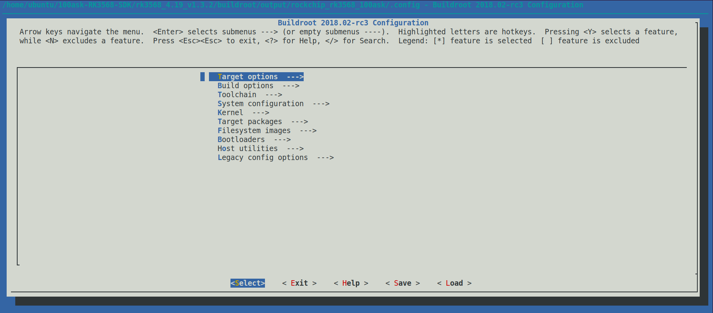
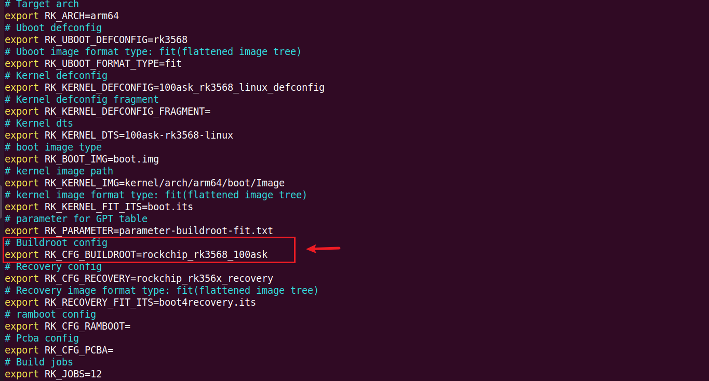

# SDK开发指南

本章节将讲解如何在RK的SDK中进行 u-boot、kernel 和 buildroot单独编译与配置。默认已选择过板级配置文件，如果没有，请先阅读《开发环境搭建》章节，以下操作皆在ubuntu执行。

## U-boot使用

### 配置u-boot

u-boot是一个引导加载程序，用于初始化硬件并引导操作系统。一般并不需要修改，RK对于原生的u-boot有了完善的支持，例如初始化硬件，uboot会使用kernel的设备树来初始化。

如果需要修改u-boot，往往是修改相应处理器的uboot配置文件、设备树。例如rk3568处理器，配置文件是 u-boot/configs/rk3568_defconfig，设备树在 u-boot/arch/arm/dts/目录里。uboot配置文件可以在板级配置文件里查看需要修改那个文件。

#### uboot配置文件修改

进入 SDK/device/rockchip/rk356x/，找到相应的板级配置文件，这里使用的是 `BoardConfig-rk3568-100ask-ddr4.mk`

从上图可知，u-boot的配置文件是 rk3568_defconfig，放在 u-boot/configs/ 路径下。修改该文件，我们可以直接进行手动修改，但是为了方便修改，一般是在配置界面上做修改。

进入 SDK/u-boot/ 目录下，执行以下指令，打开配置界面，

~~~bash
make rk3568_defconfig
make menuconfig
~~~

如下：

修改完成后，进行保存`Save` 然后 退出`Exit`。仅仅这样操作并不会修改 `rk3568_defconfig`，需要进行以下操作：

~~~bash
make savedefconfig
cp defconfig configs/rk3568_defconfig
~~~

#### uboot设备树修改

如果需要修改启动顺序，或者调试串口，在 SDK/u-boot/arch/arm/dts/ 目录下，找到相应的设备树文件进行修改，rk3568的设备树文件包含关系如下：

~~~bash
rk3568-evb.dts
	rk3568.dtsi
		rk3568-pinctrl.dtsi
	rk3568-u-boot.dtsi
~~~

在 `rk3568-u-boot.dtsi` 可以看到启动顺序和调试串口等信息：

配置完成后，即可进行编译。

### 单独编译u-boot

RK的SDK源码，有提供一个编译脚本 `./build.sh`，我们可以根据脚本使用指令来查看如何编译u-boot，

进入SDK源码根目录，执行以下指令：

~~~bash
./build.sh -h uboot
~~~

可以看到以下是如何编译u-boot的步骤：

~~~bash
ubuntu@ubuntu2004:~/100ask-RK3568-SDK/rk3568_4.19_v1.3.2$ ./build.sh -h uboot
###Current SDK Default [ uboot ] Build Command###
cd u-boot
./make.sh rk3568 
Running usageuboot succeeded.
~~~

进入u-boot目录 `cd u-boot`，执行 `./make.sh rk3568`，

~~~bash
ubuntu@ubuntu2004:~/100ask-RK3568-SDK/rk3568_4.19_v1.3.2/u-boot$ ./make.sh rk3568
## make rk3568_defconfig -j16
#
# configuration written to .config
#
scripts/kconfig/conf  --silentoldconfig Kconfig
  CHK     include/config.h
...省略
********boot_merger ver 1.31********
Info:Pack loader ok.
pack loader okay! Input: /home/ubuntu/100ask-RK3568-SDK/rk3568_4.19_v1.3.2/rkbin/RKBOOT/RK3568MINIALL.ini
/home/ubuntu/100ask-RK3568-SDK/rk3568_4.19_v1.3.2/u-boot

Image(no-signed, version=0): uboot.img (FIT with uboot, trust...) is ready
Image(no-signed): rk356x_spl_loader_v1.16.112.bin (with spl, ddr...) is ready
pack uboot.img okay! Input: /home/ubuntu/100ask-RK3568-SDK/rk3568_4.19_v1.3.2/rkbin/RKTRUST/RK3568TRUST.ini

Platform RK3568 is build OK, with new .config(make rk3568_defconfig -j16)
/home/ubuntu/100ask-RK3568-SDK/rk3568_4.19_v1.3.2/prebuilts/gcc/linux-x86/aarch64/gcc-linaro-6.3.1-2017.05-x86_64_aarch64-linux-gnu/bin/aarch64-linux-gnu-
Sun 03 Nov 2024 09:39:03 PM EST
~~~

> 以上操作与在SDK源码根目录下执行 `./build.sh uboot` 的效果是相同的。

## Kernel使用

### 配置kernel

在kernel阶段，常常需要增减驱动、设备树节点，来适配板载硬件功能。kernel源码在 SDK/kernel/ 目录下，

#### 内核配置文件修改

如果想对内核源码进行配置，例如把某个驱动编译进内核或者编译成模块，进入kernel源码目录，执行以下指令，打开内核的配置界面：

~~~bash
make ARCH=arm64 menuconfig
~~~

如下：

以上便是进入了内核配置界面，如果需要把相应的驱动编译进内核，即选择相应的驱动，点击键盘`y`，如需编译成驱动模块，则点击键盘`m`，配置完成后，选择保存`Save`，然后退出`Exit`。修改的配置会保存在当前目录下的 `.config` 文件下。

还需要执行以下指令，把修改的配置保存在 SDK/kernel/arch/arm64/configs/100ask_rk3568_linux_defconfig，

~~~bash
make ARCH=arm64 savedefconfig
cp defconfig arch/arm64/configs/100ask_rk3568_linux_defconfig
~~~

具体是哪个内核配置文件，需要查看相应选择的板级配置文件，进入目录 SDK/device/rockchip/rk356x/

~~~bash
vi BoardConfig-rk3568-100ask-ddr4.mk
~~~

如下：

#### 内核设备树修改

由上图亦可知，设备树文件是100ask-rk3568-linux.dts，存放在 SDK/kernel/arch/arm64/boot/dts/rockchip/目录下，100ask-rk3568-linux.dts包含多个dtsi文件，其包含关系是

~~~bash
100ask-rk3568-linux.dts
	rk3568-evb1-ddr4-v10.dtsi
		rk3568.dtsi
		rk3568-evb.dtsi
	rk3568-100ask-camera.dtsi
	rk3568-linux.dtsi
~~~

如果需要 `添加新的设备树节点`，`使能设备树节点` 和 `失能设备树节点`，修改100ask-rk3568-linux.dts文件即可，亦或者在dts文件包含一个新添特定的dtsi文件，例如rk3568-100ask-camera.dtsi，因为如果存在多个类似100ask-rk3568-linux.dts的设备树，修改其他的dtsi文件会影响到别的类似100ask-rk3568-linux.dts文件。

### 单独编译kernel

在SDK源码根目录下，执行以下指令，可以查看编译内核的步骤：

~~~bash
ubuntu@ubuntu2004:~/100ask-RK3568-SDK/rk3568_4.19_v1.3.2$ ./build.sh -h kernel
###Current SDK Default [ kernel ] Build Command###
cd kernel
make ARCH=arm64 100ask_rk3568_linux_defconfig 
make ARCH=arm64 100ask-rk3568-linux.img -j12
~~~

当然上面的方式太过繁琐，还有一种方式单独编译内核，在SDK源码根目录下，执行：

~~~bash
./build.sh kernel
~~~

亦可单独编译内核。如下：

~~~bash
ubuntu@ubuntu2004:~/100ask-RK3568-SDK/rk3568_4.19_v1.3.2$ ./build.sh kernel
processing option: kernel
============Start building kernel============
TARGET_ARCH          =arm64
TARGET_KERNEL_CONFIG =100ask_rk3568_linux_defconfig
TARGET_KERNEL_DTS    =100ask-rk3568-linux
TARGET_KERNEL_CONFIG_FRAGMENT =
==========================================
#
# configuration written to .config
#
...省略
Running build_kernel succeeded.
~~~

## Buildroot使用

### 配置buildroot

Buildroot 是一个开源工具，用于快速生成嵌入式 Linux 系统的根文件系统、内核和引导加载程序。RK的SDK里还有Yocto构建工具，默认是使用 Buildroot ，这里使用的也是 Buildroot。

Buildroot 的源码存放在 SDK/buildroot/ 目录底下，

buildroot根目录下的文件夹介绍如下：

~~~bash
ubuntu@ubuntu2004:~/100ask-RK3568-SDK/rk3568_4.19_v1.3.2/buildroot$ tree -L 1
.
├── arch               #存放与特定架构相关的代码和配置文件，例如不同处理器架构的支持。
├── board              #包含特定硬件平台的支持文件和配置，用于定义特定板卡的构建过程和设置。
├── boot               #包含与引导相关的文件和脚本，处理引导加载程序的构建和配置。
├── build              #临时构建目录，用于存放构建过程中产生的中间文件。
├── CHANGES
├── Config.in          #配置文件，定义了可供选择的配置选项，并指定其依赖关系，通常用于配置菜单。
├── Config.in.legacy   
├── configs			   #包含预定义的配置文件（.config），适用于特定硬件或项目，可以通过这些文件快速开始构建。
├── COPYING
├── DEVELOPERS
├── dl                 #下载目录，存放在构建过程中下载的软件包和源代码。
├── docs			   #包含文档和说明，帮助理解和使用 Buildroot。
├── fs				   #存放与文件系统相关的代码和配置。
├── linux              #包含内核相关的配置和文件，支持构建 Linux 内核。
├── Makefile           #主要的构建文件，定义了如何构建整个项目，包含构建流程的规则和目标。
├── Makefile.legacy
├── output             #存放最终构建结果，包括生成的根文件系统和其他产物的目录。
├── package            #包含所有可用软件包的定义和构建信息，允许选择和集成不同的软件包。
├── README
├── support            #包含用于支持构建的工具和脚本，可能包括调试工具和测试脚本。
├── system             #与系统级配置和服务相关的文件和设置。
├── toolchain          #存放与工具链相关的文件和配置，包括交叉编译器的设置。
└── utils              #实用工具和辅助脚本，用于支持构建过程或提供其他功能。

15 directories, 8 files
~~~

进入SDK源码根目录，

在当前目录下，执行以下指令，可以打开buildroot配置界面：

~~~bash
source envsetup.sh rockchip_rk3568_100ask
make menuconfig
~~~

可以在配置界面，选上一些需要的package等，配置完成后，选择保存`Save`，然后退出`Exit`。

执行以下指令即可保存：

~~~bash
make savedefconfig
~~~

打印信息如下：

~~~bash
ubuntu@ubuntu2004:~/100ask-RK3568-SDK/rk3568_4.19_v1.3.2$ make savedefconfig
umask 0022 && make -C /home/ubuntu/100ask-RK3568-SDK/rk3568_4.19_v1.3.2/buildroot O=/home/ubuntu/100ask-RK3568-SDK/rk3568_4.19_v1.3.2/buildroot/output/rockchip_rk3568_100ask savedefconfig
  GEN     /home/ubuntu/100ask-RK3568-SDK/rk3568_4.19_v1.3.2/buildroot/output/rockchip_rk3568_100ask/Makefile
grep "#include" /home/ubuntu/100ask-RK3568-SDK/rk3568_4.19_v1.3.2/buildroot/configs/rockchip_rk3568_100ask_defconfig > /home/ubuntu/100ask-RK3568-SDK/rk3568_4.19_v1.3.2/buildroot/configs/rockchip_rk3568_100ask_defconfig.split || true
cat /home/ubuntu/100ask-RK3568-SDK/rk3568_4.19_v1.3.2/buildroot/configs/rockchip_rk3568_100ask_defconfig >> /home/ubuntu/100ask-RK3568-SDK/rk3568_4.19_v1.3.2/buildroot/configs/rockchip_rk3568_100ask_defconfig.split
/home/ubuntu/100ask-RK3568-SDK/rk3568_4.19_v1.3.2/buildroot/build/defconfig_hook.py -s /home/ubuntu/100ask-RK3568-SDK/rk3568_4.19_v1.3.2/buildroot/configs/rockchip_rk3568_100ask_defconfig.split /home/ubuntu/100ask-RK3568-SDK/rk3568_4.19_v1.3.2/buildroot/configs/rockchip_rk3568_100ask_defconfig
rm /home/ubuntu/100ask-RK3568-SDK/rk3568_4.19_v1.3.2/buildroot/configs/rockchip_rk3568_100ask_defconfig.split
~~~

可以看到这个过程指定了输出目录，以及把配置结果保存到配置文件rockchip_rk3568_100ask_defconfig。

buildroot默认的配置文件，可以在板级配置文件 SDK/device/rockchip/rk356x/BoardConfig-rk3568-100ask-ddr4.mk 里面查看。

### 单独编译buildroot

在SDK源码根目录下，执行以下指令，即可看到编译步骤：

~~~bash
ubuntu@ubuntu2004:~/100ask-RK3568-SDK/rk3568_4.19_v1.3.2$ ./build.sh -h rootfs
###Current SDK Default [ rootfs ] Build Command###
source envsetup.sh rockchip_rk3568_100ask
make
~~~

不过执行步骤有点繁琐，还好的是`./build.sh` 脚本提供了单独编译buildroot的参数。在SDK源码根目录下，执行以下指令，单独编译buildroot：

~~~bash
./build.sh buildroot
~~~

如下：

~~~bash
ubuntu@ubuntu2004:~/100ask-RK3568-SDK/rk3568_4.19_v1.3.2$ ./build.sh buildroot
processing option: buildroot
==========Start building buildroot==========
TARGET_BUILDROOT_CONFIG=rockchip_rk3568_100ask
=========================================
Top of tree: /home/ubuntu/100ask-RK3568-SDK/rk3568_4.19_v1.3.2
===========================================

#TARGET_BOARD=rk3568
#OUTPUT_DIR=output/rockchip_rk3568_100ask
#CONFIG=rockchip_rk3568_100ask_defconfig

===========================================
make: Entering directory '/home/ubuntu/100ask-RK3568-SDK/rk3568_4.19_v1.3.2/buildroot'
...省略
make: Leaving directory '/home/ubuntu/100ask-RK3568-SDK/rk3568_4.19_v1.3.2/buildroot'
2024-11-04T07:28:01 >>>   Finalizing target directory
2024-11-04T07:28:02 >>>   Sanitizing RPATH in target tree
2024-11-04T07:28:09 >>>   Copying overlay board/rockchip/common/base
2024-11-04T07:28:09 >>>   Copying overlay board/rockchip/common/powermanager
2024-11-04T07:28:09 >>>   Copying overlay board/rockchip/rk356x/fs-overlay/
2024-11-04T07:28:09 >>>   Copying overlay board/rockchip/common/wifi
2024-11-04T07:28:09 >>>   Executing post-build script ../device/rockchip/common/post-build.sh
2024-11-04T07:28:09 >>>   Generating root filesystem image rootfs.cpio
2024-11-04T07:28:34 >>>   Generating root filesystem image rootfs.ext2
2024-11-04T07:28:36 >>>   Generating root filesystem image rootfs.squashfs
2024-11-04T07:28:40 >>>   Generating root filesystem image rootfs.tar
Done in 43s
log saved on /home/ubuntu/100ask-RK3568-SDK/rk3568_4.19_v1.3.2/br.log. pack buildroot image at: /home/ubuntu/100ask-RK3568-SDK/rk3568_4.19_v1.3.2/buildroot/output/rockchip_rk3568_100ask/images/rootfs.ext4
you take 0:43.92 to build builroot
Running build_buildroot succeeded.
Running build_rootfs succeeded.
~~~

