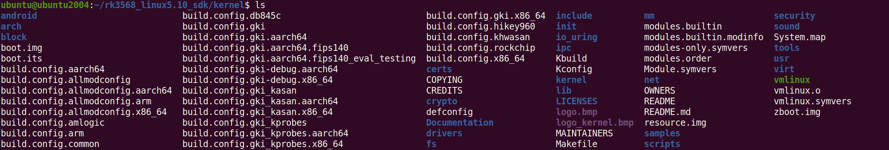
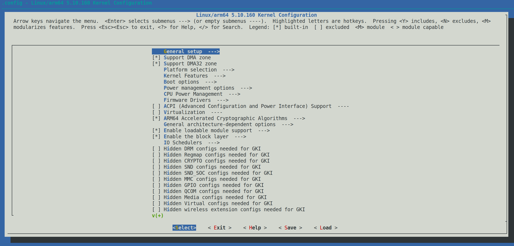
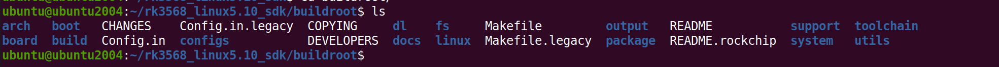
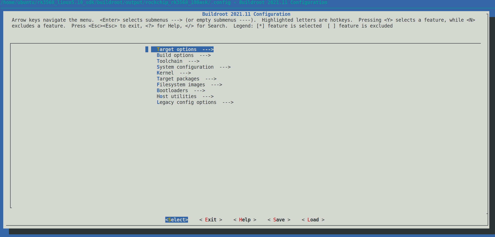

# SDK开发指南

本章节将讲解如何在RK的SDK-Linux5.10版本中进行 u-boot、kernel 和 buildroot单独编译与配置。默认已选择过板级配置文件，如果没有，请先阅读《开发环境搭建》章节，以下操作皆在ubuntu执行。

## U-boot使用

### 配置u-boot

u-boot是一个引导加载程序，用于初始化硬件并引导操作系统。一般并不需要修改，RK对于原生的u-boot有了完善的支持，例如初始化硬件，uboot会使用kernel的设备树来初始化。

如果需要修改u-boot，往往是修改相应处理器的uboot配置文件、设备树。例如rk3568处理器，配置文件是 u-boot/configs/rk3568_defconfig，设备树在 u-boot/arch/arm/dts/目录里。uboot配置文件可以在板级配置文件里查看需要修改那个文件。

#### uboot配置修改

进入 SDK/u-boot/ 目录下，执行以下指令，打开配置界面，

~~~bash
make rk3568_defconfig
make menuconfig
~~~

如下：

如果执行了修改，需要进行保存`Save` 然后 退出`Exit`。仅仅这样操作并不会修改 `rk3568_defconfig`，需要进行以下操作：

~~~bash
make savedefconfig
cp defconfig configs/rk3568_defconfig
~~~

#### uboot设备树修改

如果需要修改设备树，在 SDK/u-boot/arch/arm/dts/ 目录下，找到相应的设备树文件进行修改，rk3568的设备树文件包含关系如下：

~~~bash
rk3568-evb.dts
	rk3568.dtsi
		rk3568-pinctrl.dtsi
	rk3568-u-boot.dtsi
~~~

### 编译uboot部分

RK的SDK源码，有提供一个编译脚本 `./build.sh`，我们可以根据脚本使用指令来查看如何编译u-boot。

进入SDK源码根目录，执行以下指令，编译uboot：

~~~bash
./build.sh uboot
~~~

## Kernel使用

### 配置kernel

在kernel阶段，常常需要增减驱动、设备树节点，来适配板载硬件功能。kernel源码在 SDK/kernel/ 目录下。

####  修改内核配置

如果想对内核源码进行配置，例如把某个驱动编译进内核或者编译成模块，进入kernel源码目录，执行以下指令，打开内核的配置界面：

~~~bash
make ARCH=arm64 menuconfig
~~~

执行后，会进入内核配置界面，如下：

如果修改了内核配置信息，除了保存退出，还需要执行以下操作，否则编译时会复原为修改前的配置。

~~~bash
make ARCH=arm64 savedefconfig
cp defconfig arch/arm64/configs/rockchip_100ask_linux_defconfig
~~~

#### 内核设备树修改

设备树文件是rk3568-100ask-evb1-ddr4-v10-linux.dts，存放在 SDK/kernel/arch/arm64/boot/dts/rockchip/目录下，rk3568-100ask-evb1-ddr4-v10-linux.dts包含多个dtsi文件，其包含关系如下：

~~~bash
rk3568-100ask-evb1-ddr4-v10-linux.dts
	rk3568-100ask-evb1-ddr4-v10.dtsi
		rk3568.dtsi
		rk3568-100ask-evb.dtsi
	rk3568-100ask-480-800-mipi.dtsi
	rk3568-100ask-typec.dtsi
	rk3568-linux.dtsi
~~~

### 编译kernel部分

RK的SDK源码，有提供一个编译脚本 `./build.sh`，我们可以根据脚本使用指令来查看如何编译kernel。

进入SDK源码根目录，执行以下指令，编译kernel：

~~~bash
./build.sh kernel
~~~

## Buildroot使用

### 配置buildroot

Buildroot 是一个开源工具，用于快速生成嵌入式 Linux 系统的根文件系统、内核和引导加载程序。RK的SDK里还有Yocto构建工具，默认是使用 Buildroot ，这里使用的也是 Buildroot。

Buildroot 的源码存放在 SDK/buildroot/ 目录底下，

~~~bash
ubuntu@ubuntu2004:~/rk3568_linux5.10_sdk/buildroot$ tree -L 1
.
├── arch               #存放与特定架构相关的代码和配置文件，例如不同处理器架构的支持。
├── board              #包含特定硬件平台的支持文件和配置，用于定义特定板卡的构建过程和设置。
├── boot               #包含与引导相关的文件和脚本，处理引导加载程序的构建和配置。
├── build              #临时构建目录，用于存放构建过程中产生的中间文件。
├── CHANGES
├── Config.in          #配置文件，定义了可供选择的配置选项，并指定其依赖关系，通常用于配置菜单。
├── Config.in.legacy
├── configs            #包含预定义的配置文件（.config），适用于特定硬件或项目，可以通过这些文件快速开始构建。
├── COPYING
├── DEVELOPERS
├── dl                 #下载目录，存放在构建过程中下载的软件包和源代码。
├── docs			   #包含文档和说明，帮助理解和使用 Buildroot。
├── fs				   #存放与文件系统相关的代码和配置。
├── linux              #包含内核相关的配置和文件，支持构建 Linux 内核。
├── Makefile           #主要的构建文件，定义了如何构建整个项目，包含构建流程的规则和目标。
├── Makefile.legacy
├── output             #存放最终构建结果，包括生成的根文件系统和其他产物的目录。
├── package            #包含所有可用软件包的定义和构建信息，允许选择和集成不同的软件包。
├── README
├── support            #包含用于支持构建的工具和脚本，可能包括调试工具和测试脚本。
├── system             #与系统级配置和服务相关的文件和设置。
├── toolchain          #存放与工具链相关的文件和配置，包括交叉编译器的设置。
└── utils              #实用工具和辅助脚本，用于支持构建过程或提供其他功能。

15 directories, 8 files
~~~

进入SDK源码根目录，

在当前目录下，执行以下操作，可以打开buildroot配置界面。

~~~bash
source envsetup.sh
~~~

选择buildroot配置文件rockchip_rk3568_100ask：

~~~bash
op of tree: /home/ubuntu/rk3568_linux5.10_sdk

Pick a board:
...
44. rockchip_rk3568_100ask
45. rockchip_rk3568_32
46. rockchip_rk3568_recovery
47. rockchip_rk3588
48. rockchip_rk3588_base
49. rockchip_rk3588_ramboot
50. rockchip_rk3588_recovery
Which would you like? [1]: 44
~~~

进入buildroot源码路径，执行以下指令：

~~~bash
make menuconfig
~~~

执行后，会进入buildroot配置界面，如下：

可以在配置界面，选上一些需要的package等，配置完成后，选择保存`Save`，然后退出`Exit`。

执行以下指令即可保存：

~~~bash
make savedefconfig
~~~

### 编译buildroot部分

RK的SDK源码，有提供一个编译脚本 `./build.sh`，我们可以根据脚本使用指令来查看如何编译buildroot。

进入SDK源码根目录，执行以下指令，编译buildroot：

~~~bash
./build.sh buildroot
~~~

